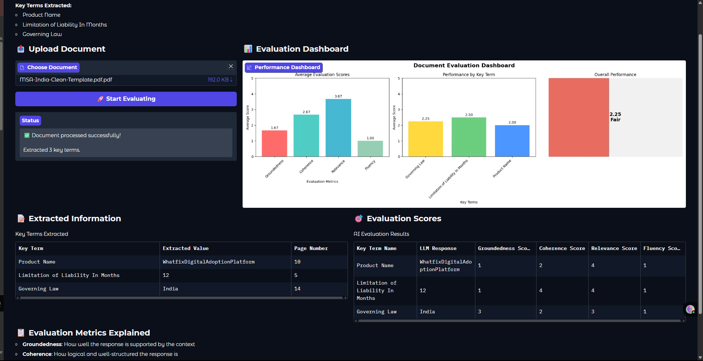

# Lab 3: Advanced Azure AI Evaluation - Introduction

/Advanced_Azure_AI_Evaluation.ipynb)

---

## 🧠 Overview

In this lab, we will use **predefined evaluators provided by Azure** to assess the quality of AI model outputs. 

While in **Lab 1**, we manually used an LLM to act as a judge by defining our own metrics and key terms, in this lab, we will explore how Azure simplifies this process by offering **built-in evaluation tools**. These tools allow you to automatically analyze and measure different aspects of generative AI outputs such as relevance, fluency, coherence, and safety.

---

## 📘 What You Will Learn

- ✅ How to use Azure AI services to evaluate LLMs outputs
- ✅ How to assess model quality, safety, and bias using Azure tools
- ✅ How to build an end-to-end evaluation pipeline within the Azure ecosystem

---

## 🖼️ Output Preview

Here's a preview of the Azure AI Evaluation dashboard/interface you will work with in this lab:

---

