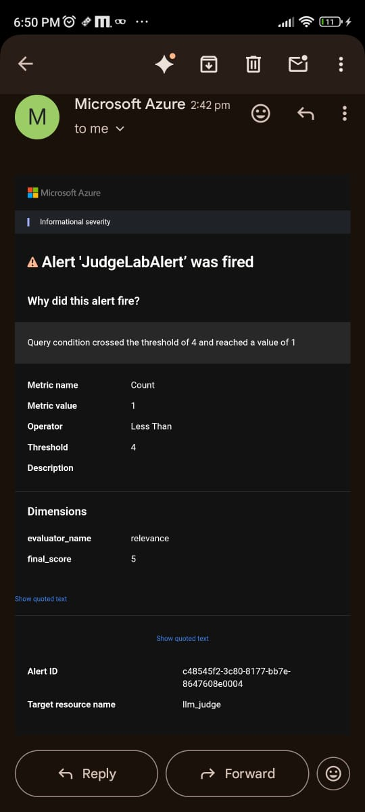

# Introduction

In this lab, we are going to learn how to **set up alerts in the Azure Portal dashboard**. 
Alerts help you monitor the health and performance of your resources by notifying you when specific conditions are met.

## Get Started

Follow the steps below to configure alerts in your Azure Portal dashboard.

## Prerequisites

Before you begin, ensure that you have the following:

- A **Premium Subscription** account in Azure.

## Let's Get Started

## Let's Get Started

### Step 1: Access Azure Monitor

1. In your **Azure Foundry Monitoring** section, scroll down until you find **Azure Monitor**.
2. Under Azure Monitor, click on **Application Insights**.
3. This will redirect you to the **Azure Portal**.

### Step 2: Open Query from Dashboard

Once you are redirected to the Azure Portal:

1. You will see a dashboard similar to the one in your Foundry environment.
2. Look for the **Open Query** link or button on the dashboard.
3. Click on it to proceed.

### Step 3: Create a New Alert Rule

1. On the right side of the screen, you'll see the **Query and Logs** section.
2. Click on the three vertical dots (...) in the top-right corner of that section.
3. From the dropdown menu, select **New Alert Rule**.

### Step 4: Alert Rule Interface

After selecting **New Alert Rule**, the **Create an alert rule** interface will open.

This interface allows you to define the conditions, actions, and scope of your alert.

### Step 5: Configure Measurement Settings

In the **"Create an alert rule"** interface:

1. Scroll down to the **Measurement** section.
2. Select the appropriate **Measure**.
3. Choose an **Aggregation Type** (e.g., Count, Average, Minimum, Maximum).
4. Set the **Aggregation Granularity** (e.g., 1 minute, 5 minutes, etc.) based on your monitoring needs.

### Step 6: Define Alert Condition

Now let’s define the alert condition.

- Under **Evaluator**, select the values needed (e.g., `fluency` and `final_score`).
- Use the **Alert logic** section to configure the rule:
  - **Operator**: `Less than`
  - **Threshold value**: `4`
  - **Frequency of evaluation**: `15 minutes`
- This means the alert will be triggered when the final score is **less than 4**, and it's checked every 15 minutes.

 

### Step 7: Create an Alert Rule

Now it's time to finalize and create the alert rule.

1. In the **Actions** section, click on **Create action group** to define what should happen when the alert is triggered.  
2. If you already have an action group, you can simply select it from the list.

Action groups can include actions like sending an email, SMS, push notification, or triggering a webhook.

### Step 8: Configure Action Group Details

In this step, you’ll provide basic details for your action group:

1. Enter the **Action Group Name**.
2. Set a **Display Name** (this will appear in alert notifications).
3. Select the appropriate **Resource Group** where this action group should be created.
4. After filling in the details, click on **Next: Notifications** to continue.

### Step 9: Configure Notifications

1. In the **Notifications** tab, go to the dropdown under **Notification type**.
2. Select **Email/SMS message/Push/Voice** from the options.

This defines how you will be notified when the alert is triggered.

### Step 10: Add Notification Details

1. After selecting **Email/SMS message/Push/Voice**, provide the details:
   - Enter the **Email address** where you want to receive the alert.
   - Optionally, you can also add:
     - **Phone number** for SMS
     - **Mobile app notification**
     - **Voice call**

You can choose any combination based on how you want to be notified.

### Step 11: Review and Create Alert

1. Once all configurations are complete, go to the **Review + create** tab.
2. Review all the details you’ve entered (scope, condition, action group, notifications, etc.).
3. If everything looks correct, click on the **Create** button to finish setting up your alert.

Your alert rule is now active and will notify you based on the conditions you defined.

### Step 12: Alert Successfully Created

Your alert has now been created based on the condition you provided.

From now on, whenever the trigger condition is met, Azure will automatically send a notification to the **email address** you entered during the notification setup.

This helps you stay informed and take action quickly when important events occur.

 

### Step 13: Disable the Alert (Optional)

If you ever want to disable the alert:

1. Go to the **Alerts** section from the Azure Dashboard.
2. Locate the alert rule you created.
3. Click on it, and then choose **Disable** from the options.

This will stop the alert from triggering without deleting the configuration.

### Step 14: Manage Action Group

To view or modify your action group:

1. Go to the **Action Groups** section from the Azure Portal dashboard.
2. Here, you can:
   - Edit existing action groups
   - Add or remove notification types (email, SMS, etc.)
   - Delete the action group if it's no longer needed

This is useful if you want to update how alerts notify you without creating a new alert rule.

### Step 15: Disable the Alert (Optional)

1. Click on it, then click the **Disable** button at the top.

This will pause the alert without deleting it.

## Conclusion

That's all you need to do to **create an alert in the Azure Dashboard**.

By following these steps, you can:

- Monitor your resources effectively
- Get notified when specific conditions are met
- Take quick action based on real-time alerts

Alerts are a powerful feature in Azure that help you stay informed and maintain the health of your applications and infrastructure.
