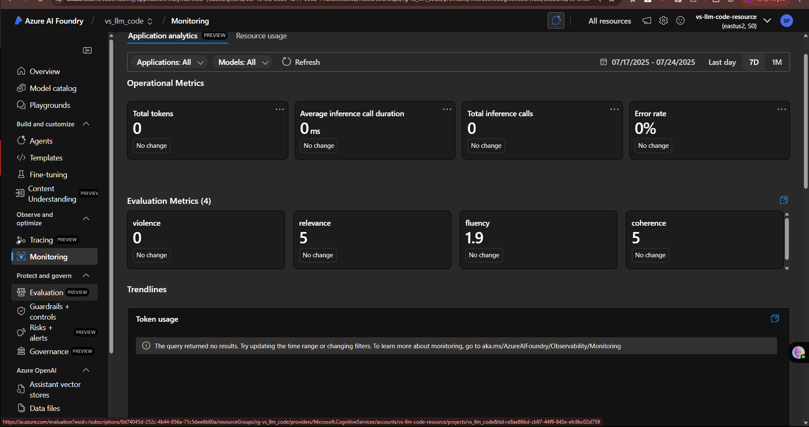
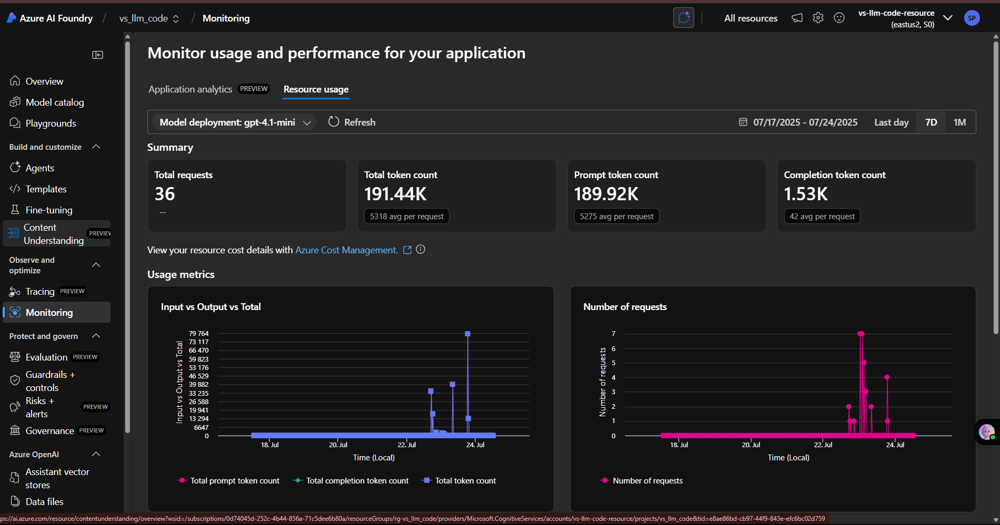
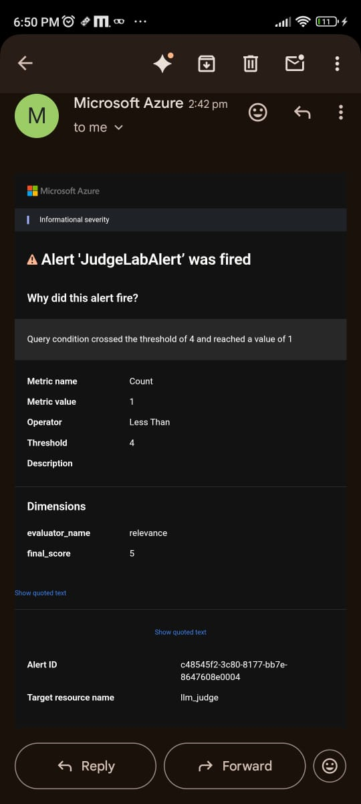

# Lab 4: Continuous Monitoring and Alerting for Your AI Agents (Azure AI Foundry) - Introduction

/Continuously_Evaluate_your_AI_agents_Azure_AI_Foundry.ipynb>)

## 🧠 Overview

In this lab, you'll explore **Continuous Evaluation for Agents** — a powerful capability that provides **near real-time evaluation and monitoring** for your AI applications. 

Through hands-on exercises, you'll learn how to implement, configure, and leverage this feature using **Azure AI Foundry** to ensure optimal agent performance and reliability.

## 📘 What You Will Learn

Specifically, you will explore:

- ✅ How to set up **real-time monitoring** for your AI agents using Azure AI Foundry
- ✅ How to view evaluation results and metrics directly in the **Foundry Observability Dashboard**
- ✅ How to configure and use **predefined evaluators** to assess quality, safety, and performance
- ✅ How to create **alert trigger points** based on specific evaluation outcomes

By the end of this lab, you’ll have a strong grasp of how to continuously track and improve your AI agents using Azure.

---

### 📘 Detailed Guide: How to Set Alerts in Azure

You can find the complete step-by-step guide in the file below:

> NOTE 👉 [View Full Alert Setup Guide](./How%20to%20Set%20Alert%20ReadMe/Readme.md)

---

### 📊 Metric Evaluator

After launching your Gradio app and sending some queries, head over to  
**Azure AI Studio > Monitoring > Evaluation**.

Here, you'll find detailed **evaluation metrics** based on your requests:

---

### ⚙️ Resource Usage

To keep track of your model’s consumption and performance, navigate to  
**Azure AI Studio > Monitoring > Resource Usage**.

This dashboard helps you visualize how many requests have been made and the token usage breakdown:

---

### 🚨 Alert Triggering

From now on, whenever the **trigger condition** is met, Azure will automatically send a notification to the **email address** you entered during the notification setup.

This helps you stay informed and take action quickly when important events occur:
  

