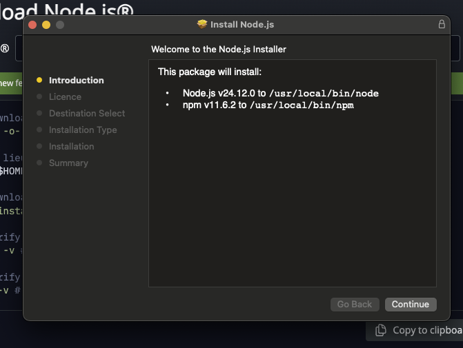
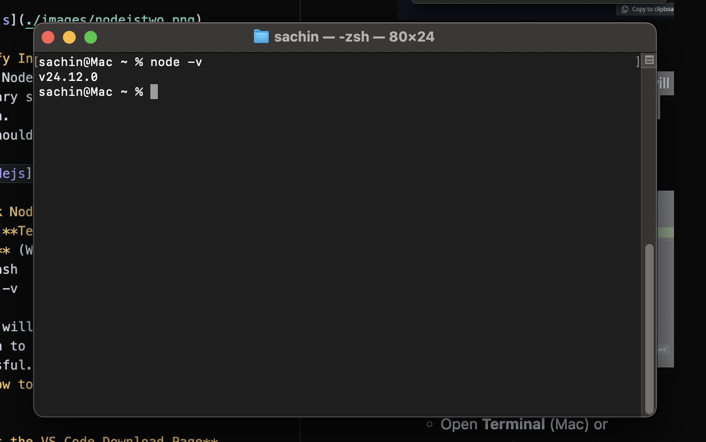
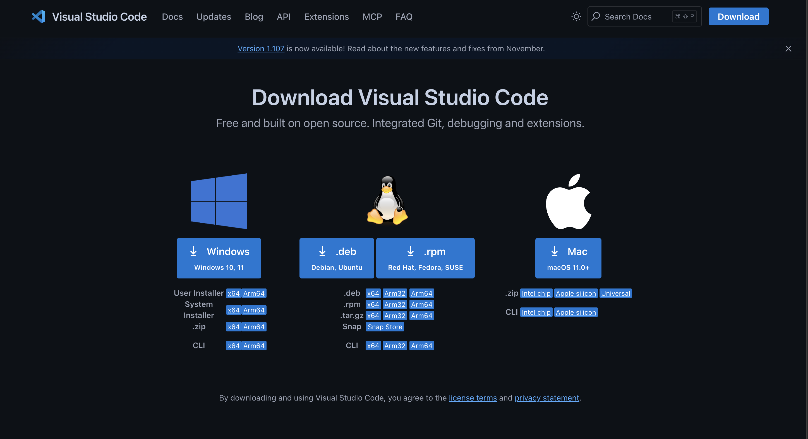
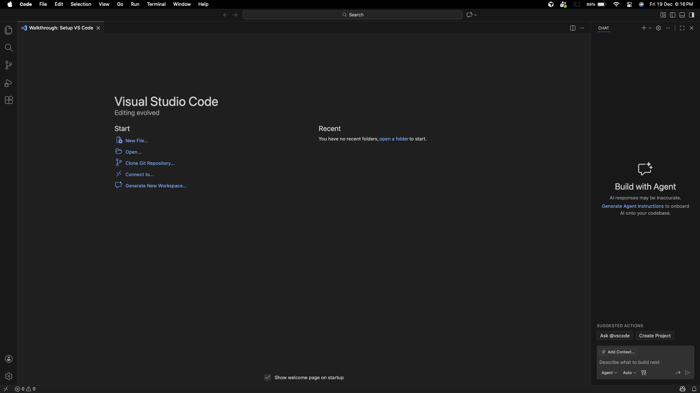

## 0.1 Installation


 
### **→ Overview**  
 
Module 0.1 is all about setting up Claude Code and completing the authentication process. This section acts as a handy reference to guide you alongside the hands-on tutorial.

Quick Note : Using Claude Code requires Node.js version 18 or higher and an active Claude subscription. Once these requirements are ready, the setup process is quick and can be completed in just a few minutes.

### **→ Prerequisites**
| Requirement | Details |
|------------|--------|
| Node.js | Node.js version 18 or above must be installed on your system. |
| Visual Studio Code (VS Code) | VS Code must be installed to connect and use Claude Code. |
| Operating System | A supported operating system: macOS or Windows 10 and later. |

### **→ Tools We’ll Use and Why**

Even if you’re not a developer, it helps to understand **what these tools are** and **why we use them** in this course:  

1. **Visual Studio Code (VS Code):**  
   VS Code is a **workspace for writing and organizing code**. Think of it like a smart notebook where you can see files, run code, and test things all in one place. It helps you work efficiently with Claude Code.
   [VS Code Documentation](https://code.visualstudio.com/docs)  

2. **Node.js:**  
   Node.js is a platform that lets your computer **run JavaScript outside of a web browser**. Many tools, including Claude Code, need Node.js to work properly.
Learn more: [Node.js Documentation](https://nodejs.org/en/docs/)  

3. **Claude Code:**  
   Claude Code is the **tool we’ll use to build, test, and document AI product workflows**. It connects with VS Code to help you interact with AI models, run your tasks, and see results quickly.  
Learn more: [Claude Documentation](https://www.anthropic.com/claude)  

> Even if you don’t dive deep into coding, these tools provide a structured environment to follow along, experiment, and understand AI workflows.

### **→ How to Install Node.js**


1. **Visit the Node.js Download Page**  
   Go to [https://nodejs.org/en/download](https://nodejs.org/en/download)

2. **Select Your Operating System**  
   - If you are on **Mac**, choose **macOS**.  
   - If you are on **Windows**, choose **Windows** from the dropdown.

3. **Download the Installer**  
   - On **Mac**, click the **macOS Installer (.pkg)**.  
   - On **Windows**, click the **Windows Installer (.msi)**.

   

4. **Run the Installer**  
   - Once you click the installer, Node.js will start installing on your machine.  
   - Follow the on-screen instructions to complete the installation.

5. **Complete the Installation Steps**  
   - Open the downloaded package/installer.  
   - Click **Continue** at the first steps (Mac) or **Next** on Windows.  
   - At the step where it asks to install, click **Install**.  

   

6. **Verify Installation**  
   - Once Node.js is installed, you will see a summary screen showing the installed version.  
   - It should look similar to the screenshot below:  
     

7. **Check Node Version (Optional)**  
   - Open **Terminal** (Mac) or **Command Prompt** (Windows) and run:  
     ```bash
     node -v
     ```  
   - This will display the installed Node.js version to confirm the installation was successful.

   
### **→ How to Install Visual Studio Code (VS Code)**

1. **Visit the VS Code Download Page**  
   Go to [https://code.visualstudio.com/Download](https://code.visualstudio.com/Download)

2. **Select Your Operating System**  
   - If you are on **Mac**, choose **macOS**.  
   - If you are on **Windows**, choose **Windows**.

3. **Download the Installer**  
   - On **Mac**, click the **.dmg** file.  
   - On **Windows**, click the **.exe** installer.  

   
4. **Run the Installer**  
   - Open the downloaded file and follow the on-screen instructions.  
   - Accept the license agreement and choose the installation location (default is recommended).  
   - Click **Install** (Windows) or drag to Applications (Mac).

5. **Launch VS Code**  
   - After installation, open **Visual Studio Code** from your applications menu or desktop shortcut. 

    


###  **→ What’s Next?**
**Now you have installed Node.js and VS Code!**  

In the upcoming module, we will see **how to connect Claude Code with VS Code** so you can start seamlessly.