## 0.3 Getting Started With Claude


 
### **→ Overview**  

In this module, we will learn how to set up Claude on your local machine and how to run and use Claude inside Visual Studio Code.

Quick Note : Using Claude Code requires Node.js version 18 or higher and an active Claude subscription. Once these requirements are ready, the setup process is quick and can be completed in just a few minutes.

---

### **→ Prerequisites**

| Requirement | Details |
|------------|--------|
| Claude Subscription | A paid Claude plan (Pro or Max) is required to use Claude locally. |
| Node.js | Node.js version 18 or above must be installed on your system. |
| Visual Studio Code (VS Code) | VS Code must be installed to run and use Claude inside the editor.

---

### **→ What is Claude Code**

Claude Code is an AI assistant that works alongside you while you build products.
It helps you understand your project, answer questions, and speed up work using simple, natural language instructions.
Instead of switching between tools, Claude fits directly into your daily workflow, making it a safe and flexible way to use AI for everyday product and development tasks.


With Claude Code, you can:
- Ask questions and get answers inside your editor
- Understand and explore codebases
- Generate and modify files
- Speed up development workflows using AI assistance

---

### **→ Hands-On: Setting Up Claude**

### Step 1: Get a Claude Subscription

Go to the following URL and purchase a Claude subscription plan:  
https://claude.com/product/claude-code  

You can start with the **Pro plan**, which is sufficient for this bootcamp.


---

### Step 2: Connect Claude to Your Email

After clicking on **Claude Code**, you will be prompted to connect using your email address. Enter your email address and complete the sign-in process to connect Claude to your account.

---

### Step 3: Complete Your Subscription

Provide the required details and choose your subscription plan. You can select either a monthly or annual plan based on your preference.

Once selected, complete the payment process to activate your subscription.

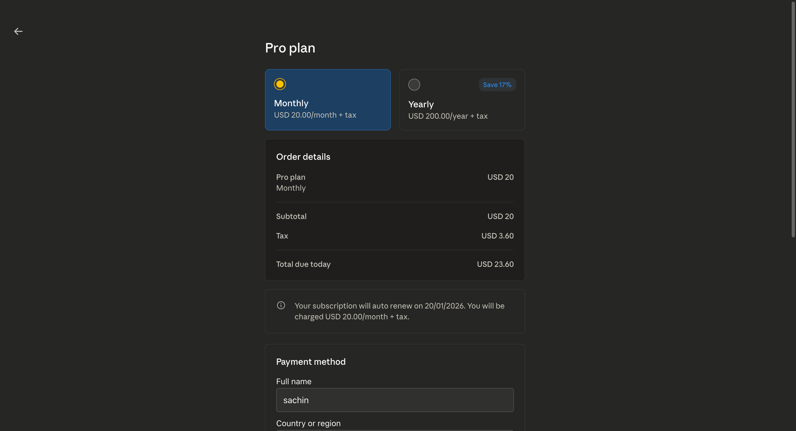

---

### Step 4: Open Terminal and Install Claude Code


| OS       | How to Open Terminal                  |
|----------|--------------------------------------|
| **Mac**  | `Command + Space` → type `Terminal` → `Enter` |
| **Windows** | `Windows Key + R` → type `cmd` → `Enter` |

---

### Step 5: Install Claude Code

Run the following command in your terminal:

```bash
npm install -g @anthropic-ai/claude-code
```

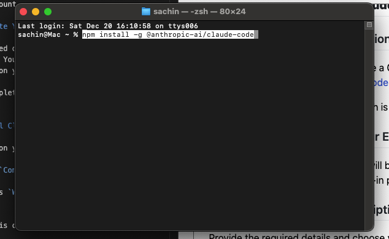

You will see a message indicating that Claude Code has been installed successfully, similar to:

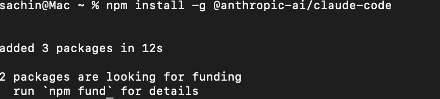

---

### Quick Note : Troubleshooting Steps (If Facing Installation Issues)

If you encounter permission errors like EACCES while installing Claude Code, 

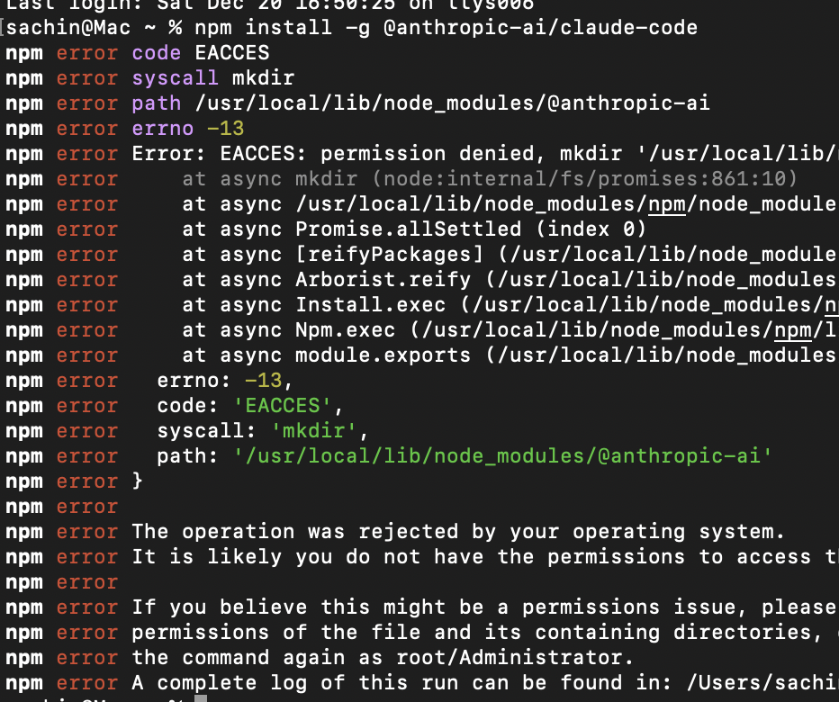

## **follow these steps in your terminal:**

1️⃣ Create a ~/.zshrc file
```bash
touch ~/.zshrc
```


2️⃣ Add nvm initialization to it
```bash
echo 'export NVM_DIR="$HOME/.nvm"' >> ~/.zshrc
echo '[ -s "$NVM_DIR/nvm.sh" ] && \. "$NVM_DIR/nvm.sh"' >> ~/.zshrc
```

3️⃣ Load the file in the current terminal

```bash
source ~/.zshrc
```


4️⃣ Verify nvm installation
```bash
nvm --version
```


You should now see the nvm version number.

5️⃣ Install Node via nvm

```bash
nvm install 24
```
```bash
nvm use 24
```
```bash
node -v
```
```bash
npm -v
```


6️⃣ Now install Claude Code globally

```bash
npm install -g @anthropic-ai/claude-code
```


✅ This should work without any EACCES errors.

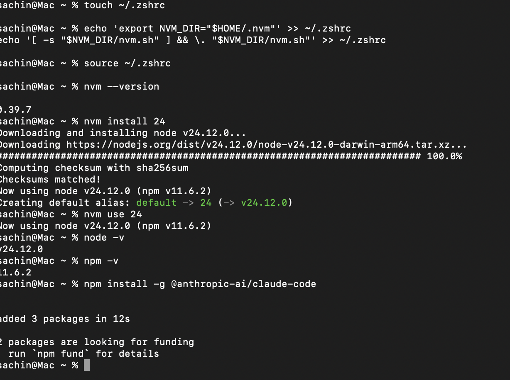

---

### Step 6: Create a Project Folder and Open in VS Code

1. Create a folder on your Mac or Windows where you want to work.  
   Example: `claude-bootcamp`

2. Open VS Code.

3. Open the folder in VS Code:  
   - Click on `Open` (Mac & Windows)  
   - Select the folder you just created.


Your folder is now opened in VS Code and ready for your project.

---

### Step 7: Open a Terminal in VS Code

1. In VS Code, click on the `Terminal` menu.  
2. Select `New Terminal`.  

3. The terminal will open at the root of your project folder, ready for running commands.

---

## Step 8: Run Claude in the Terminal

Follow these steps to run Claude from your VS Code terminal:

1. **Open Terminal**  
   Open the terminal in VS Code and type below command.

   ```bash
   claude
   ```
   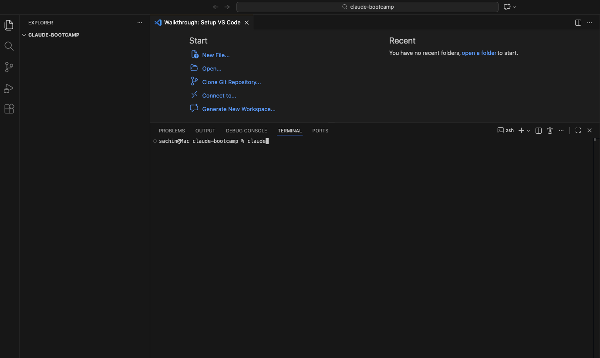

2. **Select a Theme**  
   - If you want to select the dark theme (which is the default), just press **Enter**.  
   - Alternatively, use the **Up** and **Down** arrow keys to choose a different theme, then press **Enter** to confirm your selection.

   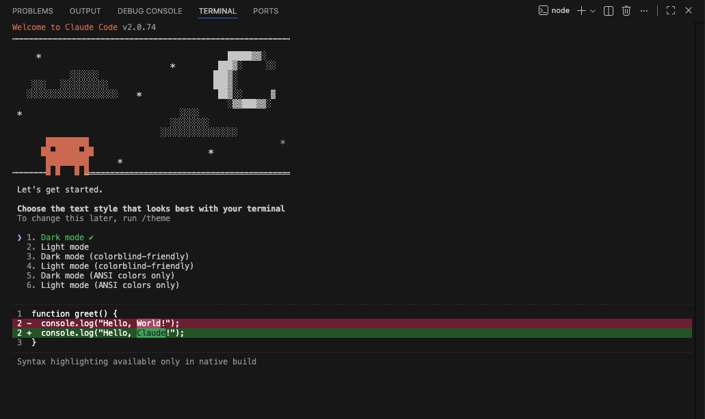


3. **Choose Account Type**  
   - Claude will provide two options:
     1. Claude account with subscription (default)
     2. Anthropic console account  
   - Choose the default option and press **Enter** you dont want to do anything.

   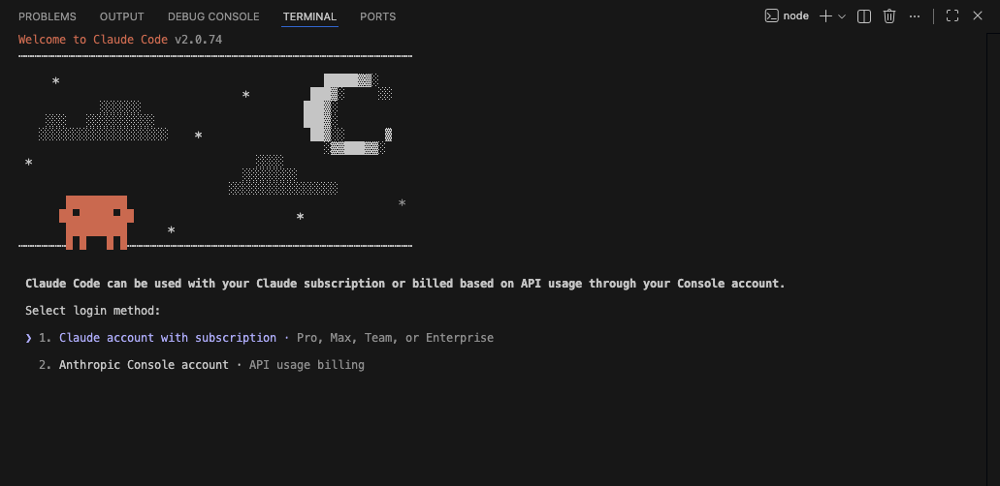

4. **Connect Your Account**  
   - Your browser will open automatically.  
   - Log in with the account that has an active subscription.  
   - Click **Authorize** to complete the connection.

   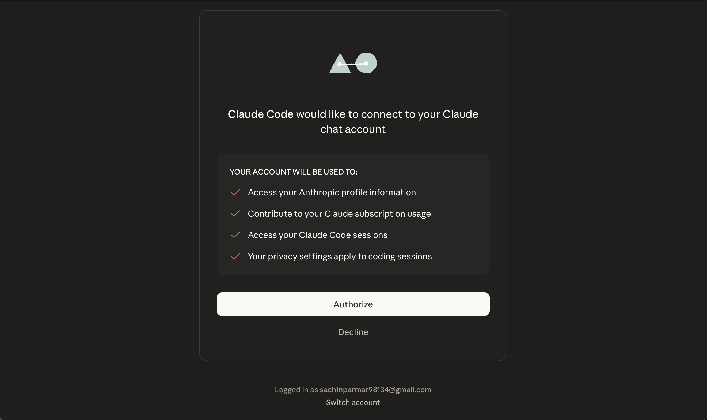

5. **Login Confirmation**  
   - You will see a message: `Login successful`.  
   - Press **Enter** to continue.

   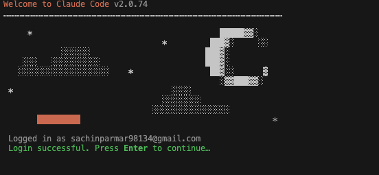

6. **Configuration Settings**  
   - Claude will ask if you want to change settings: press **Enter** to accept the defaults.  
   - It will also ask if you want to set this folder/file: press **Enter** to accept the default.
   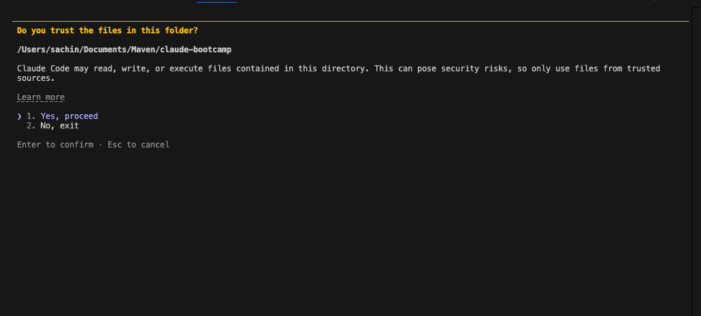

7. **Welcome Message**  
   - You will see: `Welcome to Claude`.  
   - Press **Enter** to continue.
   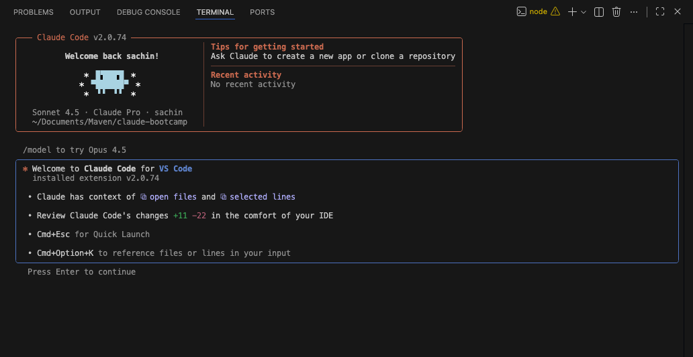

8. **Test the Connection**  
   - Once you see the prompt, your VS Code is successfully connected to Claude.  
   
   - Try a test question, e.g., `What is 2+2?` to confirm it’s working.
   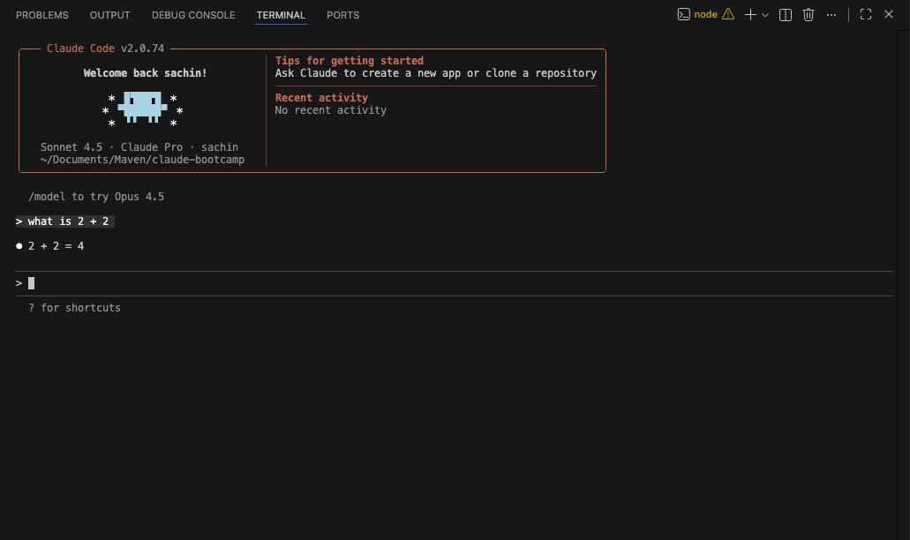

---

### **→ What's Next?**

**Congratulations! 🎉** You have successfully completed the configuration and connected Claude Code with VS Code. You're now ready to experiment and start building with AI-powered tools.

In the next module, we'll explore how to:
- **Play with Claude Code** and leverage its capabilities for product management tasks
- **Conduct market research** using AI assistance to gather insights and analyze trends
- **Perform user research** to understand user needs and validate product ideas
- **Write PRDs (Product Requirements Documents)** that are AI-aware and grounded in real evaluation.

#### You now have everything set up to work like a modern AI PM who builds, evaluates, and reasons in systems. 
---

### **→ Additional Resources**

- [Claude Code Documentation](https://code.claude.com/docs/en/overview#npm) - Official documentation for Claude Code installation, setup, and usage

---


