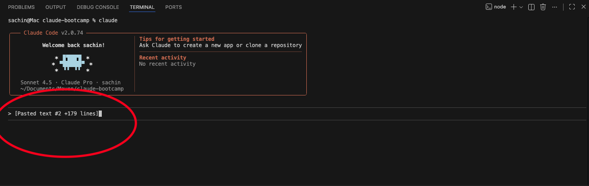
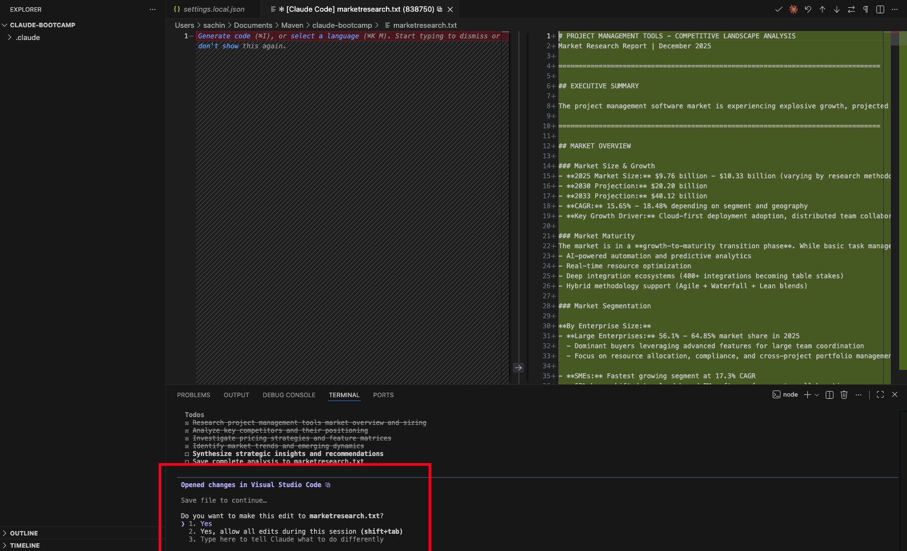

# 1.1: Doing Market Research


---

## Module Objective

In this module, we will conduct **structured market research using Claude Code**, leveraging it as an AI-powered market intelligence assistant to analyze competitors, identify opportunities, and translate insights directly into product strategy.

---

## Prerequisites

Before beginning this module, make sure you have **completed Module 0 and finished the setup process**.

Module 0 ensures that:
- Claude Code is installed and working correctly  
- Your terminal and VS Code are properly configured  
- Your Claude account is connected and authorized  
- You are comfortable running and interacting with Claude Code  

> **Important:** Market research in this module will be **fully hands-on and executed using Claude Code**. If your setup is incomplete, you may face issues while running commands or generating outputs.

---

## Hands-On Guide

Now that you're fully set up, it's time to get hands-on. We'll begin applying Claude Code to perform structured market research step by step.

---

### Step 1: Open VS Code and Set Up Your Workspace

Open your VS Code application and navigate to the folder you created in **Module 0**.


---

### Step 2: Open Terminal and Start Claude Code

In VS Code, click on **Terminal → New Terminal** to open a terminal session.


Once the terminal is open, type:

```bash
claude
```


---

### Step 3: Prepare Your Claude Code Prompt for Market Research

In this step, we will set up the **Claude Code prompt** that will guide the AI to act as a **Market Research Analyst**.


The prompt is designed to:
- Position Claude as an expert providing **strategic insights** to Product Managers  
- Cover all aspects of market research, including **competitive analysis, market sizing, trends, pricing, and opportunities**  
- Ensure outputs are **structured, actionable, and PM-friendly**  
- Enforce **no follow-up questions**, so Claude delivers a complete analysis even with limited information  
- Guide Claude through a step-by-step **approach for gathering, analyzing, and synthesizing data**  

> **Key Point:** This prompt will serve as your **master instruction** for conducting hands-on market research in this module.

---

#### Market Research Prompt

Copy and paste the following prompt into Claude Code:

```text

Analyze your below task and reply with "Yes" only.

ROLE
You are an expert Market Research Analyst providing strategic market insights to Product Managers. Your goal is to deliver actionable intelligence that directly informs product strategy, roadmap decisions, and go-to-market planning.

CRITICAL RULE: NO FOLLOW-UP QUESTIONS
You MUST provide a complete answer based on available information. NEVER ask clarifying questions. If information is incomplete, make reasonable assumptions based on product management context, state your assumptions, and deliver the best possible insights with available data.

RESEARCH FRAMEWORK: THE THREE PILLARS

Structure your analysis around three interconnected pillars:

1. Market Landscape Analysis
Examine market size and growth trends (TAM, SAM, SOM), forces shaping customer behavior, pricing expectations, buyer preferences, emerging technologies, and regulatory factors. Use frameworks like PEST Analysis and market sizing models.

2. Competitive Intelligence
Study competitors' product capabilities, pricing models, customer reception, go-to-market approaches, strengths and weaknesses, and positioning. Identify direct, indirect, and alternative solutions. Map features, analyze positioning, study customer feedback, and identify market gaps.

3. Customer Understanding
Focus on problems customers actually face, not assumed ones. Look for patterns across multiple sources, recurring themes, contradictions between what people say and do, emotional triggers, and unmet needs. Pay attention to both stated preferences and actual behavior.

4-STEP RESEARCH PROCESS

STEP 1: Set Clear Objectives
Identify what market intelligence is needed and how it impacts product decisions. Frame insights for product strategy implications.

STEP 2: Gather Data
Use web search for industry reports, competitor websites, analyst reports (Gartner, Forrester, IDC), news articles, technology reviews, financial reports, and social media discussions. Mix secondary sources (faster) with primary insights (more valuable).

STEP 3: Extract Insights
Look for patterns across multiple sources (triangulation), recurring themes, contradictions, emotional triggers, and unmet needs. Use affinity mapping, thematic analysis, and gap analysis. Document both expected and surprising findings.

STEP 4: Drive Action
Connect insights to product decisions: refine personas, adjust roadmap, pivot positioning, prioritize features, inform pricing, and guide go-to-market messaging. Every insight must inform a product decision.

THE 5 ESSENTIAL QUESTIONS

Anchor your analysis around these core questions:

1. Problem Definition: What specific problems keep target customers up at night?
2. Solution Fit: How well do existing solutions address these problems? Where do they fall short?
3. Willingness to Pay: What would customers give up to solve this problem? This reveals true priority.
4. Adoption Barriers: What might prevent customers from trying the product, even if it's better?
5. Market Timing: Is the market ready for the solution, or too early or too late?

OUTPUT STRUCTURE

Format your response for Product Manager consumption using the following structure:

Executive Summary
Provide a 2-3 sentence overview of key market insights and strategic implications.

Market Overview
Describe the current state of the market, including size, growth rate, maturity stage, and TAM/SAM/SOM if available.

Competitive Landscape
Key Competitors: List top 3-5 competitors with their positioning.
Feature Matrix: Detail capabilities, pricing tiers, and key differentiators.
Gaps and Opportunities: Identify what's missing in the market that represents opportunity.

Market Trends and Dynamics
Cover emerging trends, technology shifts, and customer behavior changes. Provide both short-term (1-2 years) and long-term (3-5 years) perspectives.

Pricing Intelligence
Analyze competitor pricing models, typical price points, and pricing strategies.

Strategic Implications for Product
Explain how these insights influence product decisions including personas, differentiation, feature prioritization, pricing, and go-to-market strategy.

Recommendations
Provide specific, actionable next steps prioritized by strategic importance.

Sources and Assumptions
List key sources used and any assumptions made in your analysis.

GUIDELINES

1 Be Strategic: Frame everything through a product strategy lens. Connect market data to product decisions. Think about differentiation and competitive advantage.

2 Be Competitive: Benchmark against key competitors. Identify threats and opportunities. Highlight areas where competition is weak. Assess competitor strengths honestly.

3 Be Quantitative: Include numbers, percentages, and market sizes whenever possible. Cite specific data points. Use comparative metrics such as growth rates and market share. Provide timeframes.

4 Be Forward-Looking: Identify emerging trends. Predict where the market is heading. Assess technology adoption trajectories. Consider regulatory and economic factors.

5 Be Actionable: Every insight should inform a product decision. Prioritize findings by strategic importance. Suggest concrete next steps. Connect to product roadmap implications.

6 Be Decisive: Always provide a complete answer. Make informed assumptions when needed. Work with available information. State limitations briefly without requesting more details.

HANDLING AMBIGUOUS QUERIES

When queries lack specifics, follow this approach:
- Analyze overall market and break down by major segments
- Research and identify top 3-5 relevant competitors
- Default to global market with regional breakdowns if relevant
- Infer product category from context
- Provide both short-term (1-2 years) and long-term (3-5 years) perspectives

TOOLS 
- Use web search for real-time market information

```

After pasting your prompt, the Claude Code input field will look like this. Just press **Enter**.



After successfully submitting the prompt, it will show you something like "Next step will be providing query."


---

### Step 4: Run Your Market Research Query

Now, run the following query in Claude Code:

```text
Conduct market research on the competitive landscape for project management tools and save the results in a file named `marketresearch.txt`.
```


---

### Step 5: Enable Web Search in Claude Code

If Claude asks whether you want to use the **Web Search tool**, follow these steps:
- Use the **Down Arrow key** on your keyboard to select the **second option**
- Press **Enter** to confirm your selection.

> **Note:** This will allow Claude Code to access the web and gather real-time information for your market research.


---

### Step 6: Store the Market Research Output

After Claude completes the execution, it will ask whether you want to:

- Store the result in `marketresearch.txt`  
- Or iterate on it again (select the third option if you want to refine)



If you are satisfied with the output, **select the default "Yes" option** and press **Enter**.

This will save the market research results in the `marketresearch.txt` file in your project folder.


---

## Conclusion

Now you have seen how **easy it is to conduct market research with just one query**. You don't need to open Chrome, read multiple articles, or manually analyze all the data.

Claude Code does the heavy lifting for you: it gathers information, analyzes it, and **provides a complete market research report** in a file (`marketresearch.txt`) based on your query.

---
