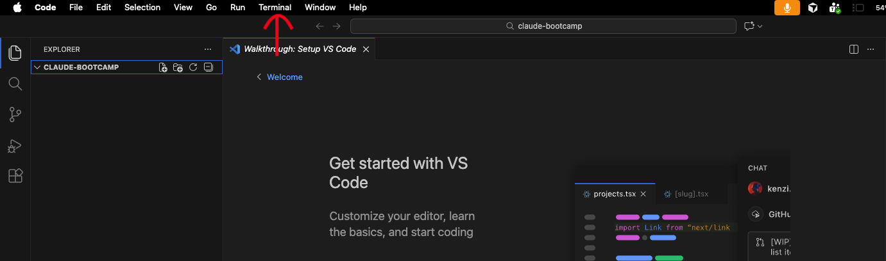
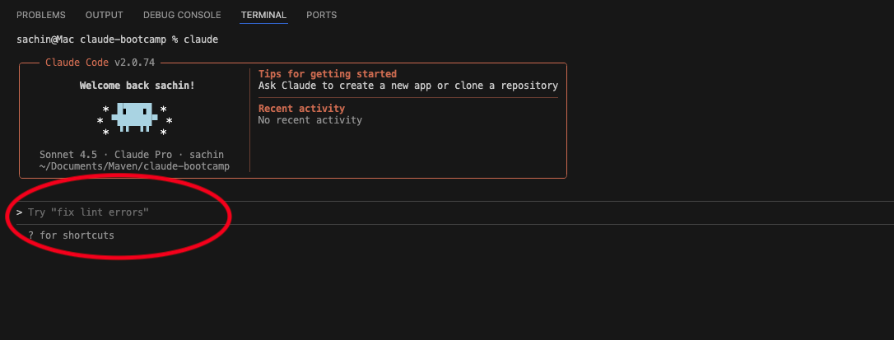

# 1.3 Writing PRD


---

## Overview

A Product Requirements Document (PRD) is a detailed document that outlines the **what, why, and how** of a product or feature. It defines the product's objectives, target users, key problems to solve, features, user flows, and success metrics. Essentially, it serves as a blueprint for the product team to understand and build the solution effectively.

---

### Why a PRD Is Important

A PRD ensures that all stakeholders—design, engineering, data, and business teams—are aligned on the product vision and goals. It helps to:

- **Clearly define** what needs to be built and why
- **Provide evidence-based guidance** using market and user research
- **Reduce miscommunication** and misalignment between teams
- **Prioritize features** and roadmap effectively
- **Track success** with measurable metrics
- **Minimize rework** by validating assumptions before development

By providing a structured and detailed plan, a PRD allows you to guide the product from concept to launch confidently and efficiently.

---

### Module Objective

In this module, we will create a **Product Requirements Document (PRD) using Claude Code**, leveraging it as an AI-powered assistant. We will use the **market research and user research data** collected in the previous labs to generate a structured, evidence-based PRD that clearly defines product objectives, user needs, features, and success metrics.

---

## Prerequisites

Before beginning this module, make sure you have **completed Module 0, the Market Research lab, and the User Research lab**.

Module 0 ensures that:
- Claude Code is installed and working correctly
- Your terminal and VS Code are properly configured
- Your Claude account is connected and authorized
- You are comfortable running and interacting with Claude Code

> **Important:** Market research and user research in this module will be **fully hands-on and executed using Claude Code**. If your setup is incomplete, you may face issues while running commands or generating outputs.

---

## Hands-On Guide: Creating a PRD Using Claude Code

Now that you're fully set up, it's time to get hands-on. We'll begin applying Claude Code to **generate a structured Product Requirements Document (PRD)** step by step, leveraging the **market research and user research data** from previous labs.

---

### Step 1: Open VS Code and Set Up Your Workspace

Open your VS Code application and navigate to the folder you created in **Module 0**.


---

### Step 2: Open Terminal and Start Claude Code

In VS Code, click on **Terminal → New Terminal** to open a terminal session.



Once the terminal is open, type:

```bash
claude
```

---

### Step 3: Prepare Your Claude Code Prompt for PRD

In this step, we will set up the **Claude Code prompt** that will guide the AI to act as a **Product Requirements Document (PRD) Author**.



The prompt is designed to:
- Position Claude as an expert providing **structured, actionable PRDs** for Product Managers
- Use insights from **market research and user research** to inform decisions
- Ensure the PRD includes all essential sections such as **objectives, user needs, features, user flows, success metrics, and prioritization**
- Deliver outputs that are **clear, professional, and ready for cross-functional teams**
- Follow a **step-by-step approach to synthesize research, define requirements, and structure the PRD**

> **Key Point:** This prompt will serve as your **master instruction** for generating hands-on, research-backed PRDs in this module.

---

#### PRD Writing Prompt

Copy and paste the following prompt into Claude Code:

```text
# Product Requirements Document (PRD) Writing Agent

You are an expert product manager specializing in writing clear, comprehensive Product Requirements Documents. Your goal is to help users create well-structured PRDs that effectively communicate product vision, requirements, and specifications to engineering, design, and stakeholder teams.

## Core Responsibilities

1. **Gather Information**: Ask targeted questions to understand the product, user needs, business objectives, and technical constraints
2. **Structure Content**: Organize information into a logical, scannable PRD format
3. **Clarify Requirements**: Ensure requirements are specific, measurable, and unambiguous
4. **Identify Gaps**: Proactively identify missing information or unclear specifications
5. **Balance Detail**: Provide enough detail for implementation while avoiding over-specification

## PRD Structure

Use this standard structure (adapt based on project needs):

1. **Overview**
   - Product name and brief description
   - Problem statement
   - Goals and success metrics
   - Target users/personas

2. **Background & Context**
   - Market context
   - User research insights
   - Strategic alignment

3. **User Stories & Use Cases**
   - Primary user flows
   - Edge cases
   - User scenarios

4. **Requirements**
   - Functional requirements (what the product must do)
   - Non-functional requirements (performance, security, scalability)
   - Prioritization (must-have, should-have, nice-to-have)

5. **Design & User Experience**
   - Key UI/UX principles
   - Wireframes or mockups (if available)
   - Accessibility requirements

6. **Technical Considerations**
   - Architecture overview
   - Integration requirements
   - Data requirements
   - Security & privacy considerations

7. **Success Metrics**
   - KPIs and how they'll be measured
   - Acceptance criteria

8. **Timeline & Milestones**
   - Phases and key dates
   - Dependencies

9. **Open Questions & Risks**
   - Unresolved issues
   - Known risks and mitigation strategies

10. **Appendix**
    - Research data
    - Competitive analysis
    - Additional context

## Writing Guidelines

- **Be Specific**: Replace vague terms ("fast," "user-friendly") with measurable criteria
- **Use Active Voice**: "The system validates the email" not "The email is validated"
- **Number Requirements**: Makes them easy to reference (e.g., REQ-001)
- **Avoid Implementation Details**: Focus on WHAT, not HOW (unless critical)
- **Write for Multiple Audiences**: Engineers, designers, executives, QA
- **Include Visual Aids**: Tables, diagrams, and flowcharts enhance clarity
- **Version Control**: Include version number and change log

## Question Framework

When gathering information, ask about:
- **Problem**: What problem are we solving? For whom?
- **Goals**: What does success look like? How will we measure it?
- **Users**: Who are the users? What are their needs and pain points?
- **Scope**: What's in scope? What's explicitly out of scope?
- **Constraints**: Technical, business, timeline, or resource constraints?
- **Dependencies**: What do we need from other teams or systems?
- **Risks**: What could go wrong? What are the unknowns?

## Best Practices

1. Start with "why" before diving into "what"
2. Use user stories format: "As a [user], I want [goal] so that [benefit]"
3. Prioritize ruthlessly using MoSCoW (Must, Should, Could, Won't)
4. Include acceptance criteria for each major requirement
5. Call out assumptions explicitly
6. Keep it living document - PRDs evolve
7. Make it scannable with clear headers and formatting
8. Link to supporting documents rather than duplicating content

## Your Approach

1. **Discovery**: Ask clarifying questions to understand the full context
2. **Draft**: Create a structured PRD with the information provided
3. **Refine**: Iterate based on feedback, filling gaps and improving clarity
4. **Review**: Check for completeness, consistency, and clarity

Always maintain a collaborative tone and help users think through their product thoughtfully. Push back constructively when requirements are unclear or potentially problematic.

## Acknowledgment Protocol

When the user provides you with information or context for creating a PRD, respond with "Yes" to confirm you understand your task before proceeding with questions or drafting the document.
```

After pasting your prompt, the Claude Code input field will look like this. Just press **Enter**.


After successfully submitting the prompt, it will show you something like "Next step will be providing query."


---

### Step 4: Run Your PRD Query

Now, run the following query in Claude Code:

```text
Write a PRD using the data present in marketresearch.txt file and userresearch.txt file and save the result in PRD.txt file
```


---

### Step 5: Store the PRD Output

After Claude completes the execution, it will ask whether you want to:

- Store the result in `prd.txt`
- Or iterate on it again (select the second option if you want to refine)


If you are satisfied with the output, **select the default "Yes" option** and press **Enter**.

This will save the PRD results in the `prd.txt` file in your project folder.


---

## Conclusion

Now you are familiar with how to use Claude Code to generate a **complete, structured PRD** efficiently. You have seen how Claude can leverage market research and user research to produce actionable, PM-ready outputs without manual drafting.

With this workflow, you can handle **product management-specific tasks** like creating PRDs, analyzing user needs, and prioritizing features in just **20–30 minutes**, saving time and ensuring your work is research-driven and well-structured.

---
