# Lesson 1.4: Setting Up Claude

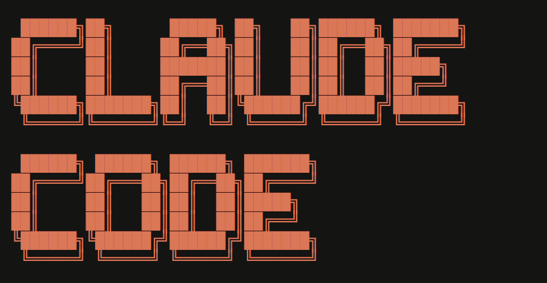

### **→ Overview**

In this lesson, we will learn how to set up Claude on your local machine and how to run and use Claude inside Visual Studio Code.

**Quick Note:** Using Claude Code requires Node.js version 18 or higher and an active Claude subscription. Once these requirements are ready, the setup process is quick and can be completed in just a few minutes.

---

### **→ Prerequisites**

| Requirement | Details |
|------------|--------|
| Claude Subscription | A paid Claude plan (Pro or Max) is required to use Claude locally. |
| Node.js | Node.js version 18 or above must be installed on your system. |
| Visual Studio Code (VS Code) | VS Code must be installed to run and use Claude inside the editor. |

---

### **→ What is Claude Code**

Claude Code is an AI assistant that works alongside you while you build products. It helps you understand your project, answer questions, and speed up work using simple, natural language instructions. Instead of switching between tools, Claude fits directly into your daily workflow, making it a safe and flexible way to use AI for everyday product and development tasks.

With Claude Code, you can:
- Ask questions and get answers inside your editor
- Understand and explore codebases
- Generate and modify files
- Speed up development workflows using AI assistance

---

### **→ Hands-On: Setting Up Claude**

### Step 1: Get a Claude Subscription

Go to the following URL and purchase a Claude subscription plan:  
https://claude.com/product/claude-code

You can start with the **Pro plan**, which is sufficient for this bootcamp.

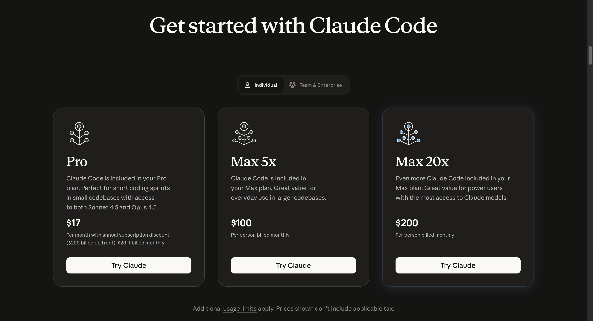

---

### Step 2: Connect Claude to Your Email

After clicking on **Claude Code**, you will be prompted to connect using your email address. Enter your email address and complete the sign-in process to connect Claude to your account.

---

### Step 3: Complete Your Subscription

Provide the required details and choose your subscription plan. You can select either a monthly or annual plan based on your preference.

Once selected, complete the payment process to activate your subscription.


---

### Step 4: Open Terminal

Open a terminal on your system:

| OS       | How to Open Terminal                  |
|----------|--------------------------------------|
| **Mac**  | `Command + Space` → type `Terminal` → `Enter` |
| **Windows** | `Windows Key + R` → type `cmd` → `Enter` |

---

### Step 5: Install Claude Code

Run the following command in your terminal:

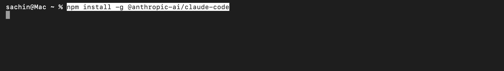

```bash
npm install -g @anthropic-ai/claude-code
```

You will see a message indicating that Claude Code has been installed successfully, similar to:

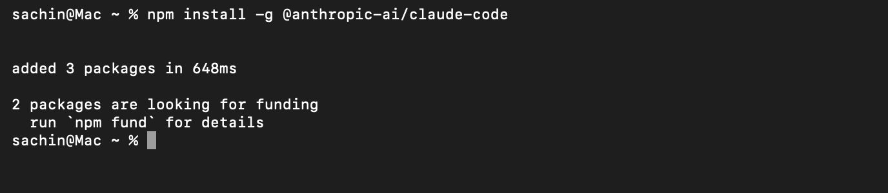

### Verify Installation

After installation, verify that Claude Code is installed correctly by running:

```bash
claude --version
```
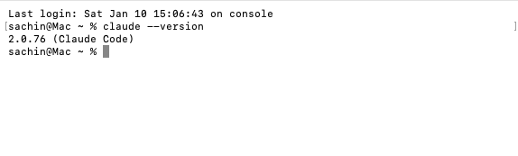

If you see a version number (e.g., `claude 1.0.0`), Claude Code is installed successfully! ✅

**If you get an error like "claude: command not found"**, follow these steps to fix the PATH:

1. **Create npm global directory and set prefix:**

```bash
mkdir ~/.npm-global
npm config set prefix '~/.npm-global'
```

2. **Add to your PATH** (choose the appropriate file for your shell):

For zsh (default on macOS):
```bash
echo 'export PATH=~/.npm-global/bin:$PATH' >> ~/.zprofile
source ~/.zprofile
```

For bash:
```bash
echo 'export PATH=~/.npm-global/bin:$PATH' >> ~/.bashrc
source ~/.bashrc
```

3. **Reinstall Claude Code:**

```bash
npm install -g @anthropic-ai/claude-code
```

4. **Verify again:**

```bash
claude --version
```

You should now see the version number, confirming that Claude Code is properly installed and accessible.

---

### Quick Note: Troubleshooting Steps (If Facing Installation Issues)

If you encounter permission errors like EACCES while installing Claude Code:

```
~ % npm install -g @anthropic-ai/claude-code

npm ERR! code EACCES
npm ERR! syscall mkdir
npm ERR! path /usr/local/lib/node_modules
npm ERR! errno -13
npm ERR! Error: EACCES: permission denied, mkdir '/usr/local/lib/node_modules'
npm ERR!  [Error: EACCES: permission denied, mkdir '/usr/local/lib/node_modules'] {
npm ERR!   errno: -13,
npm ERR!   code: 'EACCES',
npm ERR!   syscall: 'mkdir',
npm ERR!   path: '/usr/local/lib/node_modules'
npm ERR! }
npm ERR! The operation was rejected by your operating system.
npm ERR! It is likely you do not have permissions to access this file as the current user
```

### Follow these steps in your terminal:

1️⃣ **Create a ~/.zshrc file**

```bash
touch ~/.zshrc
```

2️⃣ **Add nvm initialization to it**

```bash
echo 'export NVM_DIR="$HOME/.nvm"' >> ~/.zshrc
echo '[ -s "$NVM_DIR/nvm.sh" ] && \. "$NVM_DIR/nvm.sh"' >> ~/.zshrc
```

3️⃣ **Load the file in the current terminal**

```bash
source ~/.zshrc
```

4️⃣ **Verify nvm installation**

```bash
nvm --version
```

You should now see the nvm version number.

5️⃣ **Install Node via nvm**

```bash
nvm install 24
```

```bash
nvm use 24
```

```bash
node -v
```

```bash
npm -v
```

6️⃣ **Now install Claude Code globally**

```bash
npm install -g @anthropic-ai/claude-code
```

✅ This should work without any EACCES errors.


---

### Step 6: Download the Project Repository

1. **Go to the Project Repository**  
   Open your web browser and navigate to the following URL:
   
   **[Click here to access the repository](https://github.com/sachin0034-tech/aipminterview-bootcamp-project-repo)**

2. **Download the ZIP File**  
   - Click on the **Code** dropdown button (usually green, located near the top right of the repository page).
   - Click on **Download ZIP** from the dropdown menu.
   - The ZIP file will start downloading to your default Downloads folder.
   
   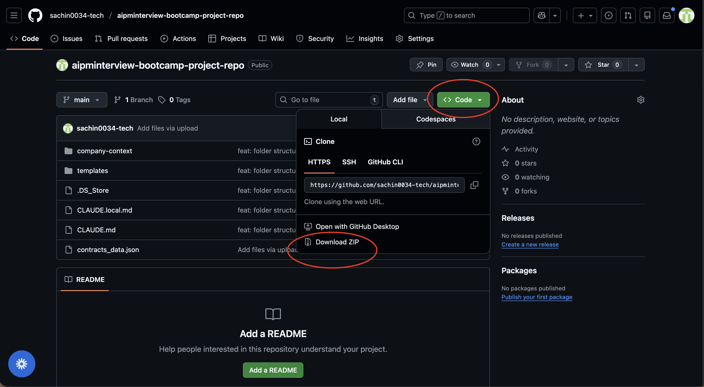

3. **Locate and Preview the Downloaded Folder**  
   - Go to your **Downloads** directory.
   - Locate the downloaded ZIP file (it will be named `aipminterview-bootcamp-project-repo-main.zip` or similar).
   - Right-click on the ZIP file and click on **Quick Look** (on Mac) to preview its contents.
   
   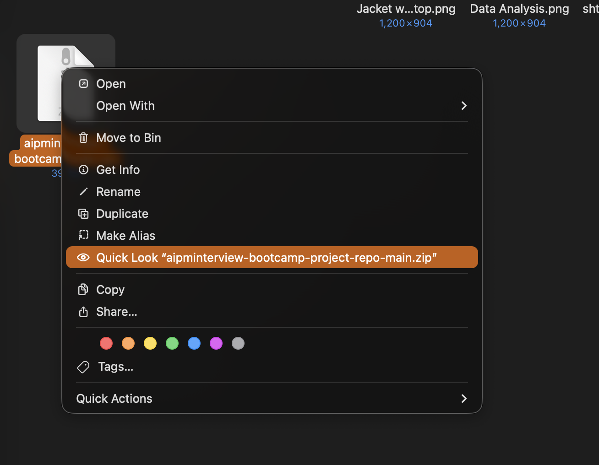

4. **Extract the ZIP File**  
   - Once you've previewed the folder, click on the **Uncompress** or **Extract** button.
   - The folder will be extracted to your Downloads directory.
   - You should now see a folder named `aipminterview-bootcamp-project-repo-main` (or similar).
   
   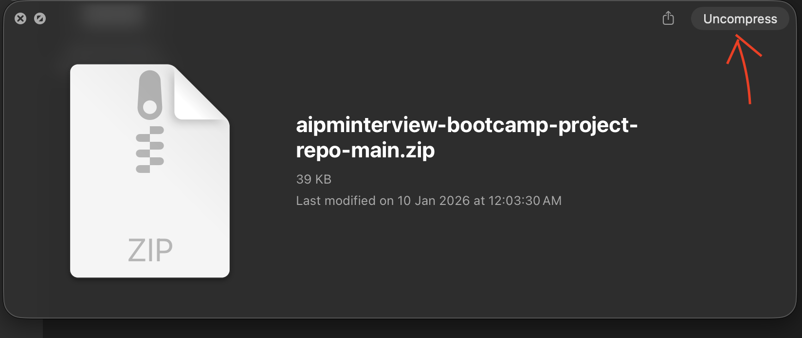

> **Note:** Now you can see that we have downloaded one folder which contains the context for our lesson. We will explore this in our next module.

---

### Step 7: Open the Project in VS Code

1. **Open the Extracted Folder in VS Code**  
   - In VS Code, click on **File** → **Open Folder** (or use `Cmd + O` on Mac / `Ctrl + O` on Windows).
   - Navigate to your Downloads directory.
   - Select the extracted folder `aipminterview-bootcamp-project-repo-main` (or the folder name you see).
   - Click **Open** to open the project folder in VS Code.

   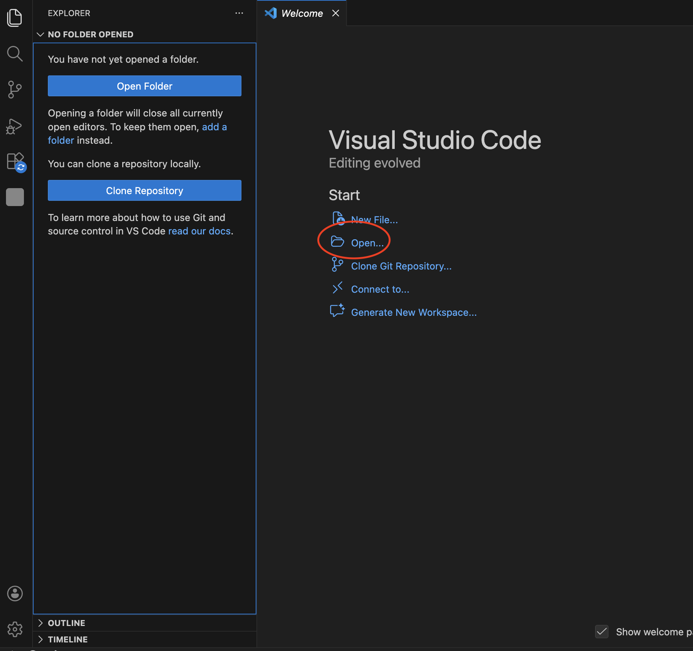

---

### Step 8: Run Claude in the Terminal

Follow these steps to run Claude from your VS Code terminal:

1. **Open Terminal in VS Code**  
   - In VS Code, click on the **Terminal** menu.
   - Select **New Terminal**.
   - The terminal will open at the root of your project folder.
   
   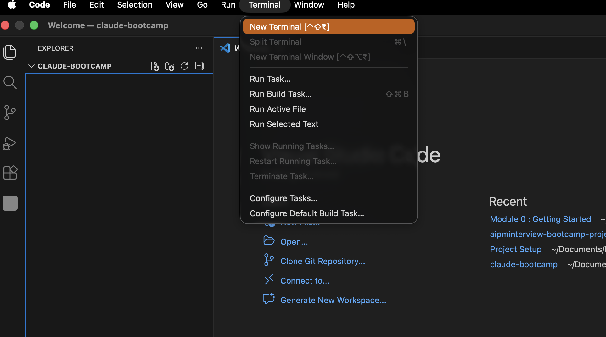

2. **Navigate to the Project Folder** *(Note: This is not a separate step - only do this if you're not already in the project folder)*  
   If you're not already in the project folder, navigate to it. In the terminal, type:
   
   ```bash
   cd ~/Downloads/aipminterview-bootcamp-project-repo-main
   ```
   
   *Note: Adjust the path if you extracted the folder to a different location.*

3. **Run Claude**  
   Now, in the same terminal, type the command below:

   ```bash
   claude
   ```
   
   

4. **Select a Theme**  
   - If you want to select the dark theme (which is the default), just press **Enter**.  
   - Alternatively, use the **Up** and **Down** arrow keys to choose a different theme, then press **Enter** to confirm your selection.

5. **Choose Account Type**  
   - Claude will provide two options:
     1. Claude account with subscription (default)
     2. Anthropic console account  
   - Choose the default option and press **Enter** (you don't need to do anything else).

   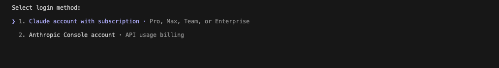

6. **Connect Your Account**  
   - Your browser will open automatically.  
   - Log in with the account that has an active subscription.  
   - Click **Authorize** to complete the connection.

   

7. **Login Confirmation**  
   - You will see a message: `Login successful`.  
   - Press **Enter** to continue.

   

8. **Configuration Settings**  
   - Claude will ask if you want to change settings: press **Enter** to accept the defaults.  
   - It will also ask if you want to set this folder/file: press **Enter** to accept the default.
   - Claude will ask "Do you trust these file": just press **Yes**.
   
   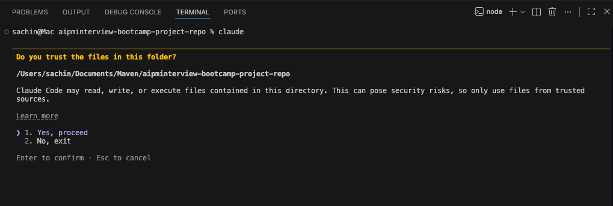

9. **Welcome Message**  
   - You will see: `Welcome to Claude`.  
   - Press **Enter** to continue.
   
   

10. **Test the Connection**  
   - Once you see the prompt, your VS Code is successfully connected to Claude.  
   - Try a test question, e.g., `What is 2+2?` to confirm it's working.
   
   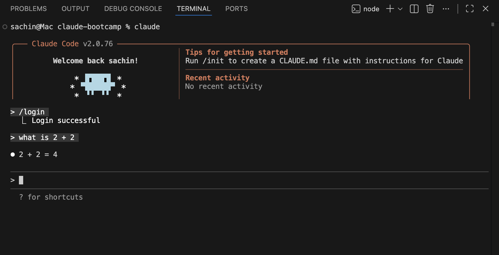

---

### **→ What's Next?**

**Congratulations! 🎉** You have successfully completed the configuration and connected Claude Code with VS Code. You're now ready to experiment and start building with AI-powered tools.

In the next module, we'll explore how to:
- **Play with Claude Code** and leverage its capabilities for product management tasks
- **Conduct market research** using AI assistance to gather insights and analyze trends
- **Perform user research** to understand user needs and validate product ideas
- **Write PRDs (Product Requirements Documents)** that are AI-aware and grounded in real evaluation.

You now have everything set up to work like a modern AI PM who builds, evaluates, and reasons in systems.

---

### **→ Additional Resources**

- [Claude Code Documentation](https://code.claude.com/docs/en/overview#npm) - Official documentation for Claude Code installation, setup, and usage

---
