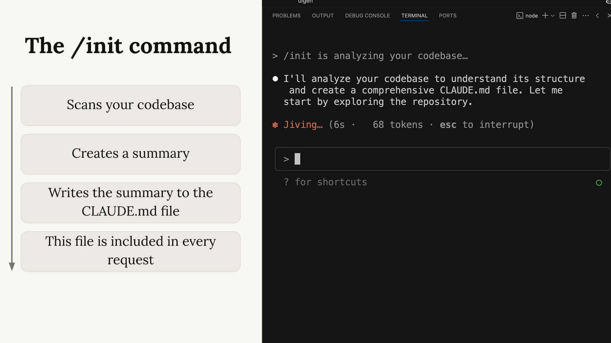

# Module 2: Understanding Claude Code Context System

---

## Overview

In this module, we will be learning and doing hands-on exercises to understand how to effectively use Claude's context system. You will learn how to add context to Claude and leverage it to perform various Product Management (PM) tasks.

---

## What You Will Learn

This module will cover:

1. **Understanding File Structure** - Learn how to organize and structure files for optimal context management
2. **Understanding Context** - Master the fundamentals of how Claude's context system works
3. **Market Research Using Context** - Perform comprehensive market research by leveraging context
4. **User Research Using Context** - Conduct user research and analysis with context
5. **Writing PRD Using Context** - Create Product Requirements Documents (PRD) efficiently using context

---

## Learning Objectives

By the end of this module, you will be able to:
- Add and manage context effectively in Claude
- Use context to perform market research tasks
- Conduct user research using context
- Write professional PRDs leveraging the context system
- Understand best practices for organizing information for Claude's context system

---

## Module Structure

This module is divided into several hands-on lessons, each building upon the previous one to give you a comprehensive understanding of Claude's context capabilities for PM work.

---

## Next Lesson

In the next lesson (2.1 - Understanding File Structure), we will observe the file structure and see how it works. This foundational lesson will help you understand how to organize and structure files for optimal context management in Claude.
