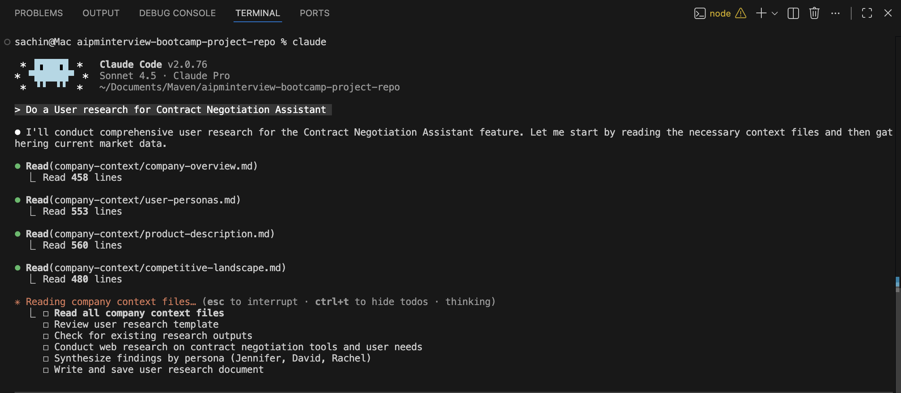
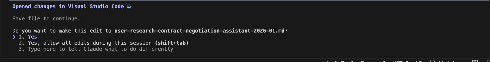
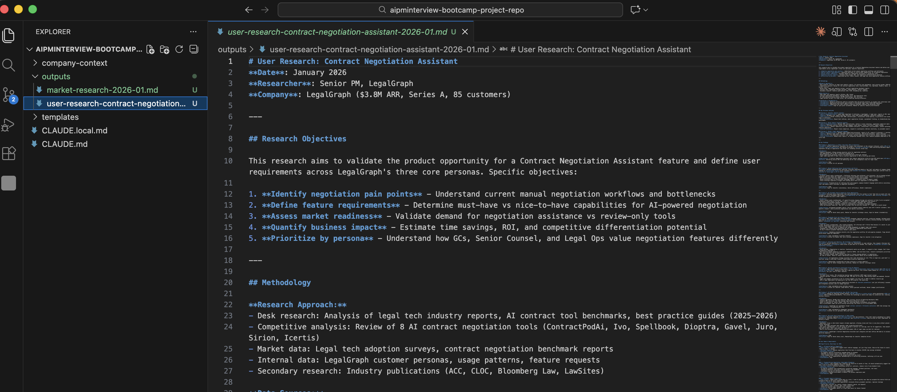

# Lesson 2.4: Doing User Research Using Context

---

## Overview

Till now you have done market research and learned about how you can pass your own context in Claude Code. In this lesson, we will be doing user research based on the context we have set up. This is where you'll see how all the concepts from the previous lessons come together to help you perform real Product Management tasks efficiently using Claude Code's context system.

---

## Prerequisites

Before starting this lesson, make sure you have:
- Completed Module 1
- Completed all previous lessons of Module 2

---

## Hands-On: User Research Using Context

Now let's start the hands-on work! In this section, we'll perform user research using the context system we've set up. You'll learn how to leverage your company context and templates to conduct comprehensive user research efficiently.

---

### Step 1: Open Your Project

Open your VS Code and navigate to your project that you have cloned in Module 1.

1. Click on the **Open** button in VS Code
2. Select the folder you have cloned in Module 1


---

### Step 2: Open Terminal

1. Click on **Terminal** in the menu bar
2. Click on **New Terminal**


---

### Step 3: Launch Claude

In the terminal, type `claude` and press **Enter**.

```
claude
```


---

### Step 4: Enter User Research Prompt

Now put a prompt in the terminal:

```
Do a User research for Lease Compliance Reporting feature.

Feature: Automated compliance report generation from lease data (IFSC, accounting standards)

Research:
- Do our personas (Jennifer/David/Rachel) need this?
- What compliance reports do legal teams generate today? (manual process?)
- How often do they generate these reports? (monthly, quarterly, annually?)
- What formats are required? (Excel, PDF, specific templates?)
- Integration needs (accounting systems, audit platforms?)
- Willingness to pay for this feature?

```



---

### Step 5: How Claude Processes This Query

The query will process in the same way as it works in market research. Let me give you an overview again:

Now let's break down how Claude processes this query. You can also see the logs in the terminal showing how your query is processing, which files it is referring to, and the template style:

The moment you put this query, Claude Code already has context about your company in `CLAUDE.md`. In that file, we have mentioned which files to refer to for doing user research as context.

As you can see, Claude will read the `company-context` folder to do user research because we have already set our context in the `CLAUDE.md` file. This means Claude doesn't need you to manually specify which files to look at - it automatically knows to use the company context files you've referenced in `CLAUDE.md`.


---

#### Review Output

Now Claude Code will ask you to review the output. If you press **Yes**, then it will move to the other step which is saving the output to a file.



After reviewing the output, you can see a new file has been created in the **output** directory. Now you have two files: **market-research.md** and **user-research.md**.



---

## What's Next

Excellent work completing the user research! In the next lesson (2.5 - Writing PRD Using Context), you will learn how to write a comprehensive Product Requirements Document using all the context you've gathered - including the market research and user research files you've created. This will bring together everything you've learned to create a professional PRD.

---
