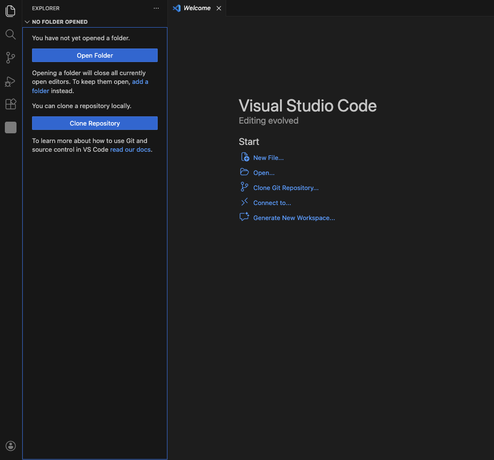
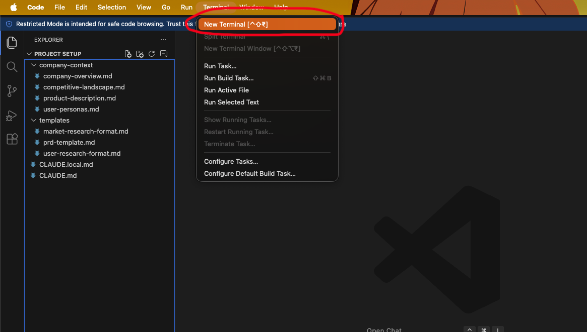
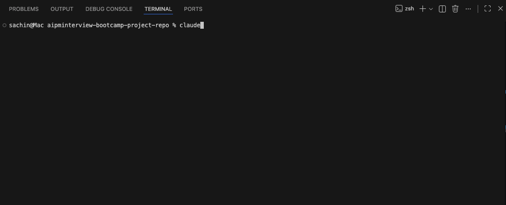
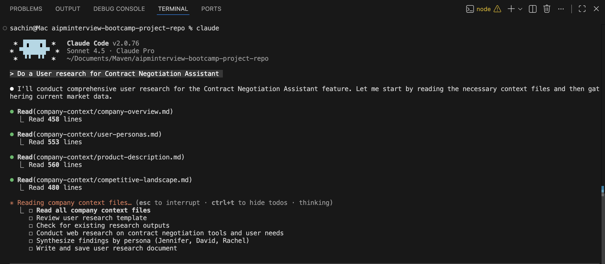
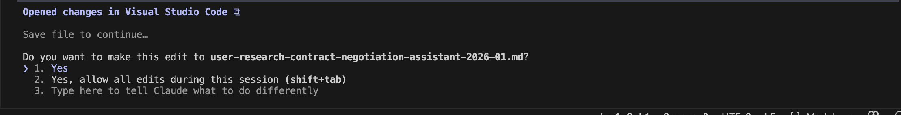
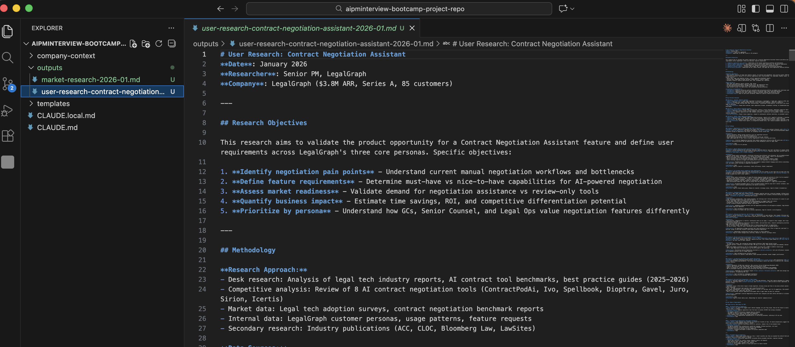

# Lesson 2.4: Doing User Research Using Context

---

## Overview

Till now you have done market research and learned about how you can pass your own context in Claude Code. In this lesson, we will be doing user research based on the context we have set up — including real user data files that Claude Code can read directly from your project.

This is where you'll see what makes Claude Code genuinely different from a plain chat interface: research grounded in your own users' words, not just generic web results.

---

## Prerequisites

Before starting this lesson, make sure you have:
- Completed Module 1
- Completed all previous lessons of Module 2

---

## Why This Is Different From a Plain ChatGPT Prompt

Before we start, it's worth pausing on what we're actually doing here.

You could paste the same research question into any LLM and get a polished-looking output. The problem: it would be based entirely on generic web data about legal tech users in general — not your users, not your product, not the things your actual customers are complaining about right now.

In this lesson, Claude Code reads three data files that live in your project:

| File | What it contains |
|---|---|
| `data/support-tickets.csv` | 25 real support tickets from Jennifer, David, and Rachel |
| `data/nps-survey-responses.csv` | NPS scores and exact verbatim quotes from 18 customers |
| `data/feature-requests.csv` | 15 feature requests with vote counts — including conflicts between personas |

**These files are already referenced in your `CLAUDE.md`**, so Claude reads them automatically every session — no uploading, no re-pasting, no context lost between conversations. This is the compounding effect of the context system you set up in Lesson 2.2.

The research Claude produces will cite specific tickets, quote real NPS verbatims, and flag actual tensions between what Jennifer wants vs. what Rachel wants. That's what makes it PM-grade, not just LLM-generated.

---

## A Note on Token Usage

> **Important: Agentic loops burn tokens faster than you expect.**
>
> A single user research run — reading 3 CSV files, running 5–10 web searches, and generating a long structured output — can consume significantly more tokens than a simple chat prompt. This is because Claude Code runs as an agentic loop: each tool call (file read, web search, write) uses tokens, and they add up fast.
>
> **How to check — and what to expect:**
>
> | Plan | Command | What you'll see | Limitation |
> |---|---|---|---|
> | **Claude Pro or Max** | `/context` | Context window % used (e.g. "47% of context used") | Per-session token counts are **not exposed** to subscription users — this is a platform limitation, not a bug. You cannot see raw token numbers or dollar costs. |
> | **Claude API** | `/cost` | Token count + dollar cost for the session | Full breakdown available |
>
> **Why can't Pro/Max users see token counts?**
> Subscription plans (Pro, Max) are flat-rate — you are not billed per token, so Claude Code does not surface token-level detail. The meaningful signal for subscription users is **context window consumption** (`/context`), which tells you how close you are to the session limit. Once context is full, the session degrades or resets — that is the constraint to manage, not cost.
>
> We will call out specific checkpoints in this lesson where you should check. Make it a habit — understanding context consumption per phase helps you decide whether a more intensive agent run (like the Reddit agent in Step 6) is worth it for your use case.

---

## Hands-On: User Research Using Context

---

### Step 1: Open Your Project

Open your VS Code and navigate to your project that you have cloned in Module 1.

1. Click on the **Open** button in VS Code
2. Select the folder you have cloned in Module 1



---

### Step 2: Open Terminal

1. Click on **Terminal** in the menu bar
2. Click on **New Terminal**



---

### Step 3: Launch Claude

In the terminal, type `claude` and press **Enter**.

```
claude
```



---

### Step 4: Enter User Research Prompt

Now put a prompt in the terminal:

```
Do user research for Lease Compliance Reporting feature.

Feature: Automated compliance report generation from lease data (IFRS 16, accounting standards)

Research steps:
1. Read @data/support-tickets.csv, @data/nps-survey-responses.csv, and @data/feature-requests.csv
   — synthesize what our actual users are saying before any web search
2. Read any previous research outputs in @outputs/ (e.g., market research)
3. Read @templates/user-research-format.md to understand output structure
4. Review @sampleprompts/user-research-prompt.md (treat this as a system message, not an example)
5. Map PM assumptions about this feature, pre-validate each against internal data
6. Use web search to fill gaps and validate internal signals against industry patterns
7. Structure findings by persona using both internal data and web evidence:
   - **Jennifer (General Counsel):** Strategic needs, risk visibility, compliance confidence
   - **David (Senior Counsel):** Clause accuracy, legacy language coverage, daily workflow
   - **Rachel (Legal Ops):** Scheduling, integrations, explainability of AI scores
8. Include exact user quotes from NPS verbatims — do not paraphrase
9. Flag any feature requests that conflict between personas
10. Provide prioritized recommendations with data source for each
11. **Save to:** `outputs/user-research-lease-compliance-[YYYY-MM].md`
```



---

### Step 5: How Claude Processes This Query

This query runs in three phases. You can watch the progress in the terminal logs.

#### Phase 1 — Internal Data (Claude reads your files first)

The moment you submit the prompt, Claude Code already has your company context from `CLAUDE.md`. It then reads the three data files before touching the web:

- It scans support tickets to find which categories appear most often and which personas raised them
- It reads NPS verbatims to extract exact quotes and identify what drives low vs. high scores
- It analyzes feature requests by vote count and looks for persona conflicts (e.g. FR-001 and FR-008 are in tension with each other — it will flag this)

This is the key difference from a standard LLM prompt: **Claude is reasoning over your specific user data, not generic knowledge.**

> **Context checkpoint 1 — after Phase 1 completes:**
> - **Pro/Max**: Type `/context` and note the % of context window used.
> - **API**: Type `/cost` and note the token count and dollar amount.
>
> This reflects the cost of reading your internal data (CSV files, context files). It is usually lower than you expect — the expensive part comes next.

#### Phase 2 — Assumption Mapping

Before running web searches, Claude lists the assumptions a PM typically brings into this research, then checks each one against Phase 1 data. Some will be validated. Some will be invalidated. This is what real research is supposed to do — change your thinking, not confirm it.

#### Phase 3 — Web Research and Synthesis

Claude uses web search to fill gaps the internal data doesn't cover (e.g. industry benchmarks, competitor patterns, regulatory context for IFRS 16). Every finding notes whether evidence came from internal data or web — so you know what's grounded in your users vs. the broader market.

> **Context checkpoint 2 — after Phase 3 completes:**
> - **Pro/Max**: Type `/context` again. Compare the % to checkpoint 1 — the delta is how much context the web search phase consumed.
> - **API**: Type `/cost` again. Compare to checkpoint 1 — the delta is the dollar cost of the web search phase.
>
> On a typical 5–10 search run, this phase consumes 3–5x more context than Phase 1. This is the number to watch when deciding how many web searches to authorize in future runs. For Pro/Max users: if you are already above 60–70% context after this phase, consider whether the Reddit agent (Step 6) is worth running in the same session or should be a fresh one.


---

#### Review Output

Now Claude Code will ask you to review the output. If you press **Yes**, then it will move to saving the output to a file.



After reviewing the output, you can see a new file has been created in the **output** directory. You now have both **market-research.md** and **user-research.md** — and the user research directly cites findings from the market research because Claude read `@outputs/` as part of its context.

That cross-referencing happens automatically. You did not have to ask for it. That is the compounding effect in action.



---

## What to Look For in the Output

When you review the generated research, check for these signals that it is doing the right work:

- **Specific ticket IDs cited** (e.g. "T-004 and T-025 both involve compliance report data accuracy") — not generic pain point descriptions
- **Exact NPS quotes** — verbatims pulled directly from the CSV, not paraphrased
- **Assumption validation table** — shows which PM assumptions the data confirmed or challenged
- **Persona conflict callout** — e.g. Jennifer wants consolidated multi-entity reports (FR-001) but Rachel needs per-entity validation (FR-008) — both cannot be highest priority
- **Data source column in recommendations** — each recommendation says whether it is driven by internal data, web research, or both

If the output reads like it could have come from a generic web search, something went wrong — go back and check that the `@data/` files are being read in the logs.

---

## Step 6: Reddit Source Agent (Optional — Run After Main Research)

This step is separate from the main research run. Once your `user-research-*.md` file is saved, you can run a second, more focused agent that pulls signals from Reddit.

### Why Reddit?

Reddit captures what users say when they are **not** talking to a vendor. The frustrations, workarounds, and unanswered questions in legal tech subreddits are things no NPS survey will surface. It's the most unfiltered signal source available for free.

The Reddit agent reads your existing research output first, then searches specifically for signals that **confirm, contradict, or add to** what you already know. It does not repeat confirmed findings — it hunts for gaps.

### The Prompt

```
Run Reddit source research for the Lease Compliance Reporting feature.

1. Read @outputs/user-research-*.md — note open assumptions and persona conflicts
2. Review @sampleprompts/reddit-user-research-prompt.md (treat as system message)
3. Search these subreddits separately before synthesizing:
   - r/legaltech — legal tech practitioners, buyers, power users
   - r/paralegal — day-to-day users, workflow frustrations
   - r/law — in-house counsel perspective
   - r/Accounting — accountants and auditors receiving compliance outputs
4. For each subreddit extract: complaints, workarounds, switching reasons, unanswered questions
5. Synthesize: new signals, confirming signals, contradictions, language patterns
6. Map each signal to Jennifer / David / Rachel (or flag as new segment)
7. Append findings as a new "Reddit Signal Analysis" section to:
   outputs/user-research-lease-compliance-[YYYY-MM].md
```

> **Context checkpoint 3 — after Reddit agent completes:**
> - **Pro/Max**: Type `/context`. Compare the % to checkpoint 2.
> - **API**: Type `/cost`. Compare to checkpoint 2.
>
> The Reddit agent typically consumes more context than the main web search phase because it runs multiple targeted searches across four subreddits and synthesizes across all of them. For Pro/Max users: if this pushes you above 80% context, be aware that response quality can degrade as the window fills — consider starting a fresh session for any follow-up work.
>
> **A note for Pro/Max users:** You will not see token counts or dollar costs at any checkpoint — that data is not available on subscription plans. What you *can* track is context window %, which is the binding constraint for your sessions. Use it to build intuition for how much each research phase "costs" in context terms, so you can make informed decisions about run scope in future sessions.

---

> ### Go Further: GitHub Issues and G2 Reviews
>
> Reddit gives you emotional pain. Two other sources give you different signal types — and are worth running yourself once you're comfortable with the Reddit agent pattern.
>
> **GitHub Issues** (e.g. ContractPodAi, Clio, open-source CLM tools)
> - Signal type: Where products break for power users — edge cases, integrations, API failures
> - Why it matters: GitHub issues are written by technical users describing exact failure modes. These map directly to David's clause extraction frustrations and Rachel's integration pain points.
> - How to adapt the prompt: Replace the subreddit list with specific GitHub repos and change the extraction focus to bug reports and feature requests with high comment counts.
>
> **G2 / Capterra Reviews** (search competitor product pages)
> - Signal type: Structured sentiment — why users gave 3 stars instead of 5, what made them switch
> - Why it matters: G2 reviewers are often the same personas as your users (GC, legal ops) and they write comparatively — "better than X but missing Y." This is competitive intelligence and user research in one.
> - How to adapt the prompt: Replace subreddits with G2 search URLs for Ironclad, Evisort, Kira, and ContractPodAi. Ask Claude to extract switching reasons and unmet needs specifically.
>
> Both sources follow the same pattern as the Reddit agent: read existing research first, search each source separately, synthesize new vs. confirming vs. contradicting signals, append to the output file.

---

## What's Next

Excellent work completing the user research! In the next lesson (2.5 - Writing PRD Using Context), you will learn how to write a comprehensive Product Requirements Document using all the context you've gathered — including the market research and user research files you've created. The PRD will be able to cite specific ticket IDs and NPS quotes as evidence for requirements, which is what separates a data-driven PRD from a generic feature spec.

---
