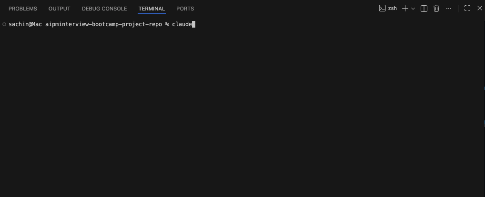
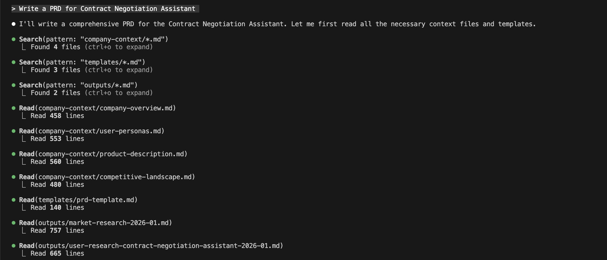
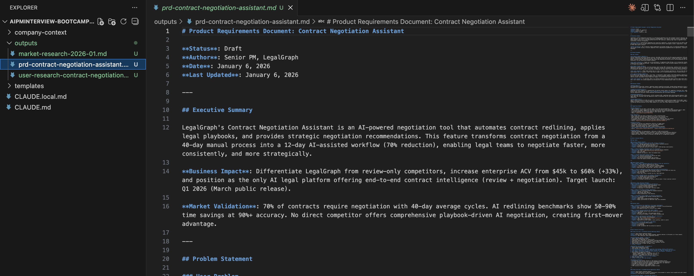
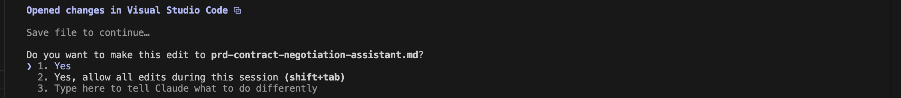

# Lesson 2.5: Writing PRD Using Context

---

## Overview

Till now you have done market research and user research. Now it's time to write a PRD. In this module, we will be using the new context which we have created using Claude - the market research and the user research files. We have already defined the template of the PRD in the templates folder which we have passed to the `CLAUDE.md` file, which is making sure to write the PRD in that format only.

---

## Prerequisites

Before starting this lesson, make sure you have:
- Completed Module 1
- Completed all previous lessons of Module 2
- Completed market research (Lesson 2.3)
- Completed user research (Lesson 2.4)

---


## Hands-On: Writing PRD Using Context

Now let's start the hands-on work! In this section, we'll write a PRD using the context system we've set up. You'll learn how to leverage your company context, market research, user research, and templates to write a comprehensive PRD efficiently.

---

### Step 1: Open Your Project

Open your VS Code and navigate to your project that you have cloned in Module 1.

1. Click on the **Open** button in VS Code
2. Select the folder you have cloned in Module 1


---

### Step 2: Open Terminal

1. Click on **Terminal** in the menu bar
2. Click on **New Terminal**


---

### Step 3: Launch Claude

In the terminal, type `claude` and press **Enter**.

```
claude
```



---

### Step 4: Enter PRD Writing Prompt

Now put a prompt in the terminal:

```
Write a PRD for Contract Negotiation Assistant
```



---

### Step 5: How This Query Works

Now let's see how this query works. First of all, in the `CLAUDE.md` file, we have already passed:
- The template of the PRD
- The company context
- The outputs folder which contains the market research and user research that we have done in previous lessons


So we don't need to explicitly mention these - we just provide a prompt. Claude will automatically use all the context that has been set up in `CLAUDE.md`, including the PRD template format, company information, and the location where the output should be saved.

---

#### Review Output

Now Claude Code will ask you to review the output. If you press **Yes**, then it will move to the other step which is saving the output to a file.



After reviewing the output, you can see a new file has been created in the **output** directory. Now you have three files: **market-research.md** , **user-research.md** and **prd.md**.



---

## Module 2 Summary

**Note:** This is the last lesson of Module 2. Let me give you a quick summary of what you have learned:

1. **How to set context in Claude Code** - You learned the fundamentals of setting up context using `CLAUDE.md` files
2. **Different types of methods to set the context in the CLAUDE.md file** - You explored various ways to reference files and pass context using the `@` symbol and memory mode
3. **How to do market and user research using Claude Code** - You performed hands-on market research and user research tasks leveraging the context system
4. **Last but not the least, how to write PRD** - You learned to write comprehensive Product Requirements Documents using all the context you've set up, including templates, company information, and previous research outputs

Congratulations on completing Module 2! You now have a solid understanding of how to effectively use Claude Code's context system for Product Management tasks.

---

## What's Next

In the next module, we will talk about agents and hopefully build some visualizations as well. This will further expand your capabilities with Claude Code and help you create more interactive and visual outputs for your Product Management work.

---