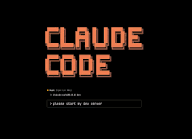

# Module 2: Understanding Claude Code Context System

Welcome to Module 2! This module focuses on mastering Claude Code's context system and learning how to leverage it for essential Product Management tasks.

---

## Module Overview

In this module, you will learn how to:
- Organize and structure files for optimal context management
- Understand how Claude's context system works
- Perform market research using context
- Conduct user research with context
- Write professional Product Requirements Documents (PRDs) using context

---

## Learning Objectives

By the end of this module, you will be able to:
- ✅ Add and manage context effectively in Claude Code
- ✅ Organize files and information for optimal context usage
- ✅ Use context to perform comprehensive market research
- ✅ Conduct user research and analysis using context
- ✅ Write professional PRDs leveraging the context system
- ✅ Understand best practices for organizing information for Claude's context system

---

## Prerequisites

Before starting this module, make sure you have:

1. **Completed Module 1** - All lessons in Module 1
2. **Cloned the Project** - The project repository from Module 1
3. **Claude Code Installed** - Claude Code should be set up and running in VS Code

---

## Quick Start Guide

1. **Start with Lesson 2.0** - Review the module overview
2. **Continue to Lesson 2.1** - Understand file structure and organization
3. **Learn Lesson 2.2** - Master Claude Code's context system
4. **Complete Lesson 2.3** - Perform market research using context
5. **Finish Lesson 2.4** - Conduct user research with context
6. **Finalize Lesson 2.5** - Write a PRD using all the context you've created

Each lesson builds on the previous one, so we recommend following them in order.

----

## Lessons in This Module

### [Lesson 2.0: Overview](./2.0-overview.md)

**[Click here to access the lesson](./2.0-overview.md)**

**What you'll learn:**
- Module overview and learning objectives
- Understanding the context system fundamentals
- What you'll accomplish in this module
- Module structure and progression

**Key Skills:**
- Module navigation
- Learning path understanding
- Context system overview

---

### [Lesson 2.1: Understanding File Structure](./2.1-understanding-file-structure.md)

**[Click here to access the lesson](./2.1-understanding-file-structure.md)**

**What you'll learn:**
- Project file structure and organization
- Understanding the company-context directory
- Working with templates for output formats
- Managing CLAUDE.md and CLAUDE.local.md files
- Best practices for file organization

**Key Skills:**
- File structure management
- Context organization
- Template usage
- Project navigation

---

### [Lesson 2.2: Understanding Claude Code Context System](./2.2-understanding-claude-code-context -system.md)

**[Click here to access the lesson](./2.2-understanding-claude-code-context -system.md)**

**What you'll learn:**
- How Claude's context system works
- Adding files and information to context
- Managing context effectively
- Understanding context limitations and best practices
- Leveraging context for better AI assistance

**Key Skills:**
- Context management
- Context optimization
- AI interaction patterns
- Information architecture

---

### [Lesson 2.3: Doing Market Research Using Context](./2.3-doing-marketresearch-using-context.md)

**[Click here to access the lesson](./2.3-doing-marketresearch-using-context.md)**

**What you'll learn:**
- Performing comprehensive market research using Claude Code
- Leveraging company context for market analysis
- Using templates to structure research output
- Analyzing competitive landscape
- Generating actionable market insights

**Key Skills:**
- Market research methodology
- Competitive analysis
- Context-driven research
- Research synthesis
- Strategic analysis

---

### [Lesson 2.4: Doing User Research Using Context](./2.4-doing-usereraserch.context.md)

**[Click here to access the lesson](./2.4-doing-usereraserch.context.md)**

**What you'll learn:**
- Conducting user research with Claude Code's context system
- Analyzing user personas and needs
- Synthesizing user feedback and insights
- Creating structured user research documents
- Identifying user pain points and opportunities

**Key Skills:**
- User research methodology
- Persona analysis
- User needs identification
- Research documentation
- User-centric thinking

---

### [Lesson 2.5: Writing PRD Using Context](./2.5-writing-prd.md)

**[Click here to access the lesson](./2.5-writing-prd.md)**

**What you'll learn:**
- Writing comprehensive Product Requirements Documents (PRDs)
- Leveraging market research and user research context
- Using PRD templates effectively
- Creating well-structured product documentation
- Synthesizing research into actionable product requirements

**Key Skills:**
- PRD writing
- Product documentation
- Requirements synthesis
- Product specification
- Cross-functional communication

---

