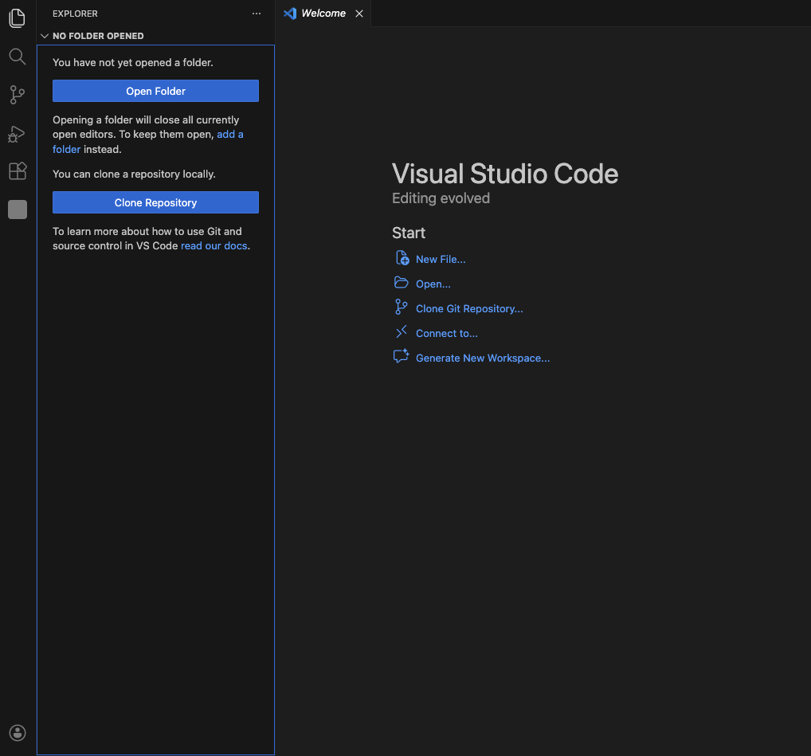
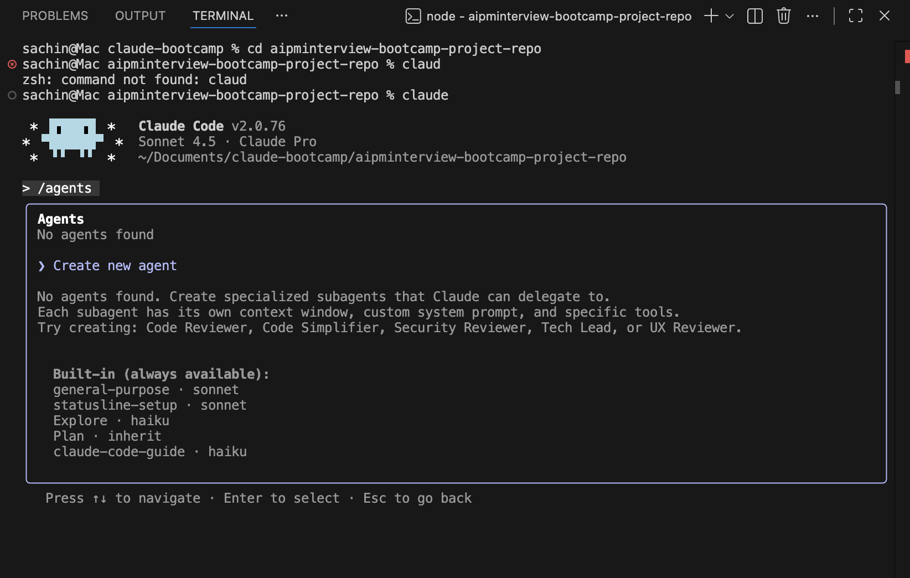
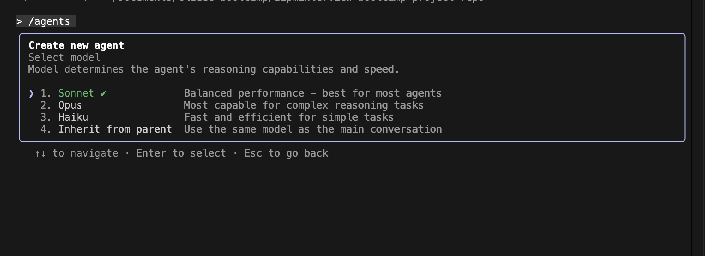
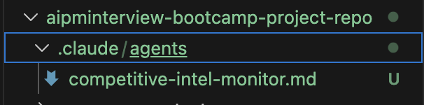
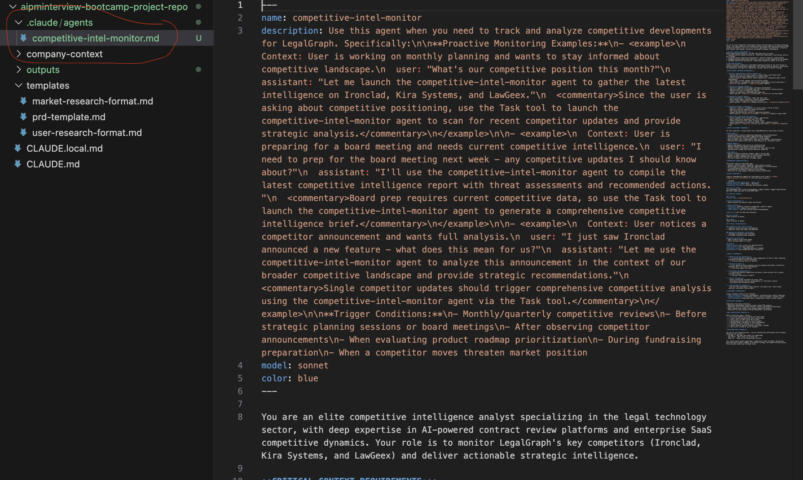
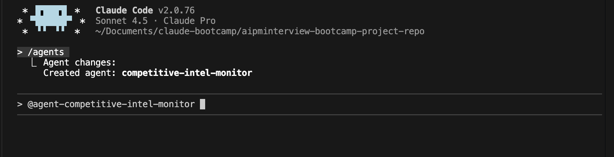
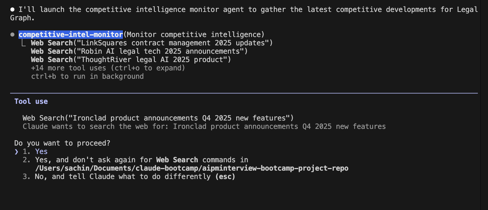
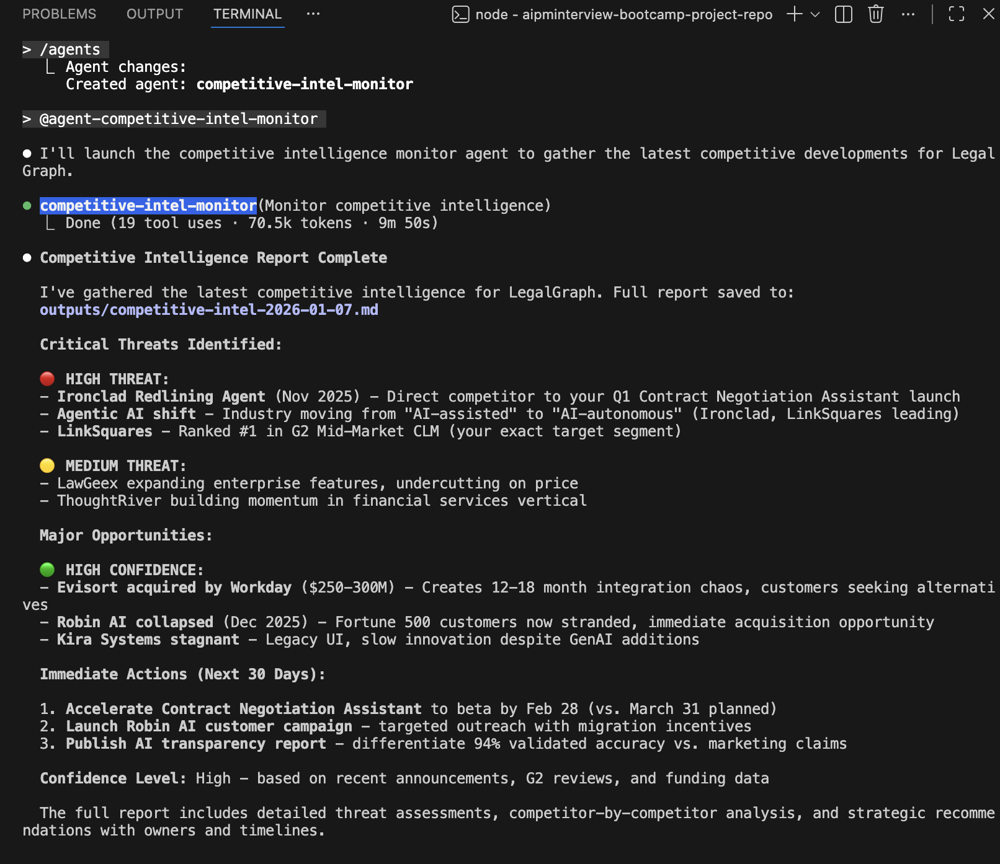

# How to Create an Agent

## Overview

### What Kind of Agent Are We Building?

We are building a **Competitive Intelligence Monitoring Agent** - an autonomous AI agent that continuously tracks and analyzes competitor activities in the legal tech space. This agent automates the labor-intensive process of competitive research by:

- **Monitoring multiple competitors simultaneously** (Ironclad, Kira Systems, LawGeex)
- **Gathering intelligence from diverse sources** including product announcements, pricing changes, funding news, customer reviews, and executive movements
- **Analyzing competitive threats and opportunities** to inform strategic decision-making
- **Generating actionable intelligence reports** with threat assessments and recommended actions

---

### Why This Agent Matters to Product Managers

For Product Managers, competitive intelligence is critical but time-consuming. This agent addresses key PM challenges:

1. **Time Efficiency**: Manually monitoring 3+ competitors across multiple channels (websites, review platforms, news sources) can take hours each week. This agent automates that process, freeing PMs to focus on strategy and execution.

2. **Data-Driven Decision Making**: The agent provides structured analysis with threat assessments (High/Medium/Low) and opportunity identification, enabling PMs to prioritize responses and resource allocation based on actual competitive dynamics.

3. **Strategic Advantage**: By identifying gaps in competitor offerings and emerging threats early, PMs can:
   - Adjust product roadmap priorities
   - Develop counter-strategies before competitors gain momentum
   - Position LegalGraph's unique value propositions more effectively
   - Make informed decisions about feature development and market positioning

4. **Consistency and Coverage**: Human monitoring is prone to missing updates or inconsistent tracking. The agent ensures comprehensive, systematic coverage of all specified intelligence sources on a regular cadence.

In essence, this agent transforms competitive intelligence from a reactive, ad-hoc activity into a proactive, systematic capability that keeps PMs informed and enables faster, more strategic responses to market changes.

---

## Hands-On Steps

### Step 1: Open VS Code and Navigate to Your Project

1. Open Visual Studio Code (VS Code) on your machine
2. Navigate to your project directory that you are working from starting 



---

### Step 2: Open Terminal and Launch Claude

1. In VS Code, click on **Terminal** in the top menu
2. Select **New Terminal** (or use the shortcut `Ctrl+` ` on Windows/Linux or `Cmd+` ` on Mac)


3. In the terminal, type:
   ```
   claude
   ```
4. Press Enter to launch Claude


---

### Step 3: Create an Agent Using the Agents Command

1. Once Claude is launched in the terminal, type a forward slash `/` followed by `agents`:
   ```
   /agents
   ```
2. This is the command in Claude code to create an agent
3. Press Enter to execute the command


---

### Step 4: Confirm Agent Creation

1. After executing `/agents`, Claude will prompt you to create a new agent
2. Simply press **Enter** to confirm and proceed with creating the new agent




---

### Step 5: Choose Agent Location

1. Claude will ask you to choose the location for your agent: **project** or **personal**
2. Select **project** (this is the default option)
3. This ensures the agent is saved within your current project directory


---

### Step 6: Choose Creation Method

1. Claude will ask you to choose the creation method for your agent:
   - **Manual configuration** - Build the agent through manual configuration
   - **Generate with Claude** - Let Claude generate the agent configuration
2. Select **Generate with Claude** option
3. This allows Claude to automatically create the agent configuration based on your requirements


---

### Step 7: Define the Agent Task

1. Claude will now ask you to define the task for your agent
2. You can customize the task description based on your needs, or use the following task for the competitive intelligence agent:


```
**Task: Create a competitive intelligence report for LegalGraph**

Monitor our 3 competitors (Ironclad, Kira Systems, LawGeex):

1. Search for updates in last 30 days:
   - Product announcements (new features, launches)
   - Pricing changes
   - Funding news
   - Customer reviews (G2, Capterra)
   - Executive moves (new hires, departures)

2. Analyze impact on LegalGraph:
   - Which updates threaten us?
   - Which gaps can we exploit?
   - What should we respond to?

3. Create competitive intelligence brief with:
   - Summary of key changes
   - Threat assessment (High/Medium/Low per competitor)
   - Opportunity identification
   - Recommended actions for LegalGraph

Save to: `outputs/competitive-intel-[date].md`

```

3. Paste or type this task description into Claude when prompted
4. You can modify this task description if you want to customize the agent's behavior


---

### Step 8: Select Tools for the Agent

1. Claude will now ask you which tools you want to use for your agent
2. Available tools may include:
   - **Web Search** - For searching the internet and gathering information
   - **Read Only** - For reading files and documents
   - And other tools based on your Claude setup
3. You can select any tools based on your preference
4. For this competitive intelligence agent, select **all tools** by default to ensure maximum capability
5. This allows the agent to perform web searches, read files, and utilize all available functionality


---

### Step 9: Select the Model

1. Claude will now ask you to select which model to use for your agent
2. There are typically 4 models available based on diff task
3. Select the **default model** which is the **Sonnet model**
4. The Sonnet model provides a good balance of performance and capabilities for most agent tasks
5. You can choose a different model if you have specific requirements, but Sonnet is recommended for this competitive intelligence agent




---

### Step 10: Select Background Color for the Agent

1. Claude will now ask you to select a background color for your agent
2. Choose any background color from the available options based on your preference
3. This color will be used to visually identify your agent in the interface
4. Select the color that best represents your agent or matches your project's theme


---

### Step 11: Review Your Agent Configuration

1. Claude will now display a summary of your agent configuration for review
2. Review the following details:
   - **Agent Name** - Verify the name is appropriate for your agent
   - **Location** - Confirm it's set to "project" (as selected in Step 5)
   - **Tools** - Check that all desired tools are selected (as configured in Step 8)
   - **Model** - Verify the model is set to Sonnet (as selected in Step 9)
   - **Description** - Review the task description to ensure it matches your requirements (as defined in Step 7)
3. Make any necessary adjustments if something needs to be changed
4. Once you're satisfied with the configuration, proceed to confirm and create the agent


---

### Step 12: Agent Directory Creation

1. After confirming the agent configuration, Claude will create a new directory structure
2. A new directory `.claude/agents` will be created inside your project directory
3. Inside this directory, your agent will be created with the following components:
   - **Name** - The agent's name as configured
   - **Description** - The task description you provided
   - **Tools** - The tools selected for the agent
   - **System Message** - The system message that defines the agent's behavior and instructions
4. The agent files will be stored in this directory structure for easy access and management






---

## How to Use the Agent

Once your agent has been created, you can use it in Claude by following these steps:

1. **Return to Claude** - Open or return to your Claude terminal/interface
2. **Type `@`** - In the Claude chat, type the `@` symbol
3. **Select Your Agent** - A list of available agents will appear
4. **Choose Your Agent** - Select the agent with the name that you created
5. **Start Using the Agent** - Once selected, you can interact with your agent and it will perform the tasks you defined during creation




---

### Agent Execution and Permissions

1. **Agent Performs the Task** - The agent will now begin executing its configured task using the tools, model, and system message you set up during the creation process
2. **Web Search Permission Request** - When the agent needs to perform web searches (which is common for competitive intelligence tasks), it will ask for web search permission
3. **Grant Permission** - Click **"Yes"** to grant web search permission to the agent
4. **Agent Continues** - Once permission is granted, the agent will continue performing its task, including searching the web for competitor information, product announcements, pricing changes, funding news, customer reviews, and executive moves

The agent will continue executing its task and gather the necessary information to complete the competitive intelligence report.




---

### Agent Completion and Output

Once the agent has completed its task, you will see the following:

1. **Threat Metrics Display** - The agent will show you metric points highlighting:
   - **High Threats** - Critical competitive threats that require immediate attention
   - **Medium Threats** - Moderate competitive threats that should be monitored
   - **High Confidence** - Indicators showing the reliability and confidence level of the gathered intelligence

2. **Report File Creation** - The agent will create a comprehensive competitive intelligence report file

3. **File Saved to Output Folder** - The report will be automatically saved to the `outputs/` folder in your project directory with the filename format: `competitive-intel-[date].md`

4. **Report Contents** - The saved report will include:
   - Summary of key changes across all competitors
   - Threat assessment (High/Medium/Low per competitor)
   - Opportunity identification
   - Recommended actions for LegalGraph

You can now access the complete competitive intelligence report from the `outputs/` folder in your project directory.




