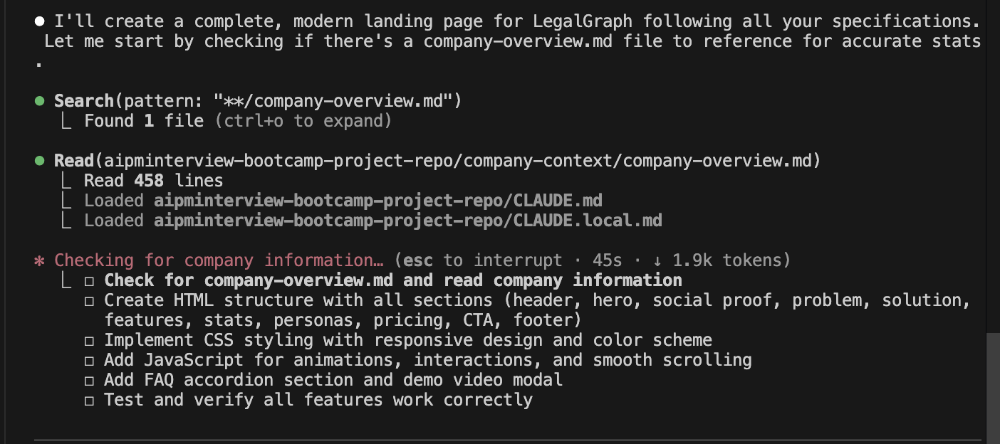
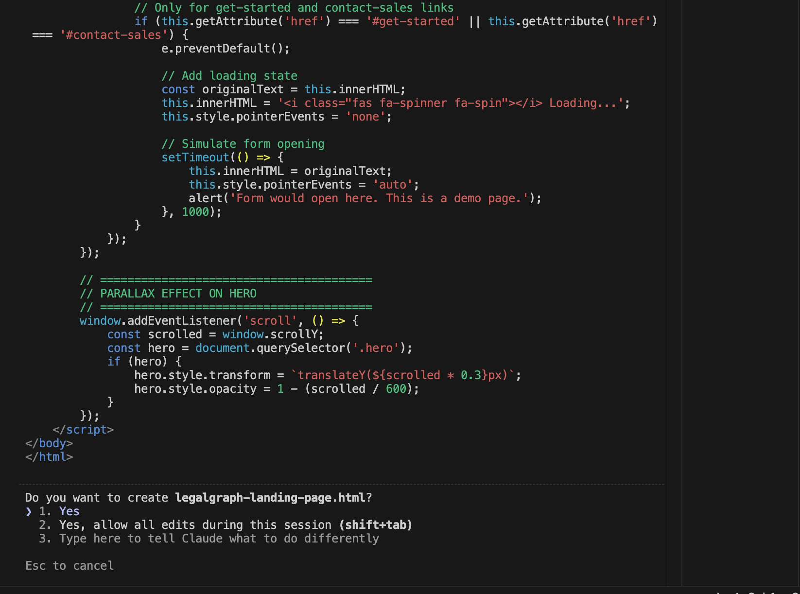
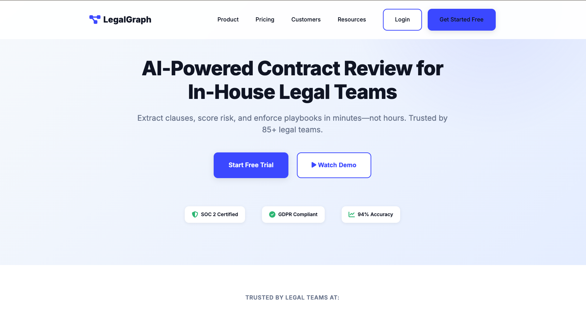

# How to Create Mocks and Visualizations

## Overview

Up until now, you have only learned about content creation and how to conduct research using AI agents. Now it's time to take the next step and build something tangible - **mocks and visualizations**.

In this lesson, we will build a **website for LegalGraph**. This hands-on exercise will teach you how to:

- Create visual mockups and prototypes
- Build interactive websites
- Develop professional-looking web interfaces that showcase your product ideas

This practical experience will help you move beyond just gathering information to actually creating visual representations of your concepts, which is essential for product managers who need to communicate ideas effectively to stakeholders, developers, and designers.

---

## Prerequisites

Before starting this lesson, make sure you have:

1. **Completed Module 1** - You should have successfully completed all lessons in Module 1
2. **Completed Module 2** - You should have successfully completed all lessons in Module 2

---

**Note**: No prior web development or coding experience is required. This lesson will guide you through the process step-by-step, making it accessible even for beginners.

---

## Hands-On Steps

### Step 1: Open VS Code and Navigate to Your Project Folder

1. Open Visual Studio Code (VS Code) on your machine
2. Navigate to your project directory where you've been working on previous lessons


---

### Step 2: Open Terminal and Launch Claude

1. In VS Code, click on **Terminal** in the top menu
2. Select **New Terminal** (or use the shortcut `Ctrl+` ` on Windows/Linux or `Cmd+` ` on Mac)

3. In the terminal, type:
   ```
   claude
   ```
4. Press Enter to launch Claude


---

### Step 3: Provide Website Design Instructions

1. Now provide Claude with instructions about what the design of the website should look like and what sections you want to include
2. Below is a reference prompt you can use, or you can modify it according to your needs:

**Reference Prompt:**

```
Create a complete landing page website for LegalGraph - an AI-powered legal contract review platform.

WEBSITE REQUIREMENTS:

1. DESIGN STYLE (Modern SaaS Landing Page):
   - Clean, professional design with legal tech aesthetic
   - Dark navy (#0A1628) and white color scheme
   - Accent color: Electric blue (#0066FF)
   - Modern sans-serif typography (Inter or similar web-safe font)
   - Ample white space, clear hierarchy
   - Subtle animations and micro-interactions
   - Glassmorphism effects where appropriate
   - Fully responsive (mobile, tablet, desktop)

2. PAGE STRUCTURE (Single Page with Sections):

   HEADER/NAVIGATION:
   - Logo (text: "LegalGraph" with simple icon)
   - Navigation menu: Product, Pricing, Customers, Resources, Login
   - CTA button: "Get Started Free"
   - Sticky on scroll with subtle shadow
   
   HERO SECTION:
   - Headline: "AI-Powered Contract Review for In-House Legal Teams"
   - Subheadline: "Extract clauses, score risk, and enforce playbooks in minutes—not hours. Trusted by 85+ legal teams."
   - Two CTAs: "Start Free Trial" (primary), "Watch Demo" (secondary)
   - Hero visual: Abstract AI/legal illustration or animated gradient
   - Trust badges: "SOC 2 Certified" "GDPR Compliant" "94% Accuracy"
   
   SOCIAL PROOF SECTION:
   - "Trusted by legal teams at:" with logo grid (create placeholder logos for: TechCorp, FinanceFlow, HealthTech, DataScale, CloudVentures)
   - Testimonial: "LegalGraph saves our team 15 hours per week on contract review" - Jennifer Martinez, GC at TechCorp
   
   PROBLEM SECTION:
   - Headline: "Legal teams are drowning in contracts"
   - 3 pain points with icons:
     * "500+ contracts per year, only 3 attorneys"
     * "Manual review takes 3-5 hours per contract"
     * "Inconsistent risk assessment across the team"
   
   SOLUTION SECTION (How It Works):
   - Headline: "AI that learns your legal playbook"
   - 3-step process with visuals:
     1. Upload Contracts (drag-and-drop icon)
     2. AI Analyzes (brain/AI icon)
     3. Review & Approve (checkmark icon)
   
   FEATURES SECTION:
   - Headline: "Everything you need to review contracts faster"
   - 6 feature cards (2 rows of 3):
     1. Clause Extraction - "Auto-extract 200+ clause types with 94% accuracy"
     2. Risk Scoring - "Multi-dimensional risk assessment across 15+ categories"
     3. Playbook Management - "Codify your legal guidelines, enforce automatically"
     4. Portfolio Analytics - "Executive dashboards for GCs and legal ops"
     5. Collaboration - "Real-time comments, approvals, audit trails"
     6. Integrations - "DocuSign, Salesforce, Slack, and more"
   - Each card: icon, title, description, "Learn more →" link
   
   STATS SECTION:
   - Dark background with 4 stats in a row:
     * "12,500 Contracts reviewed monthly"
     * "94% AI accuracy on clause extraction"
     * "3.5 hours saved per contract"
     * "92% customer retention rate"
   
   PERSONAS SECTION:
   - Headline: "Built for every member of your legal team"
   - 3 persona cards:
     1. General Counsel - "Scale your team without hiring" (icon: briefcase)
     2. Senior Counsel - "Review contracts 80% faster" (icon: document)
     3. Legal Operations - "Data-driven insights and ROI" (icon: chart)
   
   PRICING SECTION:
   - Headline: "Transparent pricing for teams of all sizes"
   - 3 pricing tiers (cards side-by-side):
     
     STARTER:
     - $8,000/year
     - "For small legal teams"
     - Features: 1-3 users, 100 contracts/month, standard extraction, email support
     - Button: "Start Free Trial"
     
     PROFESSIONAL:
     - $25,000/year (Most Popular badge)
     - "For growing legal departments"
     - Features: 5-10 users, 500 contracts/month, custom training, integrations, priority support
     - Button: "Start Free Trial"
     
     ENTERPRISE:
     - "Custom pricing"
     - "For large organizations"
     - Features: Unlimited users/contracts, advanced analytics, dedicated CSM, on-premise option, SLA
     - Button: "Contact Sales"
   
   CTA SECTION:
   - Headline: "Ready to transform your contract review process?"
   - Subheadline: "Join 85+ legal teams using LegalGraph. Start your free trial today."
   - Button: "Get Started Free" + "No credit card required"
   - Trust badges: SOC 2, GDPR, Enterprise-ready
   
   FOOTER:
   - 4 columns:
     * Product (Features, Pricing, Security, Integrations)
     * Resources (Blog, Case Studies, Documentation, API Docs)
     * Company (About, Careers, Contact, Press)
     * Legal (Privacy Policy, Terms of Service, Cookie Policy)
   - Bottom: Copyright, Social links (LinkedIn, Twitter)

3. ANIMATIONS & INTERACTIONS:
   - Smooth scroll behavior
   - Fade-in animations as sections enter viewport
   - Hover effects on buttons (scale, color change)
   - Card hover effects (lift with shadow)
   - Stats count-up animation when visible
   - Smooth navigation scroll to sections
   - Mobile hamburger menu (smooth slide-in)
   - Button loading states
   - Parallax effect on hero background (subtle)

4. TECHNICAL REQUIREMENTS:
   - Single HTML file with embedded CSS and JavaScript
   - No external dependencies except:
     * Google Fonts (Inter font)
     * Font Awesome icons (CDN) or use Unicode symbols
   - Fully responsive (breakpoints: 1200px, 768px, 480px)
   - Semantic HTML5
   - CSS Grid and Flexbox for layout
   - Vanilla JavaScript (no frameworks)
   - Smooth scroll polyfill for Safari
   - Touch-friendly for mobile (larger tap targets)
   - Fast load time (optimize images with placeholders)
   - Accessible (ARIA labels, keyboard navigation)

5. VISUAL DESIGN SPECIFICS:
   - Button styles:
     * Primary: Blue background (#0066FF), white text, rounded corners, shadow
     * Secondary: White background, blue border, blue text
     * Hover: Slight scale (1.05), darker shade
   - Card styles:
     * White background, subtle shadow, rounded corners (12px)
     * Hover: Lift effect (translateY -8px, larger shadow)
   - Typography:
     * H1: 56px (mobile: 36px), bold, line-height 1.2
     * H2: 42px (mobile: 32px), semi-bold
     * H3: 28px (mobile: 24px), semi-bold
     * Body: 18px (mobile: 16px), regular, line-height 1.6
   - Spacing:
     * Section padding: 120px vertical (mobile: 60px)
     * Element margin: 24px, 48px, 80px (consistent scale)
   - Colors:
     * Primary: #0066FF (blue)
     * Dark: #0A1628 (navy)
     * Light: #F7FAFC (off-white background)
     * Gray: #718096 (text muted)
     * Success: #10B981 (green for trust badges)

6. PLACEHOLDER CONTENT:
   - Use LegalGraph company information from company-overview.md for accurate stats
   - Generate realistic but generic company logos for social proof
   - Create simple SVG icons for features (or use Font Awesome)
   - Testimonial should feel authentic (real name, title, company)

7. INTERACTIVE ELEMENTS:
   - Demo video modal (clicking "Watch Demo" opens modal with video placeholder)
   - Pricing toggle: Annual/Monthly (show savings with annual)
   - FAQ accordion (add 5 common questions at bottom)
   - Email capture form (with validation)
   - Smooth navigation (clicking nav items scrolls to section)
   - Back-to-top button (appears after scrolling down)

8. CODE QUALITY:
   - Well-commented code
   - Organized CSS (sections, utilities, components)
   - Modular JavaScript (functions for each interaction)
   - Clean, readable code structure
   - Modern ES6+ JavaScript
   - CSS custom properties for colors/spacing (easy to customize)
```

3. You can customize this prompt based on your specific requirements for the LegalGraph website

---

### Step 4: Claude Analyzes Context

1. Claude will first analyze the Claude markdown file (`.md` file) as it acts as context for all queries
2. This helps Claude understand the project context and previous work
3. Claude uses this information to create a website that aligns with your project



---

### Step 5: Claude Writes Code and Creates HTML File

1. Claude will write the HTML, CSS, and JavaScript code for your website
2. Claude will ask you to create a file with `.html` extension to save the code
3. You can name it something like `legalgraph-website.html` or `index.html`
4. Confirm the file creation when prompted



---

### Step 6: Code Saved to HTML File

1. Once you confirm, the complete website code will be stored in the `.html` extension file
2. The file will contain all the HTML, CSS, and JavaScript needed for your website
3. You can view and edit this file in VS Code

---

### Step 7: View the Website

1. To see the website, open a **new terminal** in VS Code
2. Navigate to the directory where your HTML file is saved
3. Use the following command based on your operating system:

   **For Mac:**
   ```
   open legalgraph-website.html
   ```
   Or:
   ```
   open index.html
   ```

   **For Windows:**
   ```
   start legalgraph-website.html
   ```
   Or:
   ```
   start index.html
   ```

4. This will open the HTML file in your default web browser, and you can see your website



---

### Step 8: Modify UI/UX

1. Once you can see the website, you can change the UI/UX by:
   - Asking Claude to modify specific sections
   - Requesting color scheme changes
   - Adjusting layout or design elements
   - Adding or removing sections
   - Improving responsiveness or interactivity

2. Simply describe what changes you want, and Claude will update the code accordingly
3. Save the changes and refresh your browser to see the updates

---

## Conclusion

Congratulations! You have successfully created a website for LegalGraph using Claude. This hands-on experience demonstrates how AI can help you:

- Quickly prototype and visualize product ideas
- Create professional-looking websites without extensive coding knowledge
- Iterate and refine designs through natural language instructions
- Transform concepts into tangible visual representations

This skill is invaluable for product managers who need to communicate ideas, create mockups for stakeholders, and visualize product concepts before full development begins.

---
