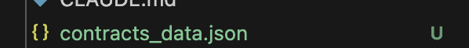
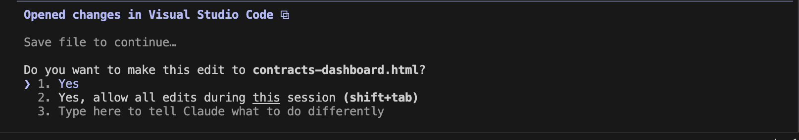
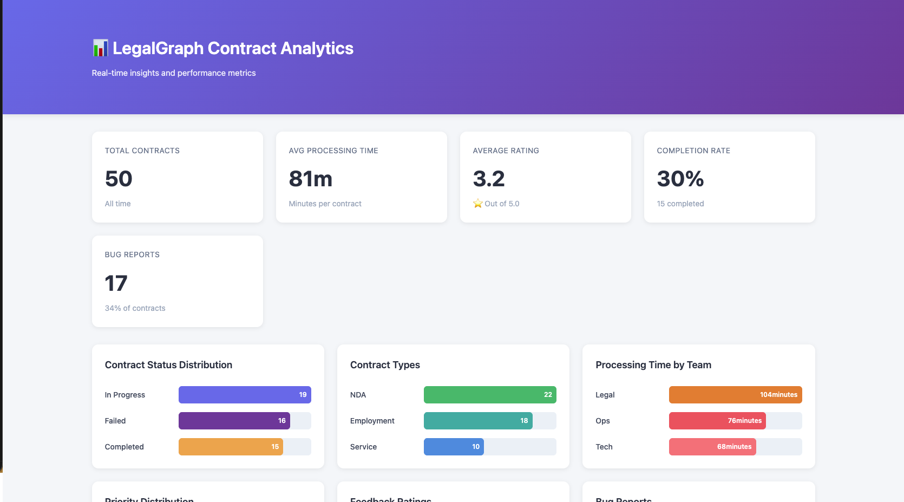
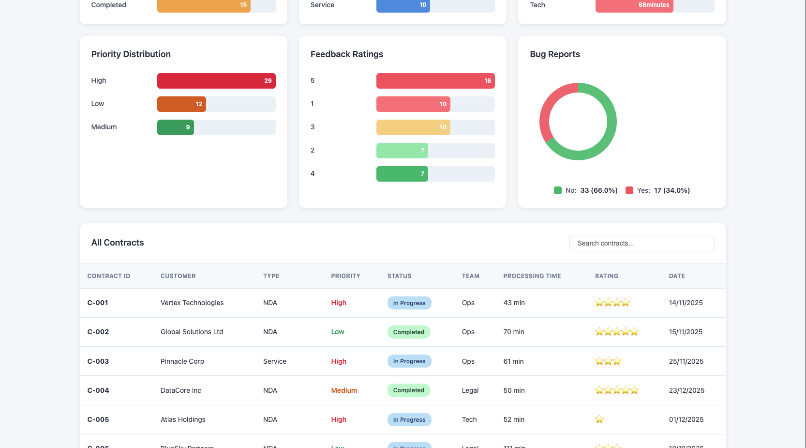

# Analyzing Data 

---

## Overview

In this lesson, we will be creating a **dashboard** that takes input from a JSON file which contains dummy data and automatically generates an interactive dashboard for you.

This hands-on exercise will teach you how to:

- Process and analyze data from JSON files
- Create interactive dashboards with visualizations
- Transform raw data into meaningful insights
- Build data visualization tools using AI assistance

This skill is essential for product managers who need to:
- Analyze customer data, sales metrics, or product performance
- Create executive dashboards for stakeholders
- Visualize data trends and patterns

---

## Important Note: Data Provided in JSON Format

**We have provided data in JSON format.**

- We have provided data in JSON format (`.json` file) that you will use for this lesson
- If you have your own data file, you can use that and iterate on it instead
- **We are NOT using any open API key or Claude API key** that automatically fetches data and creates a dashboard
- On top of this JSON data, we are going to create a dashboard
- The JSON data will be used as input for the dashboard creation

The data is already provided in JSON format, and this lesson will guide you through creating an interactive dashboard from it.

---

## Prerequisites

Before starting this lesson, make sure you have:

1. **Completed Module 1** - You should have successfully completed all lessons in Module 1
2. **Completed Module 2** - You should have successfully completed all lessons in Module 2
3. **Completed Previous Lessons in Module 3** - You should have successfully completed:
   - Lesson 3.0: How to Create an Agent
   - Lesson 3.1: How to Create Mocks and Visualizations

---

## Hands-On Steps

### Step 1: Open VS Code and Navigate to Your Project Folder

1. Open Visual Studio Code (VS Code) on your machine
2. Navigate to your project directory where you've been working on previous lessons


---

### Step 2: Open Terminal and Launch Claude

1. In VS Code, click on **Terminal** in the top menu
2. Select **New Terminal** (or use the shortcut `Ctrl+` ` on Windows/Linux or `Cmd+` ` on Mac)

3. In the terminal, type:
   ```
   claude
   ```
4. Press Enter to launch Claude


---

### Step 3: Data Provided in JSON Format

1. **Note**: We don't need to create dummy data - the data is already provided in JSON format
2. The contract data is available in JSON format in your project directory
3. This data represents contract processing information for LegalGraph, including details like contract IDs, customer names, contract types, priorities, status, processing times, team assignments, bug reports, and feedback
4. The JSON data file (`contracts_data.json`) is already in your project directory and ready to be used for the dashboard



---

### Step 4: Prompt Claude to Create Dashboard

1. Now prompt Claude to create a dashboard using the data from the `contracts_data.json` file
2. Paste the following prompt into Claude:

```
Analyze the uploaded `contracts_data.json` file and build a frontend-only analytics dashboard.

CONSTRAINTS:
- Use ONLY HTML, CSS, and Vanilla JavaScript
- Do NOT use any third-party libraries or frameworks
- Handle the CORS issue as well
```

3. Claude will analyze the JSON file and create an interactive dashboard with visualizations based on the contract data

---

### Step 5: Claude Writes Code and Creates HTML File

1. Claude will write the complete code for the dashboard (HTML, CSS, and JavaScript)
2. Claude will ask you to create a new HTML file to save the code
3. Create a file with `.html` extension, for example: `contracts-dashboard.html`
4. Confirm the file creation when prompted
5. Claude will save all the dashboard code to this HTML file



---

### Step 6: View the Dashboard

1. To see the dashboard, open a **new terminal** in VS Code
2. Navigate to the directory where your HTML file is saved (if not already there)
3. Use the following command based on your operating system:

   **For Mac:**
   ```
   open contracts-dashboard.html
   ```
   Or:
   ```
   open filename.html
   ```

   **For Windows:**
   ```
   start contracts-dashboard.html
   ```
   Or:
   ```
   start filename.html
   ```

4. This will open the HTML file in your default web browser, and you can see your interactive dashboard

---

### Step 7: View Your Dashboard

1. You can now see the dashboard that Claude created for you
2. The dashboard is based on the JSON data we provided (`contracts_data.json`)
3. The dashboard will display various visualizations and analytics based on the contract data, including:
   - Charts and graphs showing contract statistics
   - Data tables with contract information
   - Interactive filters and sorting options
   - Summary metrics and KPIs
4. Explore the dashboard to see how the data has been visualized and analyzed





---

## Optional Homework: Advanced Workflow with API Integration

**Note**: If you have an OpenAI API key (or similar API key), you can create an advanced workflow as a homework exercise:

Instead of using the provided dummy/hardcoded JSON data, you can build a more dynamic system:

1. **User Uploads Contract**: Create a frontend where users can upload a contract file
2. **API Integration**: Use your OpenAI API key to fetch and analyze data from the contract that the user has uploaded
3. **Dynamic Dashboard Creation**: Automatically create a dashboard based on the analyzed contract data
4. **Real-time Processing**: The workflow would process the uploaded contract, extract relevant information using the API, and generate a dashboard on the fly

This homework exercise will help you:
- Learn API integration
- Build more dynamic and interactive applications
- Create real-world workflows that process user-uploaded documents
- Understand how to connect frontend interfaces with AI-powered backend processing

**This is an optional advanced exercise you can try if you want to extend your learning beyond the basic lesson.**

---

## Conclusion

Congratulations! You have successfully created an interactive dashboard from JSON data using Claude. This hands-on experience demonstrates how AI can help you:

- Transform raw data into visual insights
- Create professional dashboards without extensive coding knowledge
- Analyze contract data and present it in an interactive format
- Build data visualization tools that help make data-driven decisions

This skill is invaluable for product managers who need to:
- Present data insights to stakeholders
- Create executive dashboards quickly
- Visualize metrics and KPIs
- Make informed decisions based on data analysis

You now have the foundation to create dashboards from various data sources and customize them according to your needs.

---

