# Lesson 3.3: How to Clone Mocks from Source

---

## Overview

In Lesson 3.1, we learned how to create mocks and visualizations from scratch using Claude Code. Now, suppose you know a website and you want to clone that particular mock or design for your product. How can you achieve this through Claude Code? We will explore that in this lesson.

This hands-on exercise will teach you how to:

- Clone existing website designs and adapt them to your product
- Extract design elements from reference websites
- Recreate professional mockups based on existing designs
- Customize cloned designs to match your product requirements

This skill is essential for product managers who need to:
- Quickly prototype based on proven design patterns
- Adapt successful designs to their own products
- Create mockups inspired by existing websites
- Save time by building on established design foundations

---

## Prerequisites

Before starting this lesson, make sure you have:

1. **Completed Module 1** - You should have successfully completed all lessons in Module 1
2. **Completed Module 2** - You should have successfully completed all lessons in Module 2
3. **Completed Lesson 3.1** - You should have successfully completed Lesson 3.1: How to Create Mocks and Visualizations

---

## Hands-On Steps

### Step 1: Open VS Code and Navigate to Your Project Folder

1. Open Visual Studio Code (VS Code) on your machine
2. Navigate to your project directory where you've been working from the start of Module 3


---

### Step 2: Identify the Website You Want to Clone

Let's suppose you have a website - **legalgraph.ai** - and you like their:
- **Home section**
- **Sign-in page**
- **Dashboard**

You want to build something similar for your website. How can you achieve this?

1. First, you need to have screenshots of how the website looks like
2. We have pasted screenshots showing:
   - **Home Screen** - The landing/home page design
   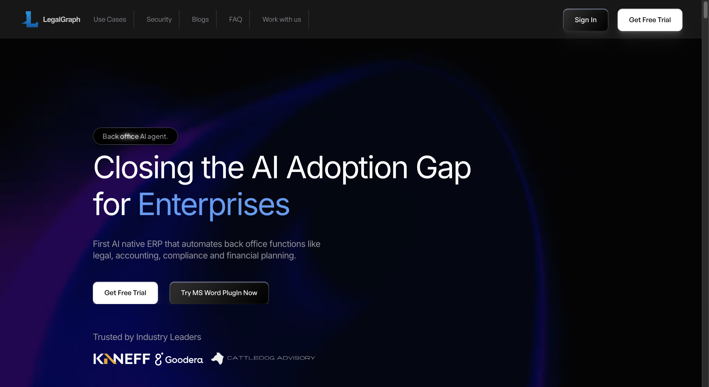
   - **Sign-in Screen** - The sign-in/login page design
   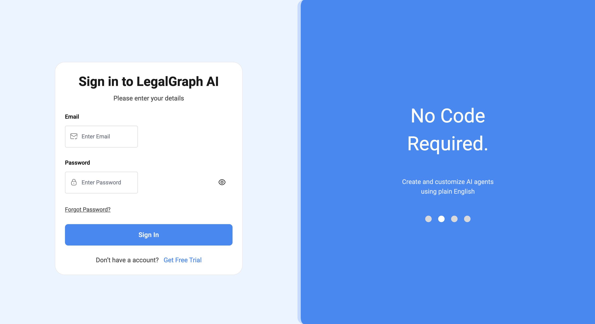
   - **Dashboard** - The dashboard interface design
   

These screenshots will serve as your reference for cloning the design.

---

### Step 3: Launch Claude Code and Start Building Mocks

1. In VS Code, click on the **Claude Code icon**
2. Claude Code will launch and you can now start building these mocks step by step using the screenshots as reference

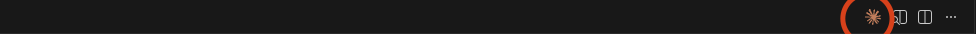

---

### Step 4: Create the Home Page

Let's start by creating the home page first.

1. In Claude Code, type `/` in the input field
2. Select **"attach file"** from the menu options
3. Select and attach the screenshot of the website home page
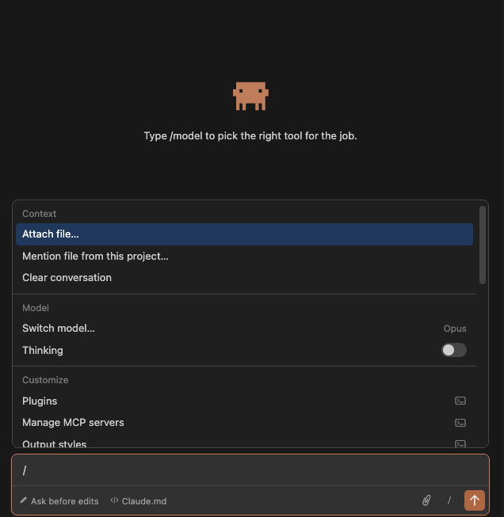
4. After attaching the screenshot, write the following prompt:

**Reference Prompt:**

```
Create a modern landing page based on the reference screenshot with these key features:

Design Requirements:
- Dark gradient background (deep purple to black with subtle glow effects)
- Hero section with large, bold headline split across two lines
- Small pill-shaped tag above headline ("Back office AI agent")
- Subtitle describing the product
- Two prominent CTA buttons (primary white, secondary dark with border)
- Logo section at bottom showing trusted company logos
- Clean, modern typography with good contrast

Technical Stack:
- Pure HTML, CSS, and vanilla JavaScript
- Responsive design (mobile-friendly)
- Smooth animations on scroll/hover
- Modern CSS (flexbox/grid for layout)

Key Elements:
- Navigation bar with logo and menu items
- Hero section with headline, description, and CTAs
- Background gradient with radial glow effects
- Company logo strip at bottom
- Hover effects on buttons and interactive elements

Style Notes:
- Use large font sizes for impact (60px+ for main headline)
- Blue accent color for highlighted text
- Subtle shadows and blur effects for depth
- Ample white space for clean look

Keep the code clean, well-commented, and easy to customize.
```

5. Claude will analyze the screenshot and create three files:
   - **index.html** - Contains the HTML structure and content of the landing page
   - **styles.css** - Contains all the styling (CSS) for the landing page
   - **script.js** - Contains JavaScript code for adding interactivity and actions to the landing page

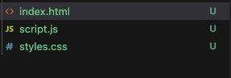

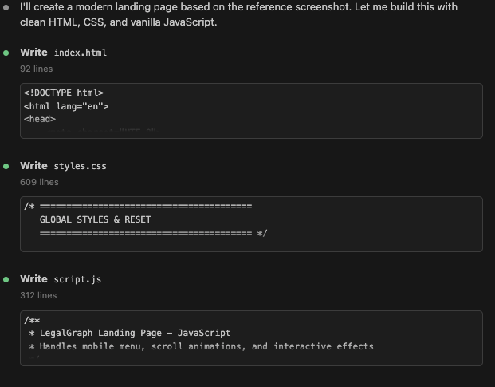

---

### Step 5: Preview the Landing Page

1. Open a **new terminal** in VS Code (Terminal → New Terminal, or use `Ctrl+` ` / `Cmd+` `)
2. Navigate to the directory where your HTML file is saved (if not already there)
3. Use the following command based on your operating system:

   **For Mac:**
   ```
   open index.html
   ```

   **For Windows:**
   ```
   start index.html
   ```

4. This will open the HTML file in your default web browser, and you can see your cloned landing page

> **Note:** The landing page would not be exactly the same as a copy-paste, but similar to the reference screenshot. Claude builds a home page for you based on the design elements, layout, and styling from the reference image.

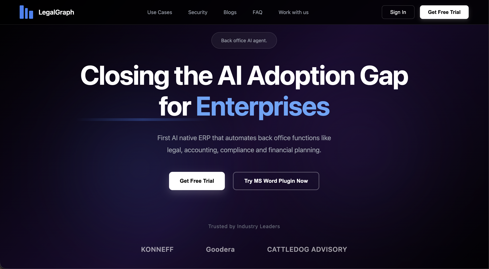

---

### Step 6: Build the Login/Signup Page

Now let's build the login and signup page. The goal is to create a page where when a user clicks on the sign-in button on your home page, they should be redirected to the login and signup screen.

1. In Claude Code, type `/` in the input field
2. Select **"attach file"** from the menu options
3. Select and attach the screenshot of the **Sign-in Screen** that you want to clone

4. After attaching the screenshot, write the following prompt:

**Reference Prompt:**

```
Now create a sign-in page (opens when user clicks "Sign In" from landing page) matching the reference screenshot:

Layout:
- Split-screen: Left = white sign-in card, Right = blue feature panel
- Stack vertically on mobile

Left Side - Form Card:
- "Sign in to LegalGraph AI" title
- "Please enter your details" subtitle
- Email input with icon
- Password input with lock icon + eye toggle
- "Forgot Password?" link
- Blue "Sign In" button (full width)
- "Don't have an account? Get Free Trial" footer

Right Side - Blue Panel:
- Large white headline text
- Subtitle below
- Pagination dots at bottom

Functionality:
- Link landing page "Sign In" button → this page (signin.html)
- Password show/hide toggle
- Basic form validation
- Hover/focus states

Tech Stack: HTML, CSS, vanilla JS

Note: Follow exact styling, spacing, and colors from the reference screenshot provided.
```

5. Claude will first write the code and then create the **signin.html**, **signin.css**, and **signin.js** files

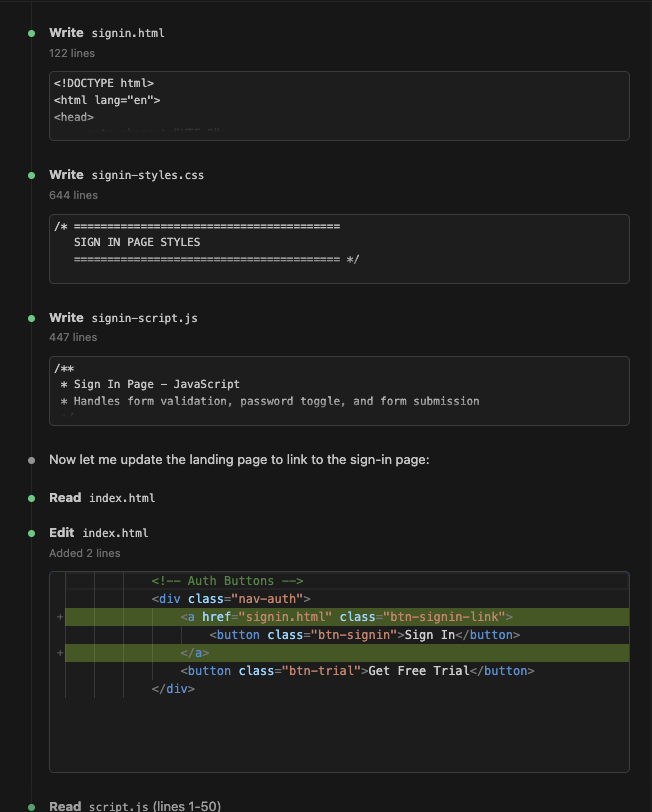

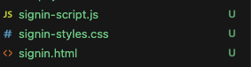

6. Claude will also update the **index.html** file to link the "Sign In" button to the signin.html page, so when users click the sign-in button on the landing page, they will be redirected to the sign-in page

---

### Step 7: Test the Functionality

Let's test the functionality we've built:

1. Open a **new terminal** in VS Code (Terminal → New Terminal, or use `Ctrl+` ` / `Cmd+` `)
2. Navigate to the directory where your HTML files are saved (if not already there)
3. Use the following command based on your operating system to open the landing page:

   **For Mac:**
   ```
   open index.html
   ```

   **For Windows:**
   ```
   start index.html
   ```

4. The landing page will open in your browser
5. Click on the **"Sign In"** button to test if it redirects to the sign-in page
6. You can also directly open the sign-in page using:

   **For Mac:**
   ```
   open signin.html
   ```

   **For Windows:**
   ```
   start signin.html
   ```

7. Verify that:
   - The landing page displays correctly
   - Clicking "Sign In" redirects to the sign-in page
   - The sign-in page displays correctly with the split-screen layout
   - All interactive elements (password toggle, form validation) work as expected

> **Note:** This time you will get a 90% same clone result as you can see in the image. The sign-in page will be very similar to the reference screenshot you provided. You can login with any name, email, and password for now.

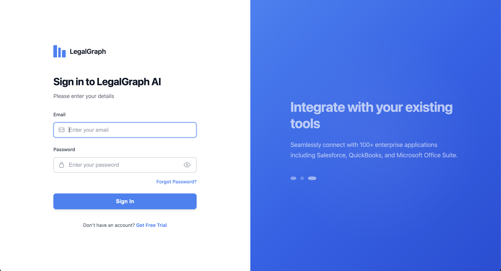

---

### Step 8: Build the Dashboard

Now let's build one more functionality. When a user logs in successfully, we need to create a dashboard similar to what the LegalGraph team is doing.

1. In Claude Code, type `/` in the input field
2. Select **"attach file"** from the menu options
3. Select and attach the screenshot of the **Dashboard** that you want to clone

4. After attaching the screenshot, write the following prompt:

**Reference Prompt:**

```
Create a COI Review Dashboard exactly like the reference screenshot with all functionalities:

Login Flow:
- After successful sign-in (from sign-in page), redirect user to this dashboard
- Can use JavaScript to handle redirect: window.location.href = 'dashboard.html'

Requirements: Build a fully functional dashboard matching the reference image with every small detail included.

Left Sidebar:
- LegalGraph AI logo at top with collapse/expand toggle
- Blue "Add Documents" button with plus icon (prominent)
- Navigation menu items:
  * Contract Vault (icon + text)
  * COI Dashboard (icon + text, highlighted/active state)
  * Analysis Results (icon + text)
  * Setting (icon + text)
- Hover effects on menu items

Top Header Bar:
- Page title: "COI Review Dashboard"
- Subtitle: "Overview of all Certificate of insurance"
- Right side: "Help" button with question mark icon
- User profile circle with name "Cerise Walters" and email "cwalters@kaneff.com"
- Profile dropdown functionality

Stats Cards Section (4 cards):
- Total COI Processed: 246 (light blue background, document icon)
- Accepted: 210 (light green background, checkmark icon)
- Rejected: 5 (light red background, cross icon)
- Expiring in 30 days: 15 (light orange background, clock icon)

Filter & Search Bar:
- Dropdown filter: "All Properties" (with down arrow)
- Dropdown filter: "Status" (with down arrow, options: Not Processed, Accepted, Rejected)
- Dropdown filter: "Filter by Expiry" (with down arrow)
- Search input: "Search by tenant, properties, or unit..." with search icon
- Blue "ADD COI" button with plus icon (right aligned)

Data Table:
- Columns: Checkbox | Property | Tenant Name | Unit | COI Name | Expiry Date | Status | Reminders | Action
- Features:
  * Sortable columns (up/down arrow indicators)
  * Checkbox for each row + select all checkbox in header
  * Edit pencil icon in Action column
  * Status badges with colors (Not Processed, Rejected, etc.)
  * Hover effect on table rows

Functionality:
- Clicking dropdowns shows options
- Search bar filters table data
- Column sorting (click headers)
- Checkbox selection
- Edit button opens edit modal/page
- Status dropdown with options: Not Processed, Accepted, Rejected
- Profile dropdown menu
- Sidebar navigation working
- "Add Documents" and "ADD COI" buttons functional

Styling:
- Clean, modern UI with proper spacing
- Color scheme: Blue primary, green/red/orange for status
- Rounded corners on cards and buttons
- Subtle shadows
- Responsive design

Tech Stack: HTML, CSS, vanilla JavaScript

Note: Match exact colors, spacing, fonts, and layout from the reference screenshot. Include all interactive states (hover, active, focus) and add some dummy data in the table like 8-9 entries.
```

5. Claude will create three new files for the dashboard:
   - **dashboard.html** - Contains the HTML structure and content of the dashboard
   - **dashboard.css** - Contains all the styling (CSS) for the dashboard
   - **dashboard.js** - Contains JavaScript code for dashboard functionality and interactivity

6. Claude will also update the **signin.html** file to connect with the login flow, so when a user successfully logs in, they will be redirected to the dashboard.html page

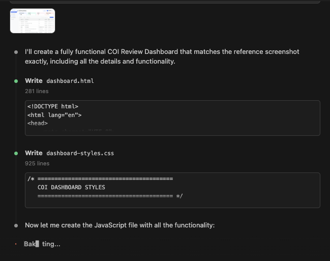

---

### Step 9: Preview the Dashboard

Follow the previous step to open the preview. Use the same commands:

**For Mac:**
```
open dashboard.html
```

**For Windows:**
```
start dashboard.html
```

You can also test the complete flow: Landing Page → Sign In → Dashboard

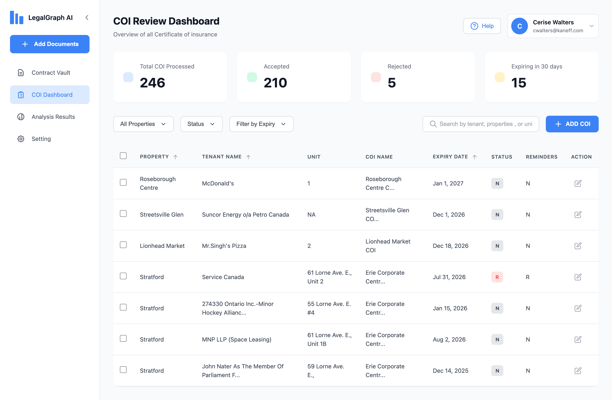

---

## Conclusion

Congratulations! You have successfully learned how to clone mocks from source websites using Claude Code. In this lesson, you have:

- ✅ Created a landing page by cloning a reference design
- ✅ Built a sign-in page with login functionality
- ✅ Developed a complete dashboard with interactive features
- ✅ Connected all pages together to create a seamless user flow
- ✅ Learned how to use screenshots as references for cloning designs

### Key Takeaways

1. **Screenshot-Based Cloning** - You can use screenshots of existing websites as references to quickly build similar designs for your product.

2. **Modular Development** - Claude Code creates separate HTML, CSS, and JavaScript files for each page, making your codebase organized and maintainable.

3. **Complete User Flow** - You've built a complete user journey: Landing Page → Sign In → Dashboard, demonstrating how to connect multiple pages together.

4. **Rapid Prototyping** - This approach allows you to quickly prototype and visualize product ideas without extensive coding knowledge.

### What You've Built

By the end of this lesson, you have created:
- A professional landing page (`index.html`, `styles.css`, `script.js`)
- A functional sign-in page (`signin.html`, `signin.css`, `signin.js`)
- A comprehensive dashboard (`dashboard.html`, `dashboard.css`, `dashboard.js`)
- A complete user flow connecting all three pages

This skill is invaluable for product managers who need to:
- Quickly prototype based on proven design patterns
- Communicate ideas visually to stakeholders
- Create mockups for development teams

