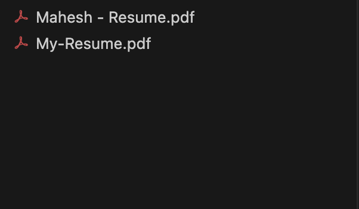
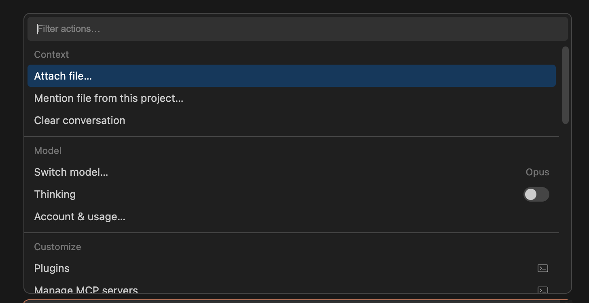
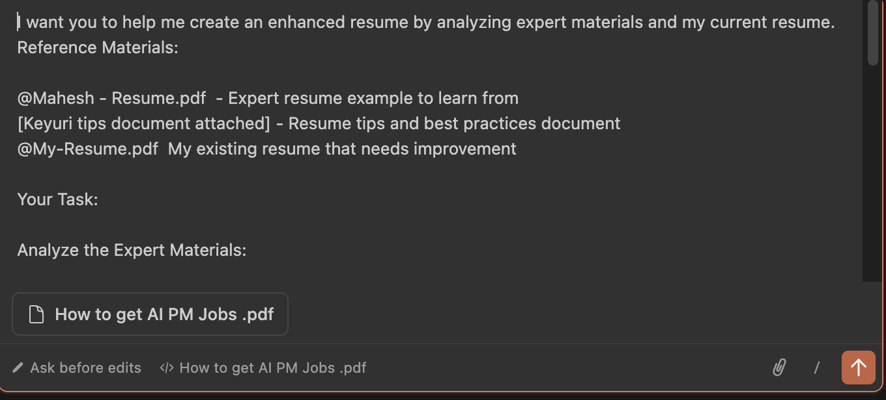
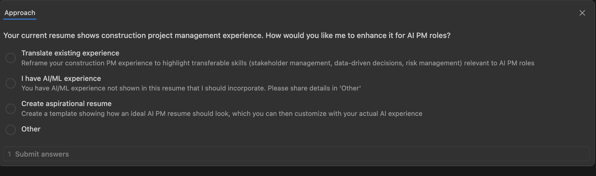
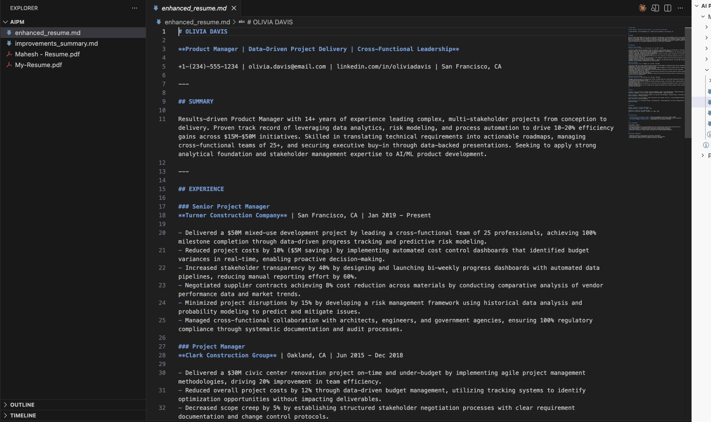
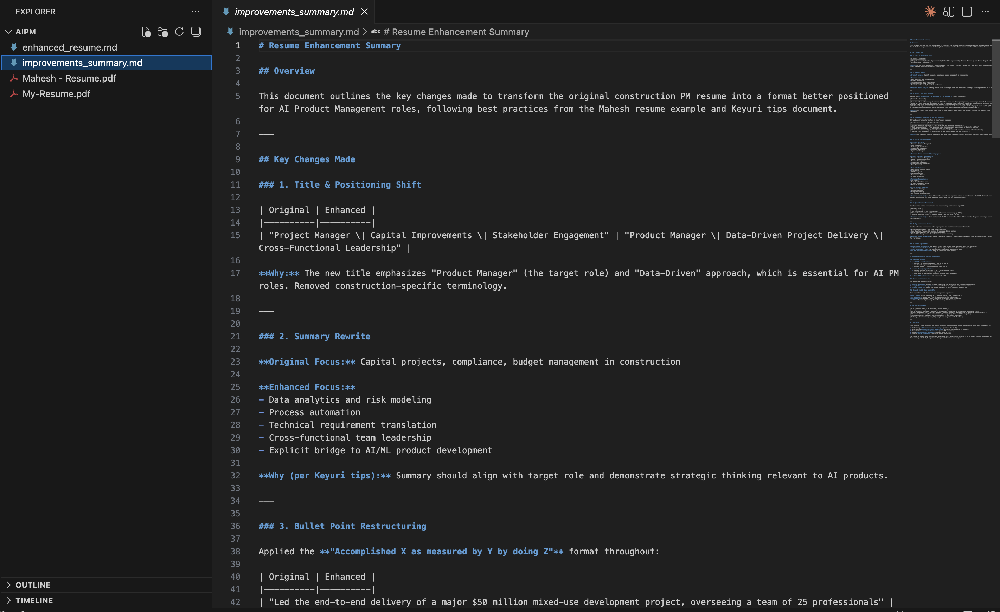

# Lesson 4.1: Building an Enhanced CV with Claude Code

---

## Overview

As a Product Manager preparing for job interviews, you've likely reviewed your resume countless times and wondered: "What am I missing? How can I make my experience stand out? What gaps exist between my current resume and what top companies are looking for?" You know your experience is valuable, but you struggle to identify what's missing or how to better articulate your achievements. You've seen examples of strong resumes from experienced PMs like Mahesh, but translating those best practices into your own resume feels overwhelming and time-consuming.

In this lesson, you will learn how to leverage Claude Code to analyze your resume against a benchmark resume (Mahesh's resume) and strategy document, identify gaps and areas for improvement, and generate an enhanced CV that fills those gaps. This lesson will guide you through the process of:

1. **Uploading Reference Materials** - Adding Mahesh's resume and strategy document as benchmarks for comparison
2. **Analyzing Your Current Resume** - Uploading your own resume for gap analysis
3. **Identifying Gaps and Missing Elements** - Using Claude Code to compare your resume against best practices and identify what's missing
4. **Generating Enhanced CV** - Creating a new, improved CV that incorporates best practices, fills identified gaps, and better showcases your experience
5. **Storing the Result** - Saving the enhanced CV in a markdown file for easy reference and further customization

By the end of this lesson, you'll have a comprehensive, gap-free CV that better aligns with industry best practices and effectively showcases your Product Manager experience, skills, and achievements.

---

## Prerequisites

Before starting this lesson, make sure you have:

1. **Completed All Modules** - All lessons in:
   - Module 1: Getting Started
   - Module 2: Understanding Claude Code Context System
   - Module 3: Building Agents & Visualizations
   - Module 4: AI Assistant for Product Manager Job Preparation (previous lessons)

2. **Downloaded Mahesh's CV** - Download Mahesh's resume in PDF format:
   - [Click here to download Mahesh's CV](https://pragyaallc-my.sharepoint.com/:w:/g/personal/mahesh_legalgraph_ai/EUCku2oDtehEgrMjeXWBcYUBNGta6LIspPDX7aN8i0vuCQ?e=HWs8as)
   - Make sure to download the file in **PDF format** (.pdf)
   - Save it with a clear name like `Mahesh-Resume.pdf` or `Mahesh-CV.pdf`
   - This will serve as a benchmark resume for comparison

3. **Downloaded Keyuri's Resume Tips Lesson** - Download Keyuri's resume tips and lessons document in PDF format:
   - [Click here to download Keyuri's Resume Tips Lesson](https://docs.google.com/document/d/1MimocqWMLruH13SpCqZHWe49GAJgopBzDDiC0Zf_EO8/edit?tab=t.xif9jgcze2ur#heading=h.7xydnnsogw2n)
   - Make sure to download the file in **PDF format** (.pdf) - In Google Docs, go to **File** → **Download** → **PDF Document (.pdf)**
   - Save it with a clear name like `Keyuri-Resume-Tips.pdf` or `Keyuri-CV-Lessons.pdf`
   - This document contains best practices and tips that will be used to enhance your CV

4. **Have Your Own Resume Ready** - Make sure you have your current resume saved as a PDF file that you can upload during the lesson

> **Note:** Having Mahesh's CV and Keyuri's Resume Tips Lesson downloaded will allow Claude Code to reference these best practices and benchmark materials when analyzing your resume and generating the enhanced CV. These reference materials will help identify gaps and ensure your enhanced CV follows industry best practices.

---

## Let's Start Hands On

Now let's start the hands-on work! In this section, we'll use Claude Code to analyze your resume against expert materials, identify gaps, and generate an enhanced CV that incorporates best practices and fills all missing elements.

---

### Step 1: Create a New Folder and Open in VS Code

1. **Create a new folder** on your computer with a memorable name. We suggest: **`cv-enhancement`** (or choose your own creative name like `resume-improvement` or `cv-builder`)

2. **Open Visual Studio Code (VS Code)** on your machine

3. Click on **File** → **Open Folder** (or use `Cmd+O` on Mac / `Ctrl+O` on Windows/Linux)

4. Navigate to and select the folder you just created

5. Your VS Code workspace is now ready for building your enhanced CV!

> **Note:** By now, you should be familiar with opening VS Code and creating folders from the previous modules. If you need a refresher, refer back to Module 1 lessons.

---

### Step 2: Add Reference Materials and Your Resume to the Folder

Now let's add all the necessary files to your project folder:

1. **Add Mahesh's Resume** - Copy or move the `Mahesh-Resume.pdf` (or `Mahesh-CV.pdf`) file you downloaded in the Prerequisites section into your project folder

2. **Add Your Current Resume** - Copy or move your own resume PDF file into the same project folder

3. **Keep Keyuri's Resume Tips Ready** - Make sure you have the `Keyuri-Resume-Tips.pdf` (or `Keyuri-CV-Lessons.pdf`) file ready - you need to attach this file directly in Claude Code instead of adding it to the folder due to some file format issue.

4. Make sure at least these two files are in the root of your project folder:
   - Mahesh's resume PDF
   - Your current resume PDF

> **Tip:** Having Mahesh's resume and your resume in the same folder makes it easier for Claude Code to reference them using `@` mentions. The Keyuri tips file will be attached directly in Claude Code.

---



---

### Step 3: Open Claude Code, Attach Keyuri Tips, and Paste the Enhancement Prompt

Now let's use Claude Code to analyze your resume and create an enhanced version:

1. **Click on the Claude icon** in the left sidebar of VS Code (or open the terminal and type `claude` to launch Claude Code)

2. **Attach the Keyuri Tips file** - In Claude Code, use the attachment feature to attach your `Keyuri-Resume-Tips.pdf` file. You can do this by:
   - Clicking the attachment/paperclip icon in Claude Code, or
   - Using `/attach` command and selecting the Keyuri tips PDF file
   - The attached file will be automatically included in the analysis

---



---

3. **Reference the other files using `@` mentions** - In the Claude Code input field, type `@` and select each file:
   - Type `@` and select your Mahesh resume file (e.g., `@Mahesh-Resume.pdf`)
   - Type `@` and select your current resume file (e.g., `@Your-Name-Resume.pdf`)

4. Now, paste the following prompt in the Claude Code input field:

---

```
I want you to help me create an enhanced resume by analyzing expert materials and my current resume.
Reference Materials:

@mahesh_resume - Expert resume example to learn from
[Keyuri tips document attached] - Resume tips and best practices document
@my_current_resume - My existing resume that needs improvement

Your Task:

Analyze the Expert Materials:

Study @mahesh_resume to understand effective resume structure, formatting, and content presentation
Extract all actionable tips and principles from the attached Keyuri tips document
Identify what makes @mahesh_resume effective (strong action verbs, quantifiable achievements, clear formatting, etc.)


Evaluate My Current Resume:

Review @my_current_resume thoroughly
Identify gaps: missing skills, weak descriptions, lack of metrics, poor formatting, unclear achievements
Note areas that need strengthening based on the expert materials


Create Enhanced Resume:

Apply best practices from @mahesh_resume structure and approach
Implement all relevant tips from the attached Keyuri tips document
Fill identified gaps with stronger content
Improve action verbs, add quantifiable results where possible
Enhance clarity, impact, and professional presentation
Maintain consistent formatting throughout


Deliverable:

Create enhanced_resume.md in Markdown format
Add a separate improvements_summary.md file documenting the key changes made and why


Please begin by reading all documents (including the attached Keyuri tips), then proceed with the analysis and enhancement.
```

---

5. **Important:** Make sure to replace the `@` mentions in the prompt with the actual file names you added to your folder. For example:
   - Replace `@mahesh_resume` with `@Mahesh-Resume.pdf` (or whatever you named the file)
   - Replace `@my_current_resume` with `@Your-Actual-Resume-Filename.pdf`

6. **Press Enter** to submit the prompt

> **Tip:** The `@` mentions allow Claude Code to access and analyze the content of files in your folder, while the attached Keyuri tips file will be automatically included in the analysis. Make sure the file names match exactly what's in your folder.

---



---

### Step 4: Wait for Claude Code to Process and Answer Counter Questions

1. Claude Code will now:
   - Read and analyze Mahesh's resume to understand effective structure and formatting
   - Extract all actionable tips and best practices from Keyuri's resume tips document
   - Thoroughly review your current resume
   - Identify gaps, missing elements, and areas for improvement
   - Compare your resume against the expert materials

2. **Claude Code may ask counter questions** - During the analysis, Claude Code might ask you some clarifying questions to better understand:
   - Specific details about your experience that aren't clear in your resume
   - Missing information that would strengthen your CV
   - Your preferences for how certain sections should be structured
   - Any specific achievements or metrics you'd like to highlight

---



---

3. **Answer based on your requirements** - When Claude Code asks questions:
   - Review the questions carefully
   - Select and answer the questions that are most relevant to your needs
   - Provide additional context or details that will help create a better enhanced resume
   - You can choose to answer all questions or just the ones that matter most to you

4. This process may take a few moments as Claude Code analyzes all documents, asks clarifying questions, and performs the gap analysis

5. You'll see Claude Code working through the analysis - be patient and let it complete the full process

> **Note:** The analysis process involves reading multiple documents, comparing structures, identifying gaps, and generating improvements. Claude Code's counter questions help ensure your enhanced CV is personalized to your specific experience and requirements. Answer the questions that are most relevant to create the best possible enhanced resume.

---

### Step 5: Review Your Enhanced Resume and Improvements Summary

Once Claude Code completes the analysis and enhancement, you'll receive two files:

1. **`enhanced_resume.md`** - This is your new, improved CV that:
   - Incorporates best practices from Mahesh's resume structure
   - Implements tips from Keyuri's resume lessons
   - Fills all identified gaps in your original resume
   - Uses stronger action verbs and quantifiable results
   - Has improved clarity, impact, and professional presentation
   - Maintains consistent formatting throughout

---



---

2. **`improvements_summary.md`** - This document explains:
   - Key changes made to your resume
   - Why each change was made
   - What gaps were identified and how they were filled
   - Specific improvements in structure, content, and formatting

---



---

3. **Review both files** to understand:
   - What was missing in your original resume
   - How the enhanced version addresses those gaps
   - Best practices that were applied
   - Areas where you can further customize the content

4. **Use the enhanced resume** as a foundation for:
   - Further customization for specific job applications
   - Understanding resume best practices
   - Identifying areas to strengthen in your actual work experience
   - Creating multiple versions tailored to different roles

> **Tip:** The enhanced resume is a starting point. Review it carefully, customize it with your specific details, and use the improvements summary to understand what makes a strong Product Manager resume. You can iterate on this enhanced version for different job applications.

---