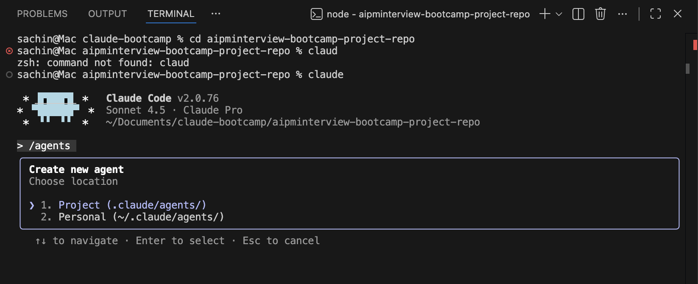
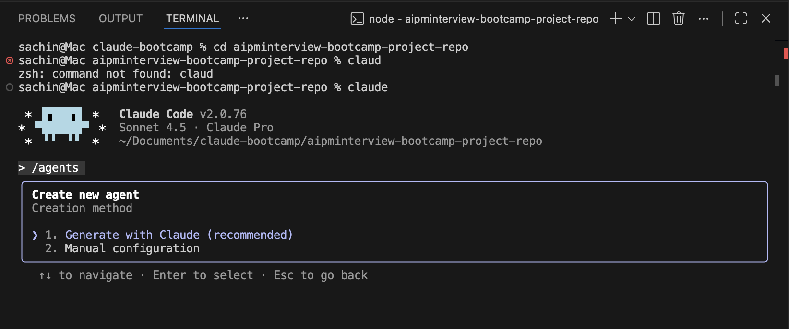
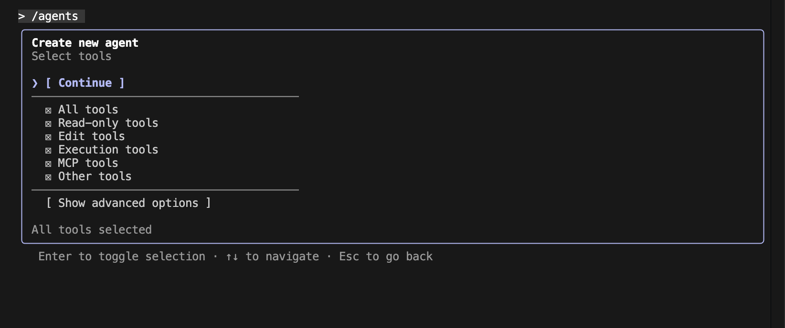
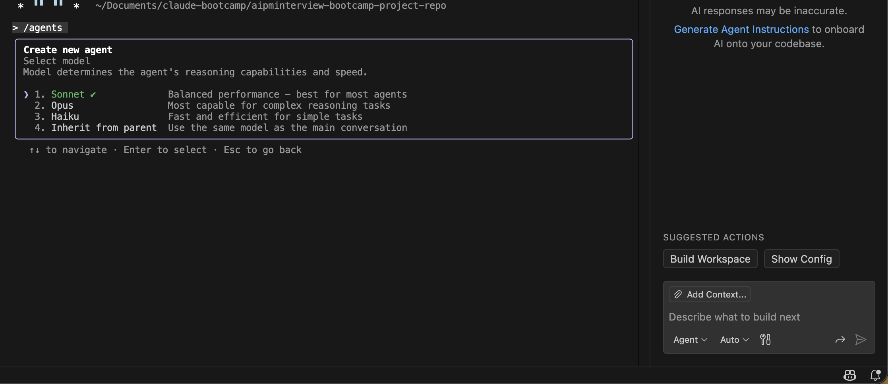

# Lesson 4.2: AI Job Hunting Agent

---

## Overview

In this lesson, we will build an AI agent that takes your resume and job strategies, and based on that information, provides you with job hunting assistance. This agent will help automate and streamline your job search process by analyzing your qualifications and matching them with relevant opportunities.

This hands-on exercise will teach you how to:

- Create an AI agent for automated job searching
- Configure the agent to analyze resumes and job strategies
- Set up the agent to provide personalized job hunting recommendations
- Automate the job search process using AI assistance

This skill is essential for product managers who need to:
- Streamline their job search process
- Get personalized job recommendations based on their profile
- Save time by automating job hunting tasks
- Leverage AI to find relevant opportunities

---

## Prerequisites

Before starting this lesson, make sure you have:

1. **Completed Module 1** - You should have successfully completed all lessons in Module 1
2. **Completed Module 2** - You should have successfully completed all lessons in Module 2
3. **Completed Lesson 3.0** - You should have successfully completed Lesson 3.0: How to Create an Agent
4. **Completed Lesson 4.1** - You should have successfully completed Lesson 4.1: AI Assistant for Job Preparation

---

## Hands-On Steps

### Step 1: Open VS Code and Launch Claude Code

1. Open Visual Studio Code (VS Code) on your machine
2. Navigate to your project directory where you've been working
3. In VS Code, click on **Terminal** → **New Terminal** (or use the shortcut `Ctrl+` ` / `Cmd+` `)
4. In the terminal, type:
   ```
   claude
   ```
5. Press Enter to launch Claude Code


---

### Step 2: Create the Job Search Agent

1. In Claude Code, type `/agent` in the input field


2. Press Enter - Claude will ask if you want to create a new agent
3. Click on **"Create New Agent"**


4. When asked for the agent location, select **"project"** (this ensures the agent is saved within your current project directory)



5. When asked for the creation method, select **"Generate with Claude"**



6. Now add the following task to your agent:

**Agent Task:**

```
# Resume Tailoring & Job Matching Agent

## Primary Objective
Analyze the user's CV/resume, understand their job search strategy, create tailored versions of their resume for specific opportunities, and identify the most relevant job postings listed within the last 48 hours.

## Core Workflow

### Step 1: Input Analysis
- Read and parse the user's CV/resume file
- Extract key information:
  - Skills (technical and soft skills)
  - Work experience and achievements
  - Education and certifications
  - Industry and job titles
  - Years of experience
  - Preferred locations (if mentioned)
- Ask the user about their job search strategy:
  - Target roles/job titles
  - Preferred industries
  - Location preferences (remote/hybrid/on-site)
  - Salary expectations (optional)
  - Any specific companies or job types to focus on/avoid

### Step 2: Job Search & Filtering
- Search for jobs across major platforms (LinkedIn, Indeed, Glassdoor, etc.)
- Apply strict filters:
  - Posted within last 48 hours ONLY
  - Match user's skills and experience level
  - Align with stated job strategy
- For each job found, extract:
  - Job title
  - Company name
  - Location
  - Key requirements
  - Direct application link
  - Source platform
  - Posting date/time

### Step 3: Job Ranking & Selection
- Analyze job descriptions to calculate match scores based on:
  - Skills overlap (40%)
  - Experience level fit (25%)
  - Industry alignment (20%)
  - Location preference (15%)
- Select the top 10 most suitable jobs
- Present in a structured format with:
  - Match score (%)
  - Job title and company
  - Key reasons for match
  - Application link
  - Source platform
  - Hours since posted
- Present this list to the user and ask which company they want a tailored resume for

### Step 4: Tailored Resume Creation
- Ask the user which company they want the tailored resume for
- Once the company is specified:
  - Take complete context from the user's original resume
  - Analyze the job description for that specific company and role
  - Create a tailored resume version that:
    * Mirrors key terminology from the job description
    * Reorders skills to highlight most relevant ones first
    * Adjusts experience descriptions to emphasize matching achievements
    * Includes keywords for ATS optimization
    * Maintains truthfulness (no fabrication)
    * Preserves all original resume content and structure
- Create a new file with the complete tailored resume
- Save the tailored resume as: `resume_tailored_[CompanyName]_[JobTitle].pdf` or `.docx`

### Step 5: Output Organization
- Create a job search report: `job_search_results.md` containing:
  - Summary of search criteria
  - All 10 jobs with details and links
  - Match scores and reasoning
  - Application strategy suggestions
- Organize tailored resumes in a folder: `tailored_resumes/`
- Create an application tracker: `application_tracker.csv` with columns:
  - Company, Job Title, Application Link, Match Score, Date Posted, Application Status, Notes

## Technical Requirements

### File Handling
- Accept CV/resume in formats: PDF, DOCX, TXT
- Use appropriate libraries for file parsing (PyPDF2, python-docx, etc.)
- Generate output files in user's preferred format

### Job Search Approach
- If direct API access isn't available, guide user to:
  - Use job board search with "past 24 hours" or "past 48 hours" filter
  - Provide search URLs for major platforms
  - Explain how to export/copy job listings
- Structure search queries using Boolean operators for precision

### Resume Tailoring Rules
- Maintain original resume structure and formatting
- Never fabricate experience or skills
- Keep each tailored version to same length as original (±10%)
- Ensure all contact information remains consistent
- Preserve professional tone and style

## Error Handling
- If CV parsing fails, request alternative format
- If job links are broken, note in report
- Validate all URLs before including in output

## Output Checklist
□ User asked which company they want tailored resume for
□ Tailored resume created with complete context from original resume
□ New file created with complete tailored resume
□ Job search results report generated
□ Application tracker CSV created
□ All files organized in logical folder structure
□ Match scores calculated and documented
□ All job links verified as posted within 48 hours
□ User notified of completion with next steps

## User Communication
- Provide progress updates at each major step
- Ask clarifying questions if job strategy is unclear
- Explain tailoring decisions for transparency
- Offer to refine results based on feedback
```

7. After pasting the task, Claude will generate the agent configuration based on your requirements

8. When asked which tools you want to use for your agent, select **all tools** to provide full tool access



9. This ensures the agent has maximum capability to:
   - Read and parse resume files
   - Search for jobs across platforms
   - Create and save tailored resume files
   - Generate reports and trackers
   - Access web search for job listings

10. When asked to select the model, choose the **default model** (typically Sonnet) which provides a good balance of performance and capabilities for this job search agent



11. When asked to select a background color for the agent, choose any color from the available options based on your preference


12. Review the agent configuration summary that Claude displays, which includes:
    - Agent name
    - Location (should be "project")
    - Tools (should show all tools selected)
    - Model (should show the model you selected)
    - Description (should show the task you provided)


13. Once you're satisfied with the configuration, press **Enter** to create the agent. This will create a new agent in the `.claude` file with the name `resume-job-matcher`


---

### Step 3: Create Your Job Search Strategy File

Now let's prepare to use the agent. First, create a markdown file with the name `strategy.md` in which you will define your strategy plan.

1. Create a new file in your project directory called `strategy.md`

2. In this file, define your job search strategy plan. I'm providing mine for reference, but you should create your own based on your preferences:

   [Click here to download my strategy.md file](https://drive.google.com/file/d/1gyCuiZKQpFKDMHu3rnAfKYRjHAlcg8na/view?usp=sharing)

3. Your `strategy.md` file should include:
   - Target roles/job titles you're interested in
   - Preferred industries
   - Location preferences (remote/hybrid/on-site)
   - Any specific companies or job types to focus on/avoid
   - Your career goals and objectives

---

### Step 4: Test the Agent

Now that you have created your strategy file, let's test the agent:

1. Click on the **Claude icon** from the left side of VS Code


2. In the Claude Code input field, type `/` and select **"attach file"**


3. Attach your resume file (PDF, DOCX, or TXT format)

4. After attaching your resume, mention the agent by typing `@` followed by your agent name (e.g., `@Resume Tailoring & Job Matching Agent`)

5. Add the following query:

**Query to send to the agent:**


6. The agent will:
   - Read and analyze your resume
   - Review your job search strategy from `strategy.md`
   - Search for relevant job postings from the last 48 hours
   - Present you with the top matching jobs and store it in a file


   - Ask which company you want a tailored resume for

---

#### Tailoring a Resume for a Specific Role

7. **To tailor a resume for a specific role:**
   - Provide context and instructions to the agent about the specific company and role you're applying for
   - You can say something like: "Create a tailored resume for [Company Name] - [Job Title] position"


   - Use the following format for your query:

   ```
   Context:
   - Use the resume optimization rules and instructions from:
     @aipminterview-bootcamp-project-repo/.claude/agents/resume-job-matcher.md
   - Use the first job posting listed in:
     @Top_20_AI_PM_Jobs_Jan_2026.md

   Task:
   - Analyze the selected job description in depth.
   - Tailor my resume specifically for this role.
   ```

   - The agent will:
     * Search for ATS-friendly keywords from the job description


     * Analyze the job requirements and match them with your resume
     * Identify relevant keywords and phrases to include
     * Create a new markdown file with your tailored resume details
     * The file will be saved as: `resume_tailored_[CompanyName]_[JobTitle].md`

   - The tailored resume will include:
     * All your original resume content
     * Optimized keywords for ATS systems
     * Reordered sections to highlight most relevant experience
     * Adjusted descriptions to match job requirements


     * Complete resume in markdown format ready for conversion to PDF/DOCX


---

## Conclusion

Congratulations! You have successfully created an AI Job Search Agent that can help automate your job hunting process.

### Key Takeaway

Now you can tell Claude to create a tailored resume for a specific company you're applying for, and it will create a tailored resume for you. Simply:

1. Mention your agent using `@agentname`
2. Tell Claude which company you want a tailored resume for
3. The agent will analyze the job description and create a complete tailored resume file based on your original resume

This agent will help you:
- Save time by automating job searches
- Get personalized job recommendations
- Create tailored resumes quickly for each application
- Track your job applications systematically

---