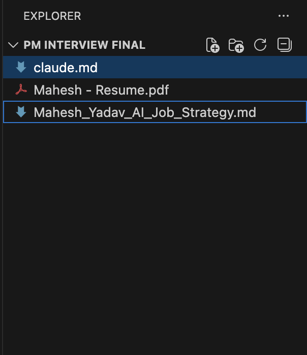
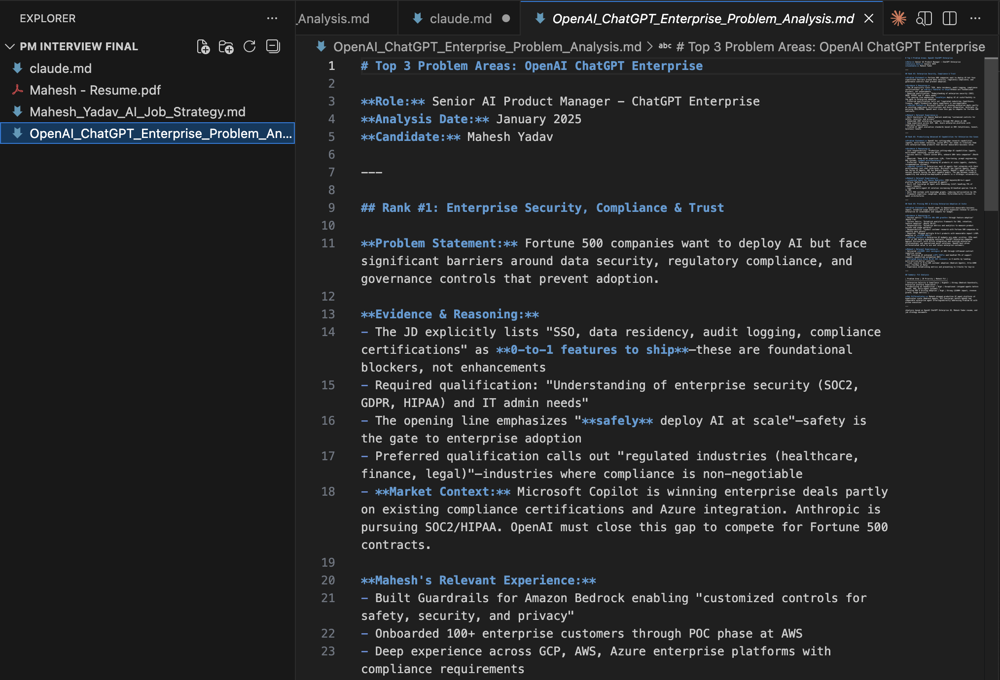
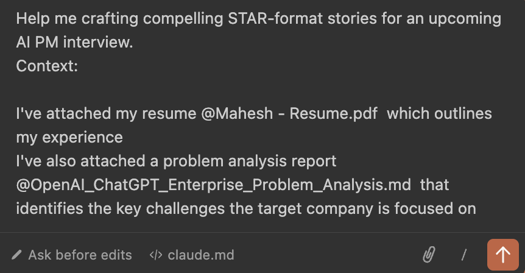
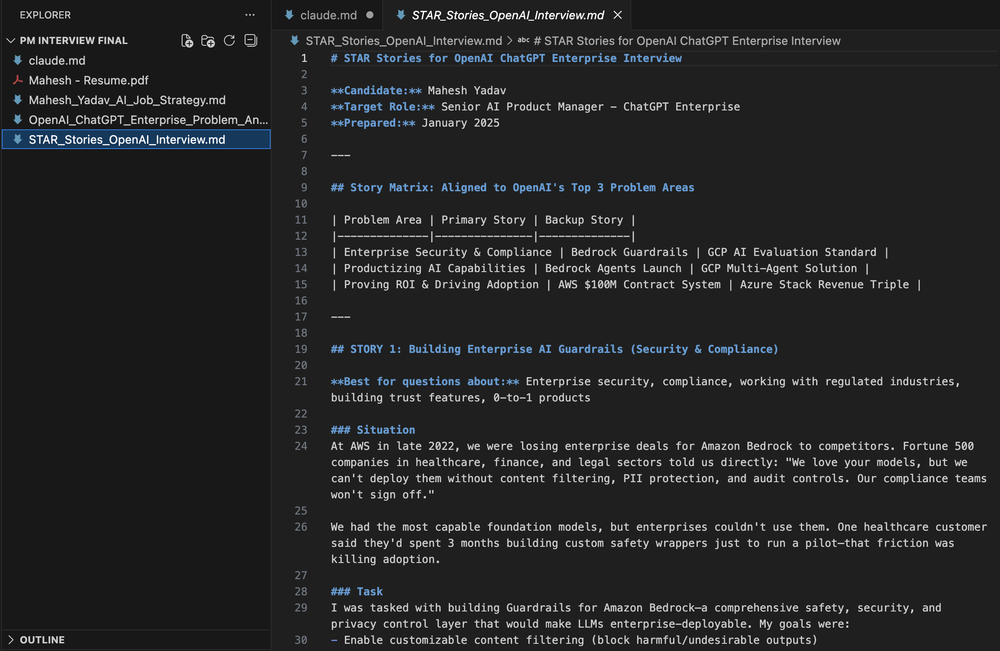
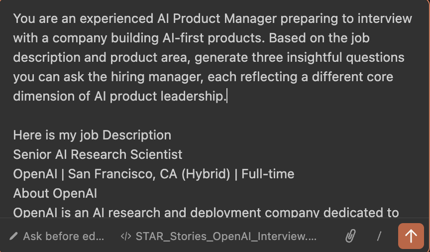
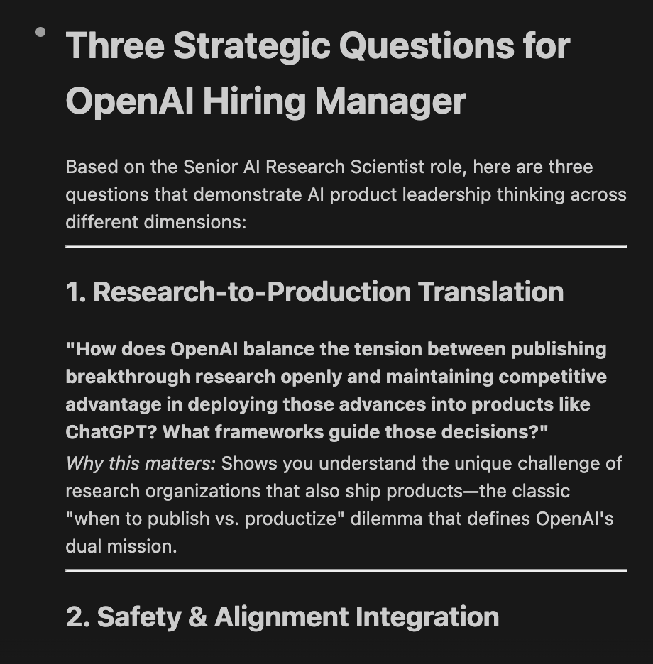

# Lesson 4.3: Get Ready for Your First Interview Call

---

## Overview

As a Product Manager preparing for interviews, you've likely found yourself reading through job descriptions and wondering: "What are they really looking for? What problems are they trying to solve? How can I position myself as the solution?" Job descriptions often contain hidden signals about the company's core challenges, strategic priorities, and the specific problems they need a PM to solve. But identifying these signals and understanding what they mean for your interview preparation can be overwhelming and time-consuming.

In this lesson, you will learn how to leverage Claude Code to systematically analyze job descriptions and market signals to identify the core problem areas that companies are trying to address. This foundational skill will help you:

1. **Decode Job Descriptions** - Extract hidden signals and priorities from job postings
2. **Identify Core Problems** - Understand the specific challenges and pain points the company is facing
3. **Analyze Market Signals** - Connect job requirements to broader market trends and industry needs
4. **Prepare Targeted Responses** - Align your experience and stories with the problems they're trying to solve
5. **Stand Out in Interviews** - Demonstrate that you understand their business challenges before they even ask

By the end of this lesson, you'll be able to quickly analyze any Product Manager job description and identify the core problem areas, enabling you to prepare more targeted and compelling interview responses that show you understand their needs.

---

## Prerequisites

Before starting this lesson, make sure you have:

1. **Completed Module 1** - All lessons in Module 1: Getting Started
2. **Completed Module 2** - All lessons in Module 2: Understanding Claude Code Context System
3. **Completed Module 3** - All lessons in Module 3: Building Agents & Visualizations

---

## Let's Start Hands On

Now let's start the hands-on work! In this section, we'll learn how to use Claude Code to analyze job descriptions and market signals to identify core problem areas that companies are trying to solve. This will help you prepare more targeted interview responses.

---

### Step 1: Open VS Code and Create a Folder

1. **Create a new folder** on your computer with a memorable name. We suggest: **`pm-interview`** (or choose your own creative name like `interview-prep` or `pm-job-analysis`)

2. **Open Visual Studio Code (VS Code)** on your machine

3. Click on **File** → **Open Folder** (or use `Cmd+O` on Mac / `Ctrl+O` on Windows/Linux)

4. Navigate to and select the folder you just created

5. **Make sure you have your strategy document, resume, and CLAUDE.md file in this folder**:
   - If you completed Lesson 4.1, you should already have your strategy plan, resume, and CLAUDE.md file in a folder. You can use that same folder, or copy those files to this new folder
   - If you haven't completed Lesson 4.1 yet, make sure to:
     - Add your **resume PDF file** to this folder
     - Add your **strategy document** (if you have one) to this folder
     - **Download and add the CLAUDE.md template file** - [Click here to download Mahesh's CLAUDE.md template](https://drive.google.com/file/d/1VuTIrMZk5QF4z_Rfb7eve312Td2SxPLi/view?usp=sharing) (this file contains the context and instructions that Claude Code will use for interview preparation)
       - Make sure to download the file in Markdown format (.md) or copy the content and save it as `CLAUDE.md` in your project folder
       - Place the `CLAUDE.md` file in the root of your project folder alongside your resume and strategy document
   - These files will be used by Claude Code to provide context when analyzing job descriptions and identifying problem areas

6. Your VS Code workspace is now ready for analyzing job descriptions and identifying core problem areas!

> **Note:** Having your resume, strategy, and CLAUDE.md file in the same folder allows Claude Code to reference your background and experience when analyzing job descriptions, making the analysis more personalized and relevant to your profile. The CLAUDE.md file contains Mahesh's template context that provides Claude Code with instructions on how to assist with interview preparation tasks.



---

### Step 2: Open Claude Code and Analyze Job Description

1. **Click on the Claude icon** in the left sidebar of VS Code (or open the terminal and type `claude` to launch Claude Code)


2. In the Claude Code input field, enter the following prompt (make sure to replace the file names with your actual strategy document and resume file names):

```
Based on the job description to identify the core challenges and problem areas the company is trying to solve.

Job Description:
[Paste the job description here]
```

3. **Press Enter** to submit the prompt

4. Claude Code will:
   - Analyze the job description using your strategy and resume as context
   - Identify the top 3 core problem areas the company is focused on
   - Rank them by relevance
   - Provide 1-2 sentence explanations for each problem
   - Include citations or reasoning from market context, competitive landscape, or language from the job description

5. Review the output - you should receive a ranked list of the top 3 problem areas with clear explanations and reasoning



> **Tip:** You can use this same approach for any job description! Simply replace the job description in the prompt with the one you want to analyze. Claude Code will use your strategy and resume to provide personalized insights about what problems that company is trying to solve.

---

### Step 3: Craft Case Stories from Your Resume Aligned to Company Challenges

Now that you've identified the core problem areas the company is focused on, it's time to craft compelling case stories from your resume that directly address these challenges. This will help you demonstrate that you understand their problems and have relevant experience solving similar issues.

1. In the Claude Code input field, enter the following prompt (make sure to replace the file names with your actual files):

```
Help me crafting compelling STAR-format stories for an upcoming AI PM interview.
Context:

I've attached my resume @Mahesh - Resume.pdf  which outlines my experience
I've also attached a problem analysis report @OpenAI_ChatGPT_Enterprise_Problem_Analysis.md  that identifies the key challenges the target company is focused on
```


2. **Press Enter** to submit the prompt

3. Claude Code will:
   - Analyze your resume and identify relevant experiences
   - Match your experiences to the top 3 problem areas identified in Step 2
   - Create structured case stories using the STAR format
   - Include quantifiable impact and metrics
   - Highlight relevant PM skills demonstrated
   - Provide interview talking points for each story
   - Rank stories by relevance to the job requirements

4. Review the output - you should receive 3-5 well-structured case stories that:
   - Directly address the company's core challenges
   - Follow the STAR method for clear storytelling
   - Include specific metrics and outcomes
   - Demonstrate relevant Product Manager competencies
   - Are ready to use in interviews

5. **Practice telling these stories** out loud to ensure they flow naturally and you can adapt them to different interview questions

> **Tip:** These case stories will be your go-to examples during interviews. Practice them so you can naturally weave them into conversations when interviewers ask about your experience, challenges you've faced, or how you've solved similar problems. The alignment with their specific challenges will make your responses more compelling and relevant.



---

### Step 4: Generate Strategic Questions for the Hiring Manager

Asking thoughtful, strategic questions during an interview demonstrates your understanding of the company's challenges and shows that you're thinking like a Product Manager. Based on the problem areas you've identified and your case stories, you can now generate targeted questions that show deep insight into their business.

1. In the Claude Code input field, enter the following prompt:

```
You are an experienced AI Product Manager preparing to interview with a company building AI-first products. Based on the job description and product area, generate three insightful questions you can ask the hiring manager, each reflecting a different core dimension of AI product leadership.

Input:
[Paste job description or company name + product]

[Optional: known challenges in the space or competitor insight]
```



2. **Replace the placeholders** in the prompt:
   - Paste the job description you're analyzing in the `[Paste job description or company name + product]` section
   - Optionally add any known challenges or competitor insights in the `[Optional: known challenges in the space or competitor insight]` section

3. **Press Enter** to submit the prompt

4. Claude Code will:
   - Analyze the job description and product area
   - Generate 3 insightful questions, each reflecting a different core dimension of AI product leadership
   - Consider optional challenges or competitor insights if provided
   - Create questions that demonstrate deep understanding of AI product management

5. Review the output - you should receive 3 well-crafted strategic questions that:
   - Cover different dimensions of AI product leadership (e.g., technical strategy, user experience, business impact, model performance, ethical considerations)
   - Show deep understanding of AI-first product challenges
   - Demonstrate strategic Product Manager thinking specific to AI/ML products
   - Are specific to the role and company context
   - Position you as a thoughtful, strategic AI Product Manager candidate


6. **Use all 3 questions** during the interview - they're designed to cover different dimensions and show comprehensive understanding of AI product leadership

> **Tip:** Strategic questions are one of the best ways to stand out in AI Product Manager interviews. These 3 questions, each covering a different dimension of AI product leadership, demonstrate that you understand the unique challenges of building AI-first products. They show that you've done your homework, understand their business challenges, and are already thinking about how you can contribute. Use these questions during the "Do you have any questions for us?" portion of the interview to demonstrate your strategic thinking and deep understanding of AI product management.



---
