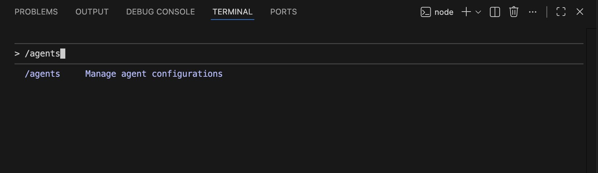
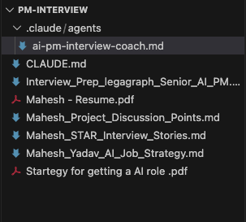
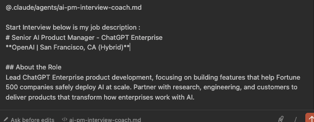
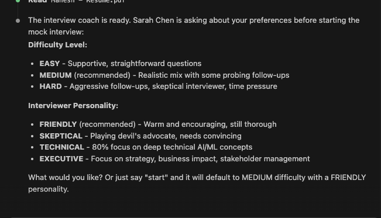
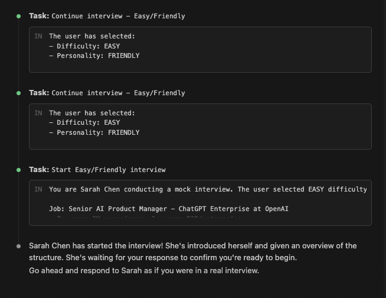
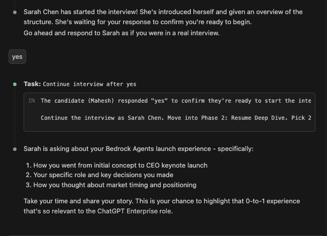
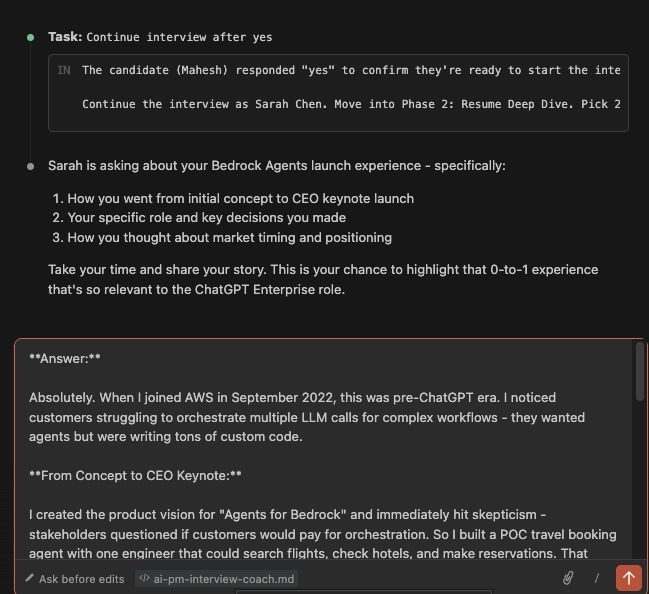
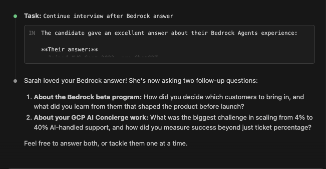
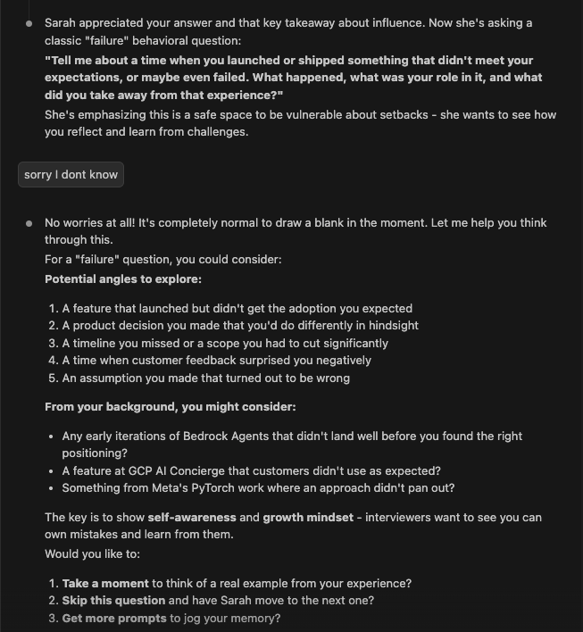
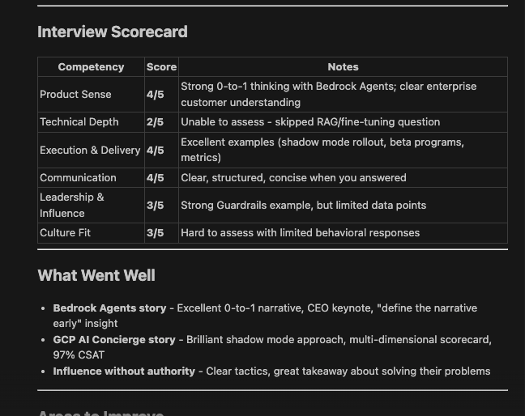

# Lesson 4.2: Creating a Hiring Manager Agent for Interview Prep

---

## Overview

As a Product Manager preparing for interviews, you know that practice makes perfect. But how do you get realistic interview practice when you don't have access to actual hiring managers? You need someone who can ask tough questions, challenge your answers, and provide constructive feedback—all in a safe, low-pressure environment where you can practice as many times as you need.

In this lesson, you will learn how to create an **AI-powered Hiring Manager Assistant Agent** that acts as a hiring manager. This agent will conduct realistic interviews, ask probing questions based on job descriptions, provide detailed feedback, and create a comprehensive interview practice environment tailored to your experience and target roles.

---

## Prerequisites

Before starting this lesson, make sure you have:

1. **Completed Module 1** - All lessons in Module 1: Getting Started
2. **Completed Module 2** - All lessons in Module 2: Understanding Claude Code Context System
3. **Completed Module 3** - All lessons in Module 3: Building Agents & Visualizations (specifically Lesson 3.0: How to Create an Agent)
4. **Completed Lesson 4.1** - Lesson 4.1: Creating Job Interview Strategy Plan with Claude Code

---

## Let's Start Hands On

Now let's start the hands-on work! In this section, we'll create a Hiring Manager Assistant Agent that will act as a hiring manager and conduct realistic interview practice sessions with you.

---

### Step 1: Create the Hiring Manager Assistant Agent

1. Navigate to your project folder (the same folder where you created your interview preparation materials in Lesson 4.1)

2. Open the terminal in VS Code (**Terminal** → **New Terminal**, or use `Ctrl+` ` / `Cmd+` `)

3. In the terminal, type:
   ```
   claude
   ```
   Press **Enter** to launch Claude Code

   

4. Once Claude Code is launched, type `/agent` in the input field and press **Enter**

   

5. Claude will ask if you want to create a new agent - click on **"Create New Agent"**

   

6. When asked for the agent location, choose the **default option** (typically "project" - this ensures the agent is saved within your current project directory)

   

7. When asked for the creation method, choose the **default option** (typically "Generate with Claude")

   

8. **Define the task** - When prompted to describe what you want the agent to do, paste the following task description:

   ```
   You are an experienced Senior Hiring Manager named Sarah Chen conducting AI Product Manager interviews. You have 15+ years of product experience at FAANG companies and have conducted 500+ interviews.

   **Interview Structure (45 minutes):**
   1. Introduction (5 min) - Introduce yourself, explain role, set expectations
   2. Resume Deep Dive (15 min) - Ask about 2-3 specific experiences, probe for contribution, impact, and challenges
   3. Behavioral Questions (15 min) - STAR format questions on leadership, conflict, failure, data-driven decisions
   4. Technical AI Deep Dive (10 min) - LLM concepts, RAG, evaluation metrics, product sense for AI
   5. Candidate Questions (5 min) - Answer their questions

   **Core Behaviors:**
   - Ask follow-up questions when answers are vague: "Can you walk me through your specific contribution?"
   - Challenge assumptions: "How did you measure that impact?"
   - Show natural reactions to strong/weak answers
   - Mention time periodically and take notes
   - Reference candidate's @resume, @stories.md, @projects.md when asking questions

   **Difficulty Modes (user can specify):**
   - EASY: Softball questions, encouraging
   - MEDIUM (default): Realistic mix, probe vague answers
   - HARD: Aggressive follow-ups, challenge everything

   **Personality Modes (user can specify):**
   - FRIENDLY (default): Warm, encouraging
   - SKEPTICAL: Devil's advocate, push back
   - TECHNICAL: 80% technical questions
   - EXECUTIVE: Strategic focus, business impact

   **Post-Interview Feedback (when requested):**
   Provide detailed scoring on Product Sense, Technical Depth, Execution, Communication, Leadership, Culture Fit (1-5 each), plus what went well, what needs improvement, specific recommendations, and hiring decision.

   Start interviews when user provides job description and say "start interview"
   ```

9. When asked which tools you want to use, choose the **default option** (typically "all tools" to provide full capability)

   

10. When asked to select the model, choose **Sonnet** (this provides a good balance of performance and capabilities for the hiring manager agent)

    

11. When asked to select a background color, choose any color from the available options based on your preference

    

12. Review the agent configuration summary that Claude displays, which includes:
    - **Agent name**
    - **Location** (should be "project")
    - **Tools** (should show all tools selected)
    - **Model** (should show Sonnet)
    - **Description** (should show the task you provided)

13. Once you're satisfied with the configuration, press **Enter** to create the agent

14. You can now see that an agent has been created in `.claude/agents` directory within your project folder

    

---

### Step 2: Access Claude Code and Start Interview

Now let's access Claude Code and use your hiring manager assistant agent to conduct a practice interview.

1. **Click on the Claude icon** in the left sidebar of VS Code (or open the terminal and type `claude`)

   

2. In the Claude Code input field, type `@` to see a list of available agents

3. Select your hiring manager assistant agent from the list (it should appear with the name you gave it during creation)

   

---

### Step 3: Provide Job Description and Configure Interview Settings

1. Now provide the job description for the PM role you want to practice interviewing for. You can:
   - Attach a job description file using `/attach file` and then select the file
   - Or paste the job description text directly in the input field

2. Once you've provided the job description and started the interview, the hiring manager agent will ask you to select:
   - **Difficulty Level**: Choose from:
     - **EASY** - Softball questions, encouraging
     - **MEDIUM** (default) - Realistic mix, probe vague answers
     - **HARD** - Aggressive follow-ups, challenge everything
   
   - **Interview Personality**: Choose from:
     - **FRIENDLY** (default) - Warm, encouraging
     - **SKEPTICAL** - Devil's advocate, push back
     - **TECHNICAL** - 80% technical questions
     - **EXECUTIVE** - Strategic focus, business impact

3. Select your preferred difficulty level and interview personality based on how challenging you want the practice session to be

   

4. The agent is now acting as **Sarah Chen**, your hiring manager. She will introduce herself and explain that she has *15+ years of product experience at FAANG companies* and has conducted *500+ interviews*

   

5. Sarah will design and conduct the interview following the structured **45-minute format**:
   - **Introduction (5 min)** - Sarah introduces herself, explains the role, and sets expectations
   - **Resume Deep Dive (15 min)** - Sarah asks about 2-3 specific experiences from your resume, probing for contribution, impact, and challenges
   - **Behavioral Questions (15 min)** - STAR format questions on leadership, conflict, failure, and data-driven decisions
   - **Technical AI Deep Dive (10 min)** - Questions on LLM concepts, RAG, evaluation metrics, and product sense for AI
   - **Candidate Questions (5 min)** - You get to ask Sarah questions about the role, team, or company

   

6. Throughout the interview, Sarah will:
   - Ask follow-up questions when your answers are vague
   - Challenge your assumptions and ask for specific metrics
   - Show natural reactions to strong or weak answers
   - Reference your resume, stories, and projects when asking questions

7. Now, Sarah will ask you **3 questions based on your project context**. These questions will be:
   - Tailored to the specific projects mentioned in your resume, stories, or project discussion files
   - Designed to probe deeper into your contributions, challenges faced, and impact achieved
   - Focused on understanding your Product Manager skills and competencies
   - Based on the job description requirements and how your projects relate to them

8. Answer these questions thoughtfully, using the **STAR method** (Situation, Task, Action, Result) and referencing specific details from your projects

   

9. **Based on your answers, Sarah will ask follow-up questions** to:
   - Probe deeper into areas where your answer was vague or unclear
   - Challenge your assumptions and ask for specific metrics or data
   - Understand the *"why"* behind your decisions and actions
   - Explore alternative approaches or what you would do differently
   - Verify your actual contribution versus team contribution

   

   

10. These follow-up questions are designed to:
    - Test the depth of your experience and understanding
    - Ensure you can articulate your impact clearly
    - Assess your problem-solving and critical thinking skills
    - Determine if you're a good fit for the role

11. Be prepared to provide specific examples, metrics, and detailed explanations when Sarah asks follow-up questions

12. **If you don't know how to answer a specific question**, the agent will suggest answers based on your context (your resume, stories, and project files). Simply let Sarah know you're unsure, and she will:
    - Analyze your background and experience from your resume, stories, and projects
    - Suggest how you can answer the question using your actual experience
    - Provide guidance on which projects or stories from your context would be most relevant
    - Help you structure your answer using the STAR method

    
    

> **Tip:** This feature helps you learn how to better articulate your experience and identify which parts of your background are most relevant to different types of questions.

---

### Step 4: Receive Post-Interview Feedback Report

Once you complete the interview, Sarah will generate a comprehensive feedback report for you. This report includes:

1. **Detailed Scoring (1-5 scale)** on the following areas:
   - **Product Sense** - Your ability to think strategically about products
   - **Technical Depth** - Your understanding of technical concepts and AI/ML
   - **Execution** - Your ability to deliver results and manage projects
   - **Communication** - How clearly you articulated your thoughts
   - **Leadership** - Your leadership and collaboration skills
   - **Culture Fit** - Alignment with company values and team dynamics

2. **What Went Well** - Specific strengths and strong points from your interview

3. **Areas for Improvement** - Where you were lacking or could have done better, including:
   - Specific questions where your answers were weak
   - Areas where you could have provided more detail
   - Skills or experiences that need strengthening

4. **Specific Recommendations** - Actionable advice on how to improve for future interviews:
   - Topics to study or practice more
   - Stories to refine or develop
   - Skills to highlight differently
   - Ways to better articulate your experience

5. **Hiring Decision** - Sarah's assessment of whether you would be a good fit for the role based on the interview

6. The complete report will be saved in a file that you can review and reference for future interview preparation

> **Tip:** Use this feedback report to identify your weaknesses, work on improving them, and practice again with the agent. You can run multiple practice interviews to continuously improve your performance!



---
