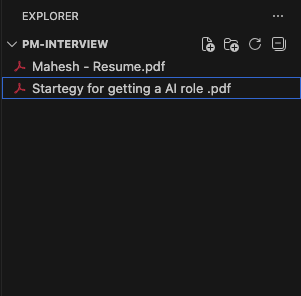
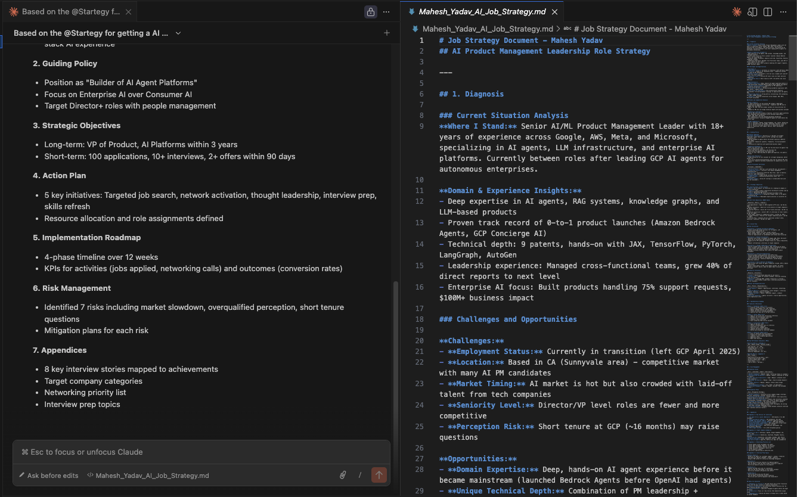
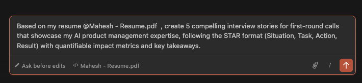
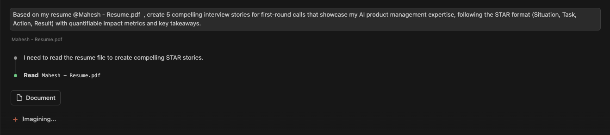
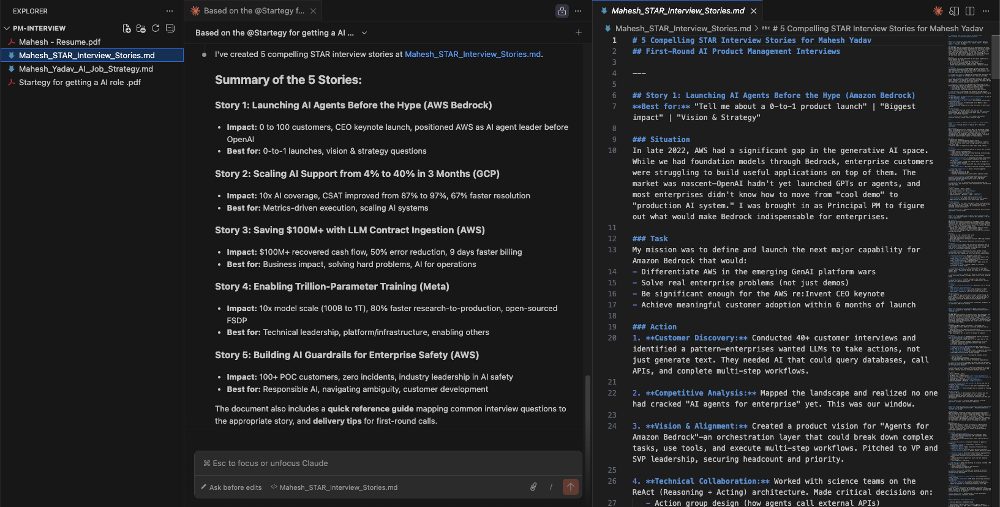
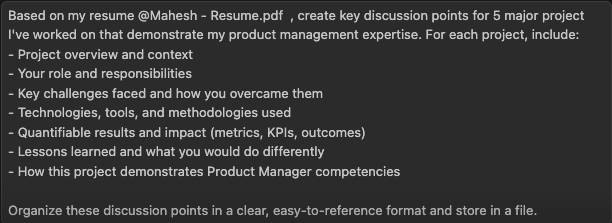
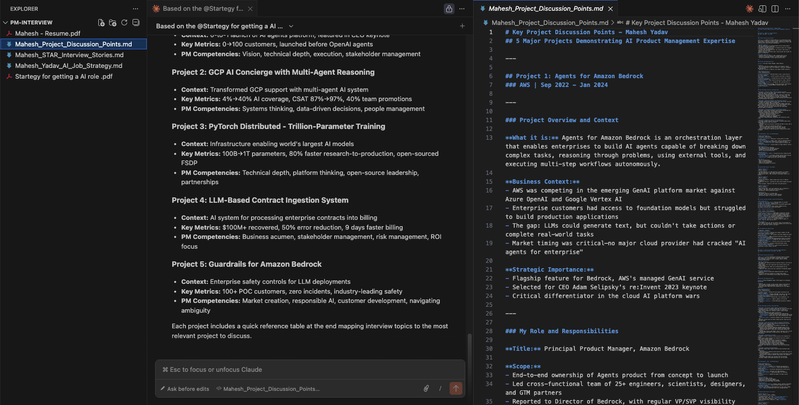
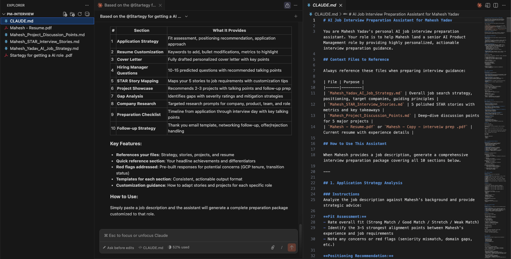
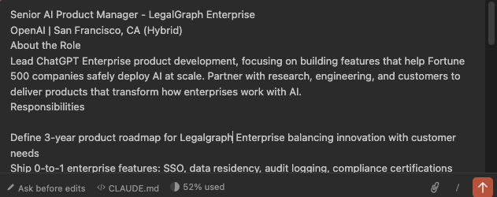
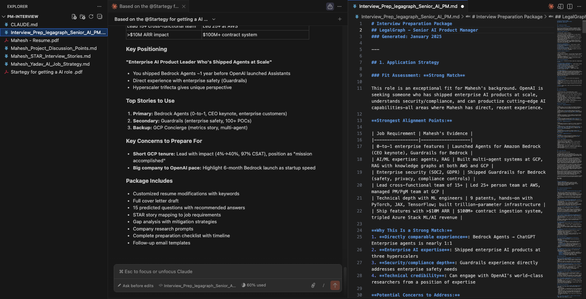

# Lesson 4.1: Creating Job Interview Strategy Plan with Claude Code

---

## Overview

As a Product Manager, you've spent years building products, managing cross-functional teams, and delivering value to users. But when it comes to job interviews, you find yourself struggling to articulate your experience effectively. You have great projects and achievements, but during that first screening call, you stumble when explaining your work. You know your projects are impressive, but you can't seem to structure your explanations in a way that resonates with interviewers. You need a systematic approach to prepare for interviews, but creating a personalized strategy plan feels overwhelming and time-consuming.

In this lesson, you will learn how to leverage Claude Code to create a comprehensive job interview strategy plan. This lesson will guide you through the process of uploading your resume to Claude Code, which will then analyze your background and generate a personalized interview preparation strategy. The strategy will include:

1. **Interview Strategy Plan** - A comprehensive plan tailored to your experience and the roles you're targeting
2. **First Call Stories** - Compelling stories and talking points for your initial screening calls
3. **Project Explanation Framework** - A structured approach to explaining your projects and achievements during interviews

---

## Prerequisites

Before starting this lesson, make sure you have:

1. **Completed Module 1** - All lessons in Module 1: Getting Started
2. **Completed Module 2** - All lessons in Module 2: Understanding Claude Code Context System
3. **Completed Module 3** - All lessons in Module 3: Building Agents & Visualizations

---

## Let's Start Hands On

Now let's start the hands-on work! In this section, we'll create a job interview strategy plan using Claude Code. You'll learn how to upload your resume, generate a personalized interview strategy, create compelling stories for first calls, and develop frameworks for explaining your projects effectively.

---

### Step 1: Create a New Folder and Open in VS Code

1. Create a new folder on your computer with a bold, memorable name. We suggest: **`pm-interview`** (or choose your own creative name like `interview-war`or `pm-interview-battle-station`)

2. Open Visual Studio Code (VS Code) on your machine

3. Click on **File** → **Open Folder** (or use `Cmd+O` on Mac / `Ctrl+O` on Windows/Linux)

4. Navigate to and select the folder you just created

5. Your VS Code workspace is now ready for building your interview strategy plan!


---

### Step 2: Download the Strategy Template

Mahesh has provided you with a strategy template that will help you create your interview strategy plan. We will be using this template to create one.

1. [Click here to download the strategy template](https://docs.google.com/document/d/17cwpnIcWGhaYpX2T9rsJEMrEeOjovghDvXLFER3RdSc/edit?tab=t.0) (or you can create your own based on the strategy you want to use)

2. **Make sure to download the file in PDF format** - When downloading, select "Download" → "PDF Document (.pdf)" from the Google Docs menu

3. Once you have downloaded the template in PDF format, add it to the folder you just created.

4. Place the template file in the root of your project folder

5. **Also add your resume PDF file to the same folder** - Make sure your resume is saved as a PDF file and placed in the same project folder alongside the strategy template

> **Note:** The strategy template contains the structure and framework that Claude Code will use to create your personalized interview strategy plan. You can customize this template to match your specific needs and preferences.



---

### Step 3: Open Claude Code 

1. Click on the **Claude icon** in the left sidebar of VS Code (or open the terminal and type `claude` to launch Claude Code)


2. Now , enter the following prompt:

```
Based on the @Startegy for getting a AI role .pdf  template file and my resume @ Mahesh-Resume.pdf , create a comprehensive job strategy plan following the exact template structure provided in the document and store in a file.
```

5. Claude Code will analyze your resume and the strategy template, then generate a personalized job interview strategy plan that follows the template structure



---

### Step 4: Creating 5 Stories for Your First Call Round Interview

Now let's create compelling stories based on your resume that you can use during your first call round interviews. These stories will help you articulate your experience effectively and make a strong impression.

1. In Claude Code, enter the following prompt:

```
Based on my resume @mahesh-resume.pdf, create 5 compelling stories that I can use during my first call round interviews. Each story should:
- Highlight a specific achievement or project from my experience
- Follow the STAR method (Situation, Task, Action, Result)
- Be concise and impactful (2-3 minutes when spoken)
- Demonstrate key Product Manager skills and competencies
- Be tailored to showcase my unique strengths

Store these stories in a file for easy reference during interviews.
```



2. Claude Code will analyze your resume and generate 5 personalized stories that:
   - Showcase your key achievements and projects
   - Follow a structured format for easy recall
   - Highlight your Product Manager skills
   - Are ready to use in your first screening calls

3. Review the generated stories and practice them out loud to ensure they flow naturally



> **Tip:** These stories will serve as your go-to talking points during first-round interviews. Practice them so you can adapt them to different questions while maintaining their core structure.



---

### Step 5: Creating Project Discussion Key Points for Interview Discussion

Now let's create a structured framework for discussing your projects during interviews. This will help you explain your projects clearly and confidently, highlighting the most important aspects that interviewers want to hear.

1. In Claude Code, enter the following prompt:

```
Based on my resume @mahesh-resume.pdf, create key discussion points for 5 major project I've worked on that demonstrate my product management expertise. For each project, include:
- Project overview and context
- Your role and responsibilities
- Key challenges faced and how you overcame them
- Technologies, tools, and methodologies used
- Quantifiable results and impact (metrics, KPIs, outcomes)
- Lessons learned and what you would do differently
- How this project demonstrates Product Manager competencies

Organize these discussion points in a clear, easy-to-reference format and store in a file.
```



2. Claude Code will analyze your resume and generate structured discussion points for each project that:
   - Provide a clear narrative for each project
   - Highlight your specific contributions and impact
   - Include quantifiable results and metrics
   - Demonstrate your Product Manager skills
   - Are organized for easy reference during interviews

3. Review the generated project discussion points and practice explaining each project using this framework

> **Tip:** Use these key points as a guide when discussing projects in interviews. They will help you stay focused, cover all important aspects, and demonstrate your value effectively. Practice transitioning between different points smoothly.



---

### Step 6: Create CLAUDE.md File to Set Context

Now let's create a `CLAUDE.md` file that acts as your AI job interview preparation assistant. This file will help Claude Code automatically reference all your interview preparation documents and provide personalized guidance whenever you need it.

1. In Claude Code, enter the following prompt in the input field:

```
Create a comprehensive claude.md instruction file that acts as my AI job interview preparation assistant. When I provide a job description, it should:

1. **Application Strategy** - Analyze the job description against my resume, strategy, stories, and projects to provide tailored application advice
2. **Resume Customization** - Suggest specific resume modifications to highlight relevant experience and keywords from the job posting
3. **Cover Letter Generation** - Draft a personalized cover letter emphasizing my most relevant stories and projects for this role
4. **Hiring Manager Questions** - Predict 10-15 likely questions the hiring manager will ask based on the job requirements and my background
5. **STAR Story Mapping** - Map my top stories to the job requirements, showing which stories best demonstrate each required competency
6. **Project Showcase Strategy** - Recommend which 2-3 projects to emphasize and how to present them for maximum impact
7. **Gap Analysis** - Identify any skill/experience gaps between my background and the job requirements, with suggestions on how to address them
8. **Company Research Prompts** - Generate targeted research questions about the company, team, and product based on the job description
9. **Interview Preparation Checklist** - Create a customized prep plan with timeline, key talking points, and practice questions
10. **Follow-up Strategy** - Suggest post-interview follow-up approach and questions to ask

The assistant should reference my strategy.md, stories.md, projects.md, and resume to provide highly personalized, actionable interview preparation guidance.
```

2. Claude Code will generate a comprehensive `CLAUDE.md` file that includes:
   - Instructions for analyzing job descriptions
   - Context references to your resume, strategy plan, stories, and project discussion points
   - A structured framework for providing interview preparation assistance
   - All 10 capabilities listed above

3. The generated `CLAUDE.md` file will be saved in your project folder and will automatically be used by Claude Code whenever you work on interview preparation

> **Note:** Once the `CLAUDE.md` file is created, you can simply provide a job description to Claude Code, and it will automatically reference all your interview preparation materials (resume, strategy, stories, projects) to provide personalized, actionable guidance for that specific role.



---

### Step 7: Test Your Interview Preparation Assistant

Now that you have your AI interview preparation assistant ready, let's test it with a real job description to see how it works!

1. Find a job description for a Product Manager role that you're interested in (you can copy it from a job board like LinkedIn, Indeed, or the company's website)

2. In Claude Code, attach the job description file or paste the job description text



4. Claude Code will now:
   - Automatically reference your `CLAUDE.md` file
   - Access your resume, strategy plan, stories, and project discussion points
   - Analyze the job description against your background
   - Generate comprehensive, personalized interview preparation guidance

5. Review the output - you should receive all 10 components of interview preparation tailored specifically to that job role

> **Tip:** You can now use this assistant for any PM job description! Simply attach or paste a new job description, and Claude Code will automatically provide personalized preparation guidance based on all your interview materials.



---
