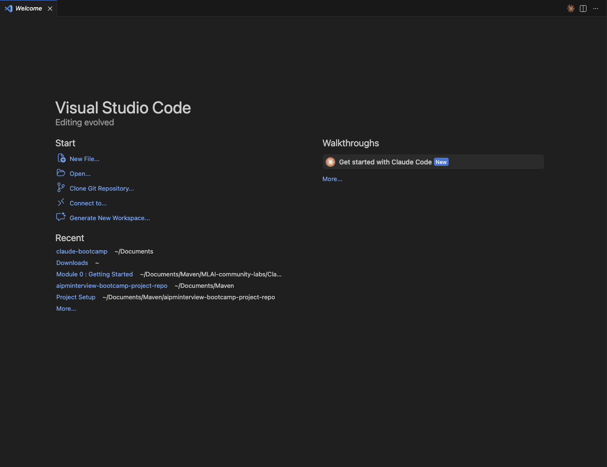
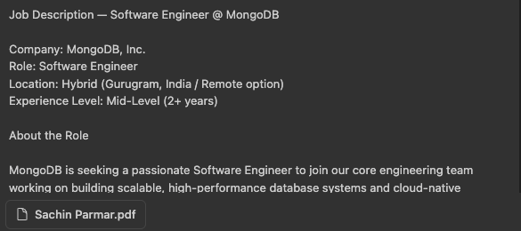

# Module 4: AI Assistant for Job Preparation

Welcome to Module 4! This module focuses on leveraging Claude Code as your personal AI assistant to help you prepare for Product Manager job interviews and excel in your career.

---

## Module Overview

In this module, you will learn how to build an AI assistant that takes your resume and job description as inputs and provides comprehensive job preparation support. The assistant will help you with:

1. **Role Understanding** - Deep analysis of the job role and requirements
2. **Resume Strengths** - Identification of your key strengths that align with the role
3. **Resume Gaps vs JD** - Analysis of gaps between your resume and job description
4. **Preparation Strategy** - Personalized strategy to bridge the gaps
5. **Topic-wise Study Plan** - Structured learning plan organized by topics
6. **Mock Interview Questions** - Practice questions tailored to the role
7. **Final Preparation Tips** - Last-minute tips and recommendations for interview success

---

## Prerequisites

Before starting this module, make sure you have:

1. **Completed Module 1** - All lessons in Module 1: Getting Started

---

## Let's Start Hands On

Follow these steps to set up your AI assistant for job preparation:

### Step 1: Create a New Folder and Open in VS Code

1. Create a new folder on your computer (e.g., `pm-job-prep-assistant`)
2. Open Visual Studio Code (VS Code)
3. Click on **File** → **Open Folder** (or use `Cmd+O` on Mac / `Ctrl+O` on Windows/Linux)
4. Navigate to and select the folder you just created

---

### Step 2: Download the CLAUDE.md File

1. Download the `CLAUDE.md` file and add it to the folder you created
2. [Click here to download CLAUDE.md](https://drive.google.com/file/d/1mT4gtlU6FWRlbi6__0Tbzi9198E75dfC/view?usp=sharing) (or you can create your own based on the job preparation strategy you want to use)
3. Place the `CLAUDE.md` file in the root of your project folder

> **Note:** The `CLAUDE.md` file contains the strategy and instructions that Claude Code will use to create your preparation plan. You can customize this file to match your specific needs and preferences.

---

### Step 3: Open Claude Code and Attach Your Documents

1. Open the terminal in VS Code (Terminal → New Terminal, or use `Ctrl+` ` / `Cmd+` `)
2. Click on the Claude icon in the terminal to launch Claude Code

3. Attach your resume file to Claude Code (you can drag and drop the file or use the `/` and then select attach file)
4. Attach the job description file for the position you're applying for.

---

### Step 4: Generate Your Preparation Plan

1. Once your resume and job description are attached, Claude Code will use the strategy defined in your `CLAUDE.md` file
2. Ask Claude Code to create your preparation plan (e.g., "Create a preparation plan based on my resume and the job description")

3. Claude Code will analyze and store the results in a table format:
   - Your resume strengths
   - Gaps between your resume and the job description
   - A personalized preparation strategy
   - A topic-wise study plan
   - Mock interview questions
   - Final preparation tips

> **Tip:** You can modify the `CLAUDE.md` file at any time to change the strategy or add custom instructions for how Claude Code should structure your preparation plan. The results will be organized in a table format for easy reference and review.

---

### Step 5: Review Your Preparation Plan

1. Your complete preparation plan will be stored in a file within your project folder
2. You can review the entire plan at any time by opening the file
3. The file contains all the analysis and recommendations:
   - Resume strengths and gaps
   - Personalized preparation strategy
   - Topic-wise study plan
   - Mock interview questions
   - Final preparation tips
4. Use this comprehensive plan to start preparing for your interview systematically

---

## Next Steps

Now that you have your personalized preparation plan:

- **Review Your Plan** - Go through the generated file and familiarize yourself with all the recommendations
- **Start Your Preparation** - Begin working through the topic-wise study plan systematically
- **Practice Mock Interviews** - Use the generated mock interview questions to practice your responses
- **Customize as Needed** - Modify the `CLAUDE.md` file if you want to adjust the strategy or add new requirements
- **Apply to Other Roles** - Use this same workflow for other job applications by simply updating the resume and job description files

Good luck with your interview preparation! 🚀

---
