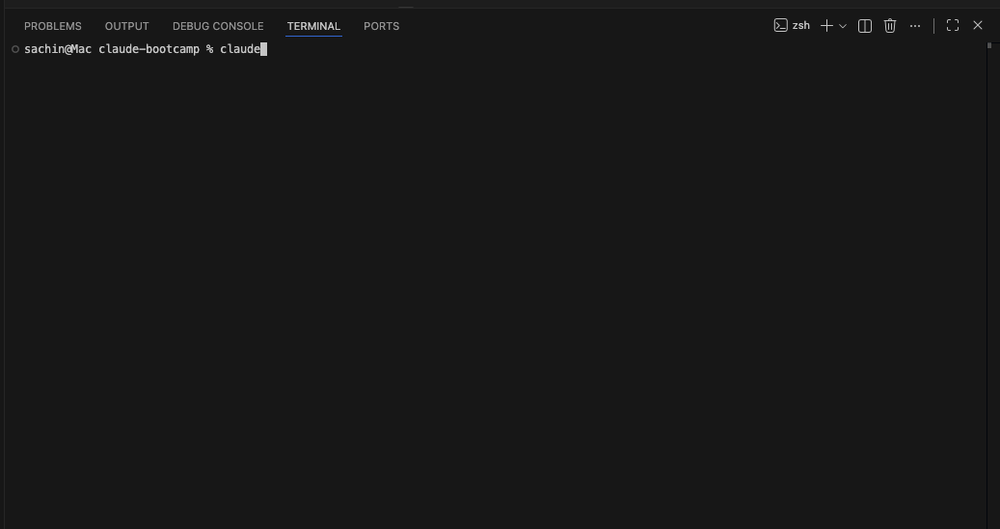
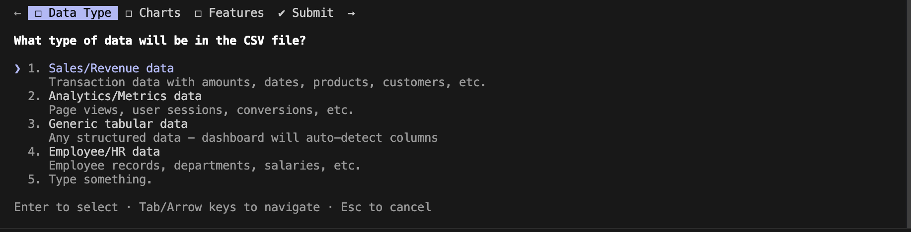
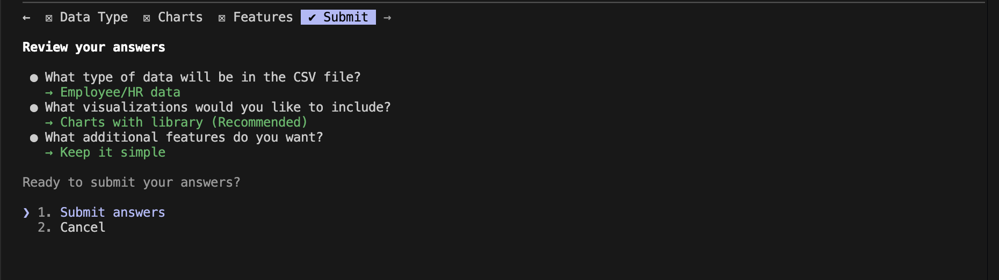
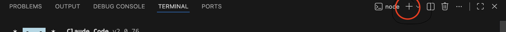
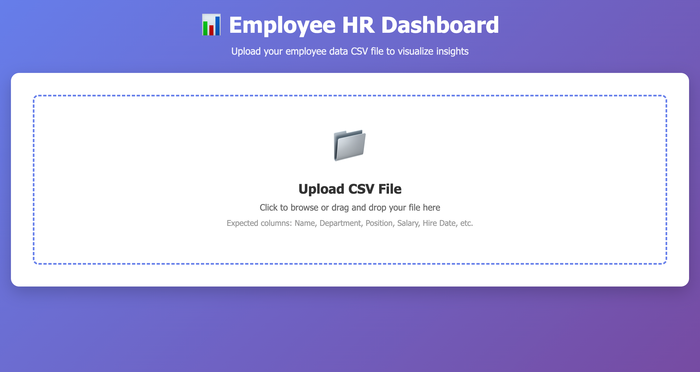
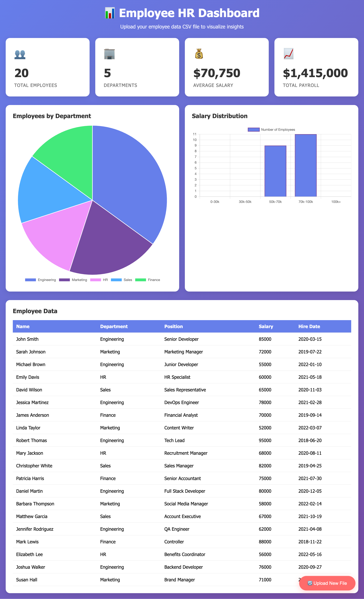

# Building in Claude: Creating Interactive Dashboards


---

## Introduction

Welcome to Module 3, where you'll discover that **Claude isn't just for conversations—it's a powerful tool for building real, functional applications.**

In this module, you'll learn how to leverage Claude Code to create an interactive dashboard from scratch. This hands-on experience will demonstrate that AI-powered development isn't just a concept—it's a practical reality that can transform how you build products and tools.

**What you'll build:** A fully functional dashboard that visualizes data, provides interactive features, and demonstrates real-world application development—all using Claude's coding capabilities.

**Why this matters:** As a product manager, understanding how to build with code (even with AI assistance) gives you a significant advantage. You can:
- **Prototype faster** - Turn ideas into working demos in hours, not weeks
- **Communicate better** - Show stakeholders exactly what you mean, not just describe it
- **Validate concepts** - Test ideas before committing engineering resources
- **Bridge the gap** - Speak the language of engineers and designers more effectively

This module bridges the gap between product thinking and technical execution, showing you that building is not just for engineers—it's for anyone with a clear vision and the right tools.

---

## Prerequisites

Before diving into building with Claude, make sure you've completed the following:

**Required Modules:**
- **Module 0: Getting Started** - You should have Claude set up and ready to use
- **Module 1: Doing Research** - You should understand market research and user research fundamentals
- **Module 2: Writing Product Documents** - You should be familiar with PRDs and design documents

## Hands-On Guide: Building an Dashboard with Claude Code

Now that you're fully set up, it's time to get hands-on. We'll begin applying Claude Code to **build a fully functional interactive dashboard** step by step. This will demonstrate how you can create real, working applications using Claude's coding capabilities—proving that building with code is accessible to product managers and non-technical professionals.

---

### Step 1: Open VS Code and Set Up Your Workspace

Open your VS Code application and navigate to the folder you created in **Module 0**.


---

### Step 2: Open Terminal and Start Claude Code

In VS Code, click on **Terminal → New Terminal** to open a terminal session.




Once the terminal is open, type:

```bash
claude
```

This will start Claude Code in your terminal. You should see Claude's interface ready to accept your commands.

---

### Step 3: Provide Your Build Prompt to Claude

Now it's time to tell Claude what you want to build. Copy and paste the following prompt into Claude Code:

```
create a dashboard in which user upload a csv sheet first and then based on the data present in the sheet and the metrics we need to create a dashboard in HTML CSS and JS and also create a csv file for testing 
```

After you paste the prompt, press Enter. Claude will then ask you a series of questions to better understand your requirements before starting to build. **Note:** The questions may vary based on your prompt and what you're building, but here's what to expect:

---

### Step 4: Answer Claude's Interactive Questions

Before Claude starts building, it will ask you a few clarifying questions to customize the dashboard according to your needs. Here's what you can expect:

#### Question 1: What kind of data does your CSV sheet contain?

Claude will ask about the type of data in your CSV file. Common options include:
- Sales data
- Revenue data
- HR data
- Other custom data types

**For this example, select:** `HR data`

This helps Claude understand the context and generate appropriate metrics and visualizations.


---

#### Question 2: How would you like to visualize the data?

Claude will ask about your preferred visualization format. Options typically include:
- Charts format (using a charting library)
- Table format
- Both charts and tables

**For this example, select:** `Charts with library`

This determines whether Claude will use a charting library (like Chart.js) to create interactive visualizations or display data in tabular format.


---

#### Question 3: Do you want any additional functionality?

Claude may ask if you'd like to add extra features to your dashboard. You can:
- Add specific features you need
- Keep it simple
- Request custom functionality

**For this example, you can select:** `Make it simple` (or add any specific features you need)

This allows you to customize the dashboard's complexity and features based on your requirements.


---

#### Question 4: Review and Submit

Finally, Claude will present a summary of all your selections and ask you to review everything. Once you're satisfied:

1. **Review** all the options you've selected
2. **Press the submit button** (or confirm in the interface)
3. Claude will start creating your dashboard!

> **Note:** The exact questions and options may vary based on your prompt and Claude's understanding of your requirements. The key is to answer honestly based on what you want to build.

After you submit, Claude will begin generating the code for your dashboard. This process may take a few moments as Claude creates all the necessary files in my case it create a dashboard.html file



> **Note:** Claude will also create a CSV file with dummy data for testing purposes. This sample CSV file will contain data that matches the type you selected (e.g., HR data) and will allow you to immediately test your dashboard without needing to prepare your own data file first.

---

### Step 5: Open Your Dashboard

Once Claude has finished creating your dashboard files, you'll want to open and view your dashboard in a browser. Here's how:

1. **Open a new terminal** in VS Code by clicking on the **add symbol** (+) in the terminal panel (or use `Terminal → New Terminal`)



2. **Open the dashboard file** using the appropriate command for your operating system:

   **For macOS:**
   ```bash
   open dashboard.html
   ```

   **For Windows:**
   ```bash
   start dashboard.html
   ```

   **For Linux:**
   ```bash
   xdg-open dashboard.html
   ```

This will open your dashboard in your default web browser, where you can see your interactive dashboard and test it with the CSV file that Claude created!

---

### Step 6: Using and Iterating on Your Dashboard

You can now see that Claude Code has built a fully functional dashboard for you. Here's what you'll find:

**Your Dashboard Features:**
- **File Upload Interface** - You can upload your CSV data file directly in the dashboard
- **Automatic Dashboard Generation** - Once you upload a CSV file, the dashboard automatically analyzes the data and creates visualizations based on the metrics present in your sheet
- **Interactive Visualizations** - Charts and graphs that help you understand your data at a glance

**Testing Your Dashboard:**
1. Use the CSV file that Claude created for testing, or upload your own CSV file
2. Watch as the dashboard automatically processes your data and generates appropriate visualizations
3. Explore the different charts and metrics that have been created

**Iterating and Improving:**
The beauty of building with Claude Code is that you can continuously improve your dashboard by iterating with more prompts. If you want to modify or enhance your dashboard:

1. Go back to Claude Code in your terminal
2. Provide additional prompts like:
   - "Add a filter feature to the dashboard"
   - "Change the color scheme to match my brand"
   - "Add export functionality to download the charts"
   - "Make the dashboard more responsive for mobile devices"
   - "Add more chart types based on the data"

3. Claude will update your existing dashboard files with the new features

> **Key Takeaway:** Building with code doesn't have to be a one-time thing. You can iterate, refine, and improve your dashboard by simply describing what you want in natural language. This is the power of AI-assisted development—it makes building accessible to everyone, not just engineers.





---