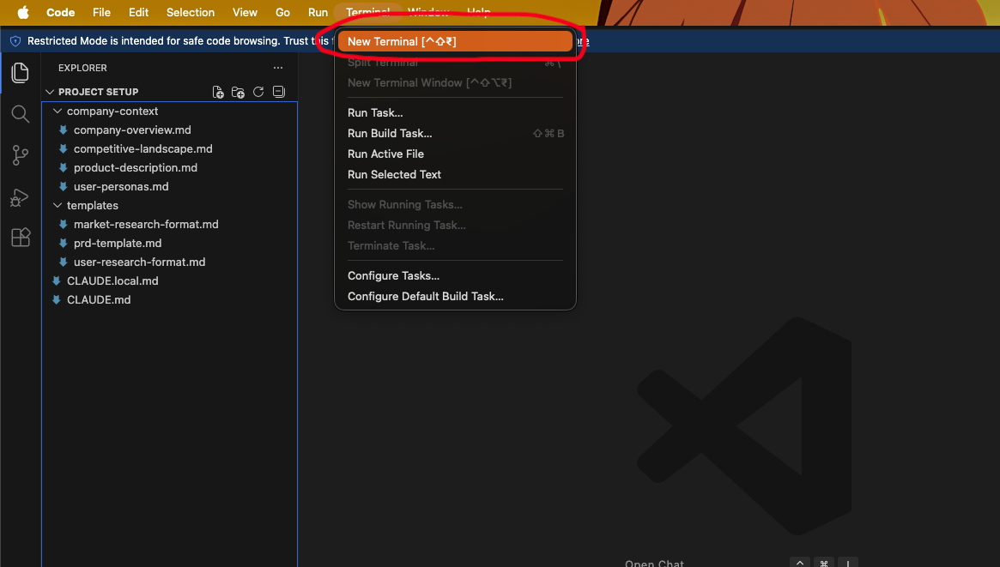
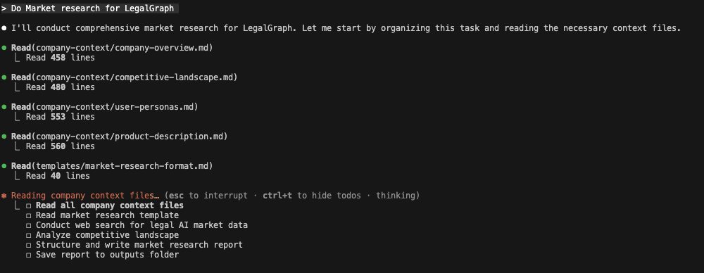
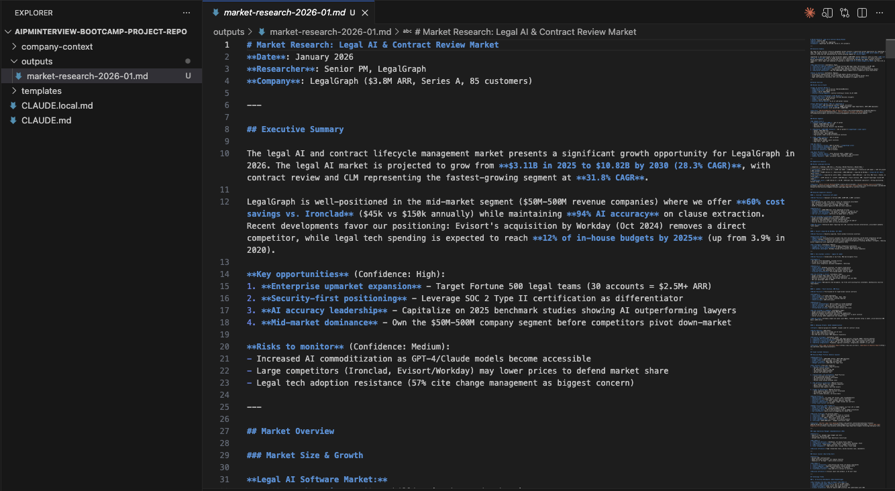

# Lesson 2.3: Doing Market Research Using Context

## Overview

In this lesson, we will be doing market research based on the context we have set up. This is where you'll see how all the concepts from the previous lessons come together to help you perform real Product Management tasks efficiently using Claude Code's context system.

---

## Prerequisites

Before starting this lesson, make sure you have:
- Completed Module 1
- Completed all previous lessons of Module 2 (2.1 and 2.2)

---

## Hands-On: Market Research Using Context

Now let's start the hands-on work! In this section, we'll perform market research using the context system we've set up. You'll learn how to leverage your company context and templates to conduct comprehensive market research efficiently.

---

### Step 1: Open Your Project

Open your VS Code and navigate to your project that you have cloned in Module 1.

1. Click on the **Open** button in VS Code
2. Select the folder you have cloned in Module 1

---

### Step 2: Open Terminal

1. Click on **Terminal** in the menu bar
2. Click on **New Terminal**

---

### Step 3: Launch Claude

In the terminal, type `claude` and press **Enter**.

Now Claude will ask you: "Do you trust the files in this folder?" Just select **Yes, Proceed** and press **Enter**.

---

### Step 4: Enter Market Research Prompt

Now put a prompt: **Do Market research for LegalGraph**

---

#### How Claude Processes This Query

Now let's break down how Claude processes this query:

The moment you put this query, Claude Code already has context about your company in `CLAUDE.md`. In that file, we have mentioned which files to refer to for doing market research as context. 

As you can see, Claude will read the `company-context` folder to do market research because we have already set our context in the `CLAUDE.md` file. This means Claude doesn't need you to manually specify which files to look at - it automatically knows to use the company context files you've referenced in `CLAUDE.md`.

---

#### Web Search Tool Access

Now Claude Code is asking whether to access the web search tool or not. You will see 3 options - as per your preference, you can select the option that best suits your needs. This allows Claude to search the web for additional market research information if needed.

---

#### File Storage Option

Now it is asking you to save the result in the file. First, it will ask to create a folder if it's not present, then it will create the file. Just press **Yes** - based on your preference, you can select any option. This is because we have provided in the context to save the output in a file. This allows you to save the market research results to a file for future reference.

---

#### Processing and Output

Now it will take 3-5 minutes because it works on thinking mode. At the end, it will first create a folder on its own if not present, named **output**, and then create a **market-research.md** file with the output. This file will contain the comprehensive market research results based on the context you've provided.

---