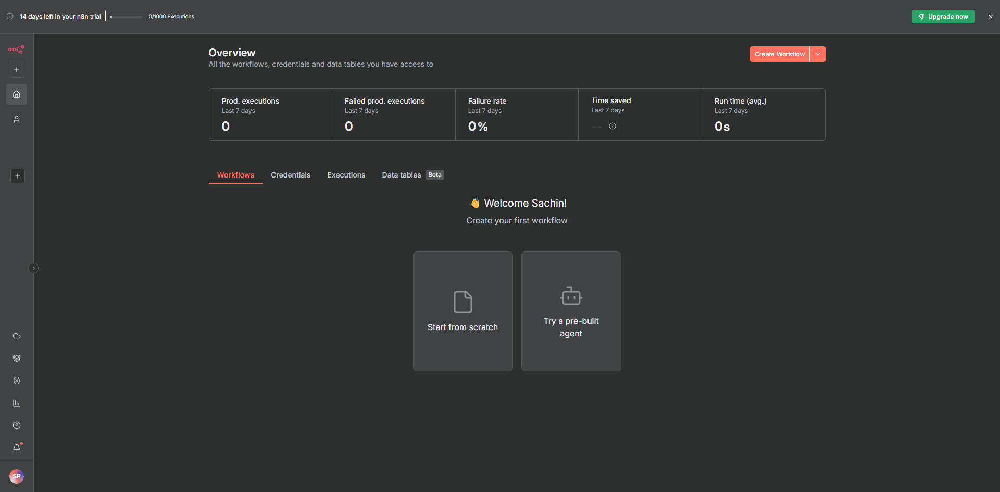

# N8N Authentication Configuration

---

## Step 1: Access n8n.io and Get Started

1. **Visit** [https://n8n.io/](https://n8n.io/) to access the n8n platform
2. **Click** on the "Get Started" button to begin the authentication setup process
3. **Or signup directly:** **[Click Here](https://n8n.io/signup)**

---

## Step 2: Provide Your Details

Enter your registration information:

---

## Step 3: Follow Up Instructions

After submitting your details, you may be asked additional questions

---

## Step 4: Click on Start Automating Button

**Click** on the **"Start Automating"** button to begin using n8n and access the workflow automation platform.

---

## Step 5: Success! You Have Successfully Logged In

**Congratulations!** You have now successfully logged into your n8n account. You can now:

- **Start creating** workflows
- **Explore** integrations
- **Build** automation solutions

---

## Important Notes

### 14-Day Free Trial

- n8n offers a **14-day free trial** for new users
- **Explore all features** during this trial period
- **No credit card required** to start

### When Your Trial Expires

**If your trial package expires and you want to continue using n8n:**

1. **Login with a different email** and create a new account
2. **Get another 14-day free trial** period
3. **Alternatively**, you can upgrade to a paid plan for continued access
