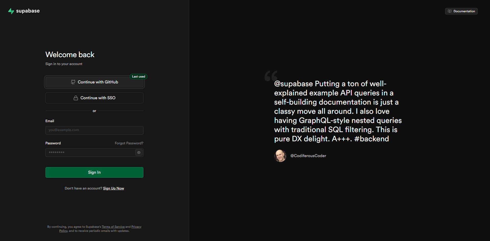
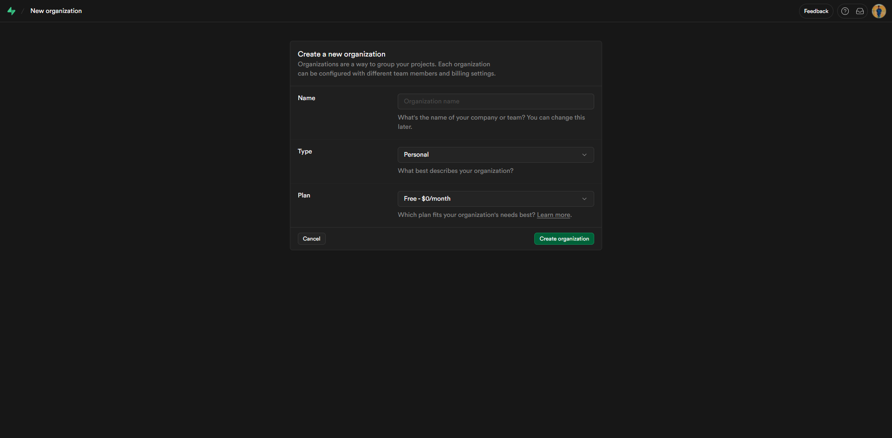
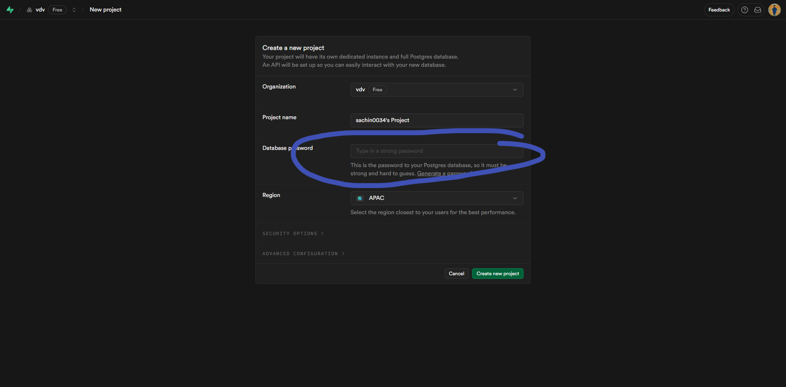
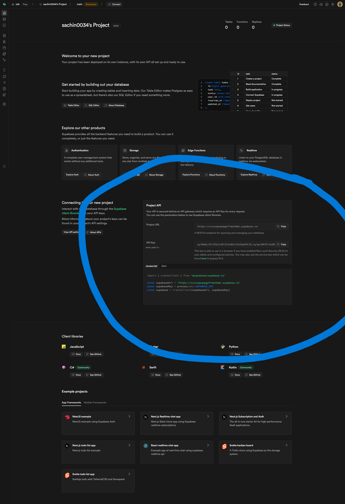

# Setting Up Your Supabase Account

This guide will walk you through the process of creating and configuring your Supabase account for the course.

## Prerequisites

- A valid email address
- Internet connection

## Step-by-Step Setup

### Step 1: Create a Supabase Account

1. Go to [supabase.com](https://supabase.com)
2. Click on "Start your project" or "Sign up"
3. Choose your preferred authentication method (GitHub or email)
4. Verify your email if required

### Step 2: Create a New Project

1. Once logged in, click on "New project"
2. Select your organization or create one if needed
3. Fill in your project details:
   - Project name
   - Database password (save this securely!)
   - Region (choose the closest to your location)
4. Click "Create new project"

### Step 3: Access Your Project Dashboard

1. Wait for your project to be set up (this may take a minute)
2. You'll be redirected to your project dashboard
3. Familiarize yourself with the different sections:
   - Database
   - Authentication
   - Storage
   - API

### Step 4: Get Your Project Credentials

1. Go to Project Settings (gear icon)
2. Click on "API"
3. Copy the following important credentials:
   - **Project URL**: Your project's API endpoint
   - **Anon Key**: Public anonymous key
   - **Service Role Key**: Private key (keep this secure!)
4. Save these credentials - you'll need them for your application

## Next Steps

Now that your Supabase account is set up:

1. **Save your credentials** in a secure location
2. **Note your project URL** and API keys

## Troubleshooting

If you encounter any issues:

- Check the [Supabase Documentation](https://supabase.com/docs)
- Review the [Supabase Status Page](https://status.supabase.com)
- Reach out to Sachin for assistance

## Additional Resources

- [Supabase Documentation](https://supabase.com/docs)
- [Supabase Discord Community](https://discord.supabase.com)
- [Supabase GitHub](https://github.com/supabase/supabase)

Happy coding! 🚀
