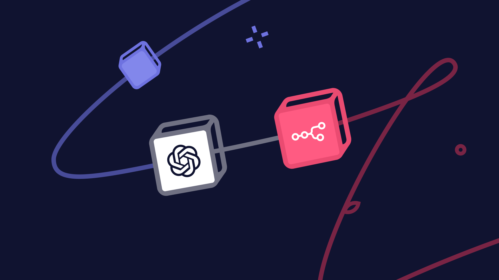
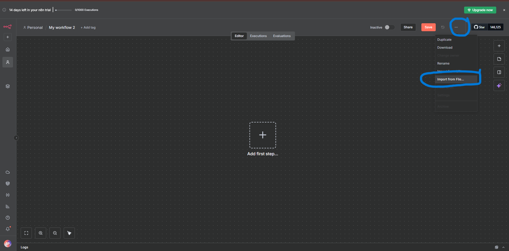
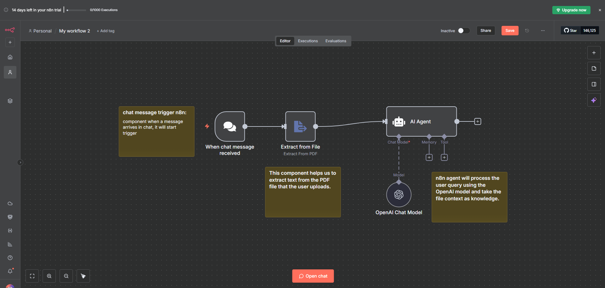
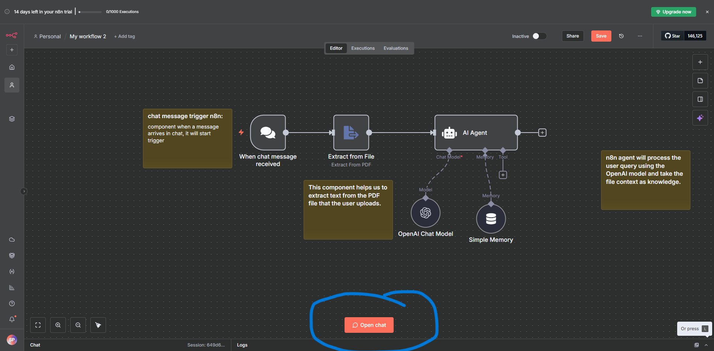
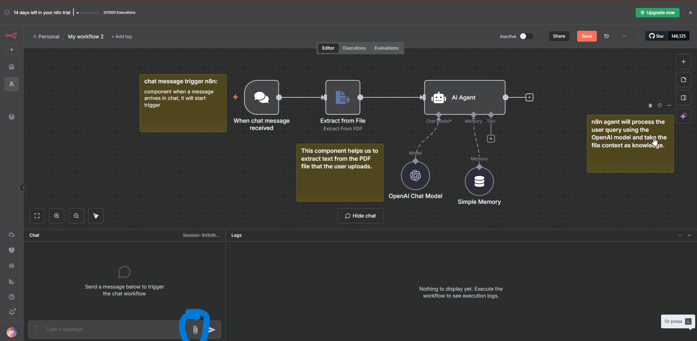
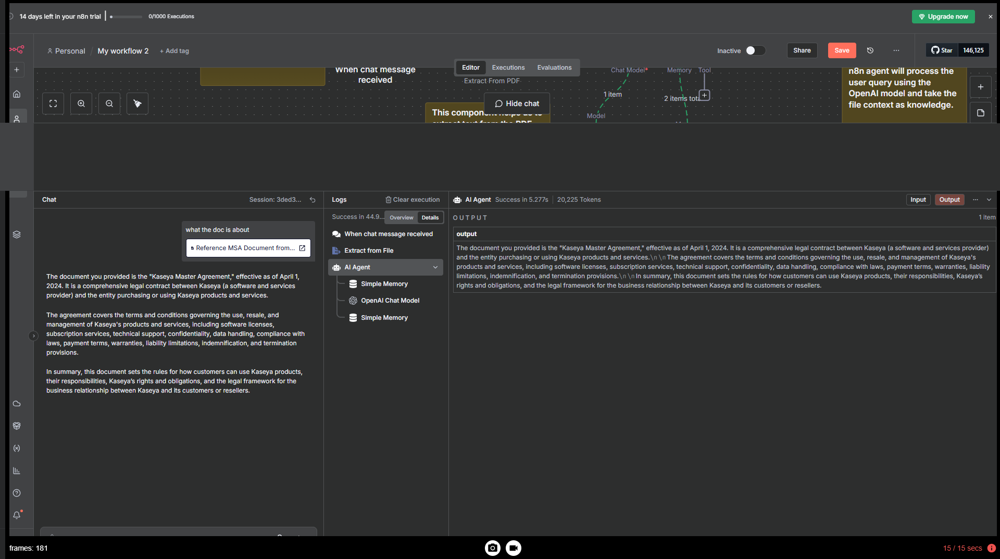

# Prompt Engineering Lab with n8n



---

## Introduction

In this lab, you will explore the fundamentals of **n8n workflow automation** and **prompt engineering**. You will learn how to build automated workflows in n8n and understand the principles of prompt engineering to effectively communicate with AI models.

### Learning Objectives

By the end of this lab, you will be able to:

- **Build and configure** workflows in n8n
- **Understand** what prompt engineering is and why it matters
- **Apply** prompt engineering techniques in your n8n workflows

---

## Prerequisites

Before beginning this lab, ensure you have completed the following:

- **New to n8n ! ** Set up your account: **[Click Here](../../Module%200%20-%20Prerequisite/n8n-loginSetup/Doc.md)**
- **Generate your OpenAI API key:** **[Click Here](https://youtu.be/YyaZ8zaGS-Q?si=bOw8C_TWgMg8S1hU)**
- **Download n8n workflow file:** **[Click Here](https://drive.google.com/file/d/1nJHmpSukVBuoAp0d6lSdBSmUfx-jqu8z/view?usp=sharing)**
- **Download reference document:** **[Click Here](https://drive.google.com/file/d/1zUUPpyFVsLXPzvnbjCDYtEDFmmwh4M3C/view?usp=sharing)**

---

## What is Prompt Engineering?

_Prompt engineering_ is the practice of designing and refining input prompts to effectively communicate with AI language models. It involves crafting **clear, specific instructions** that guide the AI to produce the desired output.

### Key Principles of Prompt Engineering

Understanding these fundamental principles will help you create more effective prompts:

1. **Be Clear and Specific** — Provide precise instructions about what you want
2. **Provide Context** — Give the AI relevant background information
3. **Use Examples** — Show the AI the format or style you expect
4. **Set Constraints** — Define boundaries, length, or format requirements
5. **Iterate and Refine** — Test and improve your prompts based on results

---

## Methods Used in Prompts

There are different types of prompts that you can use to interact with AI models based on your specific task requirements:

### 1. Instruction-Based Prompts

In this approach, you provide **explicit instructions** to the AI model, clearly stating what task needs to be performed. The model follows these instructions to generate the desired output.

#### Example: Removing Personally Identifiable Information (PII)

**INPUT:**

```
Read the following sales email. Remove any personally identifiable information (PII),
and replace it with the appropriate placeholder. For example, replace the name
"Sachin Parmar" with "[NAME]".

Hi John,

I'm writing to you because I noticed you recently purchased a new car. I'm a
salesperson at a local dealership (Cheap Dealz), and I wanted to let you know
that we have a great deal on a new car. If you're interested, please let me know.

Thanks,
Sachin Parmar
Phone: 410-805-2345
Email: ABC@gmail.com
```

**OUTPUT:**

```
Hi [NAME],

I'm writing to you because I noticed you recently purchased a new car. I'm a
salesperson at a local dealership, and I wanted to let you know that we have a
great deal on a new car. If you're interested, please let me know.

Thanks,
[SALESPERSON]
Phone: [PHONE]
Email: [EMAIL]
```

### 2. Role-Based Prompting

This technique involves **assigning a specific role or persona** to the AI model before asking questions. This helps the model respond from a particular perspective or domain expertise.

#### Example: Technical Estimation

**INPUT:**

```
You are a frontend engineer. Now estimate what it takes to build a stunning
website for a startup with 10 pages, with very basic interactions and simple
functionality. Just give the estimate in weeks, restrict your answer to 2 lines.
```

**OUTPUT:**

```
A stunning website for a startup with 10 pages, basic interactions, and simple
functionality could take approximately 4-8 weeks to complete. However, the actual
time required may vary depending on project-specific requirements and available
resources.
```

---

## Understanding n8n

**n8n** is a powerful, open-source workflow automation tool that allows you to connect various apps and services to automate tasks _without writing code_. It provides a visual interface where you can design complex workflows using a node-based system.

### What is n8n?

_n8n_ (pronounced "n-eight-n") is a fair-code licensed workflow automation tool. It enables you to:

- **Automate repetitive tasks** across multiple applications
- **Integrate different services** and APIs seamlessly
- **Build custom workflows** with a visual drag-and-drop interface
- **Self-host or use cloud** — Deploy on your own infrastructure or use n8n Cloud
- **Extend functionality** with custom nodes and JavaScript code

### Key Features of n8n

- **300+ Integrations** — Connect to popular services like Google Sheets, Slack, GitHub, databases, and more
- **Visual Workflow Editor** — Intuitive drag-and-drop interface for building automation
- **Flexible Execution** — Run workflows on schedule, webhook triggers, or manual execution
- **Data Transformation** — Process and transform data between different services
- **Error Handling** — Built-in error workflows and retry mechanisms
- **Open Source** — Free to use and customize according to your needs

---

## Hands-On: Building Your First Prompt Engineering Workflow

In this practical section, you will build a complete workflow that demonstrates the power of prompt engineering in n8n.

### Step 1: Set Up Your n8n Account

If you haven't already set up your n8n account, follow the **[Prerequisites](#prerequisites)** section above to:

1. **Create** your n8n account (cloud or self-hosted)
2. **Log in** to your n8n dashboard

> Once logged in, you're ready to create your first workflow!

---

### Step 2: Create a New Workflow

Once you are logged in, you will be redirected to your dashboard.

1. Locate and click on the **Create Workflow** button
2. A new blank workflow canvas will open
3. You're now ready to start building your automation!


---

### Step 3: Import the n8n Workflow

Now, let's import the pre-built workflow that you downloaded from the **[Prerequisites](#prerequisites)** section.

1. In the n8n canvas, look for the **menu icon** (three dots or hamburger menu) in the top-right corner
2. Click on the menu and select **Import from File** (or **Import Workflow**)
3. A file dialog will open
4. Navigate to where you saved the downloaded n8n workflow JSON file
5. Select the workflow file and click **Open**
6. The workflow will be imported and displayed on your canvas
7. Click **Save** to save the imported workflow

> **💡 Tip:** If you encounter any errors during import, ensure you downloaded the correct workflow file and that it's in _JSON format_.



---

### Step 4: Review the Imported Workflow

Now that you have imported the workflow, your canvas will display the complete workflow structure.

**Take a moment to:**

1. **Observe** the different nodes and their connections
2. **Notice** how the workflow is structured
3. **Identify** the key components (triggers, AI nodes, processing nodes)

Your workflow will look something like this, as you can see in the image below:



---

### Step 5: Configure Your OpenAI API Key

Now you need to configure your OpenAI API key to enable the workflow to communicate with the AI model.

1. Click on the **OpenAI Chat Model** node in your workflow
2. In the node parameters panel, locate the **Credentials** dropdown
3. Click on the dropdown and select **Create New Credential**
4. A credentials configuration window will appear
5. In the **API Key** input field, paste your OpenAI API key (obtained from Prerequisites)
6. Click the **Save** button to save your credentials
7. Close the credentials window and return to the workflow canvas

> **⚠️ Important:** Keep your API key secure and _never_ share it publicly. The key is stored securely in n8n.


---

### Step 6: Test Your Workflow with Chat Interface

Now it's time to test your workflow and interact with the AI agent!

1. Look for the **Open Chat** button (usually in the top-right corner or workflow panel)
2. Click on the **Open Chat** button
3. A chat interface section will appear on your screen



4. In the chat interface, locate the **file upload** option or icon
5. Click to upload and select the **reference document** that was provided in the prerequisites
6. Once the file is uploaded, start providing prompts in the **chat input field**
7. Type your questions or instructions related to the document content
8. Press **Enter** or click **Send** to submit your prompt
9. Observe how the AI agent processes your prompt and responds based on the document context



> **💡 Tip:** _Experiment_ with different types of prompts (instruction-based, role-based, specific questions) to see how the AI responds differently based on your prompt engineering techniques.

---

### Result

Now you can see the results! The AI agent **successfully processes** your prompts and provides **accurate responses** based on the uploaded document content.



---

## Improving Prompt Quality: From Basic to Optimized

Now that you know how to set up n8n and build a flow, let's explore how to **improve your prompts step by step**. You'll learn how to transform a basic prompt into an advanced, optimized one that produces superior results.

Let's explore how the _quality of your prompt_ dramatically affects the results you get from AI assistants. We'll compare outputs from poor prompts versus well-crafted ones.

---

### 🔴 Basic Poor Prompt

**Input:**

```
Extract these Information from the document: Key Term, Description, and Location in Contract.
```

**Output:**

```
Here are some key terms extracted from the document along with their descriptions and locations in the contract:

1. **Key Term:** Kaseya Master Agreement
   **Description:** A binding legal contract between Kaseya and the entity making purchases under this Agreement.
   **Location in Contract:** Introduction (Effective as of April 1, 2024)

2. **Key Term:** Scope
   **Description:** Governs the interactions between the customer and Kaseya, including access to Kaseya portals and platforms, and the right to purchase Kaseya Products.
   **Location in Contract:** Section 1(a)

3. **Key Term:** Product Terms of Use
   **Description:** Terms applicable to the use, marketing, resale, and distribution of Kaseya Products.
   **Location in Contract:** Section 1(a)

4. **Key Term:** License
   **Description:** The right to use a Product pursuant to the terms of the Agreement and as defined in the applicable Documentation.
   **Location in Contract:** Section 2(c)

5. **Key Term:** End User
   **Description:** The person or entity that purchases a Product for its own use and owns, licenses, or uses Content.
   **Location in Contract:** Section 16

6. **Key Term:** Confidential Information
   **Description:** Any business, operational, and/or technical information that is designated as confidential or that a reasonable person would believe to be confidential.
   **Location in Contract:** Section 7(a)

7. **Key Term:** Termination for Convenience
   **Description:** Either party may terminate the Agreement at any time without cause upon 30 calendar days written notice.
   **Location in Contract:** Section 9(b)

8. **Key Term:** Indemnification
   **Description:** Obligations of Kaseya and the customer to defend and hold harmless against certain claims.
   **Location in Contract:** Section 11

9. **Key Term:** Governing Law
   **Description:** The laws of the State of Delaware, USA, govern all disputes arising out of the Agreement.
   **Location in Contract:** Section 14(a)

10. **Key Term:** Fair Use
    **Description:** Policies that prohibit excessive use of Products that harms Kaseya's resources or circumvents the intended use of the Product.
    **Location in Contract:** Section 2(f)

These terms provide a foundational understanding of the Kaseya Master Agreement and its key components.
```

#### ⚠️ Issue With This Prompt

When you give an AI a vague prompt like this:

- You might get a response, but it **might not be structured** the way you expected
- The reason? You didn't specify _how_ you want the output to be formatted
- _Imagine_ you're asking a friend to summarize a book. If you don't tell them whether you want bullet points, a table, or a short paragraph, they might just ramble on in their own way

---

### 🟡 Better Prompt

Let's improve upon the basic prompt by adding structure and specificity.

**Input:**

```
Create a table with the following columns: Key Term, Description, and Location in Contract.
Populate it with the extracted details of the service provider name, customer name, and termination clauses.
```

**Output:**

```
Here's a table with the requested details extracted from the Kaseya Master Agreement:

| Key Term                     | Description                                                                                     | Location in Contract                       |
|------------------------------|-------------------------------------------------------------------------------------------------|-------------------------------------------|
| Service Provider Name         | Kaseya US, LLC (for customers in the United States)                                           | Exhibit A                                 |
| Customer Name                 | The entity making purchases under this Agreement (referred to as "you")                       | Introduction (first paragraph)            |
| Termination for Convenience    | Either party may terminate the Agreement at any time, without cause, upon 30 days written notice. | Section 9(b)                             |
| Termination for Material Breach | Each party may terminate the Agreement upon notice if the other party materially breaches and fails to cure within 30 days. | Section 9(c)                             |
| Effect of Termination         | Upon termination, the customer may not order or sell additional Products without consent, and all rights and licenses will terminate. | Section 9(d)                             |

This table summarizes the key terms related to the service provider name, customer name, and termination clauses as specified in the Kaseya Master Agreement.
```

#### ✅ Why This Works

You see, when we **clearly define the format** of the output, the AI follows our instructions and provides the response in the exact structure we need. Instead of a random or unstructured reply, we now get information that is _neatly organized_.

For example, in this case, we used a **table format**, which ensures that the AI categorizes key terms properly. Each term is placed under three distinct columns:

- **Key Term** — What is being defined
- **Description** — A brief explanation
- **Location in Contract** — Where it is found in the document

By setting this structure in the prompt, we **eliminate ambiguity**, making the AI's response clear, concise, and easy to navigate. This approach enhances readability and ensures that we receive the information in a way that is _practical and useful_.

---

### 🟢 Optimized Prompt

Now, let's take it to the next level with a comprehensive, detailed prompt that maximizes AI effectiveness.

**Input:**

```
Create a comprehensive contract analysis table with three columns: 'Key Term', 'Description',
and 'Location in Contract (Section/Page)'. Extract and populate this table with the following
specific elements:

1. Service Provider Name (including full legal entity name and any DBA names)
2. Customer Name (including full legal entity name)
3. All Termination Clauses (including for-cause and without-cause termination provisions,
   required notice periods, and any termination fees)
4. Contract Term/Duration (initial term and renewal provisions)
5. Payment Terms (including due dates, late fees, and escalation clauses)
```

**Output:**

```
Here's a comprehensive contract analysis table based on the provided Kaseya Master Agreement:

| Key Term                       | Description                                                                                                                                                                                                 | Location in Contract (Section/Page) |
|--------------------------------|-------------------------------------------------------------------------------------------------------------------------------------------------------------------------------------------------------------|-------------------------------------|
| Service Provider Name          | "Kaseya US, LLC" (for customers in the United States) and other entities for different countries as specified in Exhibit A.                                                                                 | Exhibit A, Page 1                   |
| Customer Name                  | The entity making purchases under this Agreement, as specified by the customer during the registration process.                                                                                             | Section 1, Page 1                   |
| Termination Clauses            | **For-Cause Termination:** "Kaseya may terminate this Agreement... for: (i) non-payment that is not cured within ten (10) days after notice; or (ii) your violation of Section 2 (Use of Products and Restrictions)." <br> **Without-Cause Termination:** "Either Party may terminate this Agreement, at any time, without cause, upon 30 calendar days written notice." <br> **Termination Fees:** "You are required to continue to make payments for a Trailing Subscription until its expiration." | Section 9, Page 12                  |
| Contract Term/Duration         | "This Agreement will commence upon the earlier of: (i) your acceptance of this Agreement... and then will continue until terminated in accordance with the provisions of this section." <br> "Committed Service Terms set forth in Orders will automatically renew for additional Committed Service Terms equal in length to the expiring Committed Service Term unless either party gives notice to the other of non-renewal at least thirty (30) days prior to the end of the relevant Committed Service Term." | Section 9, Page 11                  |
| Payment Terms                  | "You agree to pay all charges applicable to the Products ordered by you including... Fees and payments will be calculated by us based on records maintained by us." <br> "If you are more than thirty (30) days overdue on payments, you agree that Kaseya has the right to... charge interest/late fees at the rate of 2.0% per month." | Section 6, Page 8                   |

This table summarizes the key terms of the Kaseya Master Agreement, providing direct quotes
and plain-language summaries for clarity, along with specific locations for easy reference.
```

#### ✅ Why This Works

This optimized prompt produces **superior results** because it:

1. **Specifies exactly what information to extract** — 5 key elements versus just 3
2. **Requests specific formatting** — comprehensive table with defined columns
3. **Details what should be included in each column** — e.g., "including full legal entity name and any DBA names"
4. **Asks for both direct quotes and plain-language summaries** — for better understanding
5. **Requests precise location information** — both section and page numbers
6. **Clarifies the depth of analysis needed** — for each element (especially for termination clauses)
7. **Structures the request in a numbered list** — for clarity and organization

By following this progression from _basic_ to _optimized_, you can see how adding **specificity**, **structure**, and **clear expectations** transforms the quality of AI responses dramatically.

---

### 🌟 The Ideal Prompt: Combining All Best Practices

Now let's look at an **ideal prompt** that combines multiple advanced prompt engineering techniques. This example demonstrates how to structure a _professional, comprehensive prompt_ that maximizes AI effectiveness.

**Input:**

```
<Role>
You are an in-house general counsel trained to find liabilities and other clauses from contracts.
</Role>

<Instruction>
Use your legal expertise to review the provided contract document. Your primary goal is to
extract and summarize specific terms accurately, following the structured format specified.
</Instruction>

<Task>
1. Extract key terms including 'Service Provider Name', 'Start Date', 'End Date', and 'Deal Value'.
   Present these in a list format.
2. Review and identify clauses related to 'termination for breach', 'data breach notice', and
   'limitations of liability'. Provide a summary in JSON format.
3. Analyze 'auto-renewal' terms and specify the required notice period.
4. Summarize 'indemnification' and 'attorney fees' coverage terms separately.
5. Highlight any ambiguous or unclear language, suggesting further review if necessary.
</Task>

<Guardrails>
1. Be specific and concise in term extraction.
2. Provide summaries in the specified format (JSON, table, or bullet points as directed).
3. Emulate a legal analyst persona.
4. Use positive instructions: focus on terms to include, rather than avoid.
5. Acknowledge model limitations: flag uncertain sections for professional review.
</Guardrails>
```

#### 🎯 Why This Is The Ideal Prompt

This prompt is exceptional because it incorporates **multiple advanced prompt engineering techniques** in a single, well-structured format:

**1. Clear Role Definition (`<Role>` section)**

- Assigns a specific persona (in-house general counsel)
- Sets the expertise level and perspective
- Helps the AI understand the context and required depth

**2. Explicit Instructions (`<Instruction>` section)**

- States the primary goal clearly
- Defines the expected approach
- Sets the tone for the analysis

**3. Structured Task Breakdown (`<Task>` section)**

- Breaks down complex requirements into 5 distinct steps
- Specifies exact terms to extract
- Defines different output formats for different tasks (list, JSON, summary)
- Prioritizes tasks in logical order

**4. Built-in Quality Controls (`<Guardrails>` section)**

- Ensures consistency in output
- Reinforces formatting requirements
- Acknowledges AI limitations responsibly
- Promotes professional standards

**5. Multiple Prompt Engineering Techniques Combined:**

- ✅ Role-Based Prompting
- ✅ Instruction-Based Prompting
- ✅ Chain of Thought (step-by-step tasks)
- ✅ Format Specification (JSON, lists, summaries)
- ✅ Context Provision
- ✅ Constraint Setting (guardrails)
- ✅ Limitation Acknowledgment

> **💡 Pro Tip:** This structured approach using `<Role>`, `<Instruction>`, `<Task>`, and `<Guardrails>` sections can be adapted as a template for your own complex prompts. Simply modify the content within each section to match your specific needs.

---

## Top 10 Best Practices Walkthrough

Using our _Contract Summarization App_, you can play around and apply these **ten best practices** for prompt engineering:

---

### 1. Be Specific with Information Requests

Ask for precise information rather than vague queries.

**📌 Example:**

```
Extract the service provider name, start and end date of the contract, and the total deal value.
```

### 2. Supply Examples for Context

Provide format examples to guide the AI's response structure.

**📌 Example:**

```
Given the format "Service Provider Name: [Name], Start Date: [Date], End Date: [Date], Deal Value: [Amount]", summarize accordingly.
```

### 3. Include Relevant Data

Reference specific sections or parts of the document for focused analysis.

**📌 Example:**

```
Referencing Section 1.5, summarize the deal value and billing frequency terms.
```

### 4. Specify Desired Output Format

Define exactly how you want the information presented.

**📌 Example:**

```
Create a table with "Key Term", "Description", and "Location in Contract" columns.
```

### 5. Use Positive Instructions

Frame requests positively, stating what to do rather than what not to do.

**📌 Example:**

```
Extract key terms including 'termination for breach' and 'limitations of liability' in JSON format.
```

### 6. Assign a Persona or Frame of Reference

Give the AI a specific role or perspective to improve relevance.

**📌 Example:**

```
Imagine you are a legal analyst. Summarize auto-renewal terms, notice periods, and liabilities.
```

### 7. Implement Chain of Thought Prompting

Break down the reasoning process into logical steps.

**📌 Example:**

```
Identify 'termination without cause' clauses → Summarize → Explain implications.
```

### 8. Break Down Complex Tasks

Divide complicated requests into smaller, manageable parts.

**📌 Example:**

```
Identify and summarize indemnification terms. Then extract coverage for attorney fees.
```

### 9. Acknowledge the Model's Limitations

Recognize when expert review may be needed for critical decisions.

**📌 Example:**

```
Extract governing law and indemnification terms. Flag unclear sections for expert review.
```

### 10. Take an Experimental Approach

Test different formats and approaches to find what works best.

**📌 Example:**

```
Extract 'termination for cause' using a bullet list, then as a paragraph. Compare clarity.
```

---

## Conclusion

Congratulations! You've completed the **Prompt Engineering Lab with n8n**. Throughout this lab, you have:

✅ **Learned** the fundamentals of prompt engineering and its importance  
✅ **Built** a complete workflow in n8n with AI integration  
✅ **Explored** different prompt engineering techniques (instruction-based, role-based)

---

### Additional Resources

- **n8n Documentation:** **[https://docs.n8n.io](https://docs.n8n.io)**
- **OpenAI Best Practices:** **[https://platform.openai.com/docs/guides/prompt-engineering](https://platform.openai.com/docs/guides/prompt-engineering)**
- **n8n Community Forum:** **[https://community.n8n.io](https://community.n8n.io)**

---

**Happy Automating! 🚀**
