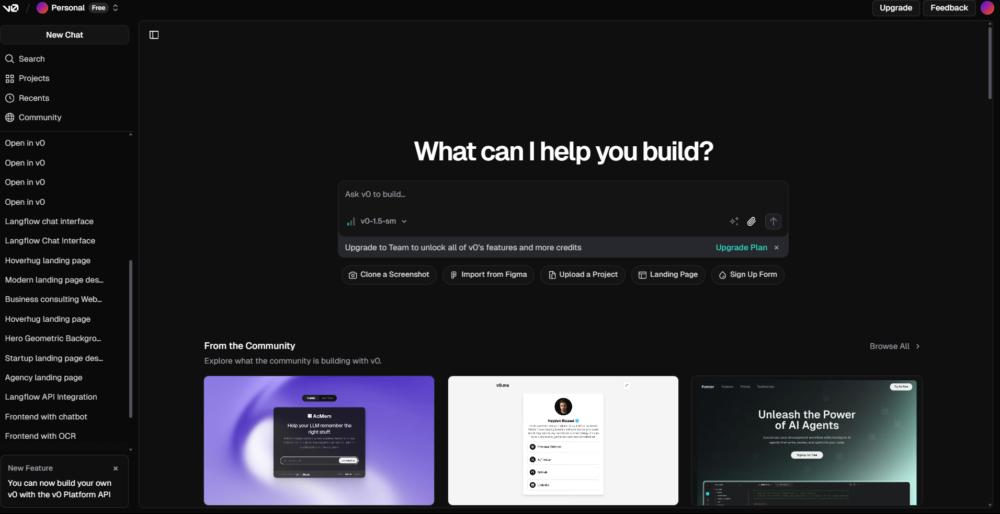
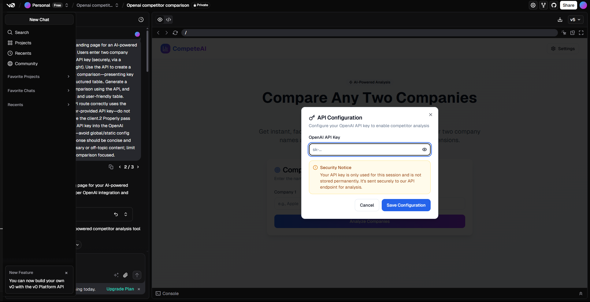
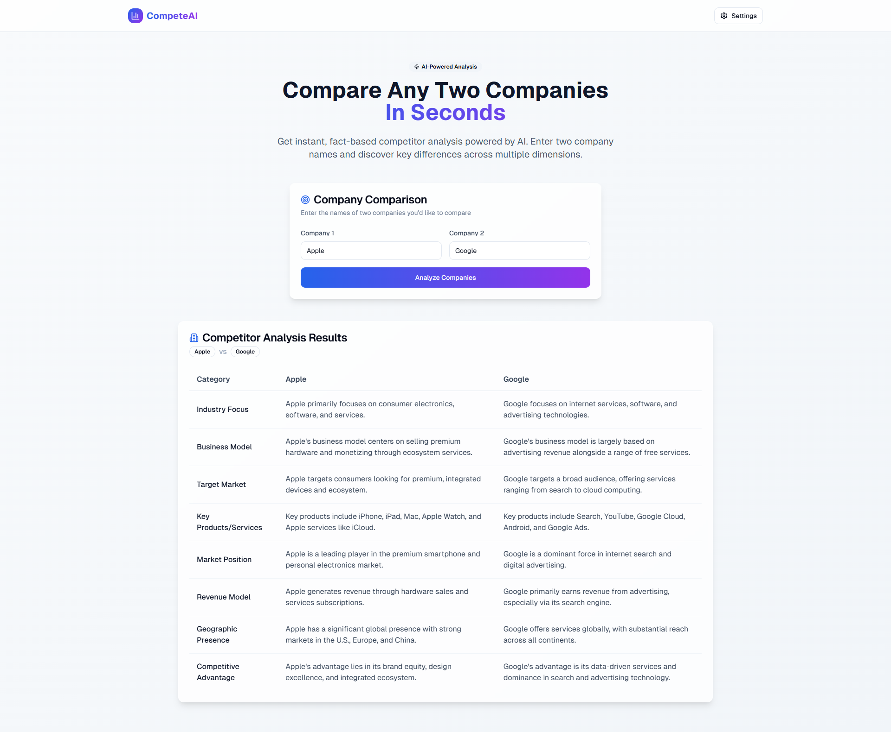

# Build a Product MVP with V0

## Overview

Imagine this:

You’ve got an idea for a tool that helps users compare two companies side by side using AI. The concept is simple but powerful — users input two company names, provide their OpenAI API key, and instantly get a structured, fact-based comparison displayed in a clean, modern layout.

That’s exactly what we’re building in this lab.

This tool could be part of a larger product vision say, a market intelligence dashboard or a competitive research assistant. The frontend you’ll prototype today is the first building block: a landing page that allows users to:

- Enter two company names.
- Securely input their OpenAI API key via a settings tab.
- Generate an AI-powered, side-by-side comparison.
- View the results in a structured and user-friendly table.

You’ll use **V0.dev** to bring this idea to life turning a product concept into a working MVP interface in under a minute.

No design team. No frontend engineer. Just you, your idea, and AI.

## Prerequisites

Before starting the lab, make sure you have the following:

- A **V0.dev** account  
  👉 [Click here to access V0](https://v0.dev/chat)

- An **OpenAI API Key**  
  👉 [Click here to get your OpenAI API key](https://youtu.be/YyaZ8zaGS-Q?si=bOw8C_TWgMg8S1hU)

> ⚠️ You'll use the OpenAI key to securely fetch company comparison data inside your prototype. Keep it safe and do not expose it publicly.

## Let's Get Started

Let’s see how you can build a working product interface in under a minute. We’ll walk you through each step, from generating the UI with V0 to preparing it for integration with real data. You don’t need to write any code from scratch just follow along, and you’ll have a polished MVP ready to go.

### Step 1: Open V0.dev

Head over to **V0.dev**, the AI-powered UI generation platform. Once you're there, you’ll see a chat interface where you can describe the UI you want to build.



> 📸 *Above: V0.dev chat interface where you’ll enter yours prompt*

### Step 2: Paste This Prompt in V0

Copy and paste the following full prompt into the V0 chat to generate your MVP landing page:

```
Create an landing page where the user can input two company names and their OpenAI API key.
When the user clicks the “Compare” button, use the OpenAI GPT-4o-mini model to compare the two companies (e.g., based on description, market position, or performance).
Requirements:
Include three input fields:
Company Name 1
Company Name 2
User’s OpenAI API Key
On submission, call the OpenAI API using the provided API key from the frontend.
Add debug statements in the console to log:
What data is being sent to the OpenAI API
What response is being received from the API
Display the comparison result neatly on the UI.
Code should be modular, optimized, and split into reusable components (e.g., CompanyComparisonForm, ComparisonResult).
Design should follow a clean, modern aesthetic with subtle animations and proper spacing.

```


### Step 3: Review Your Generated Interface

Once you submit the prompt, V0 will generate your full UI in minutes.

Your interface should include:
- A clean layout with two input fields for company names
- A secure settings tab (top-right) for entering the OpenAI API key
- A structured, responsive table for side-by-side comparisons

#### 🐞 If Something Goes Wrong...

Sometimes the first generation may not be perfect and that’s okay ! Here are some common issues and you should know to fix them:

| ❌ Issue | 💬 What to Say to V0 |
|--------|----------------------|
| Settings tab is missing | `Add a settings tab at the top-right for API key input.` |
| Comparison table looks broken | `Fix the table layout so it's clearly structured and readable.` |
| Inputs not labeled properly | `Label the input fields: one for Company A, one for Company B.` |
| No submit button or unclear action | `Add a "Compare" button below the inputs.` |
| UI looks too plain or unstyled | `Apply a modern, clean UI style with padding and spacing.` |

Just **type your request in plain English**, and V0 will regenerate the updated version instantly.

### Step 4: Power It Up – Add Inputs and Run Your First Analysis

Now that your MVP interface is ready, it's time to see it in action!

Here’s what to do:

1. **Go to the Settings tab** (top-right corner of your interface).

2. **Paste your OpenAI API key** into the secure input field.

3. **Enter the names of the two companies** you want to compare in the provided input boxes.
4. **Click the "Analyze Companies" button** to generate your side-by-side AI-powered comparison.



In just a few seconds, you'll see a clean, structured table showing the key differences between the two companies — pulled and processed live via the OpenAI API.


> ✨ You’ve officially built and run your first live product feature. In minutes.

Take a deep breath and feel it — you’ve gone from idea to execution faster than ever before.


## Conclusion: What You’ve Learned and Achieved

In just a few minutes, you went from idea to execution — building a fully functional MVP without writing code from scratch.

Here’s what you accomplished:
- Designed and generated a modern landing page using V0
- Added dynamic input fields and secure API key handling
- Integrated a button-driven workflow for live data analysis
- Displayed a clean, AI-powered, side-by-side company comparison

> 🚀 You’ve experienced what it feels like to move fast and ship even faster — using the power of AI tools to support product thinking and experimentation.

This lab wasn’t just about building a UI. It was about learning how to validate ideas quickly, iterate confidently, and bring value to users — all in record time.

You're now equipped with the mindset and tools to prototype your next idea in minutes. Keep going — this is just the beginning. 💡


