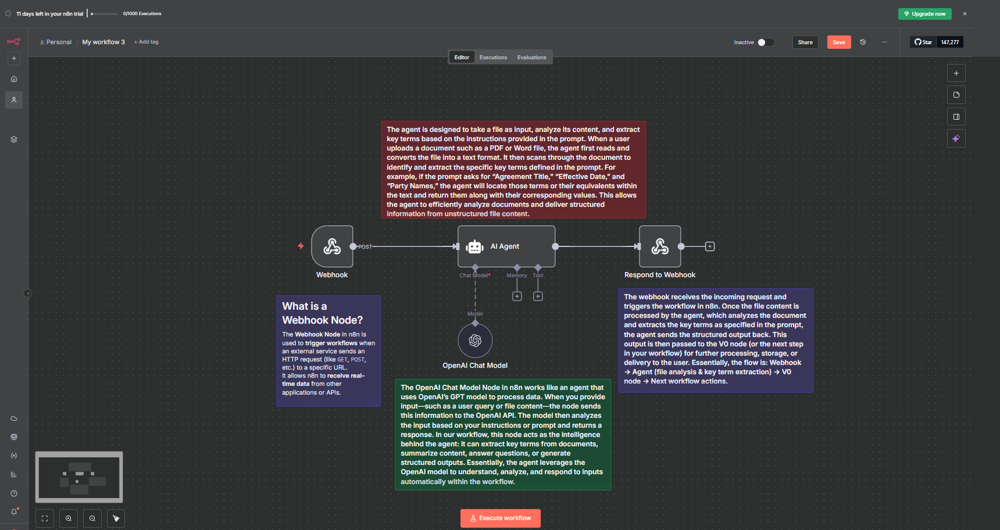

# Building an AI-Powered Document Analyzer: Connecting n8n with v0 for Key Term Extraction


## Introduction

In the last two labs, you learned how to create a basic workflow in n8n and how to build a website using v0. In this lab, we will take it a step further by connecting n8n with v0 using webhooks.

We will be building a workflow where users can upload a document through a web interface, and our AI agent will automatically analyze that document and extract key terms from it. This integration demonstrates the power of combining workflow automation with modern web development tools.

## Understanding Webhooks

In this workflow, we will be using **webhooks** as the bridge between v0 and n8n. But what exactly is a webhook?

A webhook is a way for one application to send real-time data to another application automatically. Think of it as a notification system - when something happens in one app (like a user uploading a file), it immediately triggers an action in another app (like starting the n8n workflow).

### How Webhooks Work in Our Project:

1. **Trigger Point**: When a user uploads a document on the v0 website, it sends the data to a webhook URL
2. **The Bridge**: The webhook URL is provided by n8n and acts as an entry point to our workflow
3. **Instant Processing**: As soon as n8n receives the data through the webhook, it starts processing the document automatically
4. **No Polling Required**: Unlike traditional methods where you'd need to constantly check for new files, webhooks push the data instantly when an event occurs

## Prerequisites

Before beginning this lab, ensure you have completed the following:

- **New to n8n!** Set up your account: **[Click Here](../../Module%200%20-%20Prerequisite/n8n-loginSetup/Doc.md)**
- **v0 by Vercel Account:** Access to v0 for building the web interface: **[Click Here](https://v0.dev/)**
- **Generate your OpenAI API key:** **[Click Here](https://youtu.be/YyaZ8zaGS-Q?si=bOw8C_TWgMg8S1hU)**
- **Download n8n workflow file:** **[Click Here](https://drive.google.com/file/d/1KEoQvxHBSnxHcxfTY6SpxzMpr1JyS19j/view?usp=sharing)**
- **Download reference document:** **[Click Here](https://drive.google.com/file/d/1zUUPpyFVsLXPzvnbjCDYtEDFmmwh4M3C/view?usp=sharing)**

## Hands-On: Building Your Document Analyzer Workflow

In this practical section, you will build a complete workflow that connects v0 with n8n to create an intelligent document analysis system.

### Step 1: Set Up Your n8n Account

If you haven't already set up your n8n account, follow the **[Prerequisites](#prerequisites)** section above to:

1. **Create** your n8n account (cloud or self-hosted)
2. **Log in** to your n8n dashboard

> Once logged in, you're ready to create your first workflow!

---

### Step 2: Import the Workflow

Now let's import the pre-built workflow into n8n:

1. Click on **"Create Workflow"** button in your n8n dashboard
   
2. Go to the menu (three dots or hamburger icon) and select **"Import from File"**
3. Upload the **JSON workflow file** that you downloaded from the Prerequisites section (Step 4)
   
4. The workflow will be imported and displayed on your canvas
  

> **💡 Note:** Make sure you have configured your OpenAI API key. If you have already completed **Lab 1.1**, you don't need to do it again — n8n will automatically use the credentials you saved from the environment variables.

> **If you haven't configured it yet:** Click on the **OpenAI Chat Model** component and add your API key as shown in the GIF below.


> Your workflow is now ready to be configured!

---

### Step 3: Copy the Webhook URL

The webhook is the key connection point between v0 and n8n. Let's get the webhook URL:

1. Click on the **Webhook** component in your workflow canvas
2. Locate the **Webhook URL** field in the node settings
3. **Copy** the URL .
4. Save this URL somewhere safe - you'll need it when setting up the v0 interface


> This webhook URL is where v0 will send the uploaded document data!

---

### Step 4: Create the Web Interface in v0

Now let's build the document upload interface using v0:

1. Head to **[v0.dev](https://v0.dev/)** and log in to your account
2. Copy the **prompt below**
3. Paste it into the v0 prompt input field and generate your interface

**Note:** When using the prompt below, ensure you replace `<Your Webhook URL>` with the webhook URL you copied in Step 3.

**Prompt to copy:**

```
You are a frontend UI designer.

Your task is to design a clean, modern landing page where users can upload a document, send it to a webhook, and display the processed JSON results in a beautifully formatted table.

Requirements:

1. Page Purpose
Create a landing page where the user can:
- Upload a document (PDF, DOCX, TXT)
- Click a "Process Document" button
- On button click, send the uploaded file to the webhook: <Your Webhook URL>

2. Functionality
- Show a loading animation while waiting for the webhook response
- Webhook returns JSON. Sometimes it returns a stringified JSON inside output
- Parse the response correctly to handle both formats
- Detect if JSON contains document extraction fields: key_term, value, page_number
- Render dynamic table displaying all key-value pairs, or a specialized table if document extraction fields exist
- Table rows should map automatically from JSON array items

3. Design
- Elegant dark theme with glowing accents
- Centered layout with rounded drag-and-drop upload area
- Button: gradient + hover glow
- Responsive for mobile and desktop
- Clean fonts with minimal animations (fade-in table, hover highlights)

4. UI Flow
- Header: "Document Analyzer"
- Subtext: "Upload your document and see the results"
- Upload Section: Drag-and-drop + file select button
- Process Button: "Process Document"
- Response Area: Dynamically render the parsed JSON in a formatted table

5. Table Rendering Logic - Implementation Approach

Step 1: Data Reception & Parsing
When the webhook returns the response, handle different formats:

const data = await response.json();

// Handle nested string format
if (data.output && typeof data.output === "string") {
  parsedData = JSON.parse(data.output); // Parse stringified JSON
} else if (Array.isArray(data)) {
  parsedData = data; // Already an array
}

Step 2: Data Structure Detection
Automatically detect if data contains document extraction fields:

const isArray = Array.isArray(parsedData);
const isDocumentExtraction = isArray && parsedData.length > 0 && "key_term" in parsedData[0] && "value" in parsedData[0];

Step 3: Table Rendering
Map the validated data to a structured table:

<thead>
  <tr>
    <th>Key Term</th>
    <th>Value</th>
    <th>Page</th>
  </tr>
</thead>

<tbody>
  {parsedData.map((item, index) => (
    <tr key={index}>
      <td>{item.key_term}</td>
      <td>{item.value}</td>
      <td>{item.page_number}</td>
    </tr>
  ))}
</tbody>

Include: upload functionality, webhook request, loading state, JSON parsing (handle both formats), table rendering, and modern dark-themed UI.

```

> Once v0 generates the interface, review and customize as needed!


---

### Step 5: Test Your Document Analyzer

Now it's time to test our workflow:

1. **Go back to n8n** and open your workflow
2. Click the **"Execute Workflow"** button to activate your workflow (this puts the webhook in listening mode)
3. **Return to your v0 interface** in the browser
4. Paste the **webhook URL** (from Step 3) into the webhook URL input field in your v0 interface
5. **Upload the reference document** that you downloaded from the Prerequisites section
6. Click the **"Analyze Document"** or **"Process"** button
7. Wait for the AI agent to analyze the document and extract key terms

> The webhook will trigger the n8n workflow, which will process your document and return the extracted key terms!


---

## Conclusion

Congratulations! 🎉 You've successfully built an end-to-end AI-powered document analyzer by connecting n8n with v0 using webhooks.

### What You've Accomplished

In this lab, you:

- ✅ **Learned about webhooks** and how they enable real-time communication between applications
- ✅ **Imported and configured** a workflow in n8n with webhook integration
- ✅ **Built a modern web interface** using v0 with drag-and-drop file upload functionality
- ✅ **Connected two powerful platforms** (n8n and v0) to create a seamless user experience
- ✅ **Implemented intelligent document processing** with AI-powered key term extraction
- ✅ **Created dynamic table rendering** that automatically formats and displays JSON responses

### Key Takeaways

1. **Webhooks are powerful**: They enable instant, event-driven communication between systems without constant polling
2. **n8n is flexible**: You can automate complex workflows and integrate multiple services easily
3. **v0 accelerates development**: AI-powered UI generation speeds up frontend development significantly
4. **Integration is key**: Combining different tools creates powerful, practical solutions

---


