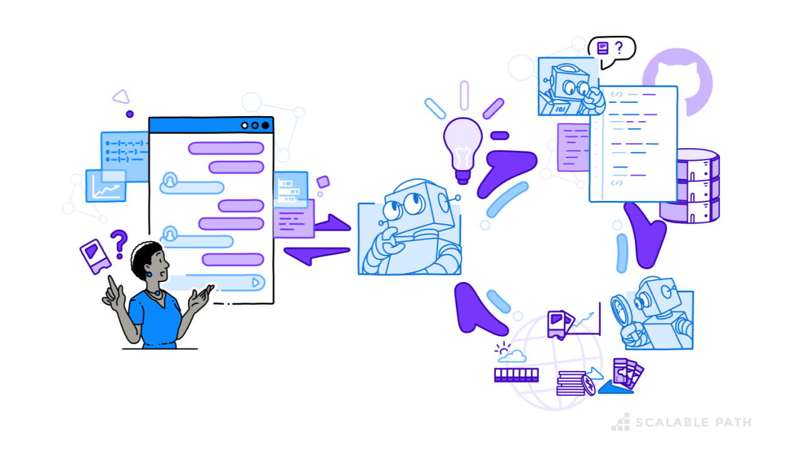

# Module 1: Introduction to AI Agents and No-Code Development

Welcome to **Module 1** ! This module is designed to introduce you to the world of **AI agents**, **workflow automation**, and **no-code development tools**. You'll learn how to build intelligent applications without writing extensive code, leveraging powerful platforms like **n8n** and **v0.dev**.

---

## 🎯 Module Overview

In this module, you will:

- **Master Prompt Engineering** — Learn how to craft effective prompts that produce high-quality AI responses
- **Build Automated Workflows** — Create intelligent workflows in n8n that integrate with AI models
- **Develop Modern UIs** — Use v0.dev to rapidly prototype professional web interfaces
- **Connect Systems with Webhooks** — Integrate different platforms to create end-to-end solutions

By the end of this module, you'll have hands-on experience building three complete projects that demonstrate the power of AI-driven automation and no-code development.

---

## 📚 Labs in This Module

### Lab 1.1: Prompt Engineering with n8n

**[📖 View Lab Documentation](<./Lab-1.1(n8n-PromptEngineering-Lab)/doc.md>)**

**What You'll Learn:**

- Fundamentals of prompt engineering and why it matters
- Building and configuring workflows in n8n
- Different prompt engineering techniques (instruction-based, role-based)
- How to progress from basic to optimized prompts
- Top 10 best practices for effective prompt engineering

**What You'll Build:**

- A complete n8n workflow that demonstrates prompt engineering concepts
- An AI-powered contract analysis agent that processes documents intelligently

---

### Lab 1.2: Build a Product MVP with V0

**[📖 View Lab Documentation](<./Lab-1.2(Build-a-Product-MVP-with-V0)/Readme.md>)**

**What You'll Learn:**

- How to use v0.dev to rapidly prototype user interfaces
- Product thinking and MVP development
- Building AI-powered comparison tools
- Creating modern, responsive web designs without writing code from scratch

**What You'll Build:**

- A company comparison tool that uses AI to analyze and compare two companies side-by-side
- A clean, professional landing page with interactive features
- A settings interface for securely managing API keys

---

### Lab 1.3: Connecting n8n with V0

**[📖 View Lab Documentation](<./Lab-1.3(n8n-with-v0)/Readme.md>)**

**What You'll Learn:**

- Understanding webhooks and how they enable system integration
- Connecting n8n workflows with web interfaces built in v0
- Building end-to-end AI-powered applications
- Processing user uploads through automated workflows

**What You'll Build:**

- An AI-powered document analyzer that extracts key terms from uploaded documents
- Integration between v0 (frontend) and n8n (backend workflow)
- A complete workflow that demonstrates real-time data processing

---

## Learning Outcomes

After completing this module, you will be able to:

✅ **Design effective prompts** that produce high-quality AI responses  
✅ **Build automated workflows** in n8n that integrate with AI models  
✅ **Create professional web interfaces** using v0.dev  
✅ **Integrate multiple systems** using webhooks and APIs  
✅ **Develop complete AI-powered applications** without extensive coding  
✅ **Apply no-code tools** to solve real-world problems

---

## 📖 Additional Resources

- **n8n Documentation:** [https://docs.n8n.io](https://docs.n8n.io)
- **OpenAI Best Practices:** [https://platform.openai.com/docs/guides/prompt-engineering](https://platform.openai.com/docs/guides/prompt-engineering)
- **V0.dev Documentation:** [https://v0.dev/docs](https://v0.dev/docs)
- **n8n Community Forum:** [https://community.n8n.io](https://community.n8n.io)

---

## 🤝 Need Help?

If you encounter any issues or have questions:

1. Review the lab documentation carefully
2. Check the prerequisites section of each lab
3. Refer to the additional resources listed above
4. Reach out Sachin for support

---

**Ready to get started?** Start With your first lab and begin your journey ! 

---

_Happy Building! 🎉_
