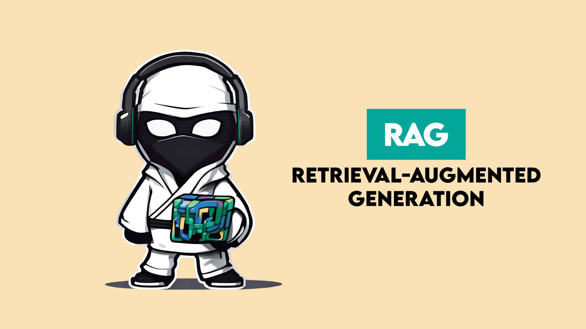
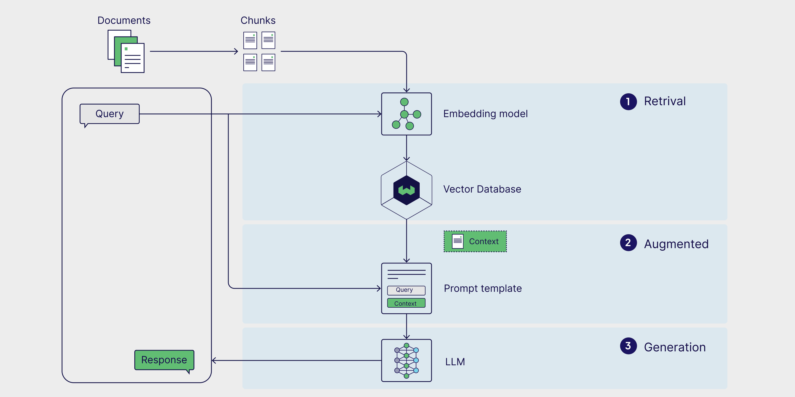
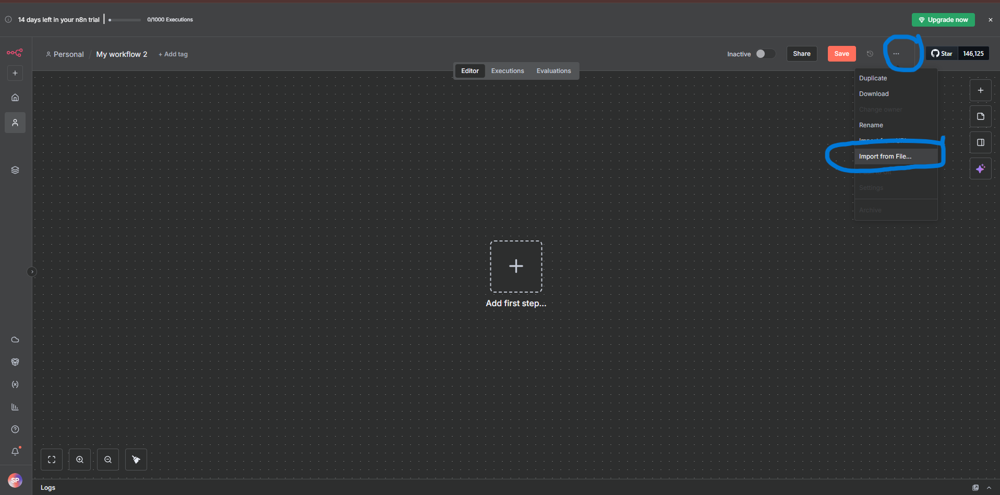
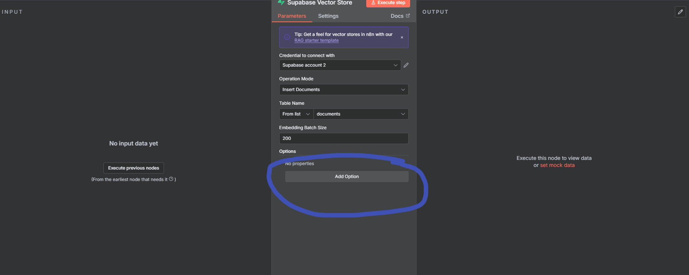
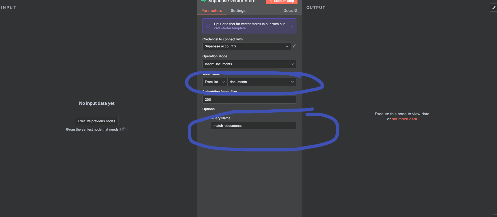
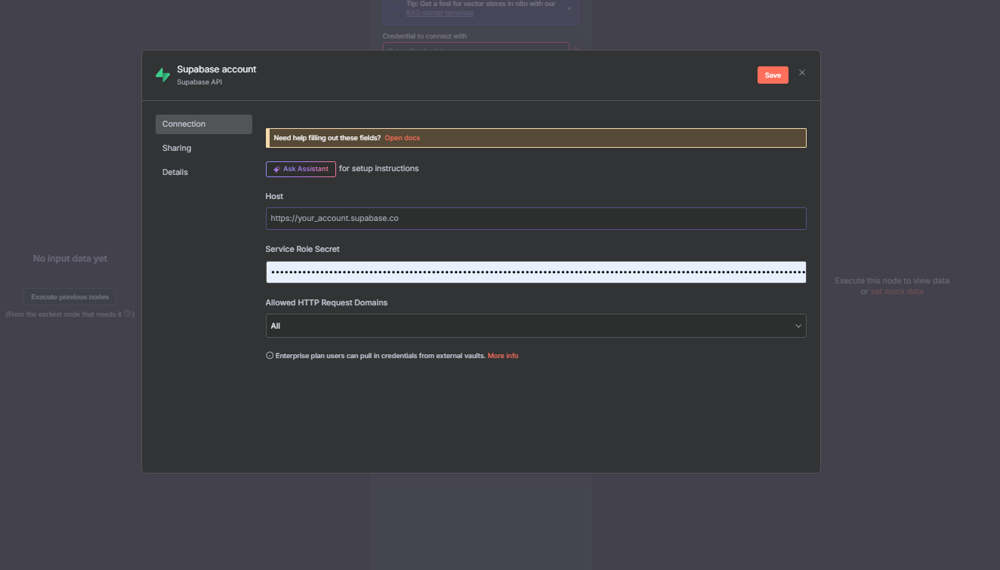
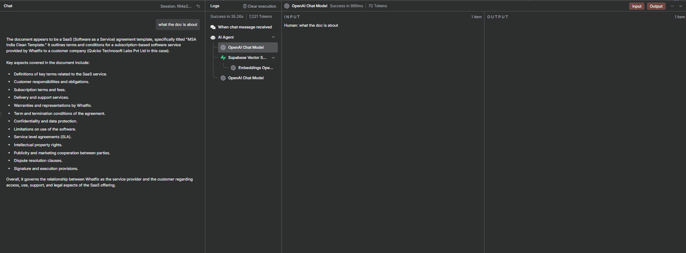

# Building a RAG System with n8n



## Description

In the previous lab, you encountered a limitation where ChatGPT failed to analyze a contract document due to token limit length errors. In this lab, we will build a solution using a RAG (Retrieval-Augmented Generation) workflow that overcomes this limitation.

We will use **Supabase** to store document chunks and implement a retrieval system. Using the same document that failed in Lab 1, you'll now be able to query the document and receive accurate responses without hitting token limits. This approach demonstrates how RAG systems can handle large documents by breaking them into manageable chunks and retrieving only relevant information for each query.

---

## Introduction to RAG (Retrieval-Augmented Generation)

### What is RAG?

RAG (Retrieval-Augmented Generation) is a powerful AI architecture that combines the strengths of information retrieval systems with large language models (LLMs). Instead of relying solely on the knowledge embedded in an LLM during training, RAG systems dynamically retrieve relevant information from external knowledge bases to generate more accurate and contextual responses.

### How Does RAG Work?

The RAG workflow consists of three main stages:

1. **Document Processing & Storage**: Large documents are split into smaller chunks and converted into vector embeddings, which are then stored in a vector database (like Supabase with pgvector).

2. **Retrieval**: When a user submits a query, the system converts it into a vector embedding and searches the database for the most semantically similar document chunks.

3. **Generation**: The retrieved relevant chunks are combined with the user's query and sent to the LLM, which generates a response based on the specific context provided.

### Why Use RAG?

RAG systems offer several key advantages:

- **Overcomes Token Limitations**: Traditional LLMs have context window limits. RAG systems only send relevant information to the model, allowing you to work with documents of any size.

- **Up-to-Date Information**: You can update your knowledge base without retraining the model, ensuring responses are based on the latest information.

- **Improved Accuracy**: By grounding responses in specific retrieved documents, RAG reduces hallucinations and provides more factually accurate answers.

- **Cost-Effective**: Instead of fine-tuning models or processing entire documents repeatedly, RAG efficiently retrieves only what's needed for each query.

- **Source Attribution**: RAG systems can reference specific document chunks, making it easy to verify and cite sources.

- **Domain-Specific Knowledge**: You can create specialized AI assistants for specific domains (legal, medical, technical) by providing relevant document collections.



---

## Prerequisites

Before beginning this lab, ensure you have completed the following:

**Important:** Make sure you have completed **Module 1** and **Lab 1.1 of Module 2** before starting this lab.

- **New to n8n!** Set up your account: **[Click Here](../../Module%200%20-%20Prerequisite/n8n-loginSetup/Doc.md)**
- **Setup Supabase Account:** Configure your Supabase database: **[Click Here](../../Module%200%20-%20Prerequisite/supabase-configuration/Readme.md)**
- **v0 by Vercel Account:** Access to v0 for building the web interface: **[Click Here](https://v0.dev/)**
- **Generate your OpenAI API key:** **[Click Here](https://youtu.be/YyaZ8zaGS-Q?si=bOw8C_TWgMg8S1hU)**
- **Download n8n workflow file:** **[Click Here](https://drive.google.com/file/d/1cMk6ihLPtMh5MNTJoRJvhdJ560mydXWb/view?usp=sharing)**

**Note:** You can download any one file from below. The larger file will take 15-20 minutes for processing.

- **Download Large Contract reference document:** **[Click Here](https://drive.google.com/file/d/1RMzUyryxh88qiXTW6psH6lEfrhQ8H2ZQ/view?usp=sharing)**
- **Download Small Contract reference document:** **[Click Here](https://drive.google.com/file/d/1RMzUyryxh88qiXTW6psH6lEfrhQ8H2ZQ/view?usp=sharing)**

---

## > **💡 Note:** **Build it From Scratch:** **[Click Here](https://maven.com/mahesh-yadav/genaipm/admin/syllabus/modules/e4d850?cohort=7&item=631eb82b63738807)**

## Hands-On: Building Your RAG System

### Step 1: Set Up Your n8n Account

If you haven't already set up your n8n account, follow the **[Prerequisites](#prerequisites)** section above to:

1. **Create** your n8n account (cloud or self-hosted)
2. **Log in** to your n8n dashboard

> Once logged in, you're ready to create your first workflow!

---

### Step 2: Import the Workflow

Now let's import the pre-built workflow into n8n:

1. Click on **"Create Workflow"** button in your n8n dashboard

   

2. Go to the menu (three dots or hamburger icon) and select **"Import from File"**

3. Upload the **JSON workflow file** that you downloaded from the Prerequisites section

   

4. The workflow will be imported and displayed on your canvas

   

> **💡 Note:** Make sure you have configured your OpenAI API key. If you have already completed **Lab 1.1**, you don't need to do it again — n8n will automatically use the credentials you saved from the environment variables.

> **If you haven't configured it yet:** Click on the **OpenAI Chat Model** component and add your API key as shown in the GIF below.


> Your workflow is now ready to be configured!

---

### Understanding the Workflow: Two Main Steps

Before we dive into configuration, let's understand what this workflow does:

**Step 1: Document Upload & Storage (Indexing)**

- Upload your contract document
- The system will automatically split it into smaller chunks
- Each chunk is converted into vector embeddings
- These embeddings are stored in Supabase vector database for later retrieval

**Step 2: Query & Retrieval (Q&A)**

- Submit a query about your document
- The system searches the Supabase vector database for relevant chunks
- Retrieved chunks are sent to the LLM along with your query
- You receive an accurate response based on the document content

Now let's configure each step!


---

### Step 3: Set Up Supabase Vector Storage

Before we can store document embeddings, we need to create a vector storage table in Supabase:

1. **Open your Supabase project** - Log in to your [Supabase account](https://supabase.com) and select your project

2. **Navigate to SQL Editor** - In the left sidebar, click on **"SQL Editor"**

   

3. **Create the vector table** - Copy and paste the SQL query below into the editor:

   ```sql
   -- Enable the pgvector extension to work with embedding vectors
   create extension vector;

   -- Create a table to store your documents
   create table documents (
     id bigserial primary key,
     content text, -- corresponds to Document.pageContent
     metadata jsonb, -- corresponds to Document.metadata
     embedding vector(1536) -- 1536 works for OpenAI embeddings, change if needed
   );

   -- Create a function to search for documents
   create function match_documents (
     query_embedding vector(1536),
     match_count int default null,
     filter jsonb DEFAULT '{}'
   ) returns table (
     id bigint,
     content text,
     metadata jsonb,
     similarity float
   )
   language plpgsql
   as $$
   #variable_conflict use_column
   begin
     return query
     select
       id,
       content,
       metadata,
       1 - (documents.embedding <=> query_embedding) as similarity
     from documents
     where metadata @> filter
     order by documents.embedding <=> query_embedding
     limit match_count;
   end;
   $$;
   ```

4. **Run the query** - Click the **"Run"** button to execute the query

5. **Verify creation** - Once executed successfully, this will create a vector storage table in your Supabase database

> **✅ Success!** Your Supabase database is now ready to store document embeddings.

---

### Step 4: Configure Supabase in Your Workflow

Now let's connect n8n to your Supabase database:

1. **Locate the Supabase component** - In your imported workflow, find the **Supabase Vector Store** node in **Step 1** (Document Upload & Storage section)

2. **Click on the Supabase component** to open its configuration

   

3. **Add your credentials:**

   - **Supabase URL**: Copy your project URL from Supabase dashboard (Settings → API)
   - **Supabase API Key**: Copy your anon/public API key from the same location

4. **Select the table name** - Choose the vector storage table you created in Step 3, then click on the **"Add Option"** button. This will automatically add the query option and match query settings.

   

   

5. **Save the configuration** - Click "Save"

> **💡 Tip:** Use the URL and API key that you saved while going through the prerequisite section and select the table name.



---

### Step 5: Upload Your Contract Document

Now it's time to upload the contract document that failed in Lab 1 and store it in Supabase:

1. **Click the "Execute Workflow" button** - This will activate your workflow and make it ready to receive the document

2. **Upload the contract** - Upload the same contract document that failed in Lab 1.1 due to token limit errors

3. **Wait for processing** - The workflow will:
   - Split your document into smaller chunks
   - Generate vector embeddings for each chunk
   - Store the embeddings in your Supabase vector database

> Your contract document is now chunked and stored as vector embeddings in Supabase, ready for retrieval!


#### Cross-Check Your Data:

To verify that your chunks have been successfully stored:

1. Go back to your **Supabase dashboard**
2. Navigate to **Table Editor** in the left sidebar
3. Select the vector storage table you created
4. You should now see your document chunks stored in the table with their embeddings

> **✅ Verification Complete!** If you can see the chunks in your Supabase table, your document has been successfully processed and stored.

---

### Step 6: Configure Step 2 - Query & Retrieval

Now let's set up the retrieval workflow to query your document:

1. **Locate Step 2 components** - In your workflow, find the **Step 2: Query & Retrieval** section

2. **Configure Supabase Vector Store:**

   - Click on the **Supabase Vector Store** node in Step 2
   - Add your **Supabase URL** (same as Step 1)
   - Add your **Supabase API Key** (same as Step 1)
   - Select the **table name** (same table you created earlier)
   - Click "Save"

3. **Configure OpenAI Chat Model:**

   - Click on the **OpenAI Chat Model** node
   - Ensure your OpenAI API key is configured
   - If you completed Lab 1.1, the credentials should already be saved
   - Click "Save"

4. **Configure OpenAI Embeddings Model:**
   - Click on the **OpenAI Embeddings** node
   - Verify your OpenAI API key is configured
   - This model will convert your queries into vector embeddings for searching
   - Click "Save"

> **💡 Note:** All three components (Supabase, OpenAI Chat, and OpenAI Embeddings) must be configured for the retrieval system to work properly.

---

### Step 7: Test Your RAG System

Now it's time to test your RAG system and see it in action!

1. **Open the Chat Window:**

   - Click on the **"Open Chat"** button in your workflow
   - This will launch the chat interface

   

2. **Start Asking Queries:**

   - Type any question about your contract document
   - Ask the same questions that failed in Lab 1.1 due to token limits
   - Press Enter or click Send

3. **Watch the Magic Happen:**

   - The system will search your Supabase vector database for relevant chunks
   - Retrieved information will be sent to the LLM
   - You'll receive accurate responses based on your document content

   

4. **Try Multiple Queries:**
   - Ask different questions about your contract
   - Test complex queries that require information from multiple sections
   - Compare the results with Lab 1.1 where the document failed to process

> **🎉 Success!** You've successfully built a RAG system that can handle large documents without token limit errors!

---

## Conclusion

Congratulations! You've successfully built a complete RAG (Retrieval-Augmented Generation) system using n8n and Supabase. In this lab, you learned:

- How RAG systems overcome token limitations by chunking documents and retrieving relevant information
- How to set up Supabase with pgvector for storing vector embeddings
- How to configure n8n workflows for both document indexing and retrieval
- How to integrate OpenAI embeddings and chat models for semantic search and response generation

### Key Takeaways

✅ **No More Token Limits** - Your RAG system can now handle documents of any size  
✅ **Accurate Responses** - By retrieving only relevant chunks, you get precise answers  
✅ **Scalable Solution** - You can add more documents to your Supabase database anytime  
✅ **Production Ready** - This workflow can be extended for real-world applications

---

## Need Help?

If you encounter any issues:

- Review the Prerequisites section to ensure all accounts and keys are properly configured
- Check the Supabase table to verify your document chunks were stored correctly
- Ensure all OpenAI API credentials are valid and have sufficient credits
- Connect with the Sachin

---

**Happy Building! 🚀**
