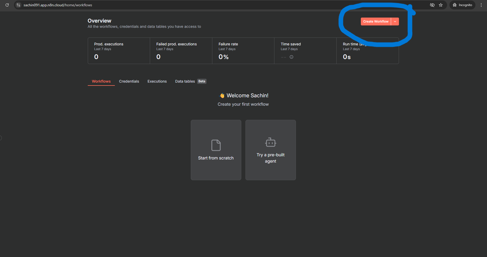

# **Connecting Your RAG System with v0**

In the previous lab (Lab 1.2), you successfully built a RAG system using n8n and Supabase that can handle large documents and answer queries without hitting token limit errors. Your RAG system is working in the backend through n8n workflows, but now it's time to give it a beautiful, user-friendly interface.

In this lab, we will connect your existing RAG system to a modern web frontend built with **v0 by Vercel**. You'll learn how to:

- Create an interactive UI that connects to your n8n RAG workflow
- Build a responsive chat interface for querying your documents
- Deploy your RAG application with a professional frontend

By the end of this lab, you'll have a complete, production-ready RAG application with both a powerful backend (n8n + Supabase) and an intuitive frontend

---

## Prerequisites

**Important:** Before starting this lab, you **MUST** complete **Lab 1.2 (Building a RAG System with n8n)**.

- **n8n Account:** Set up your account: **[Click Here](../../Module%200%20-%20Prerequisite/n8n-loginSetup/Doc.md)**
- **v0 by Vercel Account:** Access to v0 for building the web interface: **[Click Here](https://v0.dev/)**
- **Generate your OpenAI API key:** **[Click Here](https://youtu.be/YyaZ8zaGS-Q?si=bOw8C_TWgMg8S1hU)**
- **n8n workflow file (from Lab 1.2):** **[Click Here](https://drive.google.com/file/d/1R2CMEUZZIfa3mib5ysntbX5IIvPgQOVh/view?usp=sharing)**
- **Reference document (from Lab 1.2):** **[Click Here](https://drive.google.com/file/d/1S8W-C9-8GI4oBVN0T_bH2r9OvChbrQuR/view?usp=sharing)**

---

## Hands-On: Connecting Your RAG System with v0

Let's build an interactive web interface for your RAG system. This will involve creating a frontend with v0, setting up the connection to your n8n workflow, and making it work seamlessly together.

## Hands-On: Building Your RAG System

### Step 1: Set Up Your n8n Account

If you haven't already set up your n8n account, follow the **[Prerequisites](#prerequisites)** section above to:

1. **Create** your n8n account (cloud or self-hosted)
2. **Log in** to your n8n dashboard

> Once logged in, you're ready to create your first workflow!

---

### Step 2: Import the Workflow

Now let's import the pre-built workflow into n8n:

1. Click on **"Create Workflow"** button in your n8n dashboard

   

2. Go to the menu (three dots or hamburger icon) and select **"Import from File"**

3. Upload the **JSON workflow file** that you downloaded from the Prerequisites section

   

4. The workflow will be imported and displayed on your canvas

   

> **💡 Note:** Make sure you have configured your OpenAI API key. If you have already completed **Previous Labs**, you don't need to do it again — n8n will automatically use the credentials you saved from the environment variables.

> **If you haven't configured it yet:** Click on the **OpenAI Chat Model** component and add your API key as shown in the GIF below.


> Your workflow is now ready to be configured! Also ensure your OpenAI API key and Supabase account are configured the same way as in Lab 1.2 (Module 2).

---

### Step 3: Understanding Webhooks for External Connections

In Lab 1.2 and Module 1, you learned about using **File Component** and **Chat Trigger Component** within n8n workflows. These components work great for internal workflows and manual testing.

However, when you want to connect your n8n workflow to external applications (like a web frontend built with v0), you need to use **Webhooks**.

**What is a Webhook?**

A webhook is a way for external applications to trigger your n8n workflow by sending HTTP requests. Think of it as a "door" that your frontend can knock on to activate your RAG system.

**How it Works:**

1. Your v0 frontend sends a query to the webhook URL
2. The webhook triggers your n8n workflow
3. Your workflow processes the query using RAG and returns the answer
4. The frontend receives and displays the response

Let's set this up!

---

### Step 4: Get Your Webhook URLs

In your n8n workflow from Lab 1.2, you already have **two separate workflows**, each with their own webhook:

1. **File Upload Workflow** - For uploading and indexing documents
2. **Chat/Query Workflow** - For asking questions and retrieving answers

You need to copy **both webhook URLs** - one for file upload and one for chat queries.

#### Getting the Webhook URL for File Upload:

1. In your n8n dashboard, open the **File Upload workflow** (Step 1)
2. Look for the **Webhook node** in your workflow
3. Click on the **Webhook node**
4. The webhook URL will be displayed at the bottom of the node configuration
5. **Copy this URL** - You'll need it for the v0 frontend

#### Getting the Webhook URL for Chat/Query:

1. Open the **Chat/Query workflow** (Step 2) in your n8n dashboard
2. Look for the **Webhook node** in this workflow
3. Click on the **Webhook node**
4. The webhook URL will be displayed at the bottom
5. **Copy this URL** - You'll need this for sending queries from v0

> **💡 Important:** Save both URLs in a text editor or document - you'll need them when building your v0 frontend!


---

### Step 5: Build Your Frontend with v0

Now let's create a beautiful UI for your RAG system using v0!

1. **Go to v0.dev** - Open your browser and navigate to **[v0.dev](https://v0.dev/)**
2. **Log in** - Sign in with your GitHub account (or create one if needed)
3. **Open the Chat/Prompt interface** - Click on the chat input at the bottom of the screen

#### The Prompt to Use:

Copy and paste the following prompt into v0. **Make sure to replace the `<Your Webhook URL>` placeholders with your actual webhook URLs** that you copied in Step 4!

```text
Create an aesthetic React landing page divided into two main sections using Tailwind CSS for styling.

Page Layout
The page should have two tabs at the top:

File Processor
Chat Assistant

Step 1 File Processor Tab
Allow the user to upload a file (use an upload input field).
Include a "Process" button.
When the user clicks the "Process" button:

Trigger a webhook POST request to: <Your Webhook URL>
Send the uploaded file data in the request body (use FormData).
Log the webhook response in the console for debugging.

Step 2 Chat Assistant Tab
Create a simple chat interface where:

Users can type a message in a text input.
A Send button triggers a webhook POST request to: <Your Webhook URL>
The message text should be sent in JSON format.
Display the user's message and the response in the chat window.
Log both sent and received data in the console for debugging.

Styling & Aesthetic Guidelines
Use Tailwind CSS.
Font: Use Poppins or Inter (clean, modern).
Theme: Soft gradient background (from-indigo-500 via-purple-500 to-pink-500).
Card/Container: Use glassmorphism (semi-transparent white with blur).
Buttons: Rounded corners, hover animations (slight scale-up & color shift).
Tabs: Animated underline or color transition on active state.
Chat messages: Smooth fade-in animation (use Framer Motion or CSS transitions).
Responsive design: Center content vertically and horizontally; adapt for mobile view.
```

> **⚠️ CRITICAL:** Before pasting this prompt, replace **both** instances of `<Your Webhook URL>` with your actual webhook URLs:
>
> - **First `<Your Webhook URL>`** (in Step 1) = Your **File Upload** webhook URL
> - **Second `<Your Webhook URL>`** (in Step 2) = Your **Chat** webhook URL

4. **Paste the prompt** - Copy the prompt (with your webhook URLs inserted) and paste it into v0
5. **Wait for v0 to generate** - v0 will generate your React code with the UI components
6. **Review the code** - v0 will show you the generated code that you can copy and use


---

### Step 6: Test Your Complete RAG Application

Now let's test your complete system by uploading a document and querying it!

#### Part 1: Upload PDF and Create Chunks

Your frontend is ready! Now let's upload a document and see it get processed into chunks stored in your Supabase vector database.

1. **Go to your n8n dashboard** and open your **File Upload workflow**
2. **Execute the workflow** - Click on the "Execute Workflow" button (or activate it if it's not already running)
3. **Open your v0 frontend** - Open the React application you created with v0
4. **Switch to the File Processor tab** in your frontend
5. **Upload your contract PDF** - Click on the upload button and select your contract document
6. **Click "Process"** - This will send your file to the n8n webhook
7. **Check n8n** - Go back to your n8n dashboard. You should see the workflow executing and processing your document into chunks
8. **Verify in Supabase** - Check your Supabase database. Navigate to the Table Editor and you should see your document chunks stored in the vector database


> **✅ Success!** Your document has been chunked and stored in your Supabase vector database!

---

#### Part 2: Query Your Document

Now let's test the chat functionality to query your document!

1. **Go to your n8n dashboard** and open your **Chat/Query workflow** (Webhook 1)
2. **Execute this workflow** - Click on the "Execute Workflow" button to activate it
3. **Open your v0 frontend**
4. **Switch to the Chat Assistant tab**
5. **Type your query** - Ask any question about your document (e.g., "What is the name of the customer?")
6. **Click "Send"** - This will send your query to the n8n webhook
7. **Get your response** - The response will appear in the chat window, generated from your document using RAG!


> ## You now have a fully functional RAG application with a frontend!

---

## Troubleshooting (Quick)

- v0 basic errors: Ask v0 to fix/regenerate with the same prompt; it usually patches code.
- Verify both webhook URLs are correct and publicly reachable.
