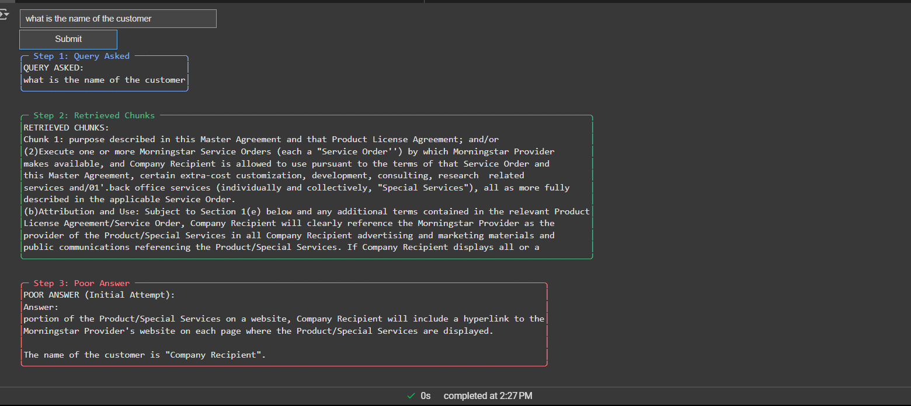

# **Understanding Agentic RAG** 

You can open this Jupyter notebook directly in Google Colab by clicking the link below:

[](https://colab.research.google.com/github/sachin0034/MLAI-community-labs/blob/main/Class-Labs/Module-2%28Understanding-Agentic-RAG%29/Lab-2.4%28Agentic-Rag-Embedding-Document%29/AgenticRAG.ipynb)

## What is Agentic RAG?
To fully grasp Agentic RAG, it's essential to first understand its two fundamental building blocks: AI agents and Retrieval-Augmented Generation (RAG).

An AI agent is an autonomous entity capable of perceiving its environment, making decisions, and taking action to achieve its goals. Agentic AI takes this autonomy further by incorporating reasoning and planning, enabling agents to be proactive instead of merely reactive. This allows AI to determine its next action independently instead of waiting for instructions.

On the other hand, RAG (Retrieval-Augmented Generation) bridges the gap between static AI models and the constantly changing world. Instead of relying solely on pre-trained knowledge, RAG systems dynamically retrieve up-to-date information from sources like APIs or databases, enabling them to generate contextually accurate and relevant responses. I find RAG useful in fields like healthcare, education, and business, where real-time data is critical.


---


### **Let's Started!** 

In this lab, we are building an **agentic application** that enhances information retrieval and response generation by combining vector databases with a knowledge graph. The workflow proceeds as follows:  

1. **Document Upload & Chunking**  
   - The user uploads a document.  
   - The document is divided into smaller **chunks** to enable efficient retrieval.  
   - These chunks are stored in a **ChromaDB vector database** for semantic search.  

2. **Query Handling**  
   - When the user submits a query, the system searches the vector database to identify the most **relevant chunks**.  

3. **Relevance Scoring & Knowledge Graph Integration**  
   - Retrieved chunks are evaluated based on their similarity score.  
   - If the relevance score of the chunks falls **below 0.5**, the system leverages a **knowledge graph** (currently implemented as a dummy version) to **refine or modify the user’s query**.  
   - This modification helps in retrieving **more enriched and contextually accurate chunks**.  

4. **LLM Response Generation**  
   - Once the refined and relevant chunks are identified, the **LLM processes them** to generate a coherent and contextually appropriate response.  

5. **Output Delivery**  
   - The final response is then presented back to the user.  


This workflow goes beyond a traditional RAG pipeline by introducing **decision-making and adaptive behavior**.  
Instead of passively retrieving chunks and passing them to the LLM, the system:  

- **Evaluates relevance dynamically** (checks similarity score).  
- **Decides when to use additional reasoning tools** (the knowledge graph) to refine the user query.  
- **Adapts its strategy** to improve retrieval and generate more accurate answers.  

These characteristics—**autonomy, adaptability, and tool usage**—are what make this an **agentic application**.  


--- 


.png)

---


### **Code Breakdown & Explanation**

#### **Step 1: Installing Required Libraries**
```python

# Step 1: Install required libraries 
! pip install chromadb langchain pypdf2 sentence-transformers pyboxen
! pip install -U langchain-community
```
Before we start, we install the necessary Python libraries:

---


#### **Step 2: Setting Up the Lab 🧪**

#### Import necessary modules
Before we start, we need to install the necessary tools. These packages are like the ingredients for our recipe – without them, the lab won't work!

#### Explanation of Imported Modules  

##### UI Components  
- **`ipywidgets`** → Provides interactive widgets like buttons, text boxes, and dropdowns.  
- **`IPython.display`** → Used to display widgets, clear output, and update UI dynamically.  

##### Data Processing & Utility  
- **`random`** → Generates random numbers, useful for testing and sampling.  
- **`typing (List, Dict)`** → Provides type hints for better code readability and debugging.  
- **`io.BytesIO`** → Handles in-memory file operations without saving to disk.  
- **`os`** → Interacts with the operating system (e.g., file paths, environment variables).  

##### LangChain Components  
- **`langchain.vectorstores.Chroma`** → Stores and retrieves document embeddings efficiently.  
- **`langchain.embeddings.HuggingFaceEmbeddings`** → Uses Hugging Face models for text embeddings.  
- **`langchain.text_splitter.RecursiveCharacterTextSplitter`** → Splits text into manageable chunks for processing.  
- **`langchain.llms.OpenAI`** → Connects to OpenAI’s LLM for generating responses.  
- **`langchain.agents.initialize_agent`** → Creates an AI agent with tools for querying documents.  
- **`langchain.tools.Tool`** → Defines custom tools for AI agents.  
- **`langchain.tools.StructuredTool`** → Provides structured tools for better AI responses.  
- **`langchain.prompts.ChatPromptTemplate`** → Creates structured prompts for AI interactions.  
- **`langchain.schema.runnable.RunnablePassthrough`** → Allows passing data through AI models without modification.  

##### PDF Handling  
- **`PyPDF2.PdfReader`** → Reads and extracts text from PDF documents.  

##### Database & Storage  
- **`chromadb`** → A fast and scalable vector database for storing and retrieving embeddings.  

##### UI Styling  
- **`pyboxen.boxen`** → Formats text in visually appealing boxed outputs.  

##### Data Validation  
- **`pydantic.BaseModel, Field`** → Ensures structured and validated data inputs.  


---

#### **Step 3: Initializing Components**
```python
embeddings = HuggingFaceEmbeddings(model_name="all-MiniLM-L6-v2")
chroma_client = chromadb.PersistentClient(path="./chroma_db")
os.environ["OPENAI_API_KEY"] = "YOUR_API_KEY"
llm = OpenAI(temperature=0)
```
- **Embeddings:** We use `HuggingFaceEmbeddings` to convert text into numerical format.
- **ChromaDB Client:** Creates a database at `./chroma_db` to store text embeddings.
- **OpenAI API:** We set the API key to access OpenAI’s language model.
[Generate Your OpenAI API Key](https://github.com/initmahesh/MLAI-community-labs/tree/main/Class-Labs/Lab-0(Pre-requisites))

- **LLM Initialization:** We set the temperature to `0` for more deterministic responses.

---

#### **Step 4: Upload & Process a PDF Document**  

This step allows users to upload a PDF file, extract its text, split it into smaller chunks, and store it in a vector database for AI processing.  

#### How It Works  
1. **File Upload Widget**  
   - A button appears that lets you upload a **PDF file**.  
   - The system only accepts **one file at a time**.  

2. **Processing the File**  
   - When you click the **"Process File"** button:  
     - The system checks if a file is uploaded.  
     - If no file is found, it shows a message: **"No file uploaded!"**  
     - If a file is uploaded, the system reads the PDF and extracts its text.  
     - The text is split into smaller **chunks** (for efficient processing).  
     - Each chunk is assigned a **random confidence score**.  
     - The data is stored in **ChromaDB**, a special AI-ready database.  

3. **Success Message**  
   - If everything works, you’ll see a **green notification box**:  
     ```
     File processed with confidence scores!
     ```  
   - This means your file was successfully processed and stored. 

```python
# Step 4: File upload widget with value storage
import random
# Step 4: File upload widget with value storage
import random
uploader = widgets.FileUpload(accept='.pdf', multiple=False)
process_btn = widgets.Button(description="Process File")
process_output = widgets.Output()

process_btn = widgets.Button(description="Process File")
process_output = widgets.Output()

def process_file(b):
    with process_output:
        clear_output()
        if not uploader.value:
            print("No file uploaded!")
            return

        for filename, file_info in uploader.value.items():
            pdf = PdfReader(BytesIO(file_info['content']))
            break


        for filename, file_info in uploader.value.items():
            pdf = PdfReader(BytesIO(file_info['content']))
            break

        text = "\n".join([page.extract_text() for page in pdf.pages])
        text_splitter = RecursiveCharacterTextSplitter(
            chunk_size=1000, chunk_overlap=100
        )
        text_splitter = RecursiveCharacterTextSplitter(
            chunk_size=1000, chunk_overlap=100
        )
        chunks = text_splitter.split_text(text)
        metadatas = [{"value": random.uniform(0, 1)} for _ in chunks]

        Chroma.from_texts(
            chunks, embeddings,
            client=chroma_client,
            collection_name="doc_collection",
            metadatas=metadatas
        )
        print(boxen("File processed with confidence scores!", title="Success", color="green"))

display(uploader, process_btn, process_output)
process_btn.on_click(process_file)
``` 

#### Steps to Use  
✅ **Step 1** → Click on **"Upload Document"** and select a PDF file.  
✅ **Step 2** → Click **"Process File"** to analyze and store it.  
✅ **Step 3** → Wait for the **success message** confirming the file is processed.  

**✅ NOTE** : [📄Reference Document You Can Download From CLick Me](https://drive.google.com/file/d/1WWa_TgI49HIAGFuXTNvMLtkFBU6ZduHq/view?usp=sharing)

This setup makes it easy to upload and process PDFs with AI-powered storage. 🚀  
  

---
#### Step 5: Enhanced Query Processing with an Agent  

This step enhances **query processing** by implementing an **AI agent** that decides how to answer user queries based on **confidence scores**. It retrieves relevant document chunks and determines whether the response should be **directly generated** or **refined using a knowledge graph** for better accuracy.  

#### Overview of the Query Processing Flow  

##### 1️⃣ **User Query Retrieval**  
- The user submits a **query**.
- The system **retrieves relevant document chunks** using ChromaDB.
- Each retrieved chunk has an **associated confidence score**.

##### 2️⃣ **Confidence Score Evaluation**  
- If the confidence score is **high (≥ 0.5)** → Use a **direct answer** approach.
- If the confidence score is **low (< 0.3)** → Use a **knowledge-enhanced answer**.

##### 3️⃣ **Knowledge Graph Enhancement** (for low-confidence cases)  
- Some terms in the query are mapped to **more meaningful alternatives** using a **knowledge graph**.
- The query is **rewritten** with these enhancements.
- A new document search is performed using the improved query.

##### 4️⃣ **Generating the Final Answer**  
- The system **chooses the best response strategy** using an autonomous agent.
- The **final answer is generated** based on the refined context and confidence evaluation.


#### **Understanding Confidence Scores**  

A **confidence score** is a measure of **how relevant** a retrieved document chunk is to the user's query.  
- **Higher confidence (≥ 0.5)** → The retrieved text is **relevant and reliable**.  
- **Lower confidence (< 0.3)** → The retrieved text **may not be relevant or sufficient**.  

### **How is the Confidence Score Used?**  
- If the retrieved document chunk has a **high confidence score**, the system can **directly answer the query**.  
- If the retrieved document chunk has a **low confidence score**, the AI **enhances the query** using a **knowledge graph** and **retrieves better chunks**.

---

#### **Role of the AI Agent**  

The **AI Agent** acts as a **decision-maker** that chooses the **best answering approach** based on **confidence scores**.  

#### **How it Works**
1. **User submits a query**.
2. **Document chunks are retrieved** from the database.
3. **Each chunk has an associated confidence score**.
4. The AI agent **analyzes the confidence scores** and chooses:
   - ✅ **Direct Answer** → If confidence is **high (≥ 0.5)**.
   - 🔄 **Enhanced Answer** → If confidence is **low (< 0.3)**, it **rewrites the query** and **retrieves better chunks**.
5. The chosen **answering tool is executed**, and the **final response** is provided.  


---
```python
# Step 5: Enhanced query processing with autonomous agent
class QueryInput(BaseModel):
    query: str = Field(description="User's original question")
    chunks: List[Dict] = Field(description="Retrieved document chunks with confidence scores")

def retrieve_chunks(query: str) -> List[Dict]:
    collection = chroma_client.get_collection("doc_collection")
    results = collection.query(
        query_texts=[query],
        n_results=1,
        include=['documents', 'metadatas']
    )

    # Ensure metadata is returned and handle cases where it's missing
    documents = results['documents'][0]
    metadatas = results.get('metadatas', [[{}] * len(documents)])[0]  # Default to empty dicts if metadata is missing

    # Simulate low-confidence chunks for testing
    simulated_chunks = [
        {"text": doc, "value": random.uniform(0.2, 0.4)}  # Simulate low confidence scores (0.2 to 0.4)
        for doc, meta in zip(documents, metadatas)
    ]

    return simulated_chunks

def knowledge_graph(query: str) -> str:
    # Enhanced knowledge graph mappings
    kg_mappings = {
        "customer": "Company Name Referenced in Master Agreement Only",
        "Master Agreement": "Contract",
        "Service Order": "Service Agreement"
    }
    
    # Replace terms in the query using the knowledge graph mappings
    enhanced_query = query
    for term, replacement in kg_mappings.items():
        enhanced_query = enhanced_query.replace(term, replacement)

    
    return enhanced_query

def base_answer(input: QueryInput) -> str:
    context = "\n\n".join([chunk["text"] for chunk in input.chunks])
    prompt = f"Answer: {input.query}\nContext:\n{context}"
    answer = llm(prompt)
    values = [f"{chunk['value']:.2f}" for chunk in input.chunks]
    return f"Answer: {answer}\nConfidence Scores: {values}"

def enhanced_answer(input: QueryInput) -> str:
    enhanced_query = knowledge_graph(input.query)
    enhanced_chunks = retrieve_chunks(enhanced_query)
    context = "\n\n".join([chunk["text"] for chunk in enhanced_chunks])
    prompt = f"Answer: {enhanced_query}\nContext:\n{context}"
    answer = llm(prompt)
    values = [f"{chunk['value']:.2f}" for chunk in enhanced_chunks]
    return f"Optimized Answer: {answer}\nEnhanced Confidence: {values}"


# Define Tools 
tools = [
    StructuredTool.from_function(
        name="DirectAnswer",
        description="Use this when the retrieved chunks have high confidence scores (>= 0.5) and sufficient context to directly answer the query.",
        func=base_answer
    ),
    StructuredTool.from_function(
        name="EnhancedAnswer",
        description="Use this when the retrieved chunks have low confidence scores (< 0.3) or insufficient context, and the query needs to be enhanced using a knowledge graph.",
        func=enhanced_answer
    )
]

# Initialize the agent with a custom prompt
agent_prompt = """You are an intelligent assistant that decides how to answer user queries based on the context and confidence scores of retrieved document chunks.

Here are the tools available to you:
1. DirectAnswer: Use this when the retrieved chunks have high confidence scores (>= 0.5) and sufficient context to directly answer the query.
2. EnhancedAnswer: Use this when the retrieved chunks have low confidence scores (< 0.3) or insufficient context, and the query needs to be enhanced using a knowledge graph.

Your task is to analyze the query, retrieved chunks, and their confidence scores, and decide which tool to use. Provide a reason for your decision.

Query: {query}
Retrieved Chunks: {chunks}

Decision: Which tool should be used? Respond in the following format:
Tool: [DirectAnswer or EnhancedAnswer]
Reason: [Your reasoning]"""

agent = initialize_agent(
    tools=tools,
    llm=llm,
    agent="structured-chat-zero-shot-react-description",
    verbose=True
)
```
---
#### **Final Outcome**
- If the retrieved document is **relevant**, the AI answers immediately.  
- If the information is **uncertain**, the AI **optimizes** the search before answering.  
- The AI agent makes **independent decisions** for the best response. 🚀  

This **smart decision-making** process makes the AI **more intelligent and reliable** for answering document-based queries. 

---

#### **Step 6: Query Interface with Autonomous Decision-Making**  

This step introduces an **interactive query interface** that allows users to input their questions.  
The AI agent **analyzes** the query, **retrieves relevant document chunks**, and **decides how to answer**  
based on confidence scores. The decision-making is fully **autonomous**, ensuring **optimized responses**.


#### **How the Query Interface Works**  

##### **User Input & Query Submission**  
- You have to enters their query in the input field (`query_input`).
- Clicking the "Submit" button (`submit_btn`) triggers the `handle_query` function.

### Step-by-Step Query Processing Flow
**1️⃣ Step 1: Query Asked**
- The user inputs a query.
- The query is displayed in a notification box for reference.

**2️⃣ Step 2: Retrieve Relevant Chunks**
- The query is searched in the document database (ChromaDB).
- The most relevant text chunks are retrieved, along with their confidence scores.
- Retrieved chunks are displayed in a green notification box.

**3️⃣ Step 3: Generate an Initial (Poor) Answer**
- The system tries to generate an answer from the retrieved chunks.
- This is an unoptimized response that might be incorrect due to low confidence scores.
- The poor answer is displayed in a red notification box.

**4️⃣ Step 4: AI Agent Decision**
- The AI agent analyzes the retrieved chunks and confidence scores.
- It decides whether to:
  - Use the DirectAnswer tool (if confidence scores are high).
  - Use the EnhancedAnswer tool (if confidence scores are low).
- The agent's decision is displayed in a magenta notification box.

**5️⃣ Step 5: Generate the Final Answer**

✅ If the agent chooses "DirectAnswer"
- The initial answer is used without modifications.

✅ If the agent chooses "EnhancedAnswer"
- The query is refined by agnet using a Knowledge Graph.
- A new set of relevant document chunks is retrieved.
- A more optimized answer is generated.

---
```python
# Step 6: Query interface with autonomous decision-making
# Step 6: Query interface with autonomous decision-making
query_input = widgets.Text(placeholder="Enter your query")
submit_btn = widgets.Button(description="Submit")
query_output = widgets.Output()

def handle_query(b):
    with query_output:
        clear_output()
        query = query_input.value

        # Step 1: Query Asked
        print(boxen(f"QUERY ASKED:\n{query}", title="Step 1: Query Asked", color="blue"))

        # Step 2: Retrieve Chunks
        chunks = retrieve_chunks(query)
        print(boxen(
            f"RETRIEVED CHUNKS:\n" +
            "\n".join([f"Chunk {i+1}: {chunk['text']}\nConfidence: {chunk['value']:.2f}"
                       for i, chunk in enumerate(chunks)]),
            title="Step 2: Retrieved Chunks", color="green"
        ))

        # Step 3: Generate and Display Poor Answer
        poor_answer = base_answer(QueryInput(query=query, chunks=chunks))
        print(boxen(
            f"POOR ANSWER (Initial Attempt):\n{poor_answer}",
            title="Step 3: Poor Answer", color="red"
        ))

        # Step 4: Let the Agent Decide Which Tool to Use
        decision_output = llm(agent_prompt.format(query=query, chunks=chunks))
        decision = decision_output.split("Tool: ")[1].split("\n")[0].strip()  # Extract tool
        reason = decision_output.split("Reason: ")[1].strip()  # Extract reason
        print(boxen(
            f"AGENT DECISION:\nTool: {decision}\nReason: {reason}",
            title="Step 4: Agent Decision", color="magenta"
        ))

        # Step 5: Execute the Chosen Tool
        if "DirectAnswer" in decision:
            response = base_answer(QueryInput(query=query, chunks=chunks))
            print(boxen(
                f"DIRECT ANSWER:\n{response}",
                title="Step 5: Direct Answer", color="yellow"
            ))
        elif "EnhancedAnswer" in decision:
            print(boxen(
                "USING KNOWLEDGE GRAPH TO ENHANCE QUERY...",
                title="Step 5: Knowledge Graph Enhancement", color="cyan"
            ))
            enhanced_query = knowledge_graph(query)
            print(boxen(
                f"ENHANCED QUERY:\n{enhanced_query}",
                title="Step 5: Enhanced Query", color="cyan"
            ))
            enhanced_chunks = retrieve_chunks(enhanced_query)
            response = enhanced_answer(QueryInput(query=enhanced_query, chunks=enhanced_chunks))
            print(boxen(
                f"FINAL OPTIMIZED ANSWER:\n{response}",
                title="Step 5: Final Optimized Answer", color="green"
            ))
        else:
            print(boxen(
                "Unable to determine the appropriate tool. Using default answer.",
                title="Step 5: Default Answer", color="red"
            ))


display(query_input, submit_btn, query_output)
submit_btn.on_click(handle_query)
```

---

## How to Use the Query Interface?
1️⃣ Enter your question in the input box.

```text
what is the name of the customer ?
```

2️⃣ Click "Submit" to process the query.

3️⃣ The system will retrieve relevant document chunks and evaluate confidence scores.

4️⃣ The AI agent decides whether to give a direct answer or enhance the query using a Knowledge Graph.

5️⃣ The final answer is displayed, either as a Direct Answer or an Optimized Answer.
## Output



© **All rights reserved Mahesh Yadav Institute**. No part of this course can be reproduced, distributed, or transmitted in any form without permission.
