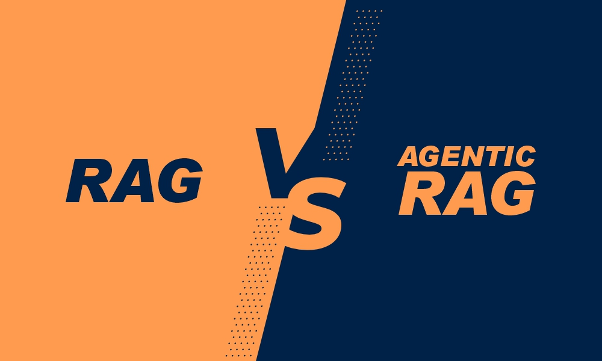
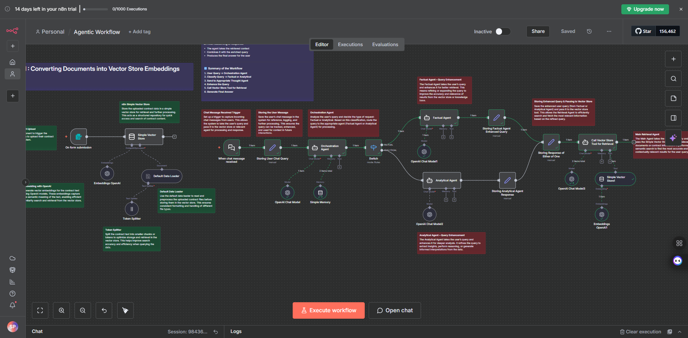
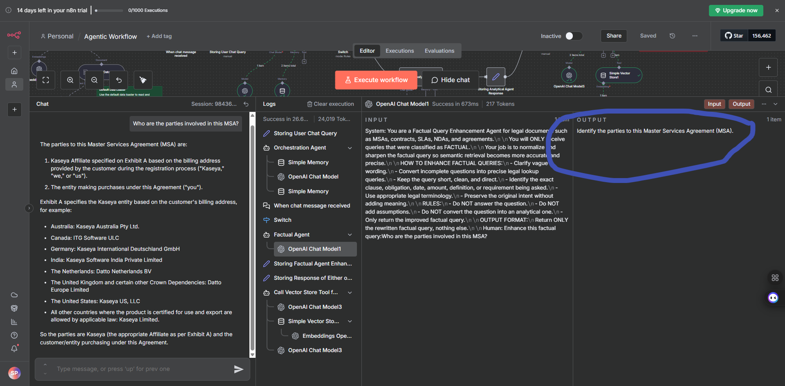
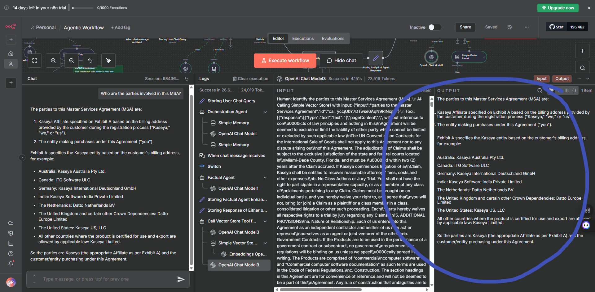

# Building an Agentic RAG Workflow in n8n

## Table of Contents

- [Overview](#overview)
  - [What We're Building](#what-were-building)
- [What is Agentic RAG?](#what-is-agentic-rag)
  - [Traditional RAG vs. Agentic RAG](#traditional-rag-vs-agentic-rag)
  - [Key Components of Agentic RAG](#key-components-of-agentic-rag)
  - [Benefits of Agentic RAG](#benefits-of-agentic-rag)
- [Prerequisites](#prerequisites)
- [Hands-On](#hands-on)
  - [Step 1: Set Up Your n8n Account](#step-1-set-up-your-n8n-account)
  - [Step 2: Import the Workflow](#step-2-import-the-workflow)
- [Part 1: Upload Document and Store in Vector Store](#part-1-upload-document-and-store-in-vector-store)
  - [Step 1: Test the Workflow - Upload the Contract](#step-1-test-the-workflow---upload-the-contract)
- [Part 2: Agentic Workflow (Query Classification → Enhancement → Retrieval)](#part-2-agentic-workflow-query-classification--enhancement--retrieval)
  - [Understanding the Workflow](#understanding-the-workflow)

---

## Overview

In this lab, we will build an **Agentic RAG (Retrieval-Augmented Generation) workflow** in n8n that intelligently processes user queries through a multi-agent system. Unlike traditional RAG systems that follow a linear path, this agentic approach uses specialized AI agents that collaborate to provide more accurate and contextually relevant responses.

### What We're Building

This workflow implements a sophisticated query processing system that:

1. **Classifies user queries** to determine the best processing approach
2. **Enhances queries** to improve retrieval accuracy
3. **Retrieves relevant information** from a vector database
4. **Generates intelligent responses** by combining reasoning with retrieved context

The system uses an **Orchestration Agent** that acts as a decision-maker, routing queries to specialized **Thought Agents** based on query type (Factual or Analytical). Each agent enhances the query before retrieval and synthesizes the final answer using both the enhanced query and retrieved context.

### What You'll Learn

In this lab, we will learn about **Agentic RAG Architecture** and how multi-agent systems enhance traditional RAG workflows by introducing intelligent routing and decision-making capabilities. You'll discover how to **classify user queries** (Factual vs. Analytical) to determine the most appropriate processing strategy, and master **query enhancement techniques** for improving query quality before retrieval, including context clarification, query expansion, and reformulation.

We'll explore **agent orchestration** by building an orchestration layer that routes queries to specialized agents based on their type and complexity. You'll learn to implement **vector store integration** for document storage and retrieval using Simple Vector Store in n8n workflows, and understand how different specialized agents (Factual Agent, Analytical Agent) collaborate to process queries and generate responses.

Finally, you'll master **context-aware response generation** by combining enhanced queries with retrieved context to produce accurate, contextually relevant answers. By the end of this lab, you'll have built a production-ready Agentic RAG system that can intelligently handle different types of queries and provide more accurate responses than traditional RAG implementations.

---

## What is Agentic RAG?

**Agentic RAG (Retrieval-Augmented Generation)** is an advanced approach to building intelligent question-answering systems that combines the power of retrieval-based search with AI agents that can reason, make decisions, and collaborate.

### Traditional RAG vs. Agentic RAG

**Traditional RAG** follows a simple, linear pipeline:
1. User query → Embedding
2. Vector search → Retrieve relevant documents
3. Context + Query → Generate response

While effective, this approach treats all queries the same way and doesn't adapt to different types of questions or reasoning needs.

**Agentic RAG** introduces intelligent agents that:
- **Classify and route queries** based on their complexity and type
- **Enhance queries** before retrieval to improve search accuracy
- **Reason about context** to provide more nuanced answers
- **Collaborate** through specialized agents for different tasks

### Key Components of Agentic RAG

1. **Orchestration Agent**: Acts as the decision-maker, analyzing incoming queries and determining the best processing strategy
2. **Specialized Thought Agents**: Domain-specific agents (e.g., Factual Agent, Analytical Agent) that handle different types of queries
3. **Query Enhancement**: Agents improve queries by adding context, clarifying intent, and reformulating for better retrieval
4. **Intelligent Retrieval**: Enhanced queries lead to more accurate document retrieval from the vector database
5. **Contextual Reasoning**: Agents combine retrieved information with reasoning to generate comprehensive answers

### Benefits of Agentic RAG

- **Better Accuracy**: Query enhancement and intelligent routing lead to more relevant document retrieval
- **Adaptive Processing**: Different query types receive specialized handling
- **Improved Context Understanding**: Agents reason about retrieved information rather than just concatenating it
- **Scalability**: New agents can be added for different domains or query types
- **Transparency**: The multi-step process makes it easier to understand how answers are generated

---

## Prerequisites

Before beginning this lab, ensure you have completed the following:

**Important:** Make sure you have completed the **RAG lab** before starting this Agentic RAG lab.

- **New to n8n!** Set up your account: **[Click Here](../../Module%200%20-%20Prerequisite/n8n-loginSetup/Doc.md)**
- **Generate your OpenAI API key:** **[Click Here](https://youtu.be/YyaZ8zaGS-Q?si=bOw8C_TWgMg8S1hU)**
- **Download n8n workflow file:** **[Click Here](https://drive.google.com/file/d/16O5RG07aTXwsJ8IvuF6CJO9uQd5c6zfT/view?usp=sharing)**
- **Download Contract reference document:** **[Click Here](https://drive.google.com/file/d/1MRevboHRREC6aZMmMCI4r5WweT_ys-q8/view?usp=sharing)**

---

## Hands-On

### Step 1: Set Up Your n8n Account

If you haven't already set up your n8n account, follow the **[Prerequisites](#prerequisites)** section above to:

1. **Create** your n8n account (cloud or self-hosted)
2. **Log in** to your n8n dashboard

> Once logged in, you're ready to create your first workflow!

---

### Step 2: Import the Workflow

Now let's import the pre-built workflow into n8n:

1. Click on **"Create Workflow"** button in your n8n dashboard

   

2. Go to the menu (three dots or hamburger icon) and select **"Import from File"**

3. Upload the **JSON workflow file** that you downloaded from the Prerequisites section

   

4. The workflow will be imported and displayed on your canvas

   

> **💡 Note:** Make sure you have configured your OpenAI API key. If you have already completed, you don't need to do it again — n8n will automatically use the credentials you saved from the environment variables.

---

## Part 1: Upload Document and Store in Vector Store

In this part, we will upload the reference document and store it in a vector database for retrieval.

---

### Step 1: Test the Workflow - Upload the Contract

Now let's test the workflow by uploading the contract document:

1. Click on **"Execute Workflow"** button in the top right corner of your n8n workflow canvas

2. Upload the **Contract reference document** that you downloaded from the Prerequisites section

3. The workflow will process the document and store it in the vector database

> **💡 Note:** Make sure you have the contract document ready. This is the same document you downloaded from the Prerequisites section earlier.

---

## Part 2: Agentic Workflow (Query Classification → Enhancement → Retrieval)

This part covers the agentic RAG workflow that processes user queries through intelligent agents.

Go to the chat query and ask a question to see the magic happen!

### Understanding the Workflow

This Agentic RAG workflow processes user queries through a sophisticated multi-step pipeline. Let's break down how it works:

#### 1. User Submits a Query

- A user enters any question into the system
- This query is passed to the **Orchestration Agent**

#### 2. Orchestration Agent — Query Type Decision

- The Orchestration Agent analyzes the user query
- It classifies the query as either:
  - **Factual** → requires direct information retrieval, or
  - **Analytical** → requires deeper reasoning + retrieval
- Based on this classification, it decides which specialized agent to call next

#### 3. Query Enhancement (Thought Agent)

- The selected agent receives the raw user query
- The agent performs **query enrichment**, such as:
  - Clarifying missing context
  - Expanding incomplete questions
  - Reformulating vague queries into precise search-ready queries
- The agent outputs an **Enhanced Query**

#### 4. Retrieval Using Simple Vector Store

- The enhanced query is passed to the "Simple Vector Store Tool"
- The tool:
  - Converts the enhanced query into embeddings
  - Searches the vector database
  - Retrieves the top relevant chunks
- This retrieval result is returned back to the active agent

#### 5. Final Reasoning & Response

- The agent takes the retrieved context
- Combines it with the enriched query
- Produces the final answer for the user

#### Summary of the Workflow

1. **User Query → Orchestration Agent**
2. **Classify Query → Factual or Analytical**
3. **Send to Appropriate Thought Agent**
4. **Enhance the Query**
5. **Call Vector Store Tool for Retrieval**
6. **Generate Final Answer**

---

## Additional Resources

### Learn More About RAG Evaluation

If you want to learn more about evaluating and optimizing RAG systems, check out this resource:

- **Evaluating RAG Systems:** **[Click Here](https://blog.n8n.io/evaluating-rag-aka-optimizing-the-optimization/)**

This article covers 4 main points:

1. **Four Types of RAG Hallucinations** - Understanding Evident Conflict, Subtle Conflict, Evident Introduction of Baseless Information, and Subtle Introduction of Baseless Information
2. **RAG Document Relevance** - How to measure Context Recall and Context Precision to ensure the right information is retrieved
3. **RAG Groundedness** - Evaluating Faithfulness and Response Relevancy to ensure LLM answers are consistent with retrieved context
4. **RAG Evaluations in n8n** - How to implement RAG evaluations natively in n8n without external libraries

---