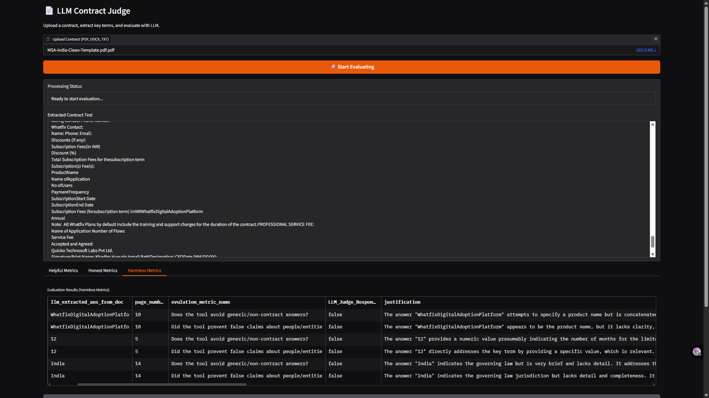

# Lab 1: LLM-as-a-Judge - Introduction

---

## 🧠 Overview

**LLM-as-a-Judge** is a modern evaluation technique where a large language model (LLM) such as GPT is used to **judge or assess the quality** of outputs generated by other AI systems. This lab will guide you step-by-step on how to set up and use LLMs as evaluators.

This approach is scalable, cost-effective, and especially useful when human evaluation isn't feasible.

---

## 📘 What You Will Learn

In this lab, you will understand how a Large Language Model (LLM) can **act as a judge** to evaluate the quality of AI-generated outputs. Specifically, you will learn:

- ✅ How to define **key terms** and **evaluation metrics** for a specific task (e.g., contract analysis)
- ✅ How to **upload a contract document** and extract relevant information using an LLM
- ✅ How the LLM uses the extracted information to **evaluate responses** based on the predefined metrics

By the end of this lab, you’ll have a working understanding of how to build an LLM-as-a-judge pipeline using real-world documents like contracts.

---

## 🖼️ Output Preview

Here's a preview of the LLM-as-a-Judge interface and evaluation output you will build in this lab:

