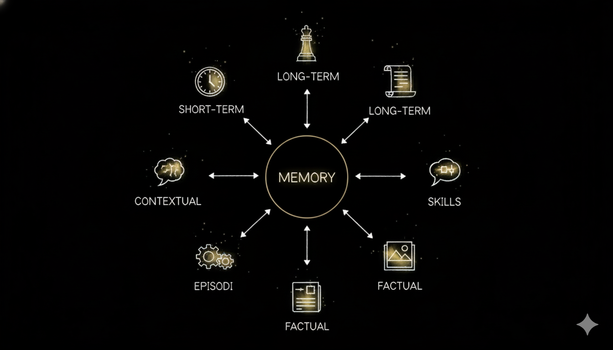
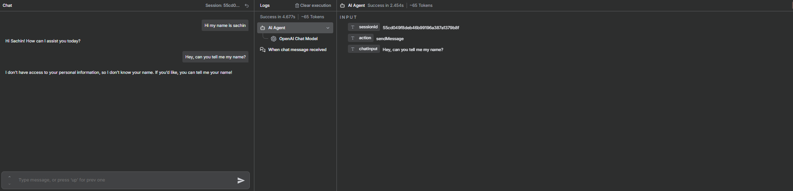
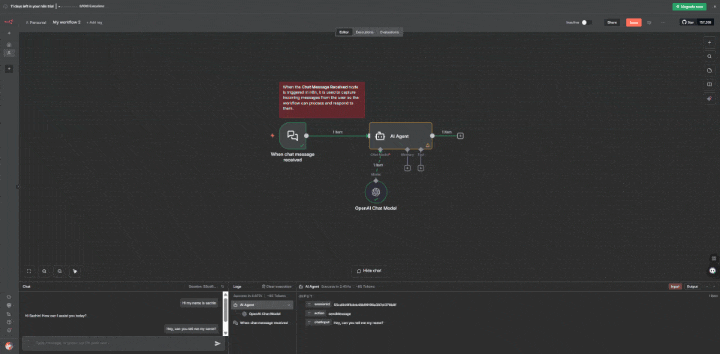
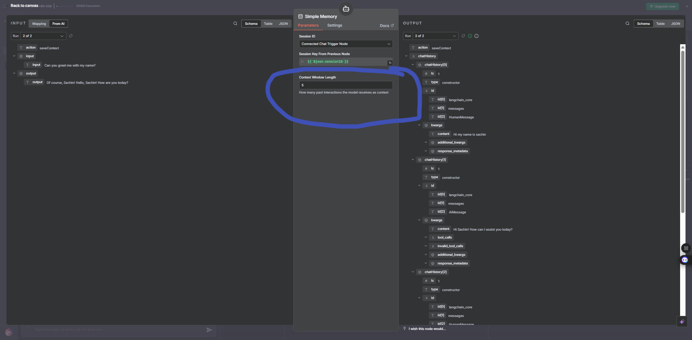
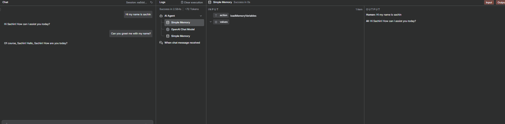

# Understanding Memory Concepts in n8n

## Description

In this lab, we will be building a simple workflow in n8n and see how memory is important to your agent. We will be dividing this lab into two steps: in step 1, we will see the response when we don't have memory, and then we will see the response when we add memory to our agent. We will be comparing both the responses.

---

## Introduction to Memory

### What is Memory?

Memory is a system that remembers information about previous interactions. For AI agents, memory is crucial because it lets them remember previous interactions, learn from feedback, and adapt to user preferences. As agents tackle more complex tasks with numerous user interactions, this capability becomes essential for both efficiency and user satisfaction.

### How Does Memory Work?

Memory systems in AI agents typically work by:

1. **Storing Context**: When a user provides information or asks questions, the system stores relevant details from the conversation.

2. **Retrieving Context**: In subsequent interactions, the agent retrieves stored information to provide contextually relevant responses.

3. **Maintaining Continuity**: Memory allows the agent to reference previous exchanges, creating a more natural and coherent conversation flow.

> **💡 Learn More:** To dive deeper into AI agent memory concepts, types, and frameworks, check out this comprehensive guide: **[AI Agent Memory - IBM Think Topics](https://www.ibm.com/think/topics/ai-agent-memory)**

---

## Prerequisites

Before beginning this lab, ensure you have completed the following:

- **New to n8n!** Set up your account: **[Click Here](../../Module%200%20-%20Prerequisite/n8n-loginSetup/Doc.md)**
- **Generate your OpenAI API key:** **[Click Here](https://youtu.be/YyaZ8zaGS-Q?si=bOw8C_TWgMg8S1hU)**
- **Download n8n workflow file:** **[Click Here](https://drive.google.com/file/d/1jfvkdxNXoP7AmJ8V4_jXC5ciIwRIEeiJ/view?usp=sharing)**

---

## Hands-On: Building Your RAG System

### Step 1: Set Up Your n8n Account

If you haven't already set up your n8n account, follow the **[Prerequisites](#prerequisites)** section above to:

1. **Create** your n8n account (cloud or self-hosted)
2. **Log in** to your n8n dashboard

> Once logged in, you're ready to create your first workflow!

---

### Step 2: Import the Workflow

Now let's import the pre-built workflow into n8n:

1. Click on **"Create Workflow"** button in your n8n dashboard

   

2. Go to the menu (three dots or hamburger icon) and select **"Import from File"**

3. Upload the **JSON workflow file** that you downloaded from the Prerequisites section

   

4. The workflow will be imported and displayed on your canvas

   

---

## Phase 1: Testing Without Memory

### Step 1: Import the Workflow

1 . **Import the workflow file**:
   - Click on the menu (three dots or hamburger icon) in the top right corner
   - Select **"Import from File"** or **"Import"**
   - Upload the **JSON workflow file** that you downloaded from the Prerequisites section
   - The workflow will be imported and displayed on your canvas.

### Step 2: Open Chat and Test Without Memory

2. **Open the chat section**:
   - Click on the **"Open Chat"** button in your workflow
   - This will launch the chat interface

3. **Send your first query**:
   - Type the following message: **"My name is ABC"**
   - Press Enter or click Send
   - Observe the response from the agent

### Step 3: Test Memory Limitation

4. **Ask the agent about your name**:
   - In the same chat, type the following query: **"Hey, can you tell me my name?"**
   - Press Enter or click Send
   - Observe the agent's response

> **💡 Observation:** Notice that the agent is unable to recall your name (ABC) that you shared in the previous message. This demonstrates the limitation of an agent without memory - it cannot remember information from previous interactions in the conversation.

  

---

## Phase 2: Adding Memory to Your Agent

Now let's enhance the workflow by adding memory capabilities. This will allow the agent to remember information from previous interactions.

### Step 1: Add Simple Memory Component

1. **Add the Simple Memory node** to your workflow:
   - Click on the **"+"** button to add a new node
   - Search for **"Simple Memory"** in the node search
   - Select and add the **Simple Memory** node to your canvas

2. **Connect the Simple Memory node**:
   - Connect the Simple Memory node to the agent memory node
   - This will enable the workflow to store and retrieve conversation context

   

3. **Configure the Context Window Length** (Optional):
   - Click on the **Simple Memory** node to open its configuration
   - Look for the **"Context Window Length"** or similar setting
   - Adjust this value to control how many previous conversations you want the agent to remember
   - Higher values will store more conversation history, while lower values will keep only recent interactions
   - Set this according to your needs and use case

> **💡 Note:** The Simple Memory component will store conversation history and make it available to the LLM for context-aware responses. Adjusting the context window length allows you to control the amount of conversation history the agent can access.

### Step 2: Test the Agent With Memory

4. **Open the chat section**:
   - Click on the **"Open Chat"** button in your workflow
   - This will launch the chat interface

5. **Send your first query with memory enabled**:
   - Type the following message: **"Hi my name is ABC"**
   - Press Enter or click Send
   - Observe the response from the agent

6. **Ask the agent to greet you with your name**:
   - In the same chat, type the following query: **"Can you greet me with my name?"** or **"Please greet me using my name"**
   - Press Enter or click Send
   - Observe the agent's response

> **💡 Observation:** Notice that the agent is now able to recall your name (ABC) and greet you using it! This demonstrates the power of memory - the agent can now remember information from previous interactions and use it to provide contextually relevant responses.

---

## Important Note: Understanding Sessions

### What is a Session?

Think of a **session** like a conversation that happens in one continuous period. Imagine you're having a phone call with someone - that entire phone call from start to finish is one "session." As long as you stay on that call, both of you remember what you've talked about. But once you hang up and call again later, it's a new conversation, and you might need to remind them of things you discussed before.

### How n8n Simple Memory Works with Sessions

The **n8n Simple Memory component** stores your past conversations, but only **within the same session**. This means:

- ✅ **During an active session**: The agent remembers everything you've discussed in that chat window
- ❌ **When the session ends**: All conversation history is cleared

### When Does a Session End?

Your conversation session will end (and all memory will be cleared) when you:

1. **Refresh your n8n page** - Clicking the refresh button or pressing F5
2. **Close and reopen the chat interface** - Closing the chat window and opening it again
3. **Create a new chat** - Starting a fresh conversation in a new chat window
4. **Close your browser tab** - Closing the n8n tab completely

### What This Means for You

If you want the agent to remember information across different sessions (like remembering your name even after refreshing the page), you would need to use a more advanced memory solution that stores data permanently, such as a database or long-term memory system. The Simple Memory component is designed for short-term, session-based conversations only.

> **💡 Tip:** To keep your conversation going, avoid refreshing the page or closing the chat window. Stay in the same chat session to maintain context throughout your interaction.

---
