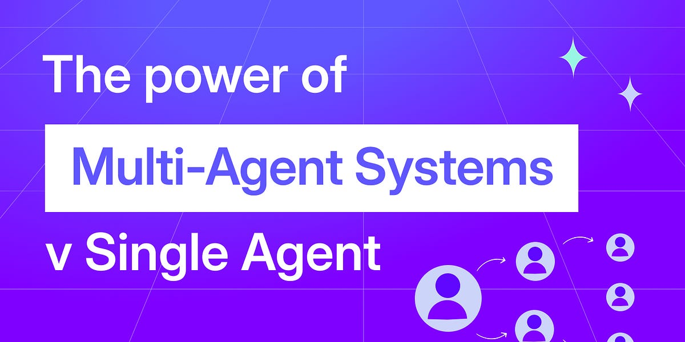
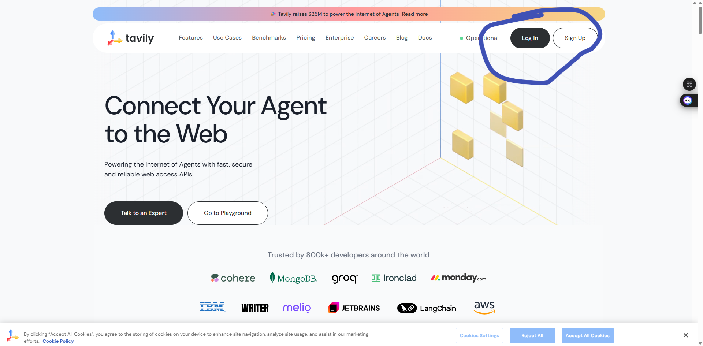
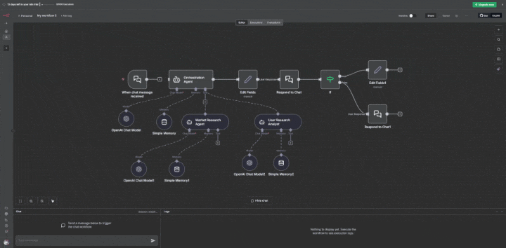
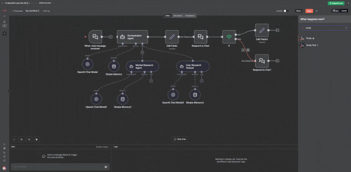
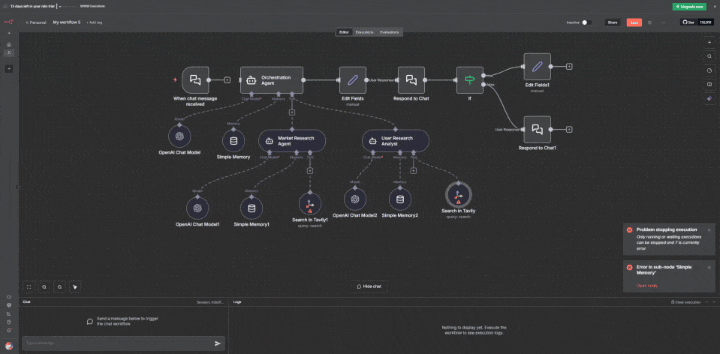
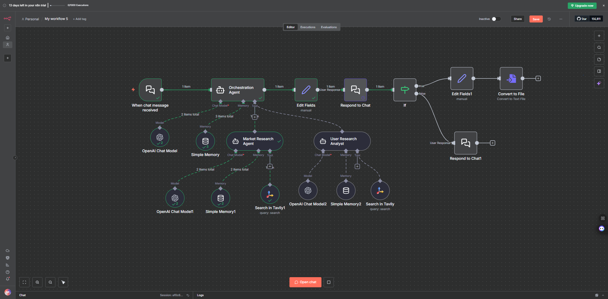

# Building a Multi-Agent System in n8n

Till now you have learned about **agents**, **RAG**, **Agentic RAG**, how **v0** works, how **n8n** works, and how you can connect **n8n** with **v0** through labs. Now it is time to see how you can build a **multi-agent system** in **n8n**.

In this lab, you will build a **multi-agent system** that will do **market research** and **user research** for you. We will be using a tool named **Tavily** to give our agents **web search capabilities**.

> **💡 Note:** We are adding the **Tavily web search tool** to demonstrate how you can integrate external tools into **n8n workflows** and how agents can use tools to extend their capabilities. If you don't want to use the **Tavily tool**, you can use a model that does web search instead. However, we also want to show you how you can use **tools** in **n8n workflows**, which is an important concept for building more advanced multi-agent systems.

---

## What are Multi-Agent Systems?

**Multi-agent systems** break a complex application into multiple specialized agents that work together to solve problems. Instead of relying on a single agent to handle every step, multi-agent architectures allow you to compose smaller, focused agents into a coordinated workflow.

**Multi-agent systems** are useful when:

- A single agent has too many tools and makes poor decisions about which to use.
- Context or memory grows too large for one agent to track effectively.
- Tasks require specialization (e.g., a **market research agent**, **user research agent**, or **web search specialist**).

In this lab, we will build a **multi-agent system** where specialized agents collaborate to perform **market research** and **user research** tasks. Each agent will have access to **Tavily** for **web search capabilities**, allowing them to gather real-time information from the internet and work together to provide comprehensive research results.

---

## Prerequisites

Before beginning this lab, ensure you have completed the following:

- **New to n8n!** Set up your account: **[Click Here](../../Module%200%20-%20Prerequisite/n8n-loginSetup/Doc.md)**
- **Generate your OpenAI API key:** **[Click Here](https://youtu.be/YyaZ8zaGS-Q?si=bOw8C_TWgMg8S1hU)**
- **Get your Tavily API key:**
  1. Go to **[Tavily - Click Here](https://tavily.com/)**
  2. Create an account
  
     
  3. Copy the **API key** from your dashboard
  
     
  4. Store it somewhere safe (you will need this for **web search capabilities** in your agents)
- **Download n8n workflow file:** **[Click Here](https://drive.google.com/file/d/1IUhjMLba6uw0GGCiiFcNFrL7ukl0-nEB/view?usp=sharing)**

## Hands-On: Building Your Multi Agent System

### Step 1: Set Up Your n8n Account

If you haven't already set up your n8n account, follow the **[Prerequisites](#prerequisites)** section above to:

1. **Create** your n8n account (cloud or self-hosted)
2. **Log in** to your n8n dashboard

> Once logged in, you're ready to create your first workflow!

---

### Step 2: Import the Workflow

Now let's import the pre-built workflow into n8n:

1. Click on **"Create Workflow"** button in your n8n dashboard

   

2. Go to the menu (three dots or hamburger icon) and select **"Import from File"**

3. Upload the **JSON workflow file** that you downloaded from the Prerequisites section

   

4. The workflow will be imported and displayed on your canvas

   

---

### Step 3: Connect Tavily Search Node to Your Workflow

Now we will be connecting the **Tavily Search Tool** node to our workflow:

1. Go to the right side panel in your n8n workflow canvas
2. Search for **"Tavily"** in the search bar
3. Click on **"Install Node"** to install the Tavily node

   

4. Again, search for **"Tavily Tool"** in the search bar and use that tool
5. Drag the **Tavily Search Tool** node onto your workflow canvas

   
6. Click on the **Tavily Tool** node to configure it:
   - Add your **Tavily API key** in the credentials section
   - Set the **Action** to **"Search"**
   - In the **Query** field, click on the start icon (⚡) to define it automatically by the model
   
     
   - Click on the **Description** field and add the description to the tool as well

   **Description Message : Use the Tavily Web Search Tool for any request involving real-time, recent, external, factual, or competitive information. If the answer depends on current market data, trends, competitor activity, or public information that changes over time, call the tool.**
   
     

> **💡 Note:** Now your final workflow will look something like this in the below image. Make sure to add the **Tavily tool** because in the system message, I have mentioned to use the **Tavily web search**. If you don't want to use this tool, make sure to modify the system message accordingly.

---

### Step 4: Test Your Workflow

Now let's test your workflow:

1. Go to the **chat section** in your n8n workflow
2. Try this query: **"How sensitive are users in this category to pricing changes?"**

   

You will see that the **orchestration** uses the **User Research Analyst Agent** to answer this query. The agent will use the **Tavily Search Tool** to gather information from the web and provide a comprehensive answer.

3. In the **chat section**, you will see a prompt asking if you want to store the output in a file

   

4. If you type **"yes"**, the system will create a **txt file** and store your output in that file

   

---

## Quick Assignment (Optional)

Now that you've learned how to build a **multi-agent system** in **n8n**, here's your assignment:

### Task: Create a PRD Generation Workflow

Create a workflow in **n8n** that:

1. **Upload Research Data**: Set up a flow where you can upload your research data file
2. **Use Golden Prompt PRD Template**: Use the **Golden Prompt PRD template** in your workflow
3. **Agent Analysis**: Configure an agent to analyze the uploaded file
4. **Generate PRD**: Based on the file context, the agent should write a **2-page PRD (Product Requirements Document)** for you

### Requirements:

- The workflow should accept file uploads (research data)
- Use the **Golden Prompt PRD template** as the system message
- The agent should analyze the uploaded file content
- Generate a comprehensive **2-page PRD** based on the research data context
- The PRD should be well-structured and follow standard PRD format

Good luck with your assignment! 🚀

