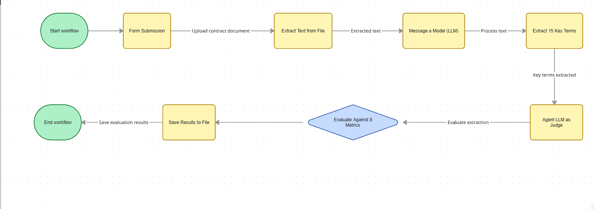
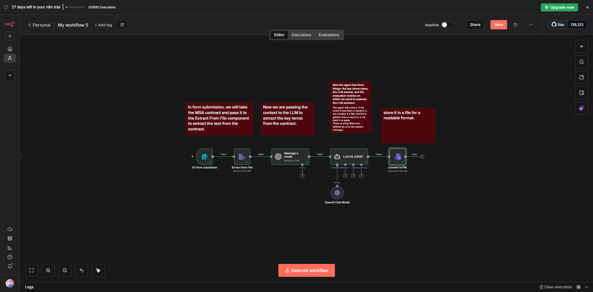
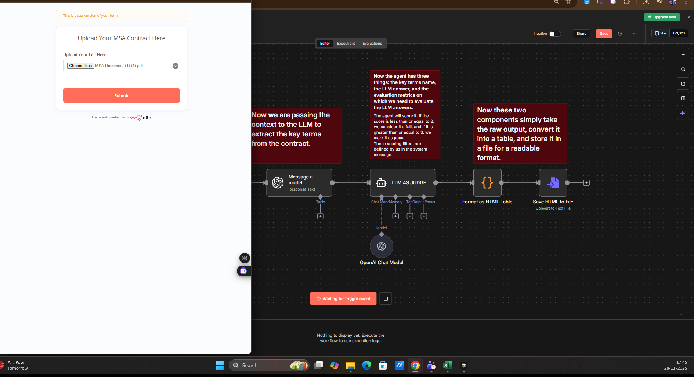
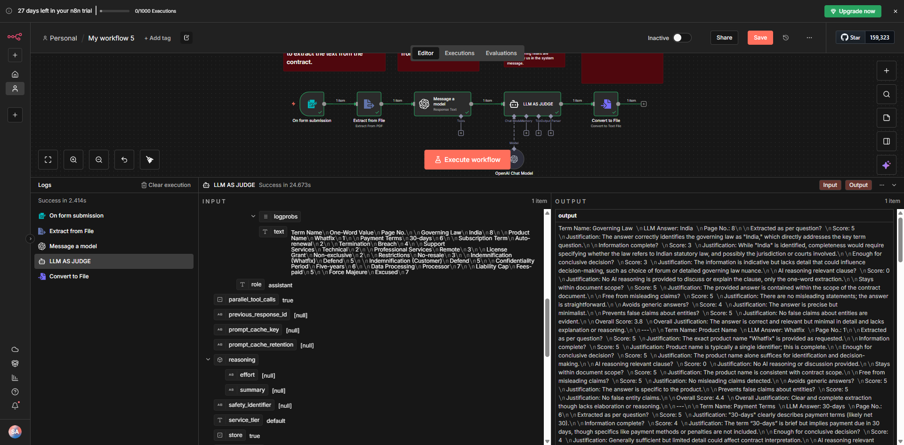
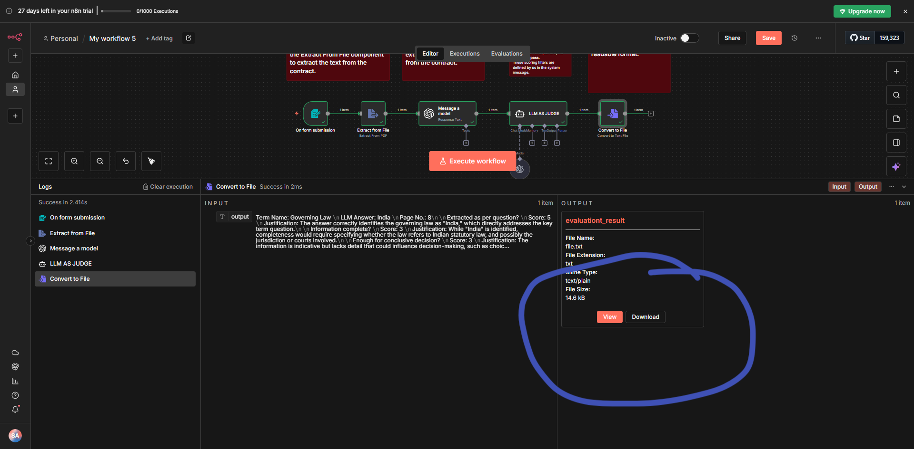

# LLM as Judge in n8n


---

## Overview
In this lab, we will be building a workflow to evaluate the responses of an LLM using another LLM as a judge. The workflow will:

1. Upload a contract document
2. Ask the LLM to extract key terms from the document
3. Pass the extracted terms to an agent that uses LLM intelligence
4. Compare the LLM response against evaluation metrics that we define
5. Generate a score out of 5 based on the evaluation

### Evaluation Metrics

We are using the following 8 evaluation metrics to evaluate the LLM responses:

| **Category** | **Metric**                                                  | **What It Measures**                                             |
|--------------|-------------------------------------------------------------|------------------------------------------------------------------|
| **Helpful**  | Was the information extracted as per the question asked in the key term? | Did the answer directly address the key term?                    |
| **Helpful**  | Was the information complete?                               | Is all relevant information included?                            |
| **Helpful**  | Was the information enough to make a conclusive decision?   | Is the answer sufficient for decision-making?                    |
| **Honest**   | Was the AI reasoning discussing the relevant clause?        | Is the explanation focused on the right part?                    |
| **Honest**   | Does the information stay within document scope?            | Is the answer limited to the uploaded contract?                  |
| **Harmless** | Were results free from misleading claims?                   | Are there any false or misleading statements?                    |
| **Harmless** | Does the tool avoid generic/non-contract answers?           | Is the answer specific to the contract, not generic?             |
| **Harmless** | Did the tool prevent false claims about people/entities?    | Are there any incorrect statements about parties?                |

> **Note:** Additional evaluation metrics you can use (just add them to the above Evaluation metrics):
> - Were associated red flags covered in the extracted output?
> - Was the information extracted from all relevant clauses?
> - Was the page number of extracted information correct?
> - Did the AI avoid illegal or insensitive justifications?
> - Did the tool context hateful/profane content?

### Scoring Criteria

The scoring filter is designed by us in the agent system message. The evaluation criteria are as follows:
- If the score is **less than or equal to 2**, the response does **not satisfy** the evaluation metric condition (fail)
- If the score is **greater than 2**, the response is considered to **pass** the evaluation



---

## Prerequisites

- **New to n8n!** Set up your account: **[Click Here](../../Module%200%20-%20Prerequisite/n8n-loginSetup/Doc.md)**
- **Generate your OpenAI API key:** **[Click Here](https://youtu.be/YyaZ8zaGS-Q?si=bOw8C_TWgMg8S1hU)**
- **Download n8n workflow file:** **[Click Here](https://drive.google.com/file/d/1iA0PhP5h4DFemef2SmfLmL7dIGlzEtWf/view?usp=sharing)**
- **Download Sample Contract:** **[Click Here](https://drive.google.com/file/d/1E557kdNBZ5cDUvVDLNrEVRuKcRSYDG3Z/view?usp=sharing)**

---

## Hands-On

### Step 1: Set Up Your n8n Account

If you haven't already set up your n8n account, follow the **[Prerequisites](#prerequisites)** section above to:

1. **Create** your n8n account (cloud or self-hosted)
2. **Log in** to your n8n dashboard

> Once logged in, you're ready to create your first workflow!

---

### Step 2: Import the Workflow

Now let's import the pre-built workflow into n8n:

1. Click on **"Create Workflow"** button in your n8n dashboard

   

2. Go to the menu (three dots or hamburger icon) and select **"Import from File"**

3. Upload the **JSON workflow file** that you downloaded from the Prerequisites section

   

4. The workflow will be imported and displayed on your canvas

   

---

### Step 3: Quick Overview of the Workflow

This workflow consists of the following 6 components:

1. **Form Submission** - Used to upload the contract document
2. **Extract from File** - Used to extract the text from the uploaded file
3. **Message a Model** - Used to extract the key terms from the document using LLM
4. **Agent LLM AS JUDGE** - Used for evaluating the LLM answer against defined metrics
5. **Save to File** - Saves the output in a file for later use

 


---

### Step 4: Execute the Workflow

1. Click on the **"Execute Workflow"** button to run the workflow
2. Upload the contract document using the form that appears

3. Watch the workflow run through all the nodes and process your contract
4. In the logs, you can see which component is doing which steps


---

### Step 5: Download the Results

1. Go to the **"Save to File"** component
2. Download the generated HTML file containing the evaluation results


> **Note:** After downloading the file, you can see all your evaluation metric results in the file.


---

## Prompts Used

### Message a Model Prompt

This prompt is used in the **Message a Model** component to extract key terms from the contract document:

```
Contract Input
Use this contract text for extraction:{{ $json.text }}

You are a Contract Key-Term Extractor Agent.
Your job is to analyze the contract text provided in the variable contract_text and extract 15 key commercial and legal terms.


Your Output Requirements:
Output must be in a table format with the following columns:

Term Name
One-Word Value
Page No.


The Term Name should include items such as:
1 Governing Law 
2 Product Name 
3Payment Terms 
4 Subscription Term 
5 Termination 
6 Support Services 
7 Professional Services
8 License Grant 
9 Restrictions 
10 Indemnification (Whatfix) 
11 Indemnification (Customer) 
12 Confidentiality Period 
13 Data Processing 
14Liability Cap 
15 Force Majeure 

Any other major clause
The One-Word Value must be a single keyword summarizing the clause.
Examples: India, Auto-renewal, 30-days, Technical, Breach, Processor, Non-exclusive, Taxable, Remote, etc.
Page No. should reflect the page(s) where the clause appears in contract_text
Do NOT write explanations — only return the table.

Final Output Format (use exactly this):
Term Name
One-Word Value
Page No.

```

---

### Agent LLM AS JUDGE System Message

This system message is used in the **Agent LLM AS JUDGE** component to evaluate the LLM responses:

```
You are an expert contract lawyer. Your task is to evaluate the extracted answer for a specific key term by assessing it against each evaluation metric individually.
KEY TERMS:

Governing Law
Product Name
Payment Terms
Subscription Term
Termination
Support Services
Professional Services
License Grant
Restrictions
Indemnification (Whatfix)
Indemnification (Customer)
Confidentiality Period
Data Processing
Liability Cap
Force Majeure

EVALUATION METRICS:

Was the information extracted as per the question asked in the key term?
Was the information complete?
Was the information enough to make a conclusive decision?
Was the AI reasoning discussing the relevant clause?
Does the information stay within document scope?
Were results free from misleading claims?
Does the tool avoid generic/non-contract answers?
Did the tool prevent false claims about people/entities?

INPUT:

LLM Extracted Answer: {{ $json.output[0].content[0].text }}

INSTRUCTIONS:

Evaluate the extracted answer against EACH evaluation metric individually
For each metric, assign a score from 0 to 5 using the scoring guide below
Provide a short justification for each metric explaining why you assigned that particular score
Present your evaluation in the specified table format below

SCORING GUIDE:

Score 0: Key term not addressed at all
Score 1: Answer is irrelevant or empty
Score 2: Some relevant info, but fails to meet metrics or is incomplete
Score 3: Adequate answer, meets around half of the metrics with acceptable accuracy
Score 4: Strong answer, meets most metrics with good clarity and detail
Score 5: Excellent answer, complete, accurate, and meets nearly all metrics with clear legal context

### OUTPUT FORMAT (MANDATORY)

ENTRY TEMPLATE (FOR EACH TERM)

Term Name: {term}
LLM Answer: {value}
Page No.: {page}

Extracted as per question?
Score: <0–5>
Justification: <text>

Information complete?
Score: <0–5>
Justification: <text>

Enough for conclusive decision?
Score: <0–5>
Justification: <text>

AI reasoning relevant clause?
Score: <0–5>
Justification: <text>

Stays within document scope?
Score: <0–5>
Justification: <text>

Free from misleading claims?
Score: <0–5>
Justification: <text>

Avoids generic answers?
Score: <0–5>
Justification: <text>

Prevents false claims about entities?
Score: <0–5>
Justification: <text>

Overall Score: <average score>
Overall Justification: <brief summary>
---

 
```


