# Multiagent with Long-Term Memory in n8n


## Overview

In this lab, we will be building a multi-agent system with long-term memory capabilities in n8n. This workflow demonstrates a multi-agent architecture where:

1. **Orchestration Agent**: Acts as the central coordinator that receives user queries and routes them to the appropriate specialized agent based on the query type.

2. **Specialized Agents**: 
   - **Market Research Agent**: Handles queries related to market analysis, trends, and competitive intelligence
   - **User Research Agent**: Handles queries related to user behavior, preferences, and user experience insights

3. **Long-Term Memory System**: Google Docs serves as a shared long-term memory tool that all three agents (orchestration, market research, and user research) are connected to. This allows:
   - **Storing** conversations and interactions for future reference
   - **Retrieving** past conversations and context when needed

4. **Workflow Architecture**: Based on the user's query, the orchestration agent intelligently calls the appropriate specialized agent (market research or user research). All agents share access to the same long-term memory, enabling them to:
   - Learn from past interactions
   - Maintain context across conversations
   - Provide more personalized and contextual responses over time
   - Build upon previous knowledge and insights

This workflow follows a multi-agent workflow pattern where specialized agents collaborate through a shared memory system, allowing for more sophisticated and context-aware responses.

---

## Prerequisites

Before beginning this lab, ensure you have completed the following:

- **Complete the prerequisite lab first:** Before jumping to this lab, make sure you have completed the prerequisite lab that covers setting up Google Docs credentials (Client ID and Client Secret). **[Click Here](https://github.com/initmahesh/MLAI-community-labs/tree/main/Class-Labs/Cohort%207/Module%203/Lab-1.4(n8n-advance-memory))**
- **New to n8n!** Set up your account: **[Click Here](../../Module%200%20-%20Prerequisite/n8n-loginSetup/Doc.md)**
- **Generate your OpenAI API key:** **[Click Here](https://youtu.be/YyaZ8zaGS-Q?si=bOw8C_TWgMg8S1hU)**
- **Download n8n workflow file:** **[Click Here](https://drive.google.com/file/d/1MCX7AGqskI4Oj7E2SYM3cd3C3Km74klv/view?usp=sharing)**

## Hands-On: Building Your Multi Agent System

### Step 1: Set Up Your n8n Account

If you haven't already set up your n8n account, follow the **[Prerequisites](#prerequisites)** section above to:

1. **Create** your n8n account (cloud or self-hosted)
2. **Log in** to your n8n dashboard

> Once logged in, you're ready to create your first workflow!

---

### Step 2: Import the Workflow

Now let's import the pre-built workflow into n8n:

1. Click on **"Create Workflow"** button in your n8n dashboard

   

2. Go to the menu (three dots or hamburger icon) and select **"Import from File"**

3. Upload the **JSON workflow file** that you downloaded from the Prerequisites section

   

4. The workflow will be imported and displayed on your canvas

   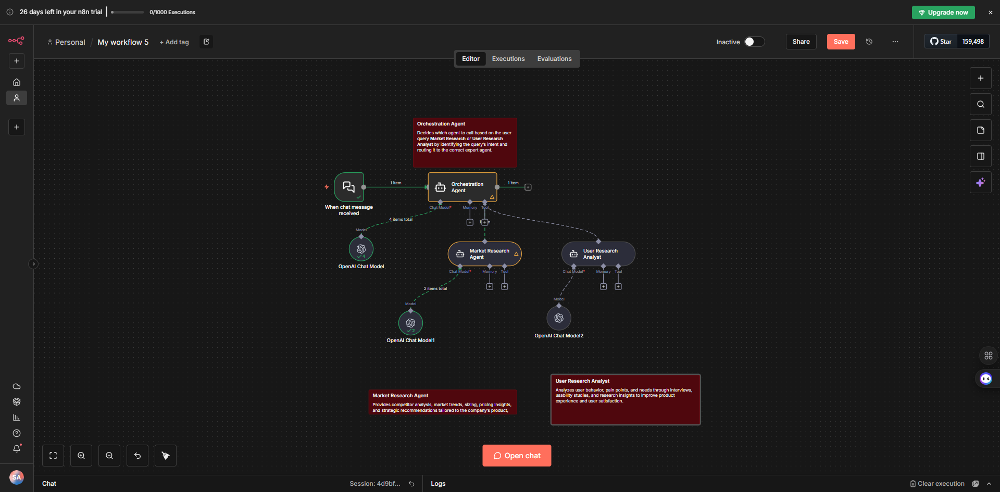

---

### Step 3: Add Google Doc Tool and Configure Credentials

Now let's add the Google Doc tool to your workflow and configure the credentials:

1. Go to the right side panel in your n8n workflow canvas
2. Search for **"Google Docs"** in the search bar

   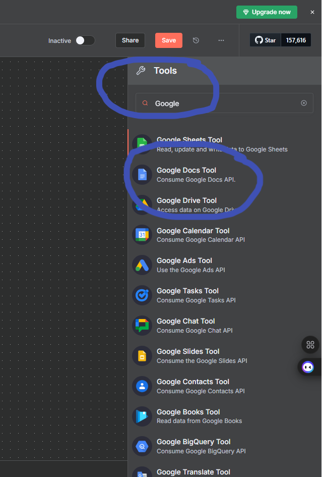

3. Drag the **Google Docs** node onto your workflow canvas
4. Click on the **Google Docs** node to configure it

   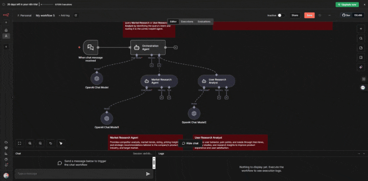

5. In the **Credentials** section, click on **"Create New Credential"**
6. Add the **Client ID** and **Client Secret**. To get these credentials, follow the lab in prerequisite before jumping to it.

   

7. After that, click on **"Sign in with Google"** and add the same account that you mentioned in the test user while creating your Client ID and Client Secret.

---

### Step 16: Create a New Google Doc

Now create a new Google Doc and copy the **Document ID** from the URL.

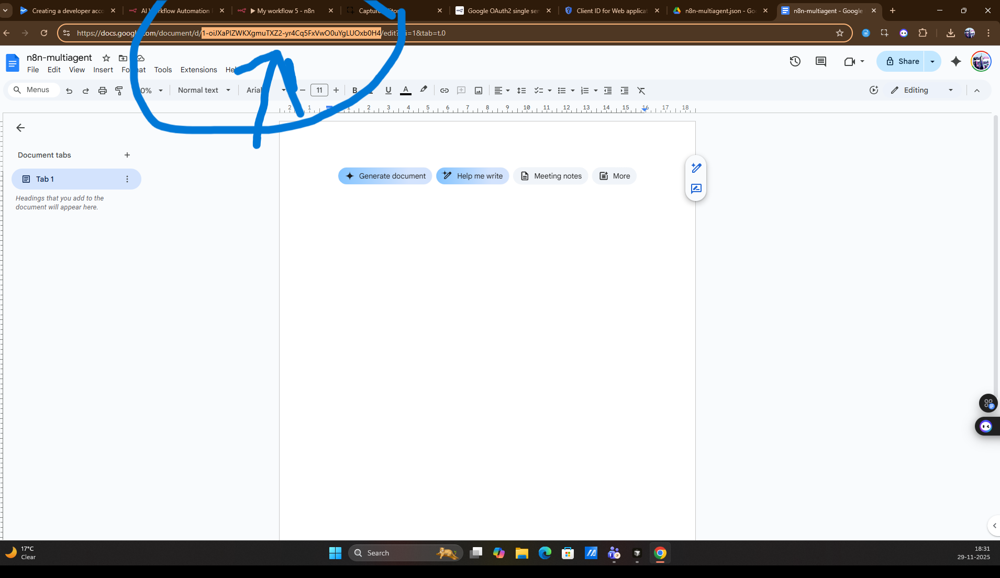

---

### Step 17: Configure Google Doc Tool

1. Now open the Google Doc tool and select the operation **Update**.

2. Add the **Document ID**.

3. In the **Text** field, select the **star icon** make it define by the model.

   

4. Click on the **Description** field and add the description below:

   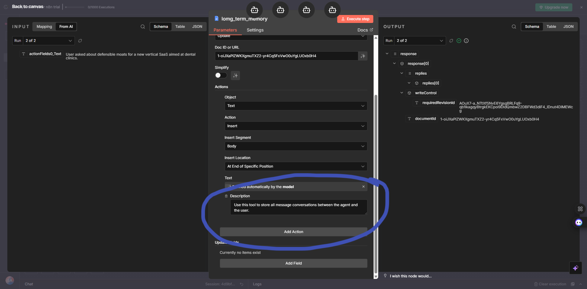

   ```
   Use this tool to store all message conversations between the agent and the user.
   ```

   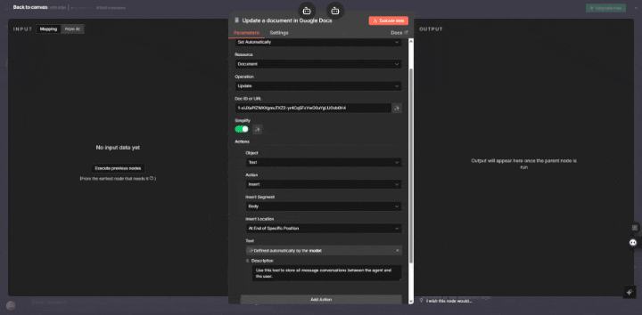

5. Rename the tool to `long_term_memory`.

---

### Step 18: Duplicate and Configure Get Operation

1. Now copy the tool and paste it one more time.

2. Click on the copied tool and change the action to **Get** only.

3. Connect it with your agent.

   

4. In the **Description** field, add the description message below:

   ```
   Use this tool to retrieve all user and agent conversations from Google Docs. It serves as a long-term memory system, allowing the agent to recall information from past interactions whenever needed.
   ```

   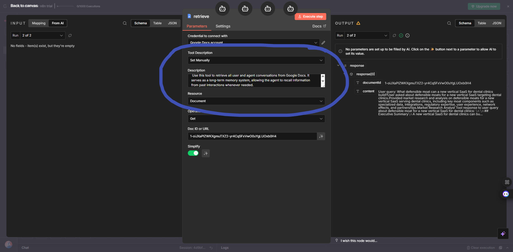

5. Rename the tool to `retrieve`.

   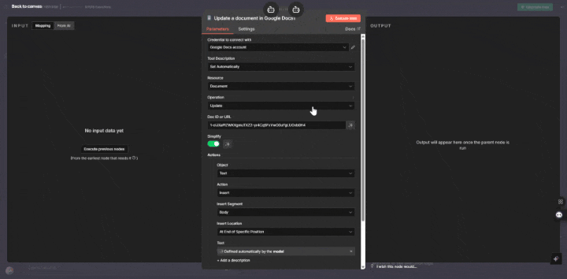

---

### Step 19: Test Your Workflow

Now your final workflow should look like this. Let's test it:

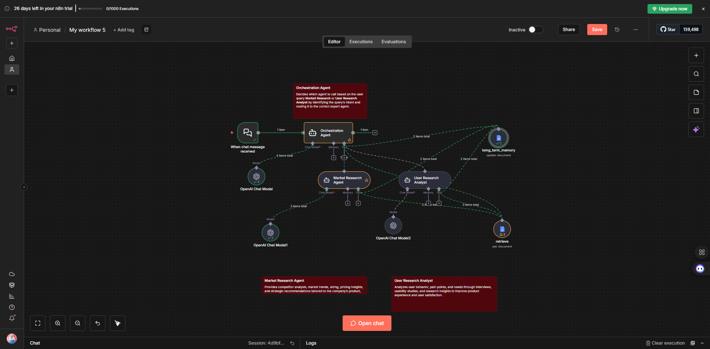

1. Open the **chat section** in your n8n workflow.

2. Test it with different queries, for example:
   - "Analyze the competitive landscape for B2B survey tools and create a pricing strategy for a new entrant."
   - "What are the entry barriers for a new cybersecurity threat intelligence startup?"

   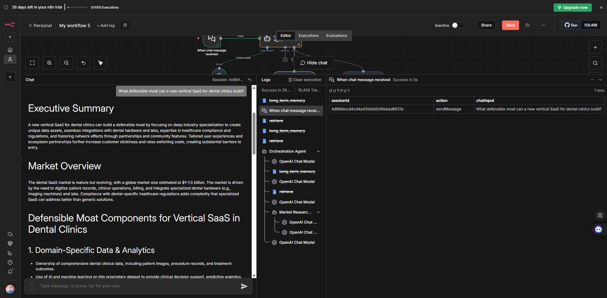

3. On the same side, go check your **Google Doc** - you will see that it is saving all your conversations automatically.

   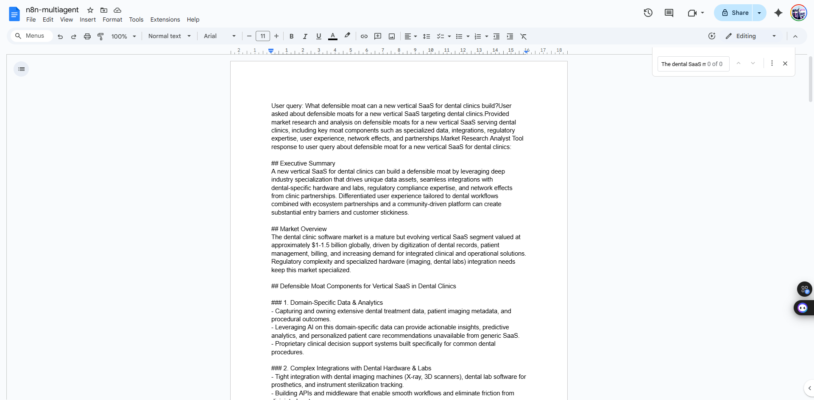

> **💡 Note:** The workflow will automatically save all conversations between you and the agents to the Google Doc, creating a persistent memory that the agents can reference in future interactions.

---

## Conclusion

In this lab, you learned how to:

- Set up Google Docs as a long-term memory system for your agents
- Configure an orchestration agent that routes queries to specialized agents
- Connect multiple agents (orchestration, market research, and user research) to a shared memory system
- Enable agents to store and retrieve conversations from past interactions
- Implement a true multi-agent workflow architecture where agents collaborate through shared memory

Your workflow now has the capability to:
- **Remember** past conversations and interactions
- **Learn** from previous queries and responses
- **Provide** more contextual and personalized responses over time
- **Maintain** continuity across multiple user sessions

You can now extend this workflow by adding more specialized agents or enhancing the memory system with additional features like memory summarization or selective retrieval based on relevance.

Happy building! 🚀
