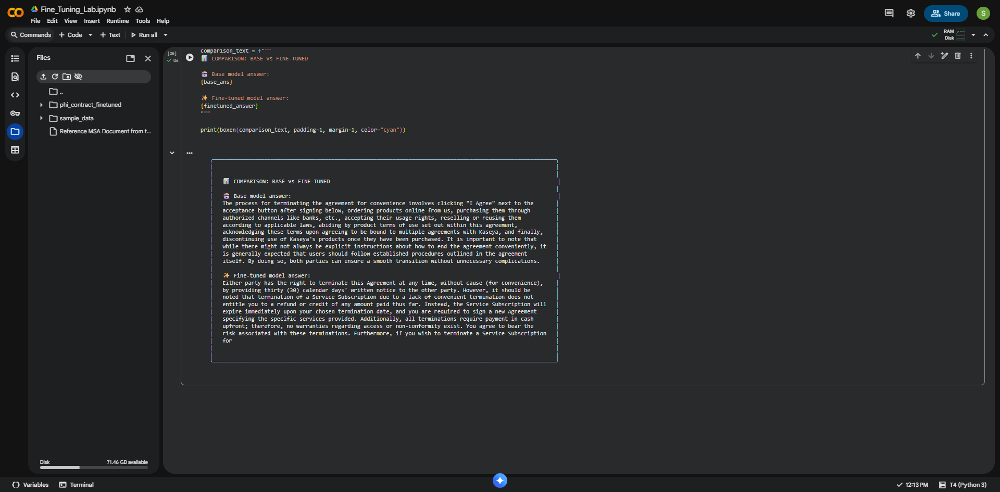

# Lab 1.3: Supervised Fine-Tuning (SFT) with Microsoft Phi-1.5

### Click the button below to open the lab in Colab 

## **Objective**

In this lab, we will perform **Supervised Fine-Tuning (SFT)** on the **Microsoft Phi-1.5** Large Language Model (LLM).

---

## **The Scenario**

Pre-trained models like Phi-1.5 have broad general knowledge but lack **domain-specific details**, especially for legal or contractual content.

To demonstrate this limitation, we will fine-tune the model on a **Kaseya Master Agreement (MSA)** PDF/TXT file.  

This will teach the model to recall **specific contractual terms** such as limitation periods, payment terms, automatic renewals, and termination clauses that are **unique to this contract**.

---

## **Learning Outcomes**

By the end of this lab, you will be able to:

- Understand the concept and importance of Supervised Fine-Tuning (SFT)
- Fine-tune the Microsoft Phi-1.5 model on domain-specific data
- Prepare legal/contractual documents for fine-tuning
- Evaluate the model's ability to recall specific contractual terms
- Compare the performance of the base model vs. the fine-tuned model

---

## **Expected Results: Before vs. After Fine-Tuning**

After successfully completing this lab, you will observe a significant improvement in the model's responses. Below is a comparison of the differences:

### **Before Fine-Tuning**

The base Phi-1.5 model provides **raw and inaccurate responses** when asked about specific contractual terms:

- ❌ **Generic answers** based on general training data
- ❌ **Incorrect or incomplete information** about contract-specific terms
- ❌ **Lacks domain-specific knowledge** from the Kaseya MSA
- ❌ **Unclear or vague responses** that don't address the specific question

### **After Fine-Tuning**

The fine-tuned model demonstrates **better clarity and accuracy** with domain-specific knowledge:

- ✅ **Accurate, contract-specific answers** based on the Kaseya MSA
- ✅ **Precise recall** of specific terms like limitation periods, payment terms, and termination clauses
- ✅ **Clear and structured responses** that directly address the question
- ✅ **Domain expertise** that reflects the unique contractual terms from the training data

