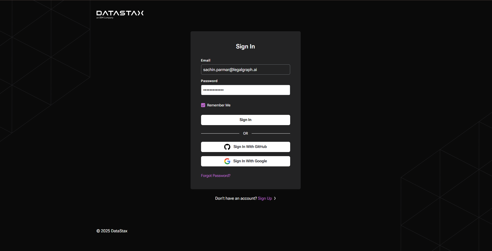
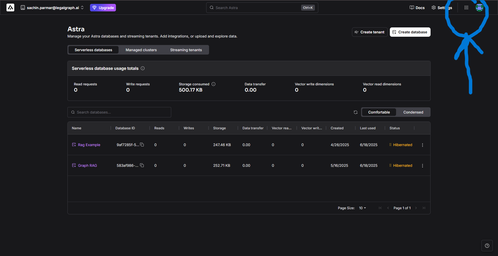
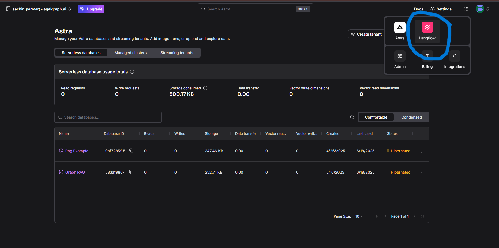

# Langflow Login Guide

## Overview

Langflow is a powerful visual interface designed to help users build, visualize, and deploy Language Model (LLM) applications with ease.

This guide provides a step-by-step walkthrough on how to log in to Langflow using the DataStax authentication portal. Whether you're a new user or returning, this documentation will help you access the Langflow workspace successfully and begin building LLM-powered workflows.

---

## Step 1: Create an Account or Log In

To get started, authenticate through the DataStax login portal.

### **Login URL:**  [Click Here](https://accounts.datastax.com/session-service/v1/login)

### Instructions
1. Open the login URL in your browser.
2. If you don’t have an account, click on **Sign Up**.
3. Enter your **email address** and create a **secure password**.
4. Follow the verification instructions to complete registration.

> Note: If you already have a DataStax account, you can proceed by logging in directly.

**Screenshot:**  

---

## Step 2: Access the Main Interface

After logging in, you will be redirected to the main Astra interface.

### Instructions
1. Locate the **icon at the top navigation bar** (commonly used to open the services/app launcher).
2. Click on the icon to open the services menu.

**Screenshot:**  

---

## Step 3: Click on Langflow

Once the services menu is open, locate the Langflow application.

### Instructions
1. In the list of available services, find and click on **“Langflow”**.
2. This will open the Langflow application in a new tab or window.

**Screenshot:**  

---

## Step 4: Langflow Interface

You are now successfully logged into the Langflow interface.

### Next Steps
- Start creating LLM flows using the visual editor.
- Drag and drop components to design your application logic.
- Connect APIs, prompts, and backend processes visually.
- Save and deploy your Langflow pipelines.

**Screenshot:**  

---

## Need Help?

If you encounter any issues:
- Ensure your internet connection is stable.
- Try logging in using an incognito/private browser window.
- Confirm your email verification is complete.
- Last Option ! Connect to sachin he will help you.
