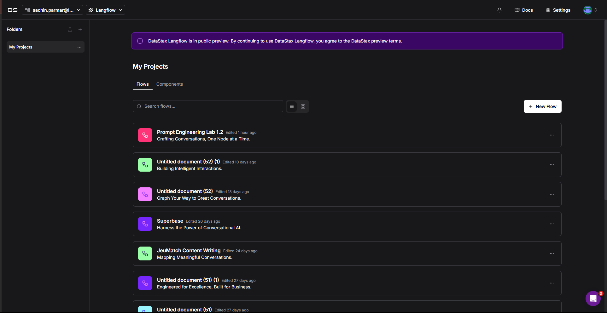
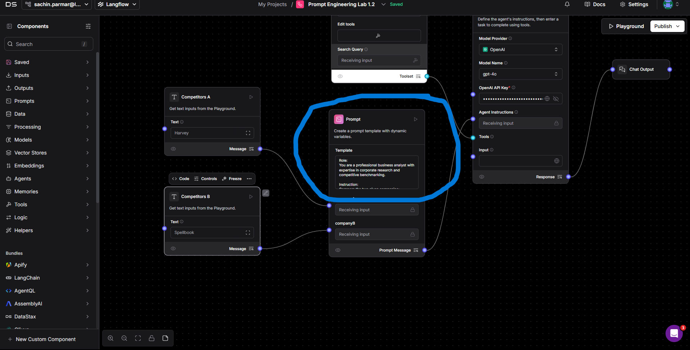
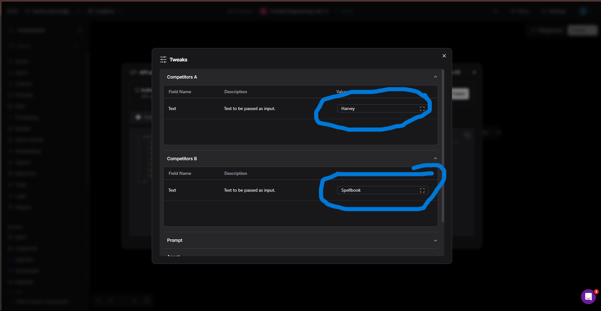

# Langflow Integration with v0 - (Build a Complete AI-Powered Competitor Analysis Tool)


### Overview

This comprehensive guide demonstrates how to integrate a Langflow backend with a frontend built using v0, creating a seamless AI-powered competitor analysis tool. You will learn to connect backend logic with modern UI components for real-time data processing and visualization.

**What You Will Build:**
- AI-powered competitor comparison tool
- Modern, responsive web interface
- Real-time API integration
- Professional data visualization

---

## Prerequisites

Before beginning, ensure you have completed the following requirements:

### 1. Get Your OpenAI API Key

You will need your personal OpenAI API key to connect Langflow to GPT models. Follow this guide to get your key:  
🔗 [How to Get Your OpenAI API Key](https://medium.com/@lorenzozar/how-to-get-your-own-openai-api-key-f4d44e60c327)

---

### 2. Get Your Tavily API Key

Before you proceed, you need a Tavily API Key. Follow these steps:

1. Navigate to [https://www.tavily.com/](https://www.tavily.com/)
2. Click on the **Login** button in the top-right corner  
   
3. Once logged in, go to your dashboard and copy your Tavily API key  
   

**Important:** Keep your Tavily API key secure. You will use it later inside the Langflow component.

---

### 3. Langflow Login Setup

Follow the instructions provided in the Langflow Login Guide:  
📘 [Langflow Login Guide](../../Lab-0(Pre-requisites)/Langflow-Login-Guide/Readme.md)

---

### 4. Langflow Flow File

Download the required Langflow flow from the link below:  
📁 [Download Langflow Flow](https://drive.google.com/file/d/1JI0bKCRMNS6mzbA8-zXsrtZYY4S6eEUn/view?usp=sharing)

---

### 5. Access to the V0 Platform

Log in to the official v0 platform:  
🌐 [Visit V0](https://v0.dev/)

---

### 6. Postman Login

Log in using the web version of Postman:  
🧪 [Postman Web Portal](https://www.postman.com/)

**Note:** If you are unable to log in through the browser, download the desktop app from the [Postman Downloads Page](https://www.postman.com/downloads/).


---

## Step-by-Step Integration Instructions

### Step 1: Log in to Langflow
Ensure you are logged in to Langflow. Refer to the login guide if you have not completed this step.

### Step 2: Create a New Flow
Click the **New Flow** button on your Langflow dashboard.



### Step 3: Select Blank Flow
Choose **Blank Flow** to start with a clean canvas.


### Step 4: Import a Flow
Click the dropdown menu in the top-left corner and select **Import**.


### Step 5: Import the Langflow JSON File
Select the `.json` file downloaded in the prerequisites step to load the predefined flow.


**Note:** Ensure all components in the flow are properly connected as shown in the interface.

### Step 6: Add API Keys to Components
Locate the components that require API keys (OpenAI, Tavily) and enter your respective keys.


**Important:** Verify that the keys are valid and placed in the correct fields.

### Step 7: Edit the Prompt and Save
1. Click on the highlighted **Prompt** field to edit it
2. Use the **Check** button to validate your changes
3. Click **Save** once completed



**Tip:** Customizing prompts improves accuracy and relevance of the AI responses.

### Step 8: Navigate to the Publish Section

You can also test the flow in the **Playground** section before publishing:

> **Tip 1:**  
> Click on the **Playground Section** button to open the interactive testing environment.  
> 

> **Tip 2:**  
> Click on **Run Flow** — make sure to provide the competitors' names in both text input components.  
> 

---

#### ✅ Now, proceed to publish:

1. **Go to the Publish Tab**  
   In the top-right corner of Langflow, navigate to the **Publish** tab to expose your flow as an API.  
   


### Step 9: Access the API Endpoint
Click on the **API Access** tab to retrieve your flow's base URL and authorization details.


**Note:** This API endpoint will be required for v0 integration.

### Step 10: Access the cURL Command
Scroll to the **cURL Command** section and click **Tweak** in the top-right corner to adjust request parameters visually.


### Step 11: Modify Tweak Parameters
Under **Input Variables**, change the values to competitors you would like to compare (e.g., `Google` and `Microsoft`).



### Step 12: Generate Token and Copy cURL Command
Complete the following steps:

**Important:** Before copying the cURL command, remove `input_value = hello world` or similar default values from the command to ensure clean integration.

1. Click **Generate Token** to obtain a valid authentication token
2. Copy the **cURL command** displayed below


**Note:** This token and command will be used for integration with your v0 frontend.

### Step 13: Open Postman
Launch the Postman application to begin testing your Langflow API.


### Step 14: Import cURL Command
Copy the cURL command from Langflow and paste it into the Postman input field. Postman will automatically configure the request with the appropriate method, URL, headers, and body.


### Step 15: Configure Headers
After Postman auto-configures the request:

1. Navigate to the **Headers** tab
2. Locate the `Authorization` key
3. In the value column, enter the Bearer token generated from Langflow in this format: `Bearer <your_generated_token>`
4. Click the **Send** button


### Step 16: Send Request and Retrieve Response
Click the **Send** button in Postman. The Langflow backend will process the request and provide a response based on your prompt and parameters. You can copy this response for further use or testing.


**Note:** Sometimes the request may take longer to process due to Langflow server latency. If the response does not appear immediately, retry the request.

### Step 17: Navigate to V0 Interface
Access the [V0 Platform](https://v0.dev/). Once logged in, you will see an interface similar to the one shown below:


### Step 18: Use the Reference Prompt in V0
Below is a reference prompt you can use in V0 to connect your Langflow API.

**Important:** Make sure to replace the Bearer Token with your actual token and update the sample response with the one you received from Postman.

#### Prompt Template

 > 📌 **Note:**  
> This prompt is designed to connect your Langflow API with a frontend landing page.  
> 🔄 Be sure to:
> - Replace the **Endpoint** section with your actual cURL command (with Bearer token)
> - Replace the **Request Body** with the **actual sample response** you received from Postman

 ```
# 🧑‍💻 Role
You are an experienced designer and developer with 20+ years of expertise.  
Your task is to create a **modern, aesthetic, and professional landing page** for a **Competitor Comparison Tool**.

---

# 📋 Instructions

## 🔹 Core Functionality
- Create a landing page with:
  - Two input fields: **"Competitor A"** and **"Competitor B"**
  - A **"Compare"** button that triggers an API call
  - A **responsive, user-friendly table** to display results
  - Handle **loading states** and **API delays**

## 🔹 API Integration

### 🔗 Endpoint
<place your curl command with token>

### 🔁 Request Body  
Here is my Sample Response:  
 
 <Paste Your Postman Sample Response>

### 🧾 Response Handling
- Extract markdown table from:
  
  response.outputs[0].outputs[0].results.message.text
  
- Parse markdown into **responsive HTML table**
- Display a **summary** below the table

---

# 🧱 Landing Page Structure

1. **Header**
   - Logo
   - Navigation menu
2. **Hero Section**
   - Headline
   - Input fields + Compare button
3. **About Us**
   - Short service description
4. **Comparison Results**
   - Dynamic API result display
5. **Footer**
   - Contact info and links

---

# 🛡️ Guardrails

## 🔸 Technical Requirements
- Handle **CORS issues**
- Show **loading spinner** during API calls
- Smooth **animations and transitions**
- **Mobile responsive** layout
- **Error handling** for failed API calls

## 🔸 Design Requirements
- Use **modern, professional aesthetic**
- Clean **typography**
- Include **hover effects** and micro-interactions**
- Maintain a **professional color scheme**

```
### 19. Final Integration & Frontend Behavior

Once you are done with all the setup:

- You will see a **fully functional frontend landing page**.
- When you click on the **"Compare"** button:
  - It will send a **request to your Langflow backend** using the input values.
  - The request uses the **curl command structure** with your **Bearer Token**.

> ⚠️ **Note:** The request might take some time to process because **Langflow servers can be slow**. If no response appears, try hitting the Compare button again.


---

### What Happens Behind the Scenes

1. The frontend sends a `POST` request to your Langflow API.
2. Langflow processes the prompt and returns a **markdown response**.
3. The frontend:
   - Extracts the markdown from:  
     ```js
     response.outputs[0].outputs[0].results.message.text
     ```
   - Parses it into a **responsive HTML table**.
   - Displays a **summary** below the comparison table.
   - Shows **loading spinners** and handles any **API errors**.

---
## Troubleshooting

### Common Issues & Solutions

| Issue | Symptoms | Solution |
|-------|----------|----------|
| **API Timeout** | No response after clicking Compare | Retry request; Langflow servers can be slow |
| **Invalid Token** | 401 Authorization error | Regenerate token in Langflow Publish section |
| **CORS Error** | Request blocked by browser | Ensure proper headers in frontend code |
| **Malformed Response** | Table not displaying correctly | Verify response extraction path |

---

## Additional Resources

- **Langflow Documentation:** [Official Docs](https://docs.langflow.org/)
- **V0 Platform Guide:** [v0.dev Documentation](https://v0.dev/docs)
- **Postman API Testing:** [Testing Best Practices](https://learning.postman.com/)


> **🎉 Huraaaah!** You've successfully built a complete AI-powered competitor analysis tool with modern frontend and intelligent backend integration.

