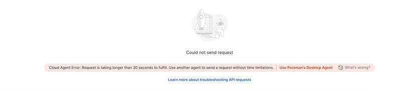
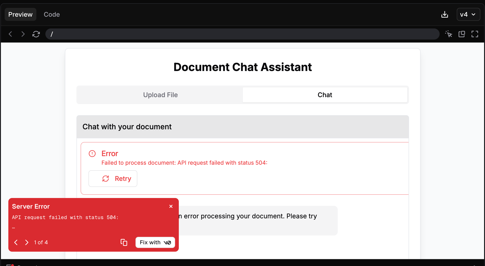

# 🚀 Lab 2: Building a User Interface for Your Langflow Agent with V0

## 📝 Overview

In this lab, we'll bridge the gap between our ML/AI agent-powered backend and real-world user interaction. Having built a powerful agentic system in LangFlow, we now need a way to make it accessible to users and collect valuable feedback.

This is where modern AI-powered UI development tools come in. Using v0.dev, we'll create a professional web interface through simple English prompts - no traditional coding required. This approach allows us to:

- Quickly prototype user interfaces
- Connect our Langflow agent to a real user-facing application
- Gather immediate user feedback
- Iterate rapidly based on user responses

The lab will guide you through:

1. Creating a functional web application using v0.dev's prompt-based interface
2. Integrating the application with our existing Langflow agent
3. Setting up the necessary API connections
4. Testing the complete system
5. Preparing for user feedback collection

By the end of this lab, you'll have a working web application that connects to your Langflow agent, ready for real user testing and feedback collection.

---

## 📦 Resources

Before starting the lab, please download the following required files:

1. **Langflow JSON Flow File**

   - [Download Link](https://drive.google.com/file/d/1g84nSN4_BmuK_v1QHFlmolS3Ok_f9Yrt/view?usp=sharing)
   - This file contains the pre-built Langflow agent configuration
   - Required for setting up the backend integration

2. **Reference Documentation**

   - [Download Link](https://drive.google.com/file/d/1YfVQI9ZbEppM00CGi5aU0yJsuyFfe7WH/view?usp=sharing)

3. **Dummy Context for Testing**

   You can use the following sample document to test your implementation:

   ```markdown
   # MASTER SERVICES AGREEMENT

   This Master Services Agreement ("Agreement") is made and entered into on this 1st day of May 2025 by and between:

   **Service Provider Name:** TechNova Solutions Inc. ("Service Provider")  
   **Customer Name:** BrightWave Media Ltd. ("Customer")

   ## 1. Scope of Services

   Service Provider agrees to provide IT consulting and development services as outlined in individual Statements of Work ("SOWs") to be agreed upon by both parties.

   ## 2. Contract Term/Duration

   This Agreement shall commence on May 1, 2025, and shall remain in effect for a period of two (2) years, unless terminated earlier in accordance with the terms herein.

   ### 2.1 Auto-Renewal Clause

   This Agreement shall automatically renew for successive one (1) year periods unless either party provides sixty (60) days written notice of non-renewal prior to the expiration of the then-current term.

   ## 3. Payment Terms

   Customer shall pay Service Provider according to the rates defined in each SOW. Unless otherwise stated, invoices are payable within thirty (30) days of receipt by Customer.

   ### 3.1 Billing Frequency

   Service Provider shall submit invoices to Customer on a monthly basis for all services rendered during the preceding calendar month.

   ### 3.2 Late Payment

   Any invoice not paid within the specified payment terms shall accrue interest at the rate of 1.5% per month or the maximum rate permitted by law, whichever is less.

   ## 4. Termination Clauses

   Either party may terminate this Agreement with thirty (30) days' written notice. In the event of breach, the non-breaching party may terminate the Agreement immediately upon notice.

   ## 5. Contact Information and Authorized Representatives

   ### 5.1 Service Provider Contact

   **Primary Contact:** Sarah Mitchell, Director of Client Services  
   **Email:** sarah.mitchell@technovasolutions.com  
   **Phone:** (555) 123-4567

   ### 5.2 Customer Contact

   **Primary Contact:** David Chen, IT Operations Manager  
   **Email:** david.chen@brightwavemedia.com  
   **Phone:** (555) 987-6543

   ```

> **Note:** Make sure to keep these files in a secure location as they contain important configuration details for your Langflow agent.

---

## About V0

V0 is a generative user interface system developed by Vercel Labs that leverages AI to create modern React components. It offers several key features:

- Generates copy-and-paste friendly React code based on shadcn/ui and Tailwind CSS
- Allows users to describe desired interfaces in plain text
- Automatically generates the necessary React code based on text descriptions
- Built on top of shadcn/ui and Tailwind CSS for consistent, modern design
- Ideal for rapid prototyping and creating initial ("v0") versions of UI ideas

While V0 is powerful for frontend development, it's important to note that:

- Generated code requires review and refinement
- Currently focuses only on frontend development
- Does not handle backend logic
- Best used as a starting point for UI development

This free tier provides more than enough resources to complete this lab and experiment with different UI designs.

---

## 📱 What is Postman?

Postman is a popular API development platform that simplifies the process of building, testing, and documenting APIs. It provides an intuitive interface for making HTTP requests, testing endpoints, and managing API collections. In this project, Postman will be used to test and interact with the Langflow API endpoints before integrating them with the frontend.

---

## 🔧 Required Tools and Accounts

Before you begin, ensure you have access to the following tools and accounts:

1. **Langflow**

   - Download the Langflow JSON Flow File From Here: [Click Here](https://drive.google.com/file/d/1g84nSN4_BmuK_v1QHFlmolS3Ok_f9Yrt/view?usp=sharing)

2. **V0**

   - Access V0 at [https://v0.dev/chat](https://v0.dev/chat)
   - Create an account if you don't have one

3. **Postman**
   - Access Postman at [https://www.postman.com/](https://www.postman.com/)
   - Download the Postman desktop application or use the web version
   - Create a free account to save your API collections

---

## 📺 Integration Tutorial

Watch our step-by-step video tutorial on how to integrate Langflow with V0:

# [Langflow V0 Integration Tutorial Video Link Click Here](https://pragyaallc-my.sharepoint.com/:v:/g/personal/sachin_parmar_legalgraph_ai/EX5qKrsmGBlBsHXozk6SJZYBn5QzP5I6M7UJxRCToClGjA?e=BbJhKH&nav=eyJyZWZlcnJhbEluZm8iOnsicmVmZXJyYWxBcHAiOiJTdHJlYW1XZWJBcHAiLCJyZWZlcnJhbFZpZXciOiJTaGFyZURpYWxvZy1MaW5rIiwicmVmZXJyYWxBcHBQbGF0Zm9ybSI6IldlYiIsInJlZmVycmFsTW9kZSI6InZpZXcifX0%3D)

The video covers:

- Setting up Langflow API endpoints
- Creating a V0 frontend interface
- Connecting Langflow with V0
- Testing the integration using Postman
- Best practices and troubleshooting tips

---

## 💡 Prompt for V0

## 🎯 Implementation Steps

### 📋 Step 1: Frontend Requirements and Design

You need to build a neat and clean frontend for this task. The user should be able to upload a file, and your first responsibility is to extract all the text from that uploaded file. Once the text is extracted, you must pass the complete file content into the input_value parameter of the cURL command. Additionally, the user should also have the ability to chat, so you need to build a chatbot within the same interface. The process should be divided into two clear steps: Step 1 is file uploading and extraction, and Step 2 is chatbot integration. Make sure to handle CORS errors properly to ensure the API requests work smoothly. Analyze each step carefully and proceed one by one to complete the task successfully.

### 🔌 Step 2: API Integration

Use the following curl command to integrate with Langflow (replace `<YOUR_TOKEN>` with your actual token):

```bash
curl --request POST \
  --url 'https://api.langflow.astra.datastax.com/lf/54941d66-0c11-4ef7-9c95-c7c80194b2be/api/v1/run/2b745936-0d00-4228-b999-5c915e070c78?stream=false' \
  --header 'Content-Type: application/json' \
  --header 'Authorization: Bearer <YOUR_TOKEN>' \
  --data '{
    "input_value": "hello world!",
    "output_type": "chat",
    "input_type": "chat",
    "tweaks": {
      "TextInput-gMY7d": {
        "input_value": "Hello World"
      }
    }
  }'
```

### 📥 Step 3: Response Handling

The API will return a response in the following format:

```json
{
  "session_id": "2b745936-0d00-4228-b999-5c915e070c78",
  "outputs": [
    {
      "inputs": {
        "input_value": "hello world!"
      },
      "outputs": [
        {
          "results": {
            "message": {
              "text_key": "text",
              "data": {
                "timestamp": "2025-06-13T09:28:16+00:00",
                "sender": "Machine",
                "sender_name": "AI",
                "session_id": "2b745936-0d00-4228-b999-5c915e070c78",
                "text": "Hello! How can I assist you today?",
                "files": [],
                "error": false,
                "edit": false,
                "properties": {
                  "text_color": "",
                  "background_color": "",
                  "edited": false,
                  "source": {
                    "id": "OpenAIModel-0iSlG",
                    "display_name": "OpenAI",
                    "source": "gpt-4o"
                  },
                  "icon": "OpenAI",
                  "allow_markdown": false,
                  "positive_feedback": null,
                  "state": "complete",
                  "targets": []
                }
              }
            }
          }
        }
      ]
    }
  ]
}
```

---

## 📚 Reference: Complete Prompt Details

```
You need to build a neat and clean frontend for this task. The user should be able to upload a file, and your first responsibility is to extract all the text from that uploaded file. Once the text is extracted, you must pass the complete file content into the input_value parameter of the cURL command. Additionally, the user should also have the ability to chat, so you need to build a chatbot within the same interface. The process should be divided into two clear steps: Step 1 is file uploading and extraction, and Step 2 is chatbot integration. Make sure to handle CORS errors properly to ensure the API requests work smoothly. Analyze each step carefully and proceed one by one to complete the task successfully.

## Curl Command

The curl command to be used for processing the file context is as follows:

curl --request POST \
  --url 'https://api.langflow.astra.datastax.com/lf/54941d66-0c11-4ef7-9c95-c7c80194b2be/api/v1/run/2b745936-0d00-4228-b999-5c915e070c78?stream=false' \
  --header 'Content-Type: application/json' \
  --header 'Authorization: Bearer <YOUR TOKEN>' \
  --data '{ "input_value": "hello world!", "output_type": "chat", "input_type": "chat", "tweaks": { "TextInput-gMY7d": { "input_value": "Hello World" } } }'

## Sample Response

The expected response from the curl command is a JSON object containing the session ID, outputs, and other relevant information. A sample response is shown below:

{
  "session_id": "2b745936-0d00-4228-b999-5c915e070c78",
  "outputs": [
    {
      "inputs": {
        "input_value": "hello world!"
      },
      "outputs": [
        {
          "results": {
            "message": {
              "text_key": "text",
              "data": {
                "timestamp": "2025-06-13T09:28:16+00:00",
                "sender": "Machine",
                "sender_name": "AI",
                "session_id": "2b745936-0d00-4228-b999-5c915e070c78",
                "text": "Hello! How can I assist you today?",
                "files": [],
                "error": false,
                "edit": false,
                "properties": {
                  "text_color": "",
                  "background_color": "",
                  "edited": false,
                  "source": {
                    "id": "OpenAIModel-0iSlG",
                    "display_name": "OpenAI",
                    "source": "gpt-4o"
                  },
                  "icon": "OpenAI",
                  "allow_markdown": false,
                  "positive_feedback": null,
                  "state": "complete",
                  "targets": []
                },
                "category": "message",
                "content_blocks": [],
                "id": "da397336-91f1-4dfc-9933-ec2637388af9",
                "flow_id": "2b745936-0d00-4228-b999-5c915e070c78"
              },
              "default_value": "",
              "text": "Hello! How can I assist you today?",
              "sender": "Machine",
              "sender_name": "AI",
              "files": [],
              "session_id": "2b745936-0d00-4228-b999-5c915e070c78",
              "timestamp": "2025-06-13T09:28:16+00:00",
              "flow_id": "2b745936-0d00-4228-b999-5c915e070c78",
              "error": false,
              "edit": false,
              "properties": {
                "text_color": "",
                "background_color": "",
                "edited": false,
                "source": {
                  "id": "OpenAIModel-0iSlG",
                  "display_name": "OpenAI",
                  "source": "gpt-4o"
                },
                "icon": "OpenAI",
                "allow_markdown": false,
                "positive_feedback": null,
                "state": "complete",
                "targets": []
              },
              "category": "message",
              "content_blocks": []
            }
          },
          "artifacts": {
            "message": "Hello! How can I assist you today?",
            "sender": "Machine",
            "sender_name": "AI",
            "files": [],
            "type": "object"
          },
          "outputs": {
            "message": {
              "message": "Hello! How can I assist you today?",
              "type": "text"
            }
          },
          "logs": {
            "message": []
          },
          "messages": [
            {
              "message": "Hello! How can I assist you today?",
              "sender": "Machine",
              "sender_name": "AI",
              "session_id": "2b745936-0d00-4228-b999-5c915e070c78",
              "stream_url": null,
              "component_id": "ChatOutput-SKjOS",
              "files": [],
              "type": "text"
            }
          ],
          "timedelta": null,
          "duration": null,
          "component_display_name": "Chat Output",
          "component_id": "ChatOutput-SKjOS",
          "used_frozen_result": false
        }
      ]
    }
  ]
}
```

---

## 🚨 Potential Problem Areas

- Sometimes when you send a request to Postman, you might face issues because Langflow servers are slow and take time to respond. Just try hitting the request again and it should work.



- In V0, while creating the frontend, you may encounter a "Bad Gateway" error. This usually happens due to CORS issues. Although we have handled it in our prompt, sometimes it might not work as expected. In such cases, just click on "Fix with V0" and it will resolve the issue for you.



- **PDF Text Extraction Limitation**: V0 has limitations in handling PDF files and extracting text properly. When users upload PDF files, the text might be extracted in an encoded format. To handle this:

  1. You'll need to modify the V0-generated code manually
  2. Implement a proper PDF text extraction solution using libraries like:
     - `pdf.js` for client-side extraction
     - `pdf-parse` for Node.js backend
     - `PyPDF2` if using Python backend
  3. After extracting the text, ensure it's properly formatted before passing it to the API's `input_value` parameter
  4. You can use tools like Cursor or Claude AI to help implement the text extraction logic

  > **Note**: This is a common issue when working with PDFs, and you'll need to handle the text extraction separately from V0's default implementation.
