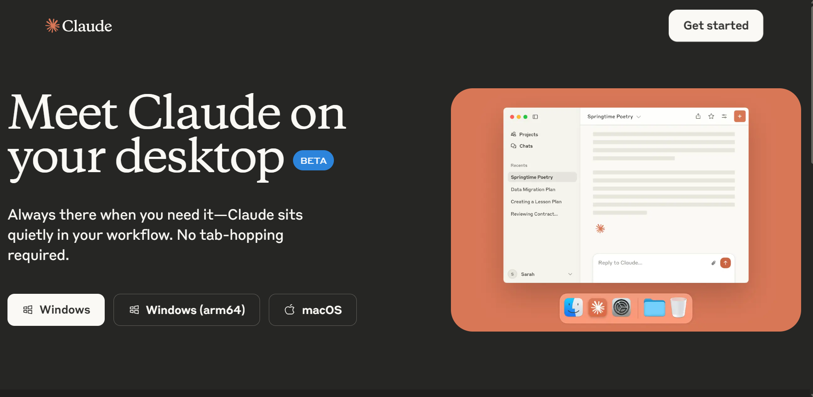
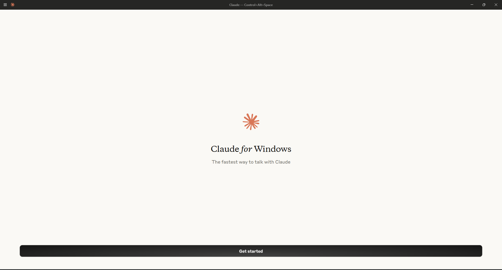
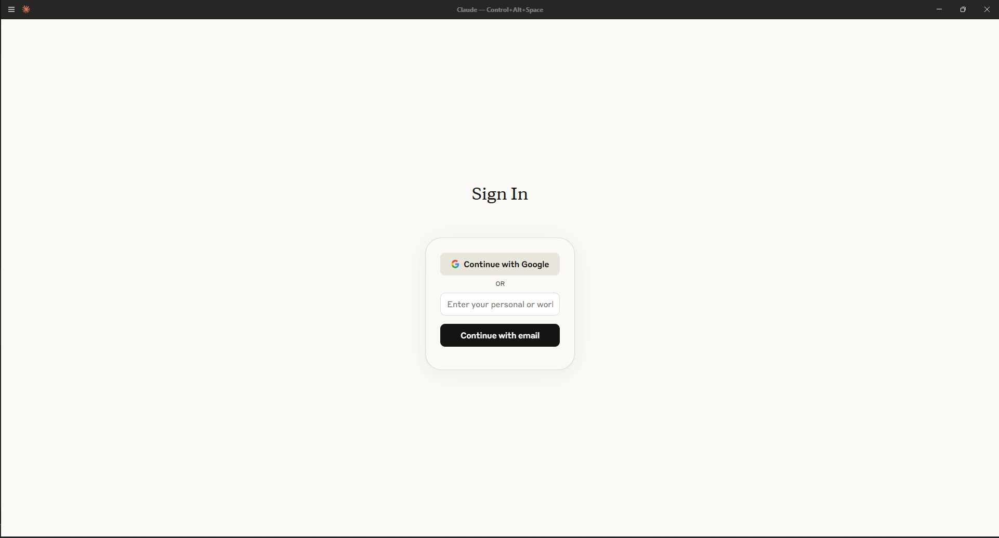
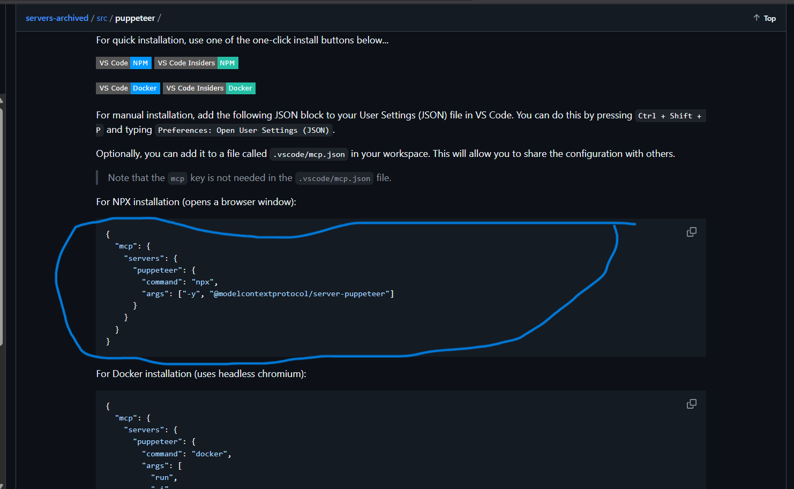
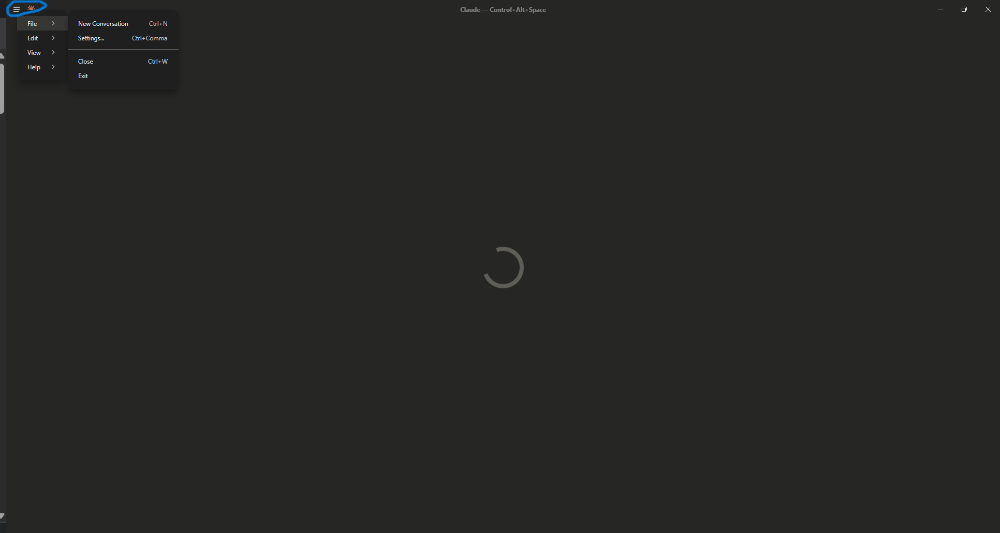
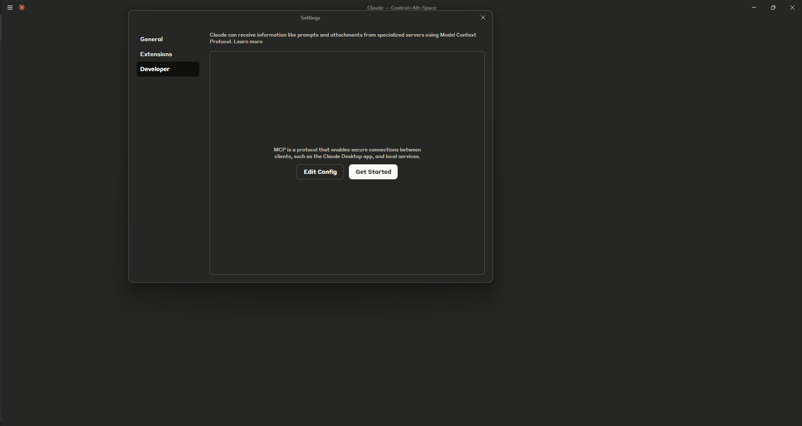
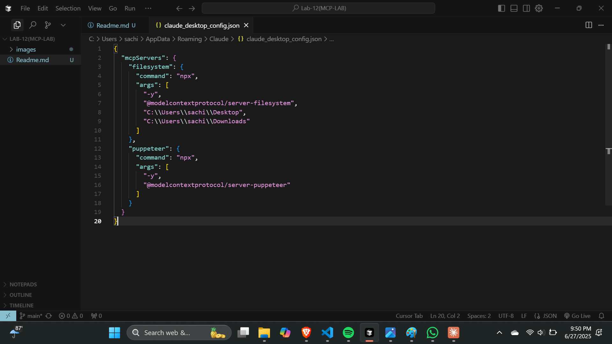
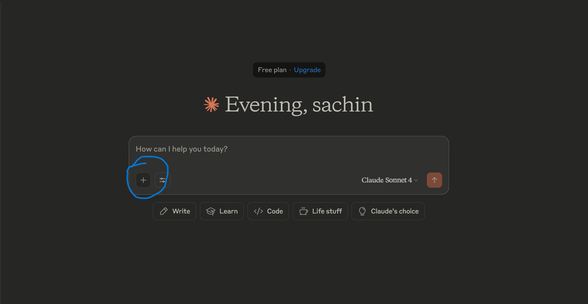
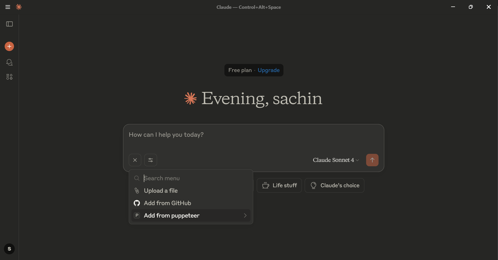

# Understand & Build AI AgentSuperpowers With MCP & A2A

## Table of Contents

- [Resources](#resources)
- [What is MCP?](#what-is-mcp)
- [What is Puppeteer (as an MCP Server)?](#what-is-puppeteer-as-an-mcp-server)
- [Step-by-Step Integration Guide](#okay-now-lets-try-how-you-can-integrate-puppeteer-with-an-intelligent-model—claude-in-our-case-step-by-step-how-we-will-do-it-lets-try-with-mcp)

## What is MCP?

**MCP (Model Context Protocol)** is an open standard protocol, introduced by Anthropic, that defines a standardized way for AI agents—especially large language models (LLMs)—to access and interact with external tools, data sources, and APIs. MCP acts as a universal connector, allowing AI models to pull in real-time context (like files, database rows, or API responses) and invoke external functions or tools through a consistent interface.

### Why MCP Matters

MCP simplifies the integration of AI agents with business tools, APIs, and data, making it easier to build powerful, context-aware AI applications. It is especially useful for:

- Enabling LLMs to securely access internal APIs and business data
- Equipping enterprise agents with real-time, structured context
- Dynamically constructing prompts based on user sessions or system state

In summary, MCP connects AI agents to the tools and data they need, making them more capable, flexible, and useful in real-world applications.

## What is Puppeteer ?

**Puppeteer** is a Model Context Protocol (MCP) server that provides browser automation capabilities using the Puppeteer library. This server enables large language models (LLMs) and AI agents to interact with web pages, take screenshots, and execute JavaScript in a real browser environment—all through standardized MCP tool calls.

## Resources

- [Watch the full integration process on YouTube](https://www.youtube.com/watch?v=m2zVpS7aIm4)
- [Puppeteer MCP Server GitHub Repository](https://github.com/modelcontextprotocol/servers-archived/tree/main/src/puppeteer)
- [Claude Download Page](https://claude.ai/download)

---

## Prerequisites

- Node.js (v14+ recommended)
- npx (comes with Node.js)
- Claude account ([Sign up here](https://claude.ai/))
- Access to the Puppeteer MCP server repository

## Okay, now let's try how you can integrate Puppeteer with an intelligent model—Claude, in our case step by step! How we will do it let's try with MCP.

### Step 1: Download Claude to Your Machine

Download the Claude by visiting: [https://claude.ai/download](https://claude.ai/download)



---

### Step 2: Open Claude and Click on Get Started

Once you have downloaded and set up Claude on your local machine, open the Claude application. On the welcome screen, click on the 'Get Started' button to begin the setup process.



---

### Step 3: Log in to Your Claude Account

After clicking 'Get Started', you will be prompted to log in.


_Figure: Claude login screen_

---

### Step 4: Get the npx Command from the Puppeteer GitHub Repository

Once you are done logging in to Claude, go to the Puppeteer GitHub repository. Scroll down in the README file until you find the npx command for running the Puppeteer MCP server. Copy this command for use in the next step.

[Click to access Puppeteer MCP Server on GitHub](https://github.com/modelcontextprotocol/servers-archived/tree/main/src/puppeteer)



---

### Step 5: Configure Claude Settings

Now, return to your Claude application. At the top, click on the icon, then select 'Files', and then 'Settings'. This is where you will configure the integration with Puppeteer MCP server.



---

### Step 6: Edit Developer Config in Claude

In the Settings menu, go to the 'Developer' section mode. Then, click on 'Edit Config' button. This will allow you to add or modify the configuration needed to connect to the Puppeteer MCP server.



---

### Step 7: Update the Configuration File (`claude_desktop_config`)

Okay, now once you click on the 'Edit Config' button, you will be redirected to the configuration file. The file is usually named `claude_desktop_config`. Open this file in any JSON editor—Notepad, VS Code, or (as we are using here) Cursor. You can use any editor you prefer.

Replace or update the configuration with the following code:

```json
{
  "mcpServers": {
    "filesystem": {
      "command": "npx",
      "args": [
        "-y",
        "@modelcontextprotocol/server-filesystem",
        "C:\\Users\\sachi\\Desktop",
        "C:\\Users\\sachi\\Downloads"
      ]
    },
    "puppeteer": {
      "command": "npx",
      "args": ["-y", "@modelcontextprotocol/server-puppeteer"]
    }
  }
}
```

> **Note:**
> The values in the configuration (such as file paths and arguments) should be adjusted according to your own machine and setup. Make sure to update the paths (e.g., `C:\Users\sachi\Desktop`) to match the directories on your computer.



---

### Step 8: Save and Reopen Claude

Once you have finished editing and saving the configuration file, close and reopen your Claude application. This will ensure that the new settings take effect and your integration with the Puppeteer MCP server is active.

---

### Step 9: Click on the Addition (+) Symbol

After reopening Claude, click on the addition (+) symbol in the interface. This will allow you to add or start a new integration, project, or workflow as needed.



---

### Step 10: Click on 'Add from Puppeteer'

After clicking the addition (+) symbol, select the option 'Add from Puppeteer'. This will connect your Claude application to the Puppeteer MCP server and enable browser automation features.



---

### Step 11: Add the Browser Console Log File in Your Chat

To facilitate troubleshooting or verify the connection, include the browser console log file in your chat.

---

### Step 12: Ask a Question and See Real-Time Web Content Fetching

Now, try asking a question in Claude that requires fetching content from a website (for example, "go get me latest filling details for SEC.gov for wallmart"). You will see that Claude, using the Puppeteer integration, fetches the content from the website in real time. You can observe all the actions—like navigating to the site, extracting information, and returning results—happening live!

---

> **Tip:** You can use any JSON editor, but VS Code provides syntax highlighting and error checking.

> ⚠️ **Warning:** Never share your configuration file with sensitive paths or credentials.

---
