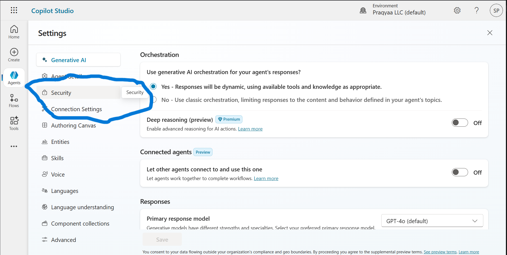

# From Agent to UI: Seamless Integration of a Knowledge Copilot into Your Website

---

## Table of Contents

1. [Introduction](#introduction)
2. [Prerequisites](#prerequisites)
3. [Step-by-Step Implementation Guide](#step-by-step-implementation-guide)
4. [Best Practices & Tips](#best-practices--tips)
5. [Troubleshooting](#troubleshooting)
6. [Conclusion](#conclusion)

---

## Introduction

Welcome! This guide will teach you, step by step, how to build, configure, and integrate a Microsoft Copilot Agent that processes knowledge sources and provides intelligent responses through your webiste and your own custom frontend. This document is designed for hands-on learning and is suitable for both beginners and experienced professionals.

---

## Prerequisites

Before you begin, ensure you have the following:

- A working professional email address
- Access to [Microsoft Copilot Studio](https://copilotstudio.microsoft.com)
- Access to [V0](https://v0.dev/)
- Access to Microsoft Teams

> **Note:** If you do not have these prerequisites, please contact Sachin for credentials.

---

## Step-by-Step Implementation Guide

### Step 1: Access Copilot Studio

1. Open your web browser
2. Go to [https://copilotstudio.microsoft.com](https://copilotstudio.microsoft.com)
3. You will see the Microsoft Copilot Studio landing page
4. Click on "Sign in" in the top right corner
5. Use your professional email address to sign in. If you don't have one, please contact Sachin and he will provide it.
6. After signing in, you'll see the dashboard, something like this as provided in the below image:


### Step 2: Navigate to Agents

1. Navigate to the left side panel of the dashboard
2. Locate and select the "Agents" option in the navigation menu
3. This will direct you to the agents management page where you can create and manage your copilot agents
4. Click on the "New Agent" button


### Step 3: Create Your Agent

1. You'll see a chat interface where you can describe your agent idea
2. Type in the following prompt to create a knowledge-based agent:
   ```
   Create an agent that takes user input and responds using only the knowledge that has been previously provided to it. The agent should not generate responses from external sources or its own assumptions, but instead rely solely on the internal knowledge base we've given it.
   ```
3. The AI will ask you questions to understand your requirements better, such as:

   - What type of knowledge will be provided?
   - Suitable name for your agent

4. Based on your responses, it will:
   - Suggest a suitable flow for your use case
   - Provide recommendations for implementation
   - Help you define the agent's capabilities


### Step 4: Create Your Agent (Direct)

1. After exploring the interface and understanding the flow, look for the "Create" button at the top of the page
2. Click on the "Create" button to start building your agent
3. Since we already have a clear idea of what we're building (a knowledge-based agent), we can skip the chat interface and proceed directly to creation


### Step 5: Review Agent Description

1. After clicking Create, you'll see a new interface where the agent has already provided a description based on your prompt
2. **The agent has automatically generated a description that matches your requirements for a knowledge-based agent that only responds using provided knowledge**
3. Review the description to ensure it aligns with your needs


### Step 6: Add Knowledge to Your Agent

Great! Now that we have our agent set up, let's teach it some knowledge. Here's what we'll do:

1. Look at the top of the page - you'll see several tabs
2. Click on the "Knowledge" tab - this is where we'll add all the information our agent needs to know
3. Think of this as teaching our agent everything it needs to help users


### Step 7: Add Knowledge Sources

Now, let's feed our agent with some knowledge! You'll see various options to add resources:

1. Upload files (PDFs, documents, etc.)
2. Add website URLs
3. Connect to other data sources
4. Import from existing knowledge bases

For this example, we're using an MSA document, but you can use any type of content that contains the information you want your agent to know about. The agent will process and learn from whatever resources you provide.


### Step 8: Test Your Agent

Great! Now that your agent has learned from the knowledge you provided, let's test it out:

1. Look for the "Test" button in the top right corner
2. Click on it to open the testing interface
3. Here you can ask questions about the content you provided
4. The agent will respond based only on the knowledge you've given it

This is where you can see your agent in action and make sure it's working as expected!

#### Test Button


#### Testing Interface


### Step 9: Publish Your Agent

Now that we've tested our agent and it's working well, let's make it available for your team:

1. Look for the "Publish" button in the top right corner
2. Click on it to start the publishing process
3. This will make your agent available for integration with MS Teams
4. The publishing process might take a few minutes


### Step 10: Access Agent Settings

Now that your agent is published, you may want to configure additional options or manage integrations:

1. Go to the top right side of the Copilot Studio interface
2. Click on the "Settings" button (usually represented by a gear icon)
3. Here you can adjust various settings for your agent, such as permissions, channels, and more

This allows you to further customize your agent's behavior and integrations as needed.


### Step 11: Access Security Settings

1. From the sidebar on the left, locate and click on the "Security" option
2. This section allows you to manage security settings for your agent, such as access controls and permissions

Adjust these settings as needed to ensure your agent is secure and accessible only to the appropriate users.



### Step 12: Configure Authorization Settings

1. In the Security section, click on the "Authorization" tab
2. Select the option "No Authorization"
3. Click on the "Save" button to apply your changes

This will allow your agent to be accessed without additional authorization requirements, depending on your use case.


### Step 13: Go to the Channel Tab

1. Once you have configured authorization, look at the top of the page
2. Click on the "Channel" tab from the top tabs
3. This section allows you to manage and configure the channels through which your agent will be available (such as MS Teams)


### Step 14: Select Web App Channel

1. In the Channel tab, look for the list of available channels
2. Select the "Web App" option
3. This will allow you to configure and enable your agent for web-based interactions


### Step 15: Copy the iFrame Code

1. After selecting the Web App channel, you will see an iFrame code displayed on the page (as shown in the image below)
2. Copy the iFrame code provided
3. You can use this code to embed your agent into a website or web application


### Step 16: Create the Frontend with V0 and Integrate the Agent

1. Go to [V0](https://v0.dev/) – a tool for quickly building frontend UIs
2. Use V0 to design and create your desired frontend interface
3. Once your frontend is ready, paste the iFrame code (copied in the previous step) into your frontend where you want the agent to appear
4. Deploy or preview your frontend to see the integrated Copilot agent in action

This allows users to interact with your Copilot agent directly from your custom frontend.

### Step 17: Provide a Detailed Prompt for V0

When using V0 to generate your frontend, use a detailed prompt to get the best results. Here is an example prompt you can use:

**Prompt:**

---

**Role:**
You are a frontend developer tasked with building a modern, user-friendly landing page for a startup.

**Instruction:**
Create a landing page for my startup that processes MSA (Master Service Agreement) documents and allows users to chat with their document. I have already created a chatbot; you just need to embed it in the code. Here is the embed code:

```html
<!DOCTYPE html>
<html>
  <body>
    <iframe
      src="https://copilotstudio.microsoft.com/environments/Default-e8ae86bd-cb97-44f9-843e-efc6bc02d759/bots/cr7b3_knowledgeBaseAgent/webchat?__version__=2"
      frameborder="0"
      style="width: 100%; height: 100%;"
    ></iframe>
  </body>
</html>
```

**Design:**

- The landing page should have a clean, professional, and modern look
- Include a prominent header with the startup name and a brief description
- Add a section explaining the benefits of processing MSA documents with the chatbot
- Ensure the embedded chatbot is clearly visible and accessible
- Use a responsive layout that works well on both desktop and mobile devices

**Guardrails:**

- Do not remove or alter the provided iFrame embed code
- Do not add unnecessary animations or distracting elements
- Ensure accessibility best practices are followed (contrast, font size, alt text, etc.)
- The page should load quickly and be optimized for performance

---

Use this prompt in V0 to generate a high-quality landing page that meets your requirements.

### Step 18: See How It Works (Demo Video)

To see the complete process and how your integrated Copilot agent works within your frontend, watch the demo video below:


This video demonstrates the user experience from setup to interacting with the embedded chatbot on your landing page.

---

## Best Practices & Tips

1. **Use Detailed Prompts**: When using V0 to generate your frontend, provide a detailed prompt to get the best results.
2. **Ensure Accessibility**: Make sure your frontend is accessible to all users, including those with disabilities.
3. **Optimize Performance**: Ensure your frontend loads quickly and is optimized for performance.

---

## Troubleshooting

1. **iFrame Code Not Working**: If the iFrame code is not working, ensure that the code is correctly copied and pasted into your frontend.
2. **Frontend Not Displaying**: If the frontend is not displaying, ensure that the frontend is correctly configured and that the iFrame code is correctly embedded.

---

## Conclusion

Congratulations! You have successfully built, configured, and integrated a Microsoft Copilot Agent that processes knowledge sources and provides intelligent responses on your own custom frontend. This guide provided a step-by-step implementation guide, best practices, and troubleshooting tips to help you through the process.

---
