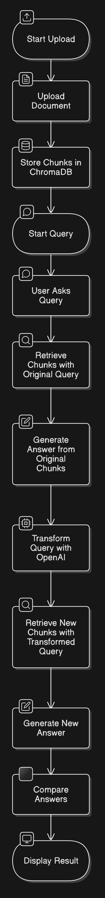
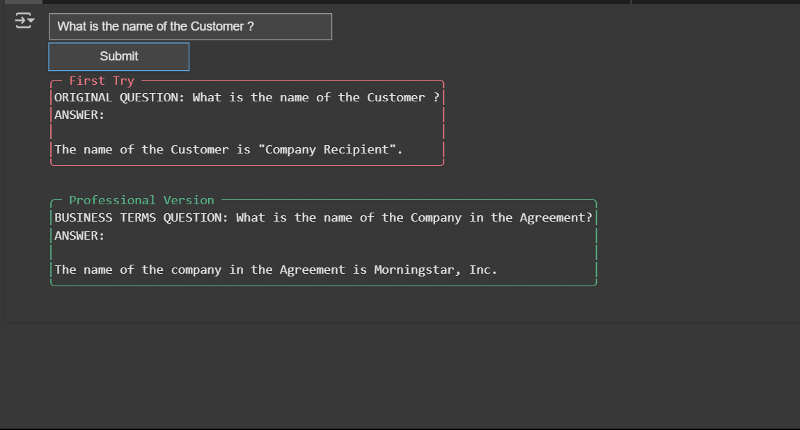

# 📌 **Document QA System using LangChain & ChromaDB**

You can open this Jupyter notebook directly in Google Colab by clicking the link below:

[](<https://colab.research.google.com/github.com/initmahesh/>)

## 📌 Objective
Create a simple system that can:
1. Accept PDF documents from users
2. Understand questions about the document
3. Provide accurate answers using AI
4. Automatically improve its answers by refining questions

## ❓ Problem Statement
Traditional document systems struggle with:
- Handling large documents
- Understanding natural language questions
- Providing precise answers from long texts
- Improving answers automatically

## 💡 Solution
Our system solves these problems using:
1. **Document Processing**: Breaks files into manageable chunks
2. **Smart Storage**: Stores content for quick searching
3. **AI Assistance**: Uses language models to understand questions
4. **Self-Improvement**: Automatically refines questions for better answers



---

## 🤖 What is Agentic RAG?
**RAG (Retrieval-Augmented Generation)**:
- Combines document search with AI answers
- "Looks up" information before answering

**Agentic RAG** adds:
- Ability to automatically improve questions
- Self-correcting answers
- Better understanding through context

*Example:*
If you ask "customer name?", the system might change it to "company name?" for better results

---

## 💻 How to Use
- Upload PDF  
- Click on **Process File** to get a notification message:  
  **"File processed and stored in ChromaDB!"**  
- Ask a question **(e.g., "What is the Name of the Customer?")**  
- Click on **Submit** and wait for a few seconds  

### 🔍 System Shows:
- **First try answer**  
- **Improved answer**  
- **What changed and why** 

---

## 📜 **Code Breakdown & Explanation**

### 📌 **Step 1: Installing Required Libraries**
```python
!pip install chromadb langchain pypdf2 sentence-transformers pyboxen
```
Before we start, we install the necessary Python libraries:
- **chromadb** – Vector database for storing and retrieving text efficiently.
- **langchain** – A framework for AI-powered applications.
- **pypdf2** – For extracting text from PDF files.
- **sentence-transformers** – To convert text into AI-readable embeddings.
- **pyboxen** – For displaying styled output in the notebook.

---

### 📌 **Step 2: Importing Required Modules**
```python
import ipywidgets as widgets  # For creating interactive UI elements
from IPython.display import display, clear_output  # To control UI output
from langchain.vectorstores import Chroma  # For vector-based search
from langchain.embeddings import HuggingFaceEmbeddings  # Convert text into AI-readable format
from langchain.text_splitter import RecursiveCharacterTextSplitter  # Break text into small pieces
from langchain.llms import OpenAI  # AI-powered language model
from langchain.prompts import PromptTemplate  # Helps structure prompts
from PyPDF2 import PdfReader  # Read and extract text from PDF files
import chromadb  # The ChromaDB client for database interaction
from pyboxen import boxen  # Stylish text boxes for output
import os  # Access environment variables (e.g., API keys)
```

### 🌐 **About LangChain (In Simple Terms)**
LangChain is a framework that helps developers **connect AI models with external data sources** like databases or APIs. In this project, we use LangChain to:
- Embed text for efficient search.
- Retrieve relevant information from the database.
- Generate answers using OpenAI’s model.

---

### 📌 **Step 3: Initializing Components**
```python
embeddings = HuggingFaceEmbeddings(model_name="all-MiniLM-L6-v2")
chroma_client = chromadb.PersistentClient(path="./chroma_db")
os.environ["OPENAI_API_KEY"] = "YOUR_API_KEY"
llm = OpenAI(temperature=0)
```
- **Embeddings:** We use `HuggingFaceEmbeddings` to convert text into numerical format.
- **ChromaDB Client:** Creates a database at `./chroma_db` to store text embeddings.
- **OpenAI API:** We set the API key to access OpenAI’s language model.
[Generate Your OpenAI API Key](https://github.com/initmahesh/MLAI-community-labs/tree/main/Class-Labs/Lab-0(Pre-requisites))

- **LLM Initialization:** We set the temperature to `0` for more deterministic responses.

---

### 📌 **Step 4: Upload & Process PDF File**
```python
uploader = widgets.FileUpload(accept='.pdf', multiple=False)
display(uploader)
```
We create a file upload widget to allow users to upload a PDF.

[Reference Document You Can Use](https://drive.google.com/file/d/1WWa_TgI49HIAGFuXTNvMLtkFBU6ZduHq/view?usp=sharing)

#### **Processing the Uploaded File**
```python
def process_file(b):
    with process_output:
        clear_output()
        if not uploader.value:
            print("No file uploaded!")
            return
        
        pdf = PdfReader(uploader.value[0])
        text = "\n".join([page.extract_text() for page in pdf.pages])
        text_splitter = RecursiveCharacterTextSplitter(chunk_size=1000, chunk_overlap=100)
        chunks = text_splitter.split_text(text)
        Chroma.from_texts(chunks, embeddings, client=chroma_client, collection_name="doc_collection")
        print(boxen("File processed and stored in ChromaDB!", title="Success", color="green"))
```
- Reads the PDF and extracts text.
- Splits the text into smaller **chunks**.
- Stores these chunks in **ChromaDB**.

---

### 📌 **Step 5: Query Processing Functions**

#### **Retrieve Relevant Chunks**
```python
def retrieve_chunks(query, collection_name="doc_collection"):
    collection = chroma_client.get_collection(collection_name)
    results = collection.query(query_texts=[query], n_results=3)
    return results['documents'][0]
```
- Searches for the most relevant text chunks **based on the user’s query**.

#### **Generate AI-Powered Answers**
```python
def generate_answer(query, chunks):
    context = "\n\n".join(chunks)
    prompt = f"Answer this query: {query}\nUsing this context:\n{context}"
    return llm(prompt)
```
- Uses OpenAI’s language model to generate an answer based on **retrieved chunks**.

#### **Optimize Query for Better Results**
```python
def transform_query(original_query, original_chunks):
    context = "\n".join(original_chunks[:2])
    template = """Optimize this query for better results. Consider context:
    Context: {context}
    Original Query: {query}
    Optimized Query:"""
    return llm(template.format(context=context, query=original_query))
```
- Uses AI to **rewrite the query** for improved results.

---
# 📌 Step 5.5: Add Knowledge Graph Component

## 🧠 What is the Knowledge Graph Component?
The **Knowledge Graph Component** enhances user queries by mapping common terms to predefined business relationships. This ensures queries align with standardized business terminology, improving response accuracy.

## ⚙️ How It Works:
1. **Predefined Mappings:**  
   The system maintains a dictionary of business term relationships:
   ```python
   kg_mappings = {
       "customer": "customer referenced in the Master Agreement and Service Order",
       "Master Agreement": "Contract",
       "Service Order": "Service Agreement",
       "client": "Organization",
       "product": "Solution"
   }
   ```

---

### 📌 **Step 6: Query Interface**
```python
query_input = widgets.Text(placeholder="Enter your query")
submit_btn = widgets.Button(description="Submit")
query_output = widgets.Output()
```
- Creates a simple **text input** for user queries.
- Displays responses interactively.

```python
def handle_query(b):
    with query_output:
        clear_output()
        query = query_input.value
        original_chunks = retrieve_chunks(query)
        original_answer = generate_answer(query, original_chunks)
        new_query = transform_query(query, original_chunks)
        new_chunks = retrieve_chunks(new_query)
        new_answer = generate_answer(new_query, new_chunks)
        print(boxen(f"QUERY: {query}\nANSWER: {original_answer}", title="Original Response", color="blue"))
        print(boxen(f"OPTIMIZED QUERY: {new_query}\nNEW ANSWER: {new_answer}", title="Optimized Response", color="yellow"))
```
- Retrieves an answer **before and after query optimization**.
- Displays the **difference in responses**.

--- 

## Output


© **All rights reserved Mahesh Yadav Institute**. No part of this course can be reproduced, distributed, or transmitted in any form without permission.
