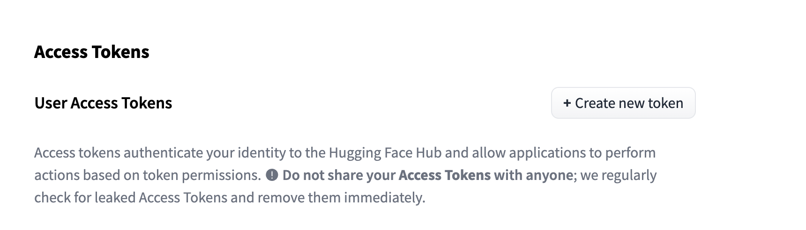
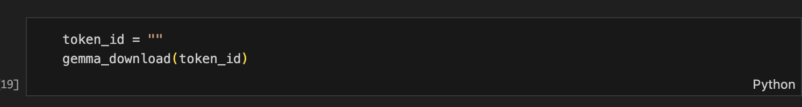
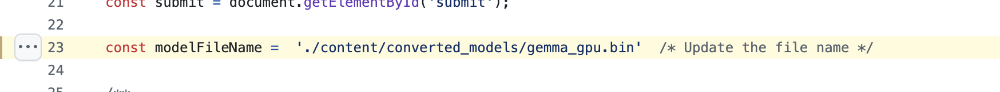
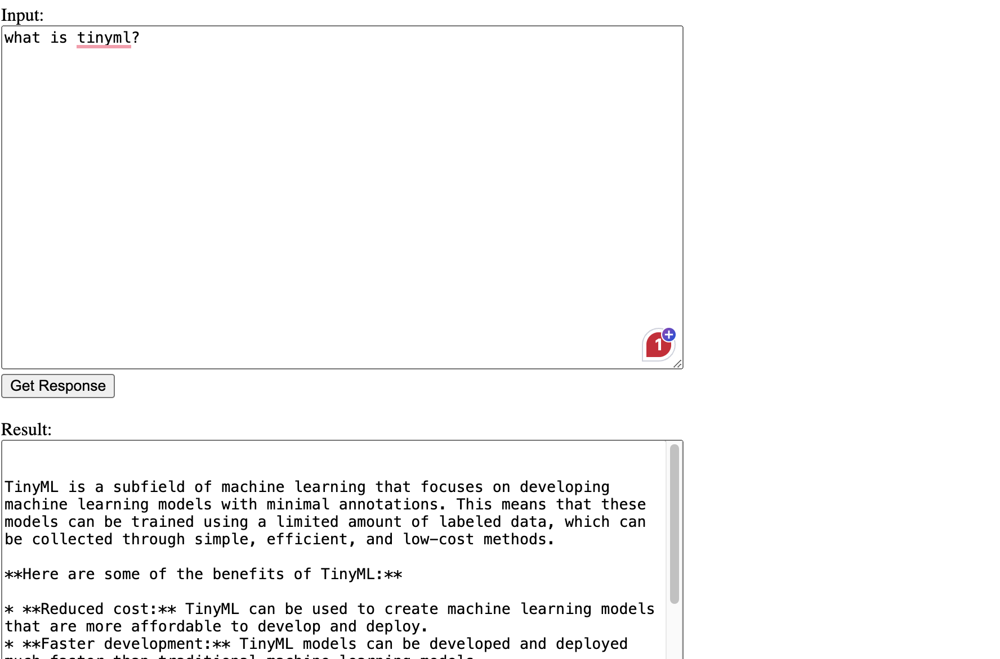

## This project demonstrates how to use Mediapipe to compress a Gemma model into a TensorFlow Lite model.

[](https://colab.research.google.com/drive/1xMaFnhgg5cNwMO9dAQfhEaMD2UCus8sW?usp=sharing)

## Requirements

- Jupyter Notebook
- Mediapipe
- TensorFlow
- Hugging Face token (for downloading the Gemma model)

## Step 1: Downloading the Gemma Model 

1. Download the Gemma Model

To download the Gemma model, you need a Hugging Face token. You can obtain one by creating an account on the Hugging Face website.

- Once you are logged in to your hugging face account, navigate to the [access tokens](https://huggingface.co/settings/tokens) page 

- Click on create new token



- Once you have the access token, save it in a separate file and paste it in the [cell](https://colab.research.google.com/drive/1xMaFnhgg5cNwMO9dAQfhEaMD2UCus8sW?usp=sharing) as show in the figure below




2. Download the tflite model directly

If the conversion process is taking too long, you can follow the below steps to download the tflite model directly using the following link


[Download Gemma Model](https://drive.google.com/file/d/1-1SgjPC2txY57YPGi3Sf633H98wO9Hjd/view?usp=drive_link)


3. Update the Model Name

After downloading the model, you will need to replace the model name in the provided [index.js](https://github.com/initmahesh/MLAI-community-labs/blob/a8cc5d0c90e68ce9c7cd8905d69310a09836a103/Class-Labs/Lab-tinyml/index.js#L23) script. Make sure to set it to the name of the model you downloaded as shown in the figure below




4. Inference on the tflite model

The next step is to run the script to do inference on the downloaded tflite model.

In order to do so, run the following command in your terminal to start the Python server:

```bash
python3 -m http.server 8000
````

You can now access the inference endpoint on http://localhost:8000.

You should see a screen like below


You can now write a query, click on  "Get Response" button and see the below screen

