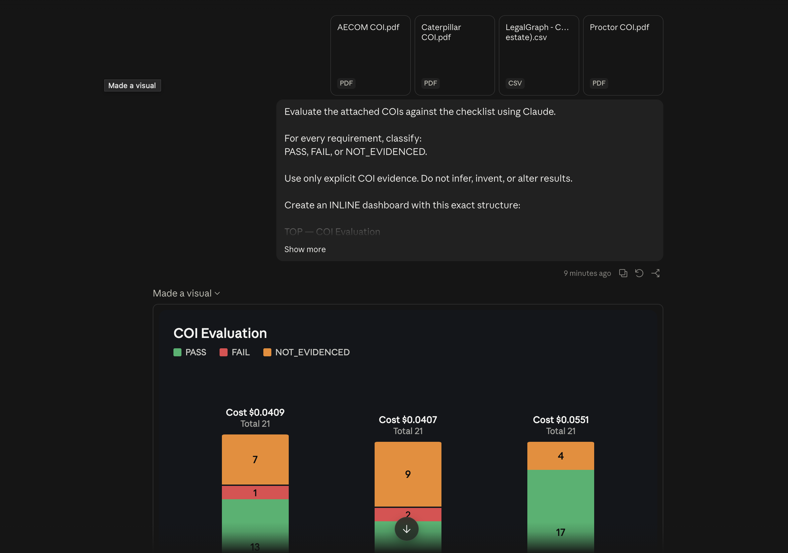
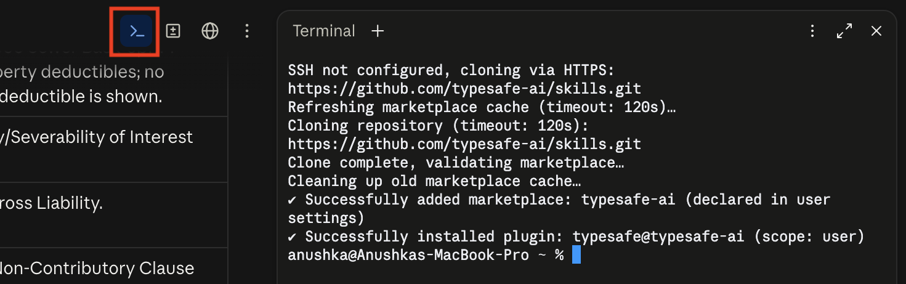
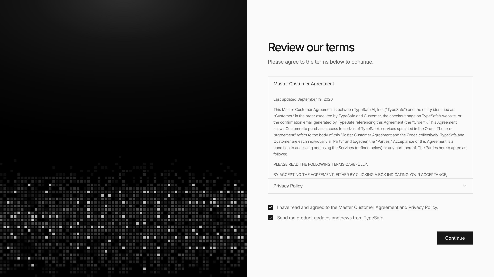
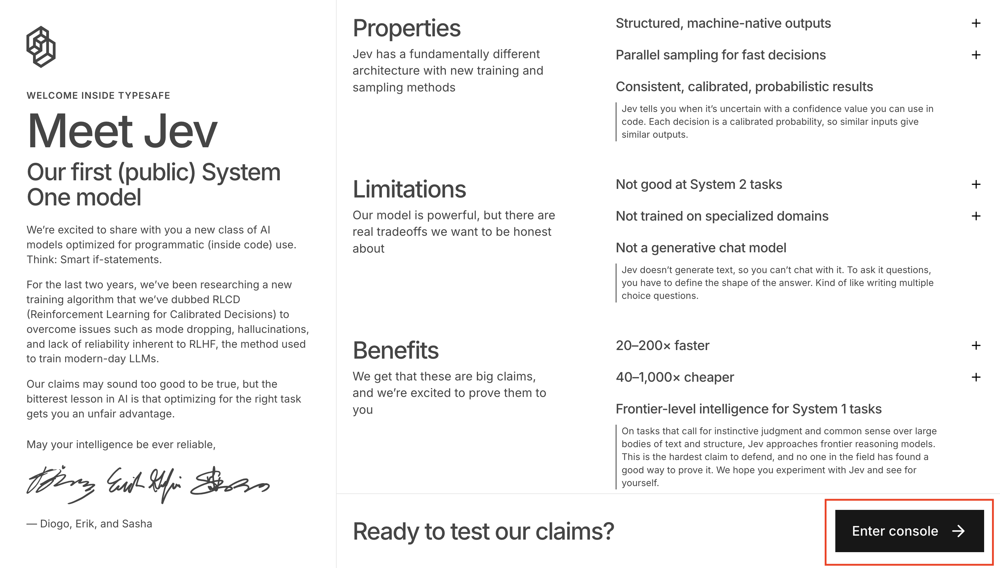
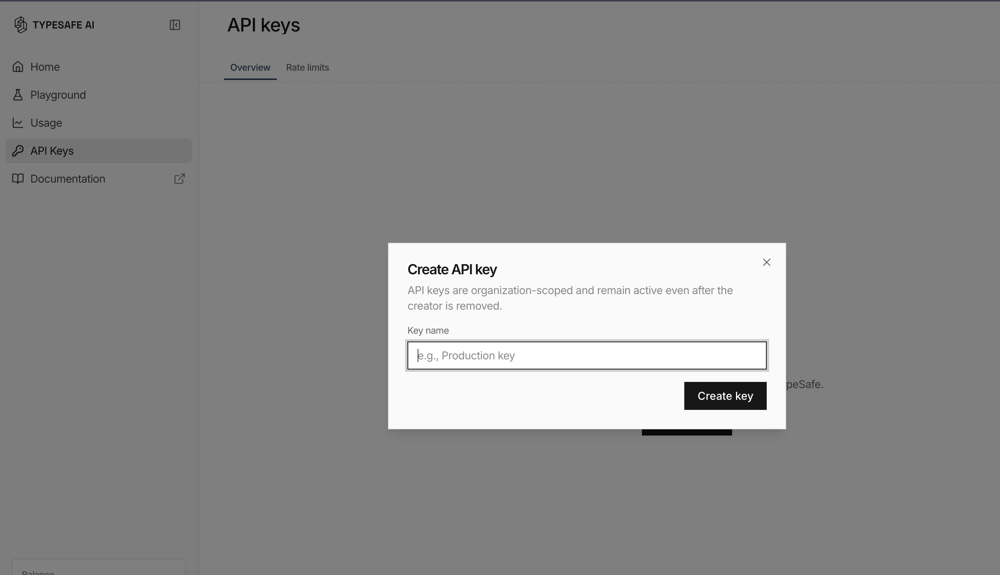
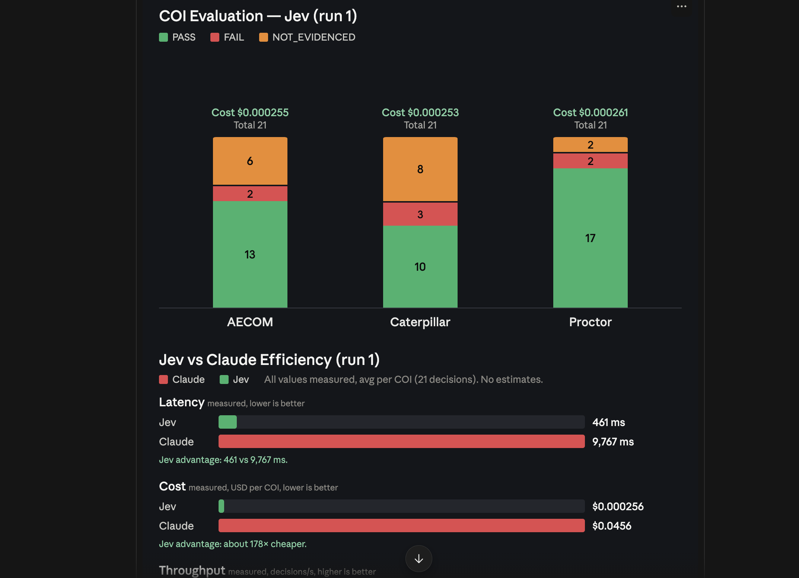
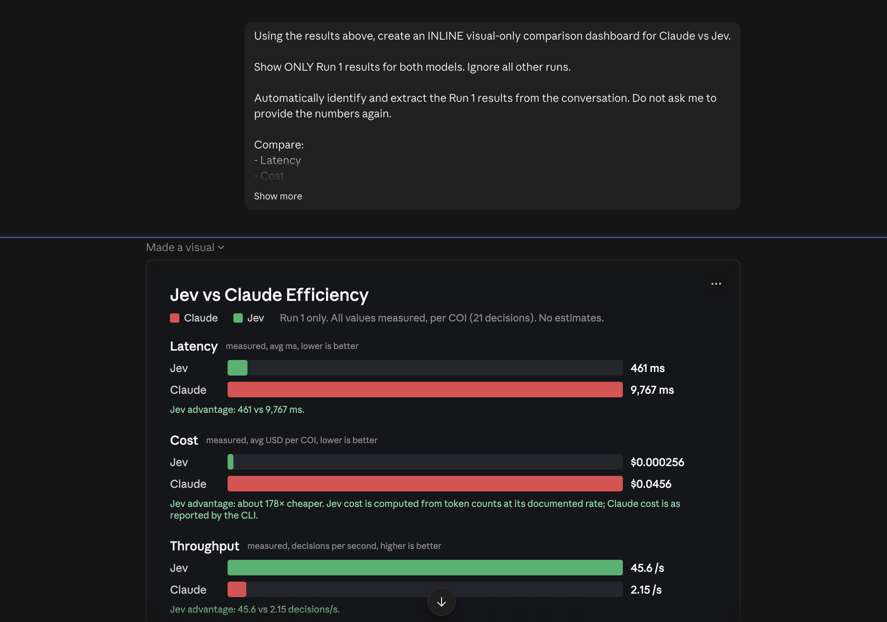

# Lab: Make Claude Faster and Cheaper with Jev

## Let Jev Decide, Let Claude Write

Say you have a pile of insurance certificates (COIs) and a checklist they all need to meet. You ask Claude to check each one. It works, but Claude reads, thinks and writes a full answer every single time. That's slow, and the cost adds up fast when the pile gets big.

Here's the catch: checking a COI against a checklist isn't writing. It's **deciding**. Pass, fail, or not enough information. And deciding is exactly what Jev is built for.

In this lab you'll run the same check twice, once with Claude alone and once with Jev making the decisions, then compare the results side by side.

Here's the flow for this lab:

- **Run it with Claude only.** See how long it takes and what it costs.
- **Add Jev.** Install the plugin and connect it.
- **Run it again with Jev.** Same documents, same checklist.
- **Compare.** Let the numbers tell you which one wins.

---

## Table of Contents

- [Prerequisites](#prerequisites)
- [Part 1: The Problem](#part-1-the-problem)
- [Part 2: The Solution](#part-2-the-solution)
- [Part 3: Run the Check with Claude Only](#part-3-run-the-check-with-claude-only)
- [Part 4: Install and Connect Jev](#part-4-install-and-connect-jev)
- [Part 5: Run the Check with Jev](#part-5-run-the-check-with-jev)
- [Part 6: Compare the Results](#part-6-compare-the-results)

---

## Prerequisites

✅ **Claude Code Desktop** installed and signed in.

✅ **Three COI documents** to check. Open each link and download the file:

- [AECOM COI](https://drive.google.com/file/d/1oHl-EZKmRITs7JJYFRZAE6IoOR32IMG2/view?usp=sharing)
- [Caterpillar COI](https://drive.google.com/file/d/1FJrG_CdcrlgCE41Nzg7JNTZ7XSVP8Ksp/view?usp=sharing)
- [Proctor COI](https://drive.google.com/file/d/1mWFw4nI8gmTtF-v76OCM0V15_TS5caFL/view?usp=sharing)

✅ **The compliance checklist.** Open the link and download the file:

- [COI Checklist](https://drive.google.com/file/d/1MYiz9iW_7vdpfK6U3xSsnOYixQKtLjYE/view?usp=sharing)

---

## Part 1: The Problem

Checking a COI means going through the checklist one line at a time and asking: does this document actually show this? Claude can do it, but it's using a very powerful model that writes full sentences to answer what is really a simple question.

The result:

- **It's expensive.** You pay for all that thinking, on every document.
- **It doesn't scale.** Three COIs is fine. Three thousand is not.

---

## Part 2: The Solution

### What's Jev

**Jev** is a different kind of AI model. It doesn't write anything. You hand it some text and a few questions, and it answers almost instantly, for almost nothing. It's made for **sorting and deciding**.

It can answer in three ways:

- **Pick one** option from a list (like PASS, FAIL or NOT_EVIDENCED).
- **Give a score** on a scale.
- **Say how likely** something is true.

### The Rule

> **Jev decides, Claude writes.**

Jev makes every call. Claude only formats the results into something readable. When you combine them, you get the speed of Jev with the clear writing of Claude.

---

## Part 3: Run the Check with Claude Only

First, set a baseline. Let Claude make every decision on its own.

1. Open Claude Code Desktop and start a new chat.
2. Attach your **COI** and the **checklist**.
3. Paste this prompt:

```
Evaluate the attached COIs against the checklist using Claude.

For every requirement, classify:
PASS, FAIL, or NOT_EVIDENCED.

Use only explicit COI evidence. Do not infer, invent, or alter results.

Create an INLINE dashboard with this exact structure:

TOP — COI Evaluation
- 3 vertical stacked bars: AECOM, Caterpillar, Proctor
- Green = PASS
- Red = FAIL
- Orange = NOT_EVIDENCED
- Show counts inside each segment
- Show Cost above each bar
- Show Total requirements above each bar

BOTTOM — "Claude Efficiency (per COI)"
Show horizontal bars for:
- Latency
- Cost
- Throughput

Show the actual value at the end of every bar.
Use red for higher/worse Claude metrics and green for better metrics.
Clearly label measured vs estimated values.

Do NOT show overall score, accuracy score, percentage score, or ranking.
Do NOT create an Artifact, HTML, or downloadable file.
Use actual calculated/measured data only; clearly label estimates.

Match this visual style:
dark background, compact layout, large readable labels, green/red/orange bars, clean typography, and presentation-ready dashboard.
```




---

## Part 4: Install and Connect Jev

### Install the plugin

In your terminal, run these two commands:

```
claude plugin marketplace add typesafe-ai/skills
claude plugin install typesafe@typesafe-ai
```




### Create your API key

Before Claude can reach Jev, you need a Typesafe API key.

1. Go to [https://console.typesafe.ai/](https://console.typesafe.ai/).
2. Enter your email.
3. Agree to the terms and conditions.

4. Skip the next steps.
5. Click **Enter console**.

6. When asked "Can you chat with Jev, TypeSafe's new model?", click **No**.
7. A message says "TypeSafe only responds with structured decisions". Click **Close**.
8. Click **API keys** in the sidebar.
9. Click **Create API key** and create a new key.

10. If your balance shows zero, click **Balance**, then **Add funds**.

> ⚠️ Keep your key private. Don't paste it into any file you might share.

### Add your API key

Now give Claude your key so it can reach Jev. Paste this prompt and replace `TYPESAFE_API_KEY` with your own key when Claude asks for it:

```
i want to add a new kind of AI model called Jev to this workspace. Jev doesn't write anything. you hand it some text plus a few questions, and it answers them almost instantly, for almost nothing. it's made for sorting and deciding.

* Jev is brand new, so you won't know it yet. before anything else, read how it works:
https://docs.typesafe.ai/llms.txt
* i'll use Jev directly through the Typesafe API using a TYPESAFE_API_KEY. follow the official Typesafe docs for the API endpoint, authentication, request format, and response format.
* ask me for my Typesafe API key. keep it somewhere safe on my computer, never inside a file i might share, and never show it back to me.
* Jev can only answer in 3 shapes: pick one option from a list, give a score on a scale, or say how likely something is true. most answers also come back with how sure it is.
* give me full control over when Jev is used. Jev should be off by default and should only be used when i explicitly turn it on or ask to use it. when Jev is off, do not send anything to the Jev API and use the normal model instead.
* do one real test so i can watch it work. make up a short sales email and ask Jev 3 things: how strong a lead is this, what kind of email is it, and does it need a personal reply. show me its answers, how long it took and what it cost. if the test fails, show me the exact error.
* then save what you learned as a reusable skill (or whatever your setup calls a saved instruction), so next time i can say "use Jev to sort these" about any pile of text.

the rule from here on: Jev decides, you write. when Jev isn't sure about something, you make the call yourself. anything you send to Jev leaves my computer, so ask me before sending anything private.
```

> ⚠️ Anything sent to Jev leaves your computer. Never send private documents without checking first.

---

## Part 5: Run the Check with Jev

Same documents, same checklist. This time Jev makes the decisions.

1. Start a new chat.
2. Type `/typesafe` and select **typesafe:typesafe-ai**.

> **Note:** Leave a space between your prompt and the plugin name.

3. Attach your **COI** and the **checklist**.
4. Paste this prompt:

```
Use the attached COIs + checklist.

Use Jev as the sole evaluator; Claude only organizes and visualizes.

For every requirement, classify: PASS, FAIL, or NOT_EVIDENCED. Use only explicit COI evidence; never infer or alter Jev's results.

show only for run 1 

Show:

1. Summary: COI | PASS | FAIL | NOT_EVIDENCED | Cost
2. INLINE stacked bar chart:
   - X: COI
   - Y: requirement count
   - Stacks: PASS / FAIL / NOT_EVIDENCED
   - Show total requirements + cost above each bar
3. Jev vs Claude efficiency visuals for:
   - latency
   - cost
   - throughput

Highlight Jev's advantage where measurable. Use actual values; label estimates.

Do NOT show any overall score, accuracy score, percentage score, or ranking.
Do NOT create an Artifact, HTML, or downloadable file.
All visuals must use actual calculated data.
```



5. Repeat for all three COIs and **save each result**.

---

## Part 6: Compare the Results

Now put the runs side by side. Paste this prompt along with both sets of results:

```
Using the results above, create an INLINE visual-only comparison dashboard for Claude vs Jev.

Show ONLY Run 1 results for both models. Ignore all other runs.

Automatically identify and extract the Run 1 results from the conversation. Do not ask me to provide the numbers again.

Compare:
- Latency
- Cost
- Throughput

Visual requirements:
- Claude = RED
- Jev = GREEN
- Horizontal comparison bars
- Show exact values on each bar
- Clearly label measured vs estimated values
- Highlight Jev's advantage where supported by the actual data
- Title: "Jev vs Claude Efficiency"

Do not invent, modify, or recalculate unsupported values.
Do not show accuracy, scores, PASS/FAIL, or rankings.
Do not create an Artifact, HTML, or downloadable file.
Keep it dark, compact, and presentation-ready.
```


What to look for:

- **Do the decisions match?** High agreement means Jev can be trusted for this job.
- **How much faster is Jev?** Check latency.
- **How much cheaper is Jev?** Check cost.

---

## Reference

[Typesafe agent skill docs](https://docs.typesafe.ai/agent-skill)
