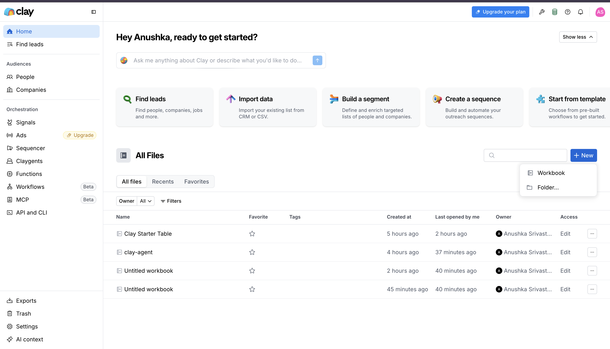
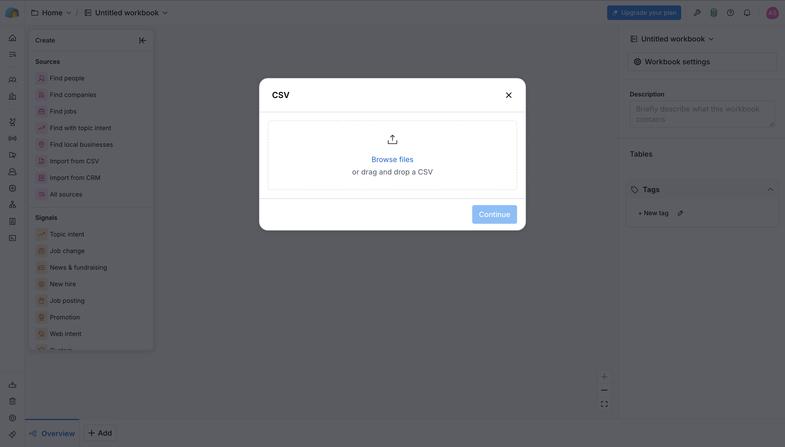
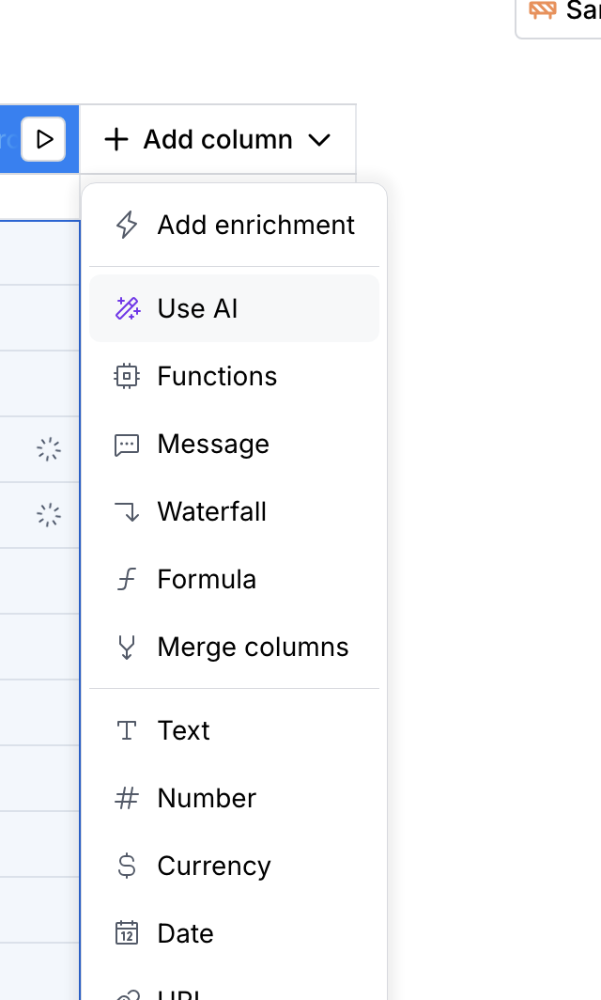
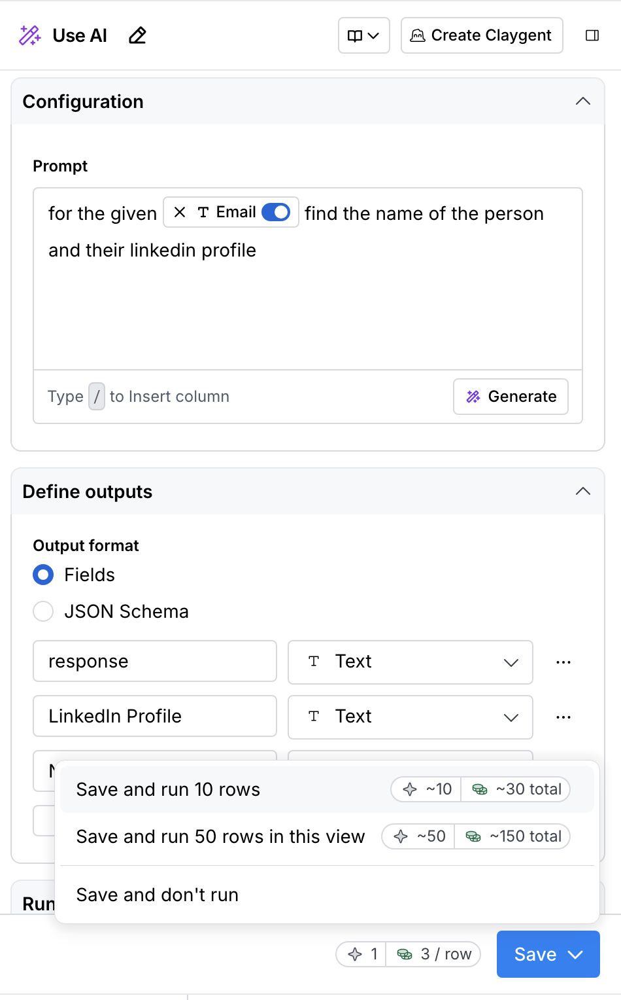
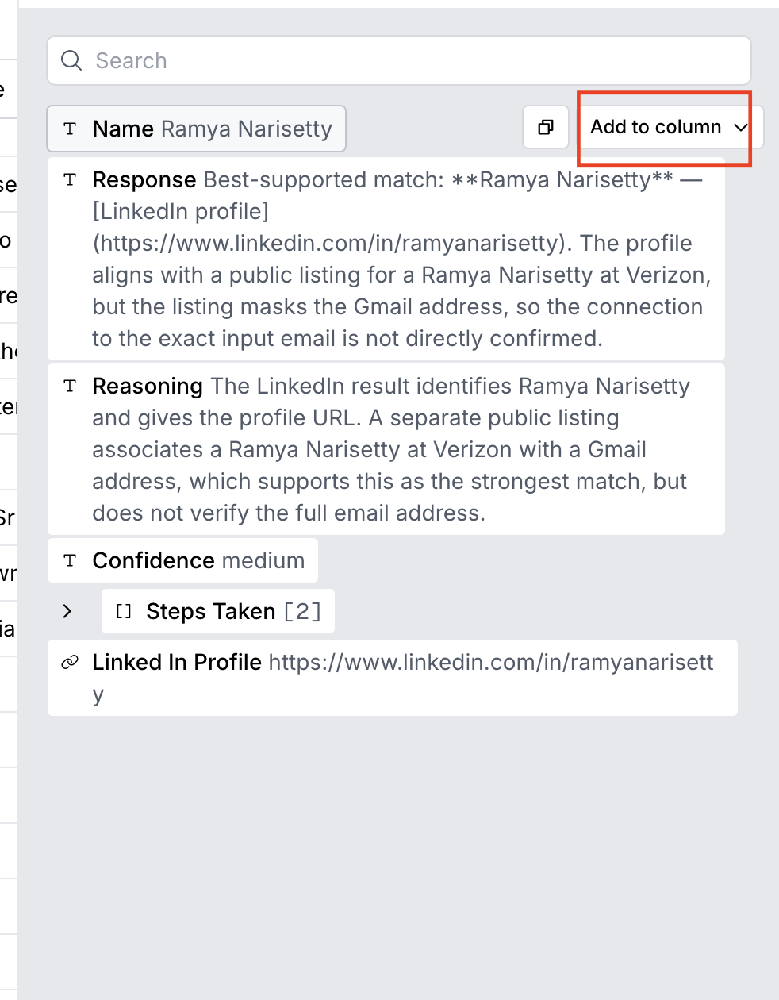

# Build a Qualified Pipeline with Clay

You have a list of leads. But a list is not a pipeline. A pipeline tells you who to call first, what to say, and why they are worth your time. This lab turns a raw CSV of email addresses into exactly that — using Clay and AI, with no code required.

**What you will walk away with:** a scored, ranked, outreach-ready lead table where every row comes with a personalised opening line for your sales team.

---

## Table of Contents

1. [The Problem — You Have Leads, But Not a Pipeline](#1-the-problem--you-have-leads-but-not-a-pipeline)
2. [The Solution — What Clay Does](#2-the-solution--what-clay-does)
3. [Core Concept: What Is Lead Qualification?](#3-core-concept-what-is-lead-qualification)
4. [Step-by-Step: Building Your Pipeline in Clay](#4-step-by-step-building-your-pipeline-in-clay)
   - [Step 1 — Upload Your Lead List](#-step-1--upload-your-lead-list)
   - [Step 2 — Find Names and LinkedIn Profiles from Emails](#-step-2--find-names-and-linkedin-profiles-from-emails)
   - [Step 3 — Qualify Every Lead with AI](#-step-3--qualify-every-lead-with-ai)
   - [Step 4 — Pull the Outputs Into Your Table](#-step-4--pull-the-outputs-into-your-table)
   - [Step 5 — Sort by Confidence and Prioritise](#-step-5--sort-by-confidence-and-prioritise)
5. [What You Just Built — and Why It Matters](#5-what-you-just-built--and-why-it-matters)

---

## 1. The Problem — You Have Leads, But Not a Pipeline

You ran a course. People signed up on Maven. You now have a CSV with hundreds of email addresses.

Here is the honest reality of that list:

- Some of those people are your perfect customer — a PM with five years of experience, already building with AI, one conversation away from buying.
- Some are students who signed up out of curiosity and will never convert.
- Some are engineers who want to learn PM, not become one.
- And most of the rest are somewhere in between — possible fits, but unclear.

**Your sales team cannot tell them apart.** They see a flat list of emails. They will either call everyone (expensive, slow, demoralising when you reach people who don't fit) or call nobody until someone manually researches each row (also slow, and it doesn't scale).

This is the lead qualification problem. It has existed as long as sales has. The difference today is that AI can solve it in minutes — automatically, on every row, at the same time.

---

## 2. The Solution — What Clay Does

Clay is a tool that turns a raw list of contacts into a research-backed, AI-scored, outreach-ready pipeline — without writing a single line of code.

Here is what happens at a high level:

1. You give Clay your CSV (just email addresses is enough to start)
2. Clay uses AI to find each person's name and LinkedIn profile
3. You give Clay a qualification brief — who your ideal customer is, what signals matter, what a poor fit looks like
4. Clay reads each person's LinkedIn and scores them: Strong / Medium / Weak fit, with a recommended sales channel and a personalised opening line
5. You sort by score and hand your sales team a prioritised list — the best leads at the top, the poor fits flagged at the bottom

The result is **not a spreadsheet**. It is a pipeline. Every row tells the sales team what they need to know before they pick up the phone.

---

## 3. Core Concept: What Is Lead Qualification?

Before jumping into the steps, it helps to understand the idea you are building.

### What "qualified" means

A **qualified lead** is someone who:

- Fits the profile of your ideal customer (the right role, background, and experience)
- Has shown a signal that they want what you are selling (active job search, a post about AI, a recent course, a career transition)
- Is reachable through a channel that makes sense for their situation

An **unqualified lead** is someone on your list who does not fit — not because they are a bad person, but because your product is not the right thing for them right now. Calling them wastes time for both sides.

### The old way vs. the Clay way

| Old way | Clay way |
|---|---|
| SDR manually Googles each person | Clay's AI reads LinkedIn for every row at once |
| Takes 10–20 minutes per lead | Takes seconds per lead |
| Inconsistent — depends on who does the research | Consistent — the same criteria applied to every row |
| Produces notes in a doc nobody reads | Produces structured columns in the same table |
| Team calls in the order the CSV was sorted | Team calls in the order of fit score |

---

## 4. Step-by-Step: Building Your Pipeline in Clay

### ▶ Step 1 — Upload Your Lead List

1. Go to [clay.com](https://clay.com) and open your workspace
2. Click **+ New** and then select **workbook** to create a fresh workbook 

3. Click **Import from CSV** and upload the CSV file you exported from Maven — the one with your course subscribers

4. Your table now has new columns

> 💡 You will notice there is a **Name** column in the CSV — but it is incomplete. Many people do not fill in their full name when signing up. Do not worry about it. **Delete the Name column** — you are going to rebuild it properly using AI in the next step.

---

### ▶ Step 2 — Find Names and LinkedIn Profiles from Emails

You have emails. You need names and LinkedIn profiles. Clay can get those automatically.

1. Click **Add Column** (the `+` button at the far right of your table header)
2. Select **Use AI**



3. Switch to the **Configure** tab at the top of the panel
4. In the **Prompt** field, type a `/` — a menu will appear showing your table's columns
5. Type this prompt, using the `/` shortcut to insert the email column as a variable in place of /email:

```
for the given /email find the name of the person and their linkedin profile
```

6. Scroll down to **Define Outputs** and add two output fields:
   - **LinkedIn Profile** — set type to `URL`
   - **Name** — set type to `Text`



7. Click the dropdown arrow next to **Save**, and select **Save and Run — 10 Rows**

> 💡 Running on 10 rows first is a best practice. It lets you check that the AI is returning what you expect before spending credits on the full list.

8. Once the run completes, click on any row's **Response** cell
9. You will see the AI's output. Hover over **LinkedIn Profile** and **Name** and click **Create Column** to add them to your main table



> ✅ You now have a Name and a LinkedIn URL for each person — sourced from the web, not guessed. Your table is starting to look like a real contact database.

---

### ▶ Step 3 — Qualify Every Lead with AI

Now comes the core of the lab. You are going to give Clay a qualification brief — a description of your ideal customer — and let AI score every person on the list against it.

1. Click **Add Column** again
2. Select **Use AI**
3. Switch to the **Configure** tab
4. In the **Prompt** field, paste this qualification prompt. Use `/` to insert the `Name` and `LinkedIn URL` columns as variables and replace {{Name}} and {{LinkedIn URL}} with that:

```
You are qualifying leads for the Agentic AI Institute.

Input:
Name: {{Name}}
LinkedIn: {{LinkedIn URL}}

Research the lead using their LinkedIn profile and available professional information.

Our ideal lead is a practicing Product Manager/Product professional, usually with 3–10 years of experience, who wants to grow in AI, move toward AI Product Management, become more hands-on with AI, build real AI products/agents, prepare for AI PM roles, or move from services into a product company.

Relevant ICP segments:
- Enterprise PM
- AI PM Job Seeker
- Consulting/Services PM
- Builder/Technical PM

Poor-fit leads include complete beginners, students looking for their first job, engineers only trying to learn PM, or people with no relevant product background.

Look for:
- Current role, company, location and experience
- Product Management experience
- AI/GenAI/Agentic AI interest
- AI tools, projects, courses or certifications
- Career growth or job-switch signals
- AI PM aspirations
- Hands-on building/upskilling signals
- Services-to-product transition signals
- Interview/job-seeking signals

Do not assume intent. Only use evidence you can find. If something cannot be verified, return "Unknown".

OUTPUT EXACTLY IN THIS STRUCTURE:

Current Role:
Current Company:
Location:
Total Experience:
Product Experience:

ICP Segment: Enterprise PM / AI PM Job Seeker / Consulting-Services PM / Builder-Technical PM / Negative ICP / Unclear

ICP Fit: Strong / Medium / Weak
AI Interest: High / Medium / Low / Unknown
AI Building Interest: High / Medium / Low / Unknown
Career Growth Intent: High / Medium / Low / Unknown
AI Career Transition Intent: High / Medium / Low / Unknown
Job Seeking Signal: Yes / No / Unknown
Upskilling Signal: High / Medium / Low / Unknown

AI Topics or Tools Mentioned:
AI Projects or Certifications:

Primary Need:
Choose one:
- Become hands-on with AI
- Move into AI Product Management
- Move from services to product
- Build AI portfolio/proof of work
- Prepare for AI PM interviews
- Earn AI credentials
- Lead AI initiatives
- Structured AI learning
- Unknown

Lead Status:
GREEN / YELLOW / RED

GREEN = strong ICP match plus clear AI, career-growth, upskilling or transition signals.
YELLOW = ICP match but weak or unclear current intent.
RED = poor ICP match.

Recommended Channel:
BDR Call / AI Call / Email Nurture / Do Not Prioritize

Best Sales Angle:
One short personalized angle based on the strongest signal.

Why Qualified:
1 short sentence explaining the qualification.

Evidence:
Give the 2 strongest evidence points from the profile.

Conversation Opener:
Write one short personalized opening line the sales team can use.
```

5. Under **Define Outputs**, add these five fields — all set to type `Text`:

   | Field name | Type |
   |---|---|
   | Growth_Intent | Text |
   | Best_Sales_Angle | Text |
   | Conversation_Opener | Text |
   | Recommended_Channel | Text |
   | ICP_Fit | Text |

6. Click **Save and Run — 10 Rows** again to test

---

### ▶ Step 4 — Pull the Outputs Into Your Table

Once the run completes:

1. Click on a row's **Response** cell to open the full AI output
2. Hover over each output field (like **ICP_Fit**, **Best_Sales_Angle**, etc.)
3. Click **Create Column** on each one to add it as a real column in your table

> ✅ You now have structured, per-person columns with qualification data pulled directly from the AI's research. Each row is no longer just an email — it is a profile with a score, a recommended action, and a ready-to-use opening line.

---

## 5. What You Just Built — and Why It Matters

### What changed

| Before Clay | After Clay |
|---|---|
| A flat list of email addresses | A scored, ranked pipeline |
| No information about who each person is | Name, role, company, experience, and AI interest — all pulled from LinkedIn |
| Sales team calls in random order | Sales team calls in order of fit — best leads first |
| Opening line is generic | Opening line is personalised to each person's profile |
| Qualification takes hours of manual research | Qualification runs on every row in minutes |

### Why This Approach Works

Manually qualifying 300 leads takes a full working day. Running this Clay workflow takes under ten minutes and produces *more* insight per lead than a manual researcher would deliver — because the AI reads every signal on the LinkedIn profile, not just the ones that catch the eye in a quick scroll.

When you spend that time on the calls that actually matter your conversion rate goes up. Not by working harder. By working on the right leads.

### What to do next

- Run the workflow on your full lead list once you are happy with the 10-row test
- Set up a Clay template so future lead imports run this same qualification automatically
- Connect the output to your CRM so qualified leads land in the right pipeline stage without any manual data entry

---
